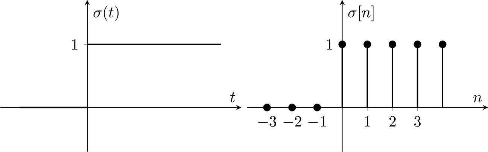

# Die Einheitssprungfunktion

Die **Sprungfunktion** $\sigma(t)$ ist 1 in der **rechten** Halbebene.

$$
\sigma(t)=\begin{cases}
1 & \text { für } t \geq 0 \\
0 & \text { für } t<0
\end{cases} \qquad
\sigma[n]=\begin{cases}
1 & \text { für } & n \geq 0 \\
0 & \text { für } & n<0
\end{cases}
$$

Sie wird zur Beschreibung von Einschaltvorgängen verwendet.

---

# Tags

[Elementare Operationen auf Signalen](Elementare%20Operationen%20auf%20Signalen.md)
[Delta-Impuls](Delta-Impuls.md)
