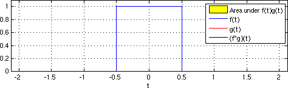

---
tags:
  - incomplete
  - Signale/Diskret
aliases: 
subject:
  - Signale und Systeme
  - VL
created: 3rd February 2023
professor:
  - Andreas Stelzer
semester: WS24
---

# Faltung

[Faltungssumme](Faltungssumme.md) ***:LiArrowBigRightDash:***

---

> [!def] **D1 - FALT)** Faltungsintegral ^FALT
> $$
> \begin{align*}
> y(t)&=(x\ast h)(t)=\int_{-\infty}^{\infty}x(\tau)\cdot h(t-\tau)d\tau=\int_{-\infty}^{\infty}x(t-\tau)\cdot h(\tau)d\tau
> \end{align*}
> $$

## Eigenschaften der Faltung

> [!satz] **S1)** Die Faltung erfüllt folgende Eigenschaften
> 
> - kommutativ $(f * g)(t)=(g * f)(t)$
> - assoziativ: $(f *(g * h))(t)=((f * g) * h)(t)$
> - distributiv: $(f *(g+h))(t)=(f * g+f * h)(t)$
> - multilinear mit $a \in \mathbb{C}$ (linear in jeder Variablen) oder assoziativ mit der skalaren Multiplikation:
> $(a(f * g))(t)=((a f) * g)(t)=(f *(a g))(t)$
> 
> Die Menge $L_1\left(\mathbb{R}^n\right)$ bildet zusammen mit der Addition und der Faltung einen kommutativen Ring, der für die Faltung kein neutrales Element besitzt. Dies ändert sich bei der Erweiterung auf Distributionen, mit $\delta(t)$ als **Einselement**.

- Wenn zwei stetige Funktionen gefaltet werden ist das Ergebnis wieder stetig.

### Spezielle Funktionen

#### Sprungfunktion

> [!important] **Die Faltung von $f(t)$ mit der Sprungfunktion $\sigma(t)$**
> 
> $$(f * \sigma)(t)=\int_{-\infty}^{\infty} f(\tau) \sigma(t-\tau) \mathrm{d} \tau=\int_{-\infty}^t f(\tau) \mathrm{d} \tau$$
> 
> entspricht der Fläche unter der Funktion $f(t)$.

Also Liefert die Faltung mit der Sprungfunktion die Stammfunktion von $f$:
Systeme mit dem Einheitssprung als Impulsantwort sind ein **Integrator**

#### Dirac-Distribution

> [!important] **Die Faltung von $f(t)$ mit der Dirac-Distribution $\delta(t)$**
> 
> $$ (f * \delta)(t)=\int_{-\infty}^{\infty} f(\tau) \delta(t-\tau) \mathrm{d} \tau=f(t) $$
> 
> ergibt wieder die Funktion selbst, was unmittelbar aus der Abtasteigenschaft der Dirac-Distribution folgt. Damit ist $\delta(t)$ die „**Einsfunktion**" der Faltung.

Die Eigenschaften Fläche unter der Kurve bzw. Abtastwert der Funktion entsprechen umgekehrt der Definition der Funktionale der zugehörigen Distributionen $\sigma(t)$ und $\delta(t)$.
Diese Eigenschaft ist die **Abtasteigenschaft** der [Dirac-Distribution](../Mathematik/Delta-Impuls.md).

---

## Relevanz in der Systemtheorie

> [!question] [Systemtheorie]({MOC}%20Systemtheorie.md)

Bei [LTI-Systemen](LTI-Systeme.md) lässt sich das Ausgangssignal $y$ durch Faltung des Eingangssignals $x$ mit der Impulsantwort $h$ Des Systems berechnen. Die Faltungsoperation ist definiert durch das Faltungsintegral bei zeitkontinuierlichen und durch die Faltungssumme bei zeitdiskreten Signalen.

---

- [INTERNAL - SuS UE Faltung](xEDU/B3_WS24/SuS/UE/Übungen/03%20Faltung.md)