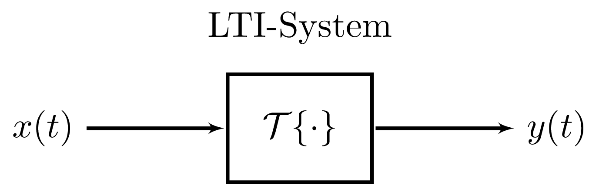

---
tags:
  - flashcards/SUS1
aliases:
  - Faltungsmatrix
  - schnelle Faltung
keywords: 
subject:
  - VL
  - Signalverarbeitung
semester: SS25
created: 24th March 2025
professor: 
release: false
title: Faltungssumme
---

# Faltungssumme

[Faltungsintegral](Faltung.md) ***:LiArrowBigRightDash:***

---

> [!def] **D1 - FALT)** Faltungssumme
> $$(y*x)[n] = \sum_{\nu=-\infty}^{\infty} x[\nu]y[n-\nu]$$

## Faltungsmatrix

> [!info] Bekannt aus der [Systemtheorie]({MOC}%20Systemtheorie.md)
> das Ausgangssignal $y$ ist das Ergebnis der Faltung des Eingangs $x$ mit der Impulsantwort $h$.
 
Diese Faltungsoperation lässt sich in die Form einer Linearen Abbildung bringen:

Für ein oft vorliegendes kausales LTI-System mit endlicher Impulsantwort (FIR) $h[n] = (h_{0}, h_{1}, \dots, h_{N_{h}-1})$ der länge $N_{h-1}$ gilt die [Differenzengleichung](../Mathematik/Analysis/Differenzengleichung.md):

$$
\begin{align}
y[n] &= (h*n)[n] = \sum_{\nu=0}^{N_{h}-1} h[\nu]x[n-\nu] \\
&=h_{0}x[n] + h_{1}x[n-1] + \dots + h_{N_{h}-1}x[n-N_{h}+1]
\end{align}
$$

> [!def] **D2 - FMTX)** Faltungsmatrix $\mathbf{H} \in \mathbb{R}^{(N_{x}+N_{h}-1) \times (N_{x})}$ ^FMTX
> $$
> \begin{gather}
> \mathbf{y} = \mathbf{Hx},\quad \mathbf{H} = \begin{pmatrix}
> h_{0} & 0 & \cdots & 0 \\
> h_{1} & h_{0} & \ddots & \vdots \\
> \vdots & h_{1} & \ddots & 0 \\
> h_{N_{h}-1} & \vdots & \ddots & h_{0} \\
> 0 & h_{N_{h}-1} &  & h_{1} \\
> \vdots & \ddots & \ddots & \vdots \\
> 0 & \cdots & 0 & h_{N_{h}-1}
> \end{pmatrix} \Big\updownarrow N_{x}+N_{h-1} \\
> \qquad \longleftrightarrow \\
> \qquad N_{x}
> \end{gather}
> $$
> 

> [!hint] Matlab Befehl: `convmtx`

### Hintergrund

Liegt ein Eingangssignal $x[n]$ von endlicher Länge $N_{x}$ vor, dann ist die Länge des Ausgangssignals $y[n]$ gleich $N_{y} = N_{x}+N_{h}-1$.

Setzt man auch für $n$ ein, erhält man eine Lineares Gleichungssystem. Die Werte $x[n]$ für $n \notin \{0,1,\dots,N_{x}-1\}$ sind dabei $0$ zu setzen.

$$
\begin{align}
y[0] &= h_{0}x[0] \\
y[1] &= h_{0}x[1] + h_{1}x[0] \\
y[2] &= h_{0}x[2] + h_{1}x[1] + h_{2}x[0]\\
&\ \ \vdots \\
y[n] &= h_{0}x[n] + h_{1}x[n-1] + \dots + h_{N_{h}-1}x[n-N_{h}+1] \\
&\ \ \vdots \\
y[N_{x}+N_{h}-2] &= h_{N_{h}-1}x[N_{x}-1]
\end{align}
$$

> [!hint] **Denkhilfe:** Die indizes jedes Terms ergeben in jedem Schritt immer $n$
> $$\text{z.B.:}\quad\underbrace{ y[2] }_{ n=2 } = \underbrace{ h_{0}x[2] }_{ 0+2=2 } + \underbrace{ h_{1}x[1] }_{ 1+1=2 } + \underbrace{ h_{2}x[0] }_{ 2+0=2 } $$

Durch die Definition der Ein- und Ausgangsfolgen als Vektoren $\mathbf{x}$ und $\mathbf{y}$, lässt sich das LGS in Matrix Schreibweise überführen.

$$
\mathbf{x} = \begin{pmatrix}
x[0] \\ x[1] \\ \vdots \\ x[N_{x}-1]
\end{pmatrix}, \quad \mathbf{y} = \begin{pmatrix}
y[0] \\ y[1] \\ \vdots \\ y[N_{x}+N_{h}-2]
\end{pmatrix}
$$

## Schnelle Faltung auf Basis der FFT

- Eingangssignal wird in $K$ Blöcke unterteilt
- idR.: Der Ausgang hat mindestens eine Latenz von einem Block 

---

- Faltungsmatrix: [INTERNAL - SigV UE01](xEDU/B4_SS25/Signalverarbeitung/UE/UE01.md)
- [Zyklische Faltung](Zyklische%20Faltung.md)

---

# Flashcards

> [!question] Geben Sie die Faltungssumme für die Faltung der beiden Folgen $x[n]$ und $h[n]$ 
?
> > [!success]- Lösung
> > $$y[n] = (h*x)[n] = \sum_{\nu = -\infty}^{\infty} h[\nu]x[n-\nu]$$