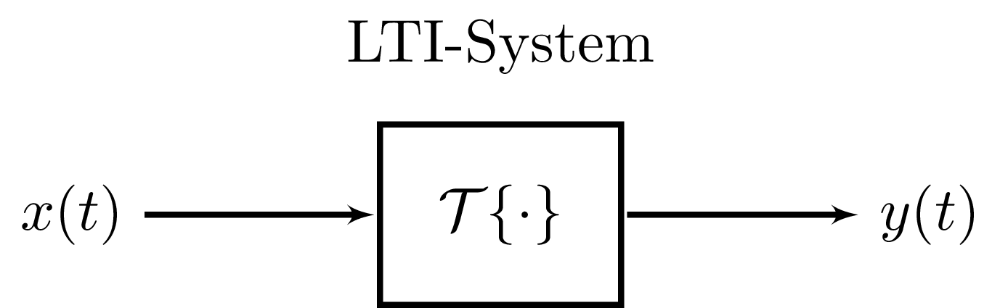

# LTI-Systeme

> [!question] :LiArrowBigLeftDash: [Lineare Systeme](Lineare%20Systeme.md) |📍| [LTI-Zustandsraum](Kontinuierlicher%20LTI-Zustandsraum.md) :LiArrowBigRightDash:

[Zeitdiskrete LTI-Systeme](Zeitdiskrete%20LTI-Systeme.md) ***:LiRefreshCcw:***

---

Zur Grundlage werden zunächst eindimensionale- bzw. Eingrößen-Systeme betrachtet:

## Linearität

> [!def] 
> 
> Ein System $\mathcal{T}\{\cdot\}$ ist linear wenn die Linearkombination der Eingänge gleich derselben Linearkombination der Ausgänge ist.
> $$ \text{LKE} \iff \text{LKA} $$
> - LKE: $x(t)=a x_1(t)+b x_2(t)$
> - LKA: $\mathcal{T}\{x\}(t)=\mathcal{T}\{a x_1+b x_2\}(t) = a \mathcal{T}\left\{x_1\right\}(t)+b \mathcal{T}\left\{x_2\right\}(t)$

LKE / LKA ... Linearkombination des Ein- / Ausgangs

$\implies \mathcal{T}$ ist eine [lineare Abbildung](../Mathematik/Algebra/Lineare%20Abbildungen.md), welche Additivität und Homogenität erfüllt.

> [!warning] **Zero In Zero-Out** Eigenschaft
> Ein System ist nur dann echt Linear, wenn 0 am Eingang 0 am Ausgang leifert. ZIZO ist eine *notwendige* Bedingung

## Zeitinvarianz

> [!def] **D2 - ZV)** Zeitvarianz und Zeitinvarianz ^ZV
> Ein Übertragungssystem $\mathcal{T}\{\cdot\}$ heißt **zeitinvariant**, wenn das zeitliche Verschieben der Eingangsgrößen um eine Spanne $t_0$ lediglich ein zeitliches Verschieben der Ausgangsgrößen um dieselbe Spanne zur Folge hat.
>
> $$\text{ ZVE } \iff \text{ ZVA }$$
> 
> - ZVA: $y(t-t_{0})\iff\mathcal{T}\{x_{2}\}(t) = \mathcal{T}\{x_{1}\}(t-t_{0}), \quad \forall x_{1}(t),t_{0}$
> - ZVE: $x_{2}(t)=x_{1}(t-t_{0})$
> 

ZVA / ZVE ... Zeitverschiebung am Ein- / Ausgang

## Systemantwort

Ist ein lineares, zeitinvariantes System $\mathcal{T}\{\cdot\}$ mit dem Eingangssignal $x(t)$ und dem Ausgangssignal $y(t)$ gegeben, ist oft eine **allgemeine Formulierung** zur Berechnung des **Ausgangssignals** gesucht.

### Impulsantwort

Es wird dazu die Antwort eines Systems auf die Impulsfunktion ([Dirac-Distribution](../Mathematik/Delta-Impuls.md)) $\delta(t)$ am Eingang betrachtet.

$$x(t) = \delta(t) \quad \implies \quad y(t) = \mathcal{T\{\cdot\}} = h(t)$$

Die Antwort (Ausgangssignal) auf den Impuls am Einang wird als **Impulsantwort** $h(t)$ bezeichnet.

> [!question]- Berechnung des Ausgangssignals mit Hilfe der Impulsantwort
> zunächst wird das LTI-System durch die Abbildung $\mathcal{T}\{\cdot\}$ beschrieben.
> $$y(t) = \mathcal{T}\{x(t)\}$$
> Das EIngagnssignal $x(t)$ wird mittels der Dirac-Distribution dargestellt.
> $$x(t) = \int_{ -\infty}^{\infty}x(\uptau)\delta(t-\uptau)\mathrm{~d}\uptau$$
> Somit folgt für das Ausgangssignal $y(t)$ mit der Abbildung $\mathcal{T}\{\cdot\}$
> $$y(t) = \mathcal{T}\left\{ \int_{-\infty}^{\infty}x(\uptau)\delta(t-\uptau)\mathrm{~d}\uptau \right\} $$
> wobei im Intergal nur $\delta (t-\uptau)$ von $t$ abhängt, d.h. $x(\uptau)$ ist bezüglich $t$ nur ein Gewichtsfaktor, womit durch die Linearität auch geschrieben werden kann:
> $$y(t)= \int_{-\infty}^{\infty}x(\uptau)\mathcal{T}\{\delta(t-\uptau)\}\mathrm{~d}\uptau$$
>  

> [!success] Mit der Definition der Impulsantwort $h(t)= \mathcal{T}\{\delta(t)\}$ und Berücksichtigung der Zeitinvarianz folgt schließlich:
>
> $$y(t) = \int_{-\infty}^{\infty}x(\uptau)h(t-\uptau)\mathrm{~d}\uptau$$
Damit lässt sich das Ausgangssignal $y(t)$ für beliebeiges Eingangssignal $x(t)$ als [**Faltung**](Faltung.md) **mit der Impulsantwort** $h(t)$ beschreiben.
>
> $$y(t) = x(t) * h(t) $$

> [!important] Diese Form der Beschreibung ist allgeimen gültig.
> **Die Impulsantwort beschreibt das Systemverhalten eines LTI-Systems vollständig!**
> Die Impulsantwort ist eine Beschreibung bzw. Charakterisierung eines Systems im **Zeitbereich**

### Sprungantwort

In technischen Systemen ist es häufig einfacher anstatt der Impulsantwort $h(t)$ die **Sprungantwort** $a(t)$ zu bestimmen (Schwierigkeit bei der Realisierung der Dirac-Funktion). 

Dabei wird als Eingangssignal die Sprungfunktion $\sigma(t)$ verwendet. Somit berechnet sich $a(t)$ zu

$$
a(t) = (h * \sigma)(t)= \int_{-\infty}^{\infty}h(\uptau)\sigma(t-\uptau)\mathrm{~d}\uptau=\int_{-\infty}^{t}h(\uptau)\mathrm{~d}\uptau
$$

Die Sprungantwort ist somit das zeitliche Integral (kumulative Summe) der Impulsantwort. Beide Beschreibungen sind für das LTI-System vollständig.

> [!example] Beispiel: Ladevorgang am RC-Tiefpass

---

