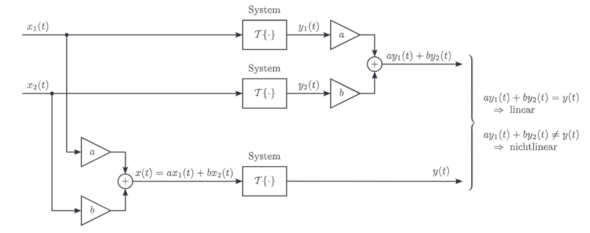

# LTI-Systeme

Zwei wichtige Eigenschaften, die Systeme aufweisen können sind Linearität und Zeitinvarianz. Diese beiden Eigenschaften sind unabhängig voneinander, es können alle Kombinationen auftreten. Systeme die sowohl linear, als auch zeitinvariant sind, werden als LTI-Systeme (LTI: linear, time-invariant) bezeichnet.

## Lineare Systeme

> [!important] Linearität
> 
> Ein system ist linear wenn die Linearkombination der Eingänge gleich der Linearkombination der Ausgänge ist 
> 
> 
> Ein System $\mathcal{T}\{\cdot\}$ ist linear wenn
> 
> $$
> \begin{aligned}
> & \mathcal{T}\{x\}(t)=a \mathcal{T}\left\{x_1\right\}(t)+b \mathcal{T}\left\{x_2\right\}(t) \quad \text { für alle } x_1(t), x_2(t), a, b \\
> & \operatorname{mit} x(t)=a x_1(t)+b x_2(t)
> \end{aligned}
> $$
> 
> wenn also $y(t)=a y_1(t)+b y_2(t)$
> 

> [!warning] **Zero In Zero-Out** Eigenschaft
> Ein System ist nur dann echt Linear, wenn 0 am Eingang 0 am Ausgang leifert
> - ZIZO ist eine Notwendige Bedingung

## Zeitinvariante Systeme

> [!important] Zeitinvarianz
> Ein System $\mathcal{T}\{\cdot\}$ ist zeitinvariant wenn
> 
> $$
> \begin{aligned}
> & \mathcal{T}\left\{x_2\right\}(t)=\mathcal{T}\left\{x_1\right\}\left(t-t_0\right) \quad \text { für alle } x_1(t), t_0 \\
> & \operatorname{mit} x_2(t)=x_1\left(t-t_0\right)
> \end{aligned}
> $$
> 
> wenn also $y_2(t)=y_1\left(t-t_0\right)$
> 

