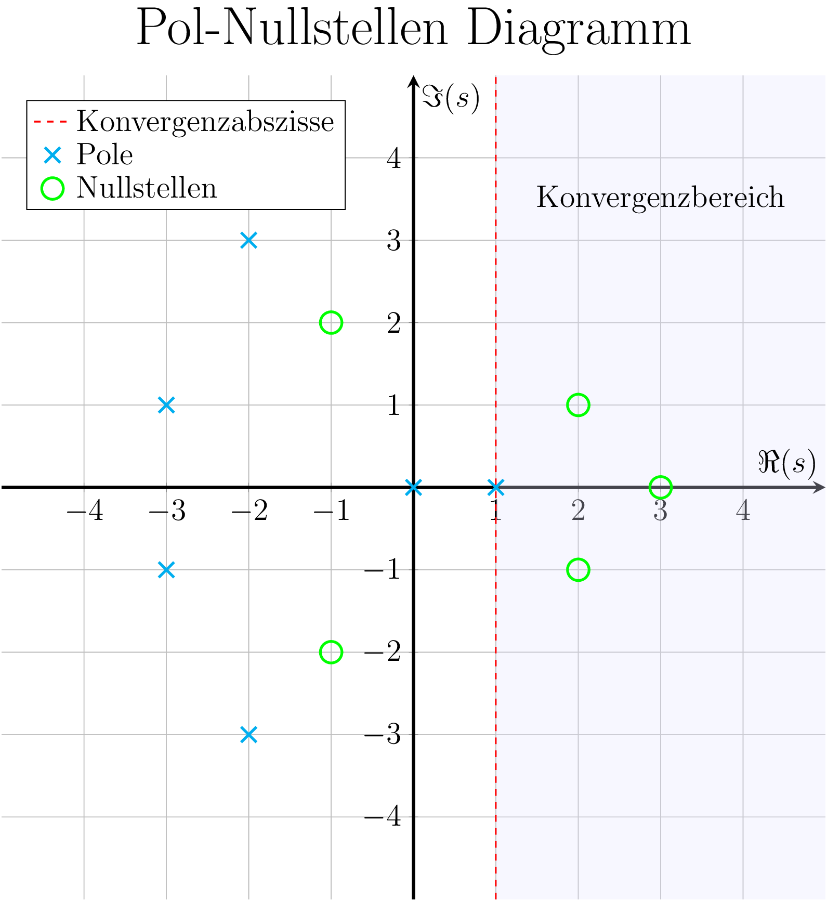
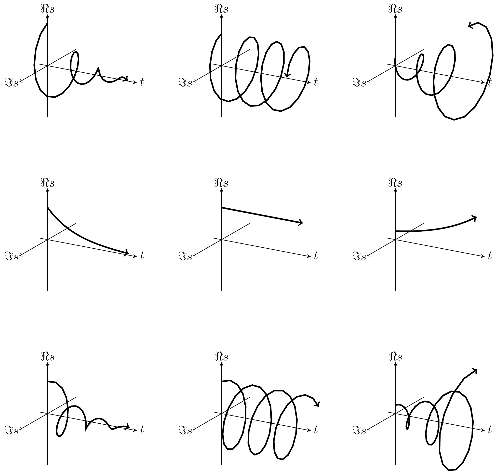

# Einseitige Laplace Transformation

[z-Transformation](z-Transformation.md) :LiArrowBigRightDash:

---

Die Laplace Transformation ist eine [Integraltransformation](Integraltransformation.md), die eine Funktion $f(t)$ auf eine Funktion $F(s)$ abbildet. Sie ist eine Erweiterung der [Fouriertransformation](Fouriertransformation.md) und wird verwendet, um Differentialgleichungen in algebraische Gleichungen zu überführen. 

> [!info] Der Transformationskern ist die exponential Funktion mit gemischt reel-komplexem Exponenten: $e^{ s }=e^{ \sigma t+j\omega t }$
> - Was bei der FT die Frequenzachse ist, ist bei der Laplacetransformation eine komplexe Ebene.
> - Mit dem neuen Paramter $\sigma$ lässt sich die Konvergenz beeinflussen, und kann als Dämpfung verstanden werden.

Damit kann eine größere Klasse von Funktionen im Zeitbereich erfasst werden als mit der Fourier-Transformation. 

Man überprüft mit dem neuen Term $e^st$ nicht nur die Korrelation mit $e^{ j\omega t}$ (also einer Frequenz) sondern zusätzlich mit einem Faktor $e^{ \sigma t}$, wobei man erkennen kann dass nur für negative $\sigma$ der Term für $t \to \infty$ verschwindet. Das System ist also auch nur dann stabil / besitzt einen konvergenten eingeschwungenenen zustand ($\implies$ existenz der Fouriertransformation). siehe [Stabilität des Systems](#Stabilität%20des%20Systems)

Der Frequenzgang des Signals ist die Imaginärachse der Laplacetransformation, da ja $j\Im s = j\omega$. siehe [Übertragungsfunktion](Übertragungsfunktion.md)

> [!question] Einseitigkeit:
> - Es werden nur [kausale](Kausalität.md) [Signale](Signale.md) betrachtet
>     - z.B. Bei Einschaltvorgängen interessiert uns nur, was nach dem [Einschalten](Schaltvorgänge.md) $(t=0)$ passiert.
> - Wegen der Einseitigkeit wird bei der Funktion des Zeitsignals die [Heaviside](Einheitssprungfunktion.md)-Funktion $\sigma(t)$ (oft implizit) dazu Multipliziert.
>     - (nicht zu verwechseln mit dem neuen eingeführten Parameter $\sigma$)

> [!def] **LAPT D1)** Ist eine Funktion auf $t\in\mathbb{R}$ definiert mit $f(t):[0,\infty)$ für $t>0$, so heißt:
>
> $$\mathcal{L}\{f(t)\}(s) = F(s) := \int_{0}^{\infty}f(t)\cdot e^{-st}\mathrm{~d}t \qquad s\in\mathbb{C} \tag{LAPT}$$
> 
> Die Einseitige Laplace Transformation von $f$, kurz $\mathcal{L}\{f(t)\}(s)$

$F(s)$ ist eine [holomorphe](../Index/Holomorph.md) Funktion. Die Laplacetransformation ist im Sinne des Uneigentliche Integrals zu verstehen: 

$$\lim_{ x \to \infty } \int_{0}^{x}f(t)e^{-st}\mathrm{~d}t$$

## Pole und Nullstellen

> [!hint] Beschränkung auf rationale Laplace Transformation. Ergebnis ist ein Quotient zweier [Polynome](../Mathematik/Algebra/Polynom.md) 
> 
> $$F(s)=\dfrac{Z(s)}{N(s)}$$ 
> 
> - Nullstellen $s_{\infty}$ des Nennerpolynoms $N(s)$ heißen **Pole** vom $F(s)$.
> - Nullstellen $s_{0}$ des Zählerpolynoms $Z(s)$ heißen **Nullstellen** von $F(s)$.
> 
> Nach dem [Fundamentalsatz der Algebra](../Mathematik/Algebra/Polynom.md) ist die Anzahl der Nullstellen gleich der Grad des Polynoms. Nullstellen treten als (vielfache) relle und/oder konjugiert komplexe Zahlen auf. Um die Terme zu vereinfachen, bedient man dich der [Partialbruchzerlegung](../Mathematik/Analysis/Partialbruchzerlegung.md).

### Pol-Nullstellen Diagramm und Konvergenzbedingungen

Die Oben definierten Pole und Nullstellen von $F(s)$ können in ein Diagramm eingezeichnet werden:

Damit $F(s)$ konvergiert, müssen alle Integrale konvergieren.

> [!satz] **S1 - LTKB)** Konvergenzbedingung für die Laplace-Transformierte 
> 
> $$\overset{ n }{ \underset{ i=1 }{ \operatorname{max} } } ~\sigma_{\infty i} < \sigma$$
> 
> Das heißt, dass das Laplace-Integral in der *Halbebene* **rechts** jenes Pols mit dem **größten Realteil** konvergiert. 

Das führt zur **Konvergenzabzisse** im [Pol-Nullstellen Diagramm](#Pol-Nullstellen%20Diagramm)

## Sätze

> [!satz] **S2 - LTR)** Sätze zu den Rechenregeln für Laplace-Transformationen ^LTR
>
> > [!question]- Einfache Schreibweise: $f(t) \circ\mkern-7px-\mkern-7px\bullet F(s)$
> >  
> 
> > [!question]- Explizite Schreibweise: $f(t)\circ\mkern-7px-\mkern-7px\bullet \mathcal{L}\left\{ f(t) \right\}(s)$
> > 

> [!satz] **S3 - AEWS)** Anfangs und Endwertsatz ^AEWS
> 
> 1. **erster Anfangswertsatz** 
> Es sei vorrausgesetzt, dass der Grenzwert im Zeitbereich existiert
> 
> $$\lim_{ t \to 0^+ } f(t) = \lim_{ s \to \infty } s~\mathcal{L}\left\{ f(t) \right\} (s)$$
> 
> 2. **zweiter Anfangswertsatz**
> Es sei vorrausgesetzt, dass der Grenzwert im Zeitbereich existiert
> 
> $$\lim_{ t \to 0^+ } \dot{f}(t) = \lim_{ s \to \infty } (s^{2}\mathcal{L}\left\{ f(t) \right\} (s)-sf(0^+))$$
> 
> 3. **Endwertsatz**
> Endwert satz gilt nur dann, wenn alle Pole Links stehen, außer der Pol bei 0. Bevor der Endwertsatz angewandt wird muss die Funktion auf stabilität geprüft werden.
> 
> $$\lim_{ t \to \infty } f(t) = \lim_{ s \to 0 } s~\mathcal{L}\left\{ f(t) \right\} (s)$$
> 

Wegen dem Differenzations-Satz bezeichnet man $s$ auch als Differenzations-Operator beim rechnen im Bildbereich

## Korrespondenzen

> [!satz]- **S3 - LAPK)** Korrespondenztabelle ^LAPK
> 
> 

## Rücktransformation

> [!def] **D - ILAPT)** Inverse Laplace Transformation - Umkehrintegral ^ILAPT
> $$\frac{1}{2\pi j} \int_{\sigma -j\infty}^{\sigma +j\infty}F(s)e^{ st }\mathrm{~d}s$$

Funktionen im Bildbereich treten als rationales Polynom $\frac{z(s)}{n(s)}$ auf

> [!important] Vorhergehensweise
> 1. Polynomdivision wenn $\deg z(s) \geq \deg n(z)$
> 2. $s$ sollte soweit es geht faktorisiert werden
> 3. Null und Polstellen berechnen:
> 4. Partialbruchzerlegung durchführen
> 5. Vereinfachte Korrespondenzen der Tabelle Entnehmen

## Existenzbedingungen

Bedingungen für die Existenz der Laplace-Transformierten $F(s)$ der Funktion $f(t)$:

$$ \lvert f(t) \rvert \leq Me^{ \alpha t } \quad \text{für } t\geq 0 $$

für geeignete reelle Konstanten $M$ und $\alpha$ und dass $f(t)$ in jedem endlichen intervall $a\leq t\leq b$ nur endlich viele Sprungstellen besitzt.

> [!hint] **Abschätzung der Konvergenzabzisse:** Welche Funktionen können Transformiert werden?
> 
> Für spezielle Funktionen lassen sich Abschätzungen für $\sigma$ angeben: Mit $\mathcal{E}$ bezeichnen wir die Menge der Funktionen $f:[0, \infty) \rightarrow \mathbb{R}$, für die gilt, dass $f$ stückweise stetig ist und dass $f$ **höchstens exponentiell** wächst. Das heißt, es existieren $M>0$ und $\alpha \in \mathbb{R}$, sodass
> $$\lvert f(t) \rvert  \leq M e^{\alpha t}, \quad t \geq 0$$
> 
> Sei $f \in \mathcal{E}$ und $s=u+i v$ mit $u, v \in \mathbb{R}$ und $\alpha<u$. Dann gilt:
> $e^{-s t}=e^{-u t}(\cos (v t)-i \sin (v t))$. Mit $\lvert\cos (v t)-i \sin (v t)\rvert=1$ erhalten wir nun:
> 
> $$
>  \left| \int_0^{\infty} f(t) e^{-s t} \mathrm{~d} t \right| \leq M \int_0^{\infty} e^{(\alpha-u) t} \mathrm{d} t=\lim _{x \rightarrow \infty} \frac{M}{u-\alpha}\left(1-e^{(\alpha-u) x}\right)=\frac{M}{u-\alpha}
> $$

> [!satz] **S2 - TRF)** Transformierbare Funktionen
> Sei $f\in \mathcal{E}$, dann Existiert die Laplace-Transformation $\mathcal{L}\{f(t)\}(s)$ von $f$ für alle $s\in\mathbb{C}$ mit $\Re \left\{ s \right\}>\alpha$. Mit $\alpha$ wie in der obigen Abschätzung für die Konvergenzabzisse

## Stabilität des Systems

Polstellen bei verschiedenen Schwingbedingungen:

- Schwingfall: Pole sind rein konjugiert Komplex
- Kriechfall: Pole sind rein reell
- Grenzfall: Pole wander zusammen bis sie auf der Imaginärachse sind

Polstellenlage vs. Zeitbereichssignal

# Tags

- [Invers Laplace Transformation Rechner](https://de.symbolab.com/solver/inverse-laplace-calculator)
- [Delta-Impuls](Delta-Impuls.md)
- [korrespondenztabelle - Google Suche](https://www.google.com/search?q=korrespondenztabelle&oq=korrespondenztabelle&gs_lcrp=EgZjaHJvbWUyBggAEEUYOTIGCAEQLhhA0gEINzcwMmowajGoAgCwAgA&sourceid=chrome&ie=UTF-8)

