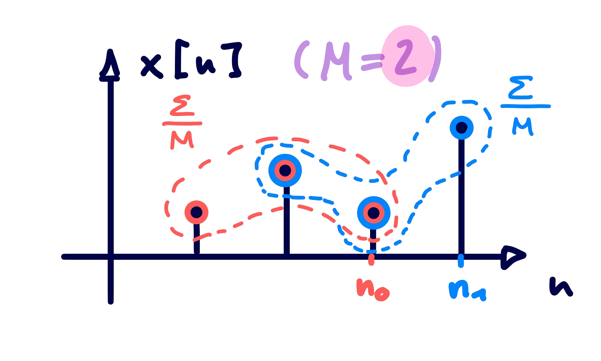
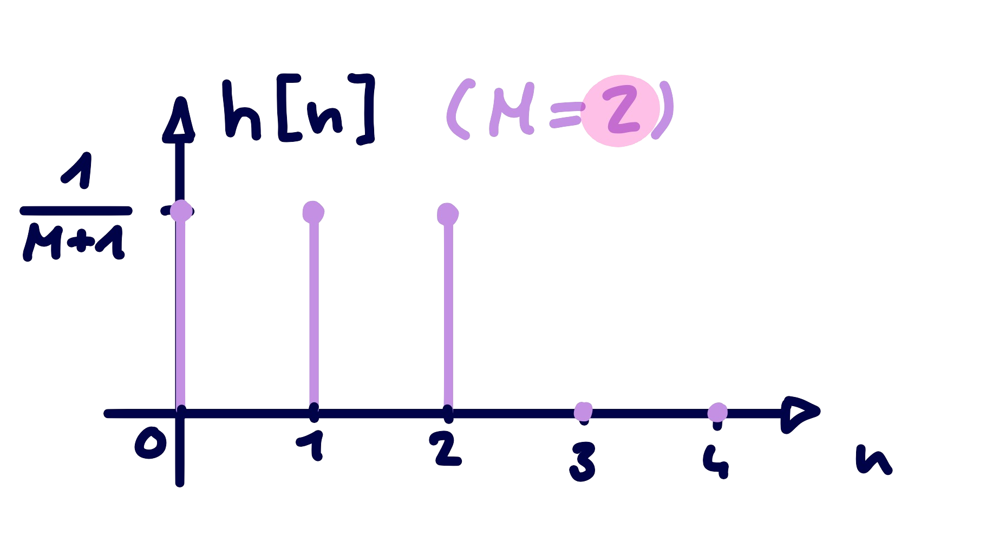

---
tags:
  - Baugruppe/Filter/Digital
aliases:
  - Gleitende Mittelwertbildung
  - Gleitender Mittelwert
keywords: 
subject:
  - VL
  - Signalverarbeitung
semester: SS25
created: 9th April 2025
professor:
  - Mario Huemer
release: false
title: Moving Average
---

# Gleitende Mittelwertbildung

Dieses System berechnet den $n$-ten Abtastwert der Ausgangsfolge aus dem Mittelwert von $x[n],x[n-1], \dots ,x[n-M]$. Es handelt sich um ein [BIBO](Stabilität%20und%20Beschränktheit.md) stabiles und [kausales](Kausalität.md) [LTI-System](Zeitdiskrete%20LTI-Systeme.md).

*Ausgangssignal:*

$$y[n] = \frac{1}{M+1}\sum_{k=0}^{M}x[n-k]$$

*Impulsantwort:*

$$h[n] = \frac{1}{M+1}\sum_{k=0}^{M}\delta[n-k] = \begin{cases} \frac{1}{M+1} & \text{für } 0 \leq n < M \\ 0 & \text{sonst} \end{cases}$$

|  |  |
| :----------------------------------------: | :-------------------------------------------------: |
| Veranschaulichung der Operation            | Impulsantwort                                       |

- Der rote Mittelwert ist der Ausgang $y[n_{0}]$
- Der blaue Mittelwert ist der Ausgang $y[n_{1}]$