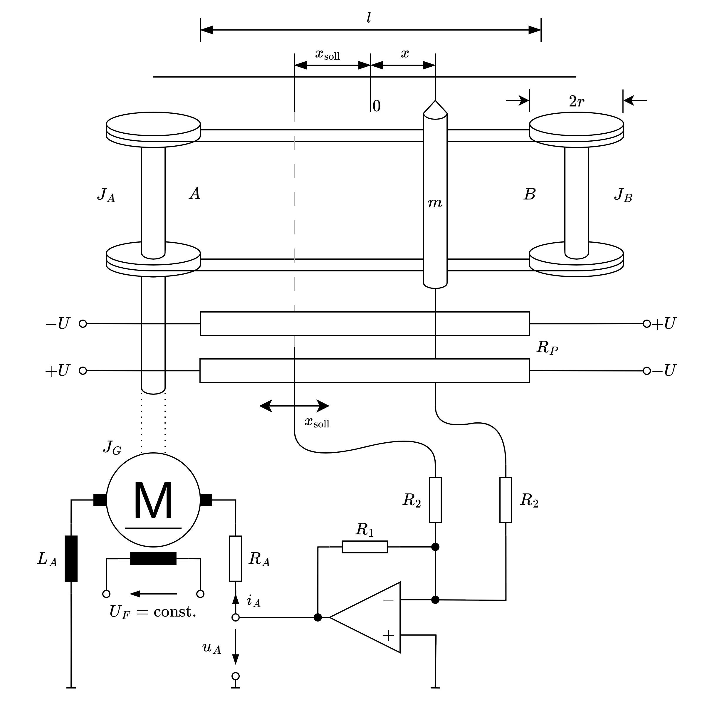

 

# Regelungstechnik

> [!quote] Regelungstechnik ist ...
> - gezieltes einwirken auf ein System / Prozess / Regelstrecke
> - sodass dieses ein gewünschtes verhalten aufweist

Die auf ein System einwirkenden Größen heißen **Eingangsgrößen** $\mathbf{u}$. Diese Eingangsgrößen setzen sich zusammen aus:
- **Stellgrößen:** Größen mit denen wir das System selbst beeinflussen
- **Störgrößen:** Größen die wir nicht kontrollieren können und aus dritter Hand auf das System einwirken.

Das Verhalten des Systems lässt sich durch die **Ausgangsgrößen** $\mathbf{y}$ beobachten. Diese können dann wiederum als [Messgrößen](../../../Messtechnik/Messtechnik.md) aufgenommen werden.

> [!hint] [Zustandsbeschreibung](Zustandsraum.md)

| dynamische Systeme                                                                                                                                                                   | statische Systeme                                                                 |
| ------------------------------------------------------------------------------------------------------------------------------------------------------------------------------------ | --------------------------------------------------------------------------------- |
| hängt auch von vergangenen Eingangsgrößen ab                                                                                                                                         | hängt nur vom augenblichlichen wert der Eingangsgrößen ab                         |
| Beispiel - Autofahren) Unterschied ob man bei 50km/h oder bei 130 km/h lenkt / bremst. - Reibung und Kräfte sind Anders.  - Motorsteuergerät reagiert anders auf die Eingaben. | Beispiel - Kaffeemaschine: Es wird immer auf das Eingangssignal ein Kaffee folgen |

Zur Beschreibung dieser Modelle werden mathematische Modelle verwendet. Ein Hauptbestandteil dieser Modelle sind [Differenzialgleichungen](../../../Mathematik/Analysis/GDGL.md), vorallem von physikalischen Systemen.

## Beispiele

Beispiele für geregelte Systeme aus verscheiden Bereichen:

| Mechanik                 | Elektronik       | Hydraulik            | Soziologie             | Mechatronik  |
| ------------------------ | ---------------- | -------------------- | ---------------------- | ------------ |
| Feder, Masse und Dämpfer | RC-Glied mit OPV | Hydraulische Kaskade | Räuber Beute Beziehung | Lageregelung |

### Mechanisches Beispiel

> [!example] Feder, Masse Dämpfung
> 
> - Differenzialgleichungen: man sucht eine gleichung bei der zu allen Zeitpunkten gilt, dass $\dot{x}=v$ wahr ist.
> - Gelingt nur für wenige DGL, Systematisch so eine Zeitfunktion zu finden: nur für Lineare 
> - $x$ ist eine variable der man eine zeitfunktion $x(t)$ zuweist (nicht das selbe)
> 
> Eingangsgrößen hier: hier gibt es nur anfangswerte, der Rest wird von der Physik geregelt.
> Eine Eingangsgröße wäre eine externe Kraft.  

### Elektronisches Beispiel

### Hydraulisches Beispiel

### Mechatronisches Beispiel

**Ausgangssystem**

**Aufstellen des Gleichungssystems dieses Systems:**

$J$ ... Trägheitsmoment, $L_{A}$ ... Ankerinduktivität, $U_{F}$ ... konstante Feldspannung des Motors

Kenngrößen des DC-Motors:

- Ankerstrom $i_{A}$
- Ankerkonstante $k_{A}$
- Winkelgeschwindigkeit des Motors $\omega_{G}$
- Drehmoment des Motors: $M_{G}$

Gleichungen für den [DC-Motor](../Elektrotechnik/Maschinen/Gleichstrommotor.md):

- Ankerspannun: $u_{A}=R_{A}i_{A}+ L_{A} \dot{i}_{A} +k_{A}\omega_{G}$
- Drallsatz: $M_{G}=J\dot{\omega}_{G}=k_{A}\cdot i_{A}$
- Winkelgeschwindigkeit der Maschine: $\dot{\varphi}_{G}=\omega_{G}$
    - $\varphi_{G} = \frac{x}{r}$ ... Winkelposition der Gleichstrommaschine, $r$ ... rollenradius

Bewegungsgleichung des Mechanischen Teilsystems:

-  $(J_{A}+J_{B}+J_{G}+r^{2}m)~\dot{\omega}_{G} = M_{G}$

**Abstraktes Schaltbild**

Rückkopplung von $\omega$ Ergibt sich durch den DC Motor Selbst. 

**Strukturbild**

