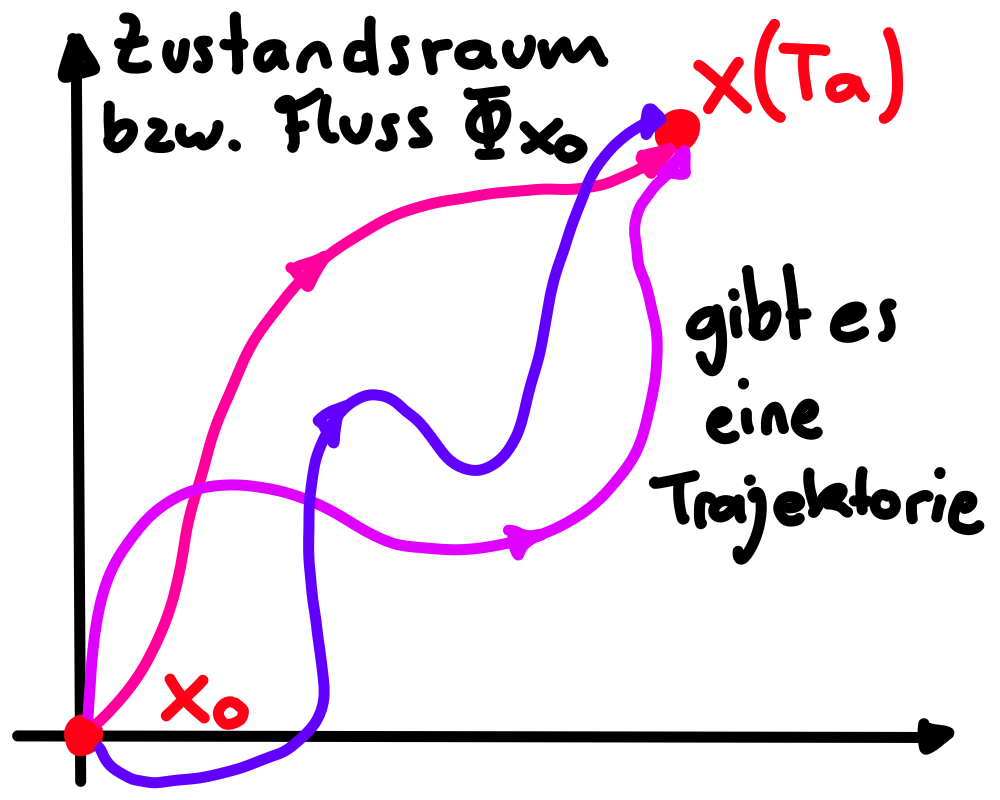

---
tags:
  - Systeme/LTI
  - Systeme/Kontinuierlich
aliases:
  - Steuerbarkeit
  - Erreichbarer Unterraum
  - Gramsche Erreichbarkeitsmatrix
  - Stabilisierbarkeit
keywords: 
subject:
  - VL
  - Regelungstechnik
semester: SS25
created: 25. Mai 2025
professor: 
release: false
title: Erreichbarkeit
---

# Erreichbarkeit von LTI-Systemen

:LiArrowBigRightDash: [Beobachtbarkeit](Regelungstechnik/Beobachtbarkeit.md) 
:LiRefreshCcw: [Erreichbarkeit Zeitdiskreter Systeme](Zeitdiskrete%20Erreichbarkeit.md) 

---

> [!def] **D1 - ERRE)** Erreichbarkeit eines zeitkontinuierlichen LTI-Systems ^ERRE
> Man nennt das [zeitkontinuierliche LTI-System](Kontinuierlicher%20LTI-Zustandsraum.md#^LTI-MIMO) vollständig erreichbar, wenn Ausgehend vom Anfangszustand $\mathbf{x}_{0}=\mathbf{0}$ jeder beliebige Zustand $\mathbf{x}(T_{e})$ innerhalb einer endlichen Zeit $T_{e}$ mit einer im intervall $0 \leq t \leq T_{e}$ stückweise stetigen Eingangsgröße $\mathbf{u}(t)$ erreicht werden kann.

Gibt es also einen Eingangsvektor $\mathbf{u}$, sodass alle Werte zu einem gegebenen Zeitpunkt $T_{e}$ alle Zustände erreicht werden können? Diese Definition kann mit der Systemmatrizen $\mathbf{A}$ und $\mathbf{B}$ geprüft werden.

## Testen Auf Erreichbarkeit

> [!satz] **S1 - MIMO)** Erreichbarkeitskriterium für $n$-dimensionale [MIMO](Kontinuierlicher%20LTI-Zustandsraum.md#^LTI-MIMO)-Systeme. ^MIMO
> Das LTI-System ist vollständig erreichbar, wenn die Erreichbarkeits-Matrix $\mathbf{M}_{\mathcal{R}}$ den [Rang](../../Mathematik/Algebra/Rang%20einer%20Matrix.md) $n$ hat.
> $$\mathbf{M}_{\mathcal{R}} = \begin{bmatrix}
> \mathbf{B} & \mathbf{AB} & \mathbf{A}^{2}\mathbf{B} & \dots &  \mathbf{A}^{n-1}\mathbf{B}\\
> \end{bmatrix}$$
> 

Das heißt für ein MIMO-System müssen alle bis auf genau $n$ Spalten linear abhängig sein, damit es gemäß [D1](#^ERRE) volständig erreichbar ist.

> [!satz]- **S2 - SISO)** Erreichbarkeitskriterium für $n$-dimensionale [SISO](Kontinuierlicher%20LTI-Zustandsraum.md#^LTI-SISO)-Systeme. ^SISO
> Das LTI-System ist vollständig erreichbar, wenn die Erreichbarkeits-Matrix $\mathbf{M}_{\mathcal{R}}$ den [Rang](../../Mathematik/Algebra/Rang%20einer%20Matrix.md) $n$ hat, d.h. [regulär](../../Mathematik/Algebra/Reguläre%20Matrizen.md#^REGM) ist. 
> $$\mathbf{M}_{\mathcal{R}} = \begin{bmatrix}
> \mathbf{b} & \mathbf{Ab} & \mathbf{A}^{2}\mathbf{b} & \dots &  \mathbf{A}^{n-1}\mathbf{b}\\
> \end{bmatrix}$$

$\mathcal{R}$ steht für *reachable*. $\mathbf{M}_{\mathcal{R}}$ heißt auch *Erreichbarkeits- / Steuerbarkeitsmatrix* (Reachability- / Controllabilitymatrix)

## Erreichbarer Unterraum

> [!def] **D2)** Der *Erreichbare Unterraum* $\mathcal{R}$ ist gegeben durch ^ERRE-SUBSPACE
> $$\mathcal{R} := \operatorname{im}(\mathbf{M}_{\mathcal{R}})$$
>  Das [Bild](../../Mathematik/Algebra/Lineare%20Abbildungen.md#^BILD) von $\mathbf{\mathbf{M}}_{\mathcal{R}}$ sind alle linear unabhängigen **Spalten**

Der Erreichbare Unterraum beinhaltet die Systemzustände, die ausgehend von $\mathbf{x}_{0} = \mathbf{0}$ die in endlicher Zeit erreicht werden können. Das System ist also vollständig erreichbar wie in [D1](#^ERRE) wenn $\dim\mathbf{M}_{\mathcal{R}} = \dim\mathcal{R} =n$ 

## Kalman-Zerlegung bezüglich der Erreichbarkeit

> [!hint] Ist das System nicht vollständig erreichbar, kann das System in ein erreichbares- und ein nicht-erreichbares Teilsystem zerlegen.

Das Resultierende System hat **immer** die Form (mit $\mathbf{\bar{A}}$ und $\mathbf{\bar{B}}$ wie in [ZTRF](../Zustandstransformation.md#^ZTRF))

**Das erreichbare Teilsystem:**

- Das Teilsystem $\mathbf{\dot{z}}_{1} = \begin{bmatrix} \mathbf{\bar{A}}_{11} & \mathbf{\bar{A}}_{12} \end{bmatrix} \begin{bmatrix} \mathbf{z}_{1} \\ \mathbf{z_{2}}\end{bmatrix} + \mathbf{B}_{11} \mathbf{u}$ ist durch den Zustand $\mathbf{z}_{1}$/$\mathbf{z}_{2}$ und dem Eingang $\mathbf{u}$ beeinflussbar
- $\mathbf{z}_{1}$ ist der Zustand des erreichbaren Teilsystems.

**Das Nicht-Erreichbare Teilsystem:**

- Das [autonome](../../Mathematik/Analysis/Autonomes%20DGL-System.md) Teilsystem $\mathbf{\dot{z}}_{2} = \mathbf{\bar{A}}_{22}\mathbf{z}_{2}$ ist *weder* durch den Eingang $\mathbf{u}$, *noch* durch den Teilzustand $\mathbf{z}_{1}$ beeinflussbar.
- $\mathbf{z}_{2}$ ist der Zustand des nicht erreichbaren Teilsystems

## Steuerbarkeit

> [!question] :LiRefreshCcw: [Steuerbarkeit Zeitdiskreter Systeme](Zeitdiskrete%20Erreichbarkeit.md#Steuerbarkeit)

---

> [!def] **D)** Steuerbarkeit
> Man nennt das [LTI-System](Kontinuierlicher%20LTI-Zustandsraum.md#^LTI-MIMO) vollständig steuerbar, wenn ausgehend von einem beliebigen Anfangszustand $\mathbf{x}_{0}$ innerhalb einer endlichen Zeit $T_{e}$ mit einer im Intervall $0 \leq t \leq T_{e}$ stückweise stetigen Eingangsgröße $u(t)$ das System in den Zustand $\mathbf{x}(T_{e}) = 0$ übergeführt werden kann

> [!hint] Im kontinuierlichen gilt: **vollst. steuerbar** $\iff$ **vollst. erreichbar**
> Ist das System vollständig Erreichbar ist es ebenso vollständig Steuerbar. Die Steuerbarkeit ist also genauso durch den vollen [Rang](../../Mathematik/Algebra/Rang%20einer%20Matrix.md) von $\mathbf{M}_{\mathcal{R}}$ gegeben

Warum? $\to$ Zeitinvarianz eines LTI Systems: Vergleicht man die beiden Definitionen, stellt man fest, dass Steuerbarkeit genau die inverse Eigenschaft zur Erreichbarkeit ist.

Die Fundamentallösung des Systems hat [besondere Eigenschaften](../../Mathematik/Analysis/Fundamentalmatrix.md#^TRSM-Eigenschaften)

- Die Transitionsmatrix ist immer [regulär](../../Mathematik/Algebra/Reguläre%20Matrizen.md) (d.h. Invertierbar)
- Folgt man dem Fluss einer Lösung in die umgekehrete Richtung ist das äquivalent zum inversen Fluss 

## Stabilisierbarkeit

> [!question] [Stabilisierbarkeit zeitdiskreter LTI-Systeme](Zeitdiskrete%20Erreichbarkeit.md#Stabilisierbarkeit)

---

Damit das nicht vollständig erreichbare System stabilisierbar ist, muss die Systemmatrix $\mathbf{A}_{22}$ des nicht-erreichbare Teilsystem eine [Hurwitzmatrix](../../Mathematik/Analysis/Hurwitz-Matrix.md) sein.

- Alle Eigenwerte sind dann negativ und das nicht-erreichbare teilsystem ist asymptotisch-stabil.
- Um das System zu stabilisieren kann eine [Zustandsregelung](Regelungstechnik/Zustandsregeler.md) unternommen werden.