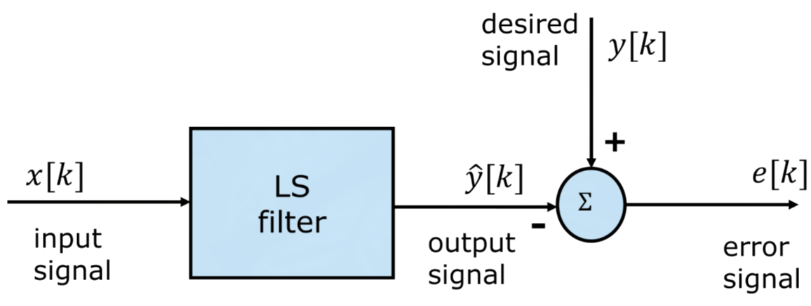

---
tags:
aliases:
  - LS-Filter
subject:
  - SE
  - Bachelorarbeit
semester: SS26
created: 25th March 2026
professor:
release: false
title: Least Square Filter
---

# Least Square Filter

> [!question] [Optimale Filter](Optimale%20Filter.md)

---

Der LS-Filter ist ein Optimaler Filter, dessen Kriterium die **Minimierung der Summe der Fehlerquadrate** ist.

LS-Filter wird dabei als FIR-Filter betrachtet.

Beim LS-Filter gibt es die **Trainingsphase** und die **Operationsphase**.

> [!question] Trainingsphase
> 
> Trainingssequenzen
> 
> - Für jeden Eingangs $x[k]$ ist ein passender Ausgang  $y[k]$ verfügbar.
> - Das Signal muss lang genug sein, sodass es das übliche (zufällige) Eingangssignal gut repräsentiert.
> 
> Berechnung der Filterparameter
> 
> - Die Filterkoeffizienten werden nach dem **LS-Kriteruim** ([Methode der kleinsten Quadrate](../../Mathematik/Lineare%20Methode%20der%20kleinsten%20Quadrate.md)) berechnet. ($w_{k} = \theta_{k}$)
> - Der Filter stellt sich dann so ein, dass der Eingang über eine optimale lineare Funktion auf den Ausgang abbildet.

> [!question] Operationsphase
>
>Die berechneten Filterkoeffizienten werden dann *bis zur nächsten Trainingsphase* zur Schätzung des Ausgangs zu zufälligen Eingängen verwendet.

## Herleitung

Es soll eine *linearer Schätzer* (=Filter) gefunden werden, dessen Ausgang die gewünschte Antwort nach einem bestimmten Optimierungskriterium so gut wie möglich annähert.

Wähernd der Trainingsphase habe der Eingang $x[k]$ hat dabei die Länge $N$. 

Die Ein- / Ausgangsbeziehung hat die Form

$$
\hat{\mathbf{y}} = \mathbf{Xw}
$$

> [!question] Dabei ist $\mathbf{X} \in \mathbb{R}^{(N+p-1) \times p}$ die darstellung des Eingangs als [Faltungsmatrix](../Zeitdiskret/Faltungssumme.md)
> 
> - Die Rolle des Eingangs und der Filterkoeffizienten (= Impulsantwort) sind hier umgekehrt.
> - Sind die Filterkoeffizienten ein Impuls, ist der geschätzte Ausgang gleich dem Eingang.

$$
\mathbf{X} = \begin{pmatrix}
x[0] & 0 & 0 & \cdots & 0 \\
x[1] & x[0] & 0 & \cdots & 0 \\
\vdots & \vdots & \ddots & \ddots & \vdots \\
x[p-1] & x[p-2] & \cdots & x[1] & x[0] \\
\vdots & \vdots & \ddots & \ddots & \vdots \\
x[k] & x[k-1] & \cdots & x[k-p+2] & x[k-p+1] \\
\vdots & \vdots & \ddots & \ddots & \vdots \\
0 & 0 & \cdots & x[N-1] & x[N-2] \\
0 & 0 & \cdots & 0 & x[N-1]
\end{pmatrix}
$$

Der Fehlervektor $\mathbf{e}$ ist dann

$$
\mathbf{e} = \mathbf{y}-\hat{\mathbf{y}}=\mathbf{y}-\mathbf{Xw}
$$

Und die Summe der Fehlerquadrate

$$
J(\mathbf{w}) = \sum_{n=0}^{N-1} e[n]^{2} = \mathbf{e}^{T}\mathbf{e} =(\mathbf{y}-\mathbf{Xw})^{T}(\mathbf{y}-\mathbf{Xw})
$$
Die Lösung des LLS Problems sind die [Normalgleichungen](../../Mathematik/Normalgleichungen.md)

$$
\begin{align}
\mathbf{X}^{T}\mathbf{Xw} &= \mathbf{X}^{T}\mathbf{y} \\
\mathbf{w} &= (\mathbf{X}^{T}\mathbf{X})^{-1} \mathbf{X}^{T}\mathbf{y} \\
\end{align}
$$

## Anwendungen

- [Systemidentifikation](Systemidentifikation.md)
- [Inverse Systemidentifikation](Inverse%20Systemidentifikation.md) (Equalization, Systemausgleich)
- [Rauschunterdrückung / -verminderung](Rauschunterdrückung.md)
- [Signalprediction](Signalprediction.md)