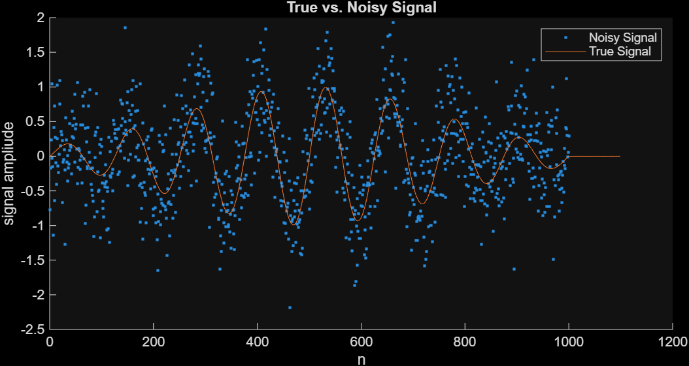
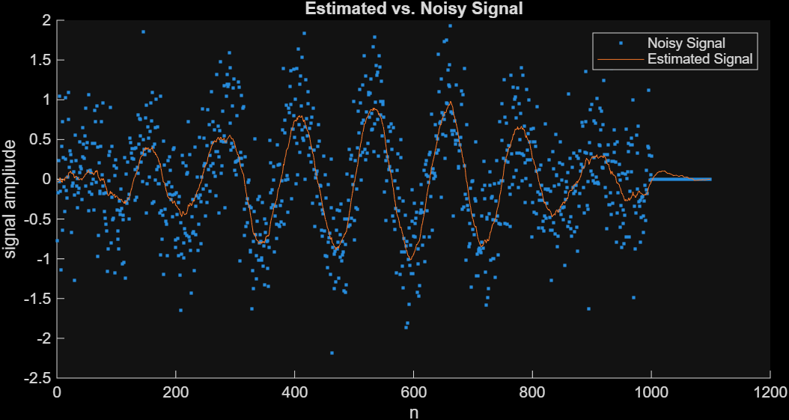
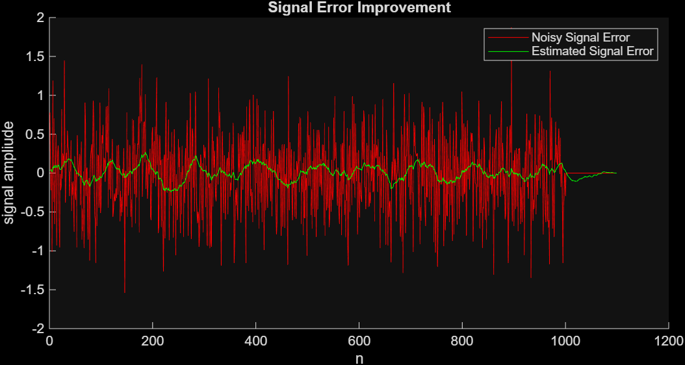

---
tags:
aliases:
  - Rauschverminderung
subject:
  - VL
  - Optimum and Adaptive Signal Processing Systems
semester: SS26
created: 25th March 2026
professor:
release: false
title: Rauschunterdrückung
---

# Rauschunterdrückung

> [!question] [Optimale Filter](Optimale%20Filter.md)

## Rauschverminderung (Noise Reduction)


> [!success] **Ziel:** $\mathbf{w}$ finden, sodass der Filter den Rauschanteil $n[k]$ im Eingangssignal $x[k]$ so gut wie Möglich reduziert.

Für $k_{0}>0$ versucht der Filter den Ausgang $\hat{y}[k]$ so gut wie möglich dem verzögerten Signal $s[k]$ nachzubilden.

### Implementierungen

> [!question] [LS-Filter](Least%20Squares%20Filter.md)

 



> [!success]- Matlab Code - LS Filter 
> 
> ```matlab
> N = 1000; % Training Signal Length
> 
> % Generate Gaussian White Noise
> n_var = 0.5;
> n_mean = 0;
> n = n_mean + n_var * randn([N,1]);
> 
> % Generate the signal to be estimated
> k = linspace(-pi, pi, N);
> s = (sin(8*k) .* exp(-0.2 * k.^2))';
> x = n + s;
> 
> % Filter parameters
> k0 = 0;
> p = 100;
> 
> % Training Convolution Matrix
> X = convmtx(x, p);
> 
> % Solve Normal Equations
> y = padDelay(s, p, k0);
> w = X'*X \ X'*y;
> 
> % Estimate the True Signal from Noisy Signal
> y_hat = conv(x, w);
> x_dly = padDelay(x, p, k0);
> 
> function p = padDelay(x, pad, delay)
> 	p = padarray(x, [delay, 0], 'pre');
> 	p = padarray(p, [pad-delay-1, 0], 'post');
> end
> ```

> [!tldr]- Matlab Plotting
> ```matlab
> % Plot Noisy Signal
> close all;
> figure;
> hold on;
> plot(x, '.');
> plot(y);
> ylabel('signal ampliude');
> xlabel('n');
> title('True vs. Noisy Signal');
> legend('Noisy Signal', 'True Signal');
> figure;
> hold on;
> plot(x_dly, '.');
> plot(y_hat);
> ylabel('signal ampliude');
> xlabel('n');
> title('Estimated vs. Noisy Signal');
> legend('Noisy Signal', 'Estimated Signal');
> 
> % Plot Error
> figure;
> hold on;
> plot(y - x_dly, 'r');
> plot(y - y_hat, 'g');
> ylabel('signal ampliude');
> xlabel('n');
> title('Signal Error Improvement');
> legend('Noisy Signal Error', 'Estimated Signal Error');
> ```

## Rauschunterdrückung (Noise Cancellation)


> [!success] **Ziel:** Entfernung von $n[k]$ aus $y[k]$ sodass $e[k]\approx s[k]$

- $y[k]$ besteht aus dem Nutzsignal $s[k]$ plus (mit $s[k]$ unkorreliertem) Rauschen $n[k]$. 
	- z.B.: Sprache + Rauschen in einem Helikopter, gemessen am Headsetmikrofon
- $n'[k]$ ist das Rauschsignal von der Gleichen Rauschquelle wie $n[k]$ aber ohne Sprachsignal.
	- z.B.: Helikopter-Rotor Geräusche, aufgenommen mit einem Zweiten Mikrofon in der Helikopterkabine.

Der Filter ist in der Lage, $n[k]$ von $n'[k]$ (ungefähr) zu rekonstruieren. Das Fehlersignal $e[k]$ wird dann dem Nutzsignal $s[k]$ Angenähert.