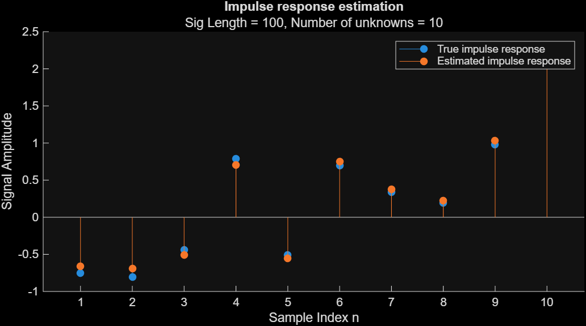
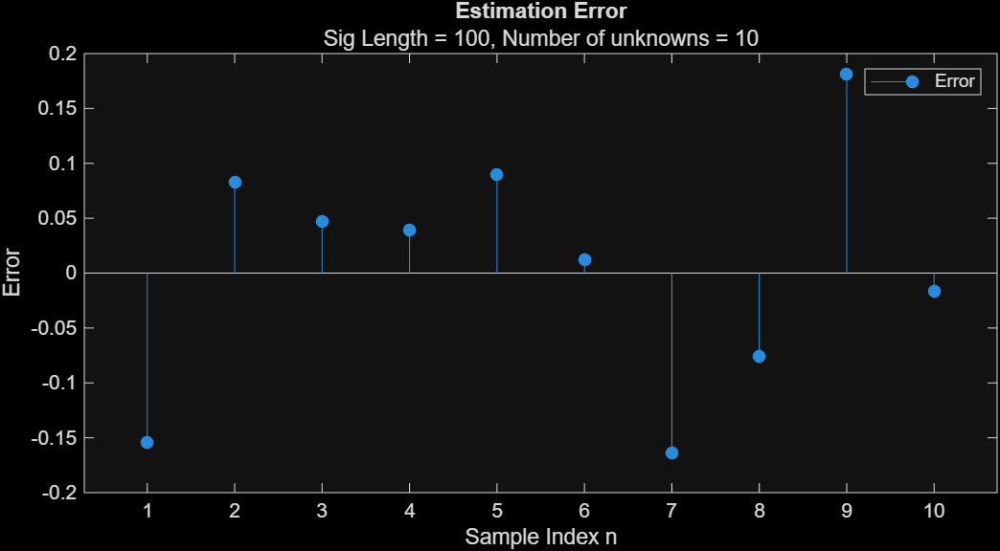

---
tags:
aliases:
  - Channel Estimation
  - System Identification
subject:
  - SE
  - Bachelorarbeit
  - VL
  - Optimum and Adaptive Signal Processing Systems
semester: SS26
created: 25th March 2026
professor:
release: false
title: Systemidentfikation
---

# Systemidentifikation

> [!question] [Optimale Filter](Optimale%20Filter.md)

Parallel zu einem Unbekannten System wird ein Optimaler Filter mit dem gleichen Eingang betrieben. Für ein [FIR](FIR-Filter.md)-System sind die Koeffizienten des Filters, dann jene des unbekannten Systems.


- $\mathbf{h}$ ... Unbekanntes System
- $n[k]$ ... Messrauschen

Der Eingang $x[k]$ beider Systeme ist üblicherweise breitbandiges Rauschen.

> [!success] Ziel ist es, $\mathbf{w}$ so gut wie möglich $\mathbf{h}$ anzunähern.

## Implementierungen

### Mit Least Square Filter

> [!question] [LS-Filter](Least%20Squares%20Filter.md)




> [!success]- Matlab Code - Systemidentifikation mit LS-Filter
> ```matlab
> N = 100;
> 
> % Generate Random Unknown System
> h_len = 10;
> h_unknown = randn([h_len,1]);
> 
> % Generate Measurement Noise
> n_var = 1;
> n_mean = 0;
> n = n_mean + n_var * randn([N+h_len-1,1]);
> 
> % Generate Random Input Signals
> x = randn([N, 1]);
> 
> % Estimate The Unknown System
> y = conv(x, h_unknown) + n;
> X = convmtx(x, h_len);
> h_estimated = (X' * X) \ (X' * y);
> ```

> [!tldr]- Matlab Plotting
> ```matlab
> % Plots
> close all;
> figure;
> hold on;
> stem(h_unknown, 'filled');
> stem(h_estimated, 'filled');
> title('Impulse response estimation')
> subtitle(sprintf('Sig Length = %d, Number of unknowns = %d', N, h_len));
> legend('True impulse response', 'Estimated impulse response');
> 
> figure;
> hold off;
> stem(h_unknown - h_estimated, 'filled');
> title('Estimation Error')
> subtitle(sprintf('Sig Length = %d, Number of unknowns = %d', N, h_len));
> legend('Error');
> ```

## Referenzen

- [Inverse Systemidentifikation](Inverse%20Systemidentifikation.md)