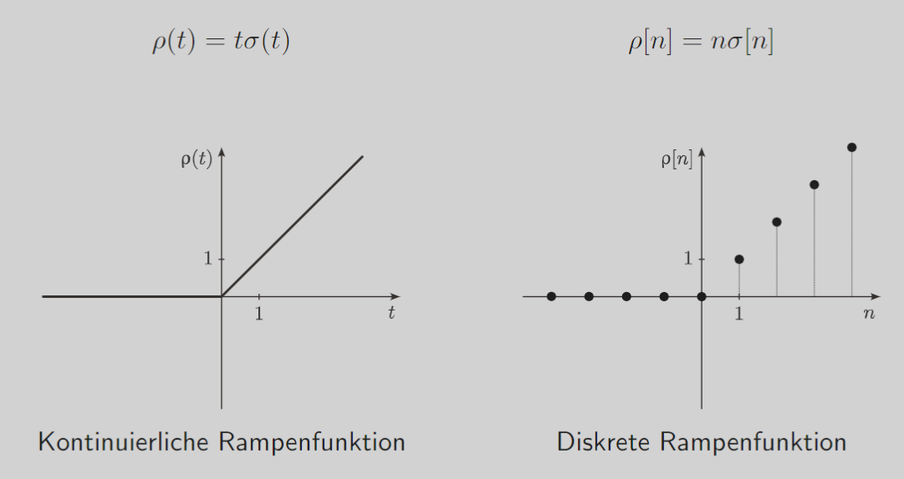

---
tags:
  - tikz/pgfplot
aliases: 
keywords: 
subject:
  - VL
  - Signale und Systeme
semester: WS24
created: 8. Oktober 2024
professor:
---
 

# Testsignale

1. [Sprung](Einheitssprungfunktion.md)
2. [Rechteck](Rechteckfunktion.md)
3. Rampen
4. Sinus
5. Dirac

## Rampenfunktion

Die Rampenfunktion $\rho(t)$ steigt für $t>0$ linear mit der Zeit an.



## reelle Exponentialfunktion

Die reelle Exponentialfunktion $x(t)=e^{\alpha t}=e^{\dfrac{t}{T}}$ besitzt die Zeitkonstante $T=\frac{1}{\alpha}$, welche die Länge der Subtangente, bzw. den Abfall auf $\dfrac{1}{e}=36,8 \%$ beschreibt.

$$
e^{\alpha t} \begin{cases}\alpha>0 & \text { anklingend } \\ \alpha<0 & \text { abklingend, gedämpft }\end{cases}
$$


```tikz
\usepackage{tikz}
\usepackage{pgfplots}
\pgfplotsset{compat=newest}

\begin{document}

% Plot for both growing and decaying exponential functions
\begin{tikzpicture}[scale=2]

% Ansteigende Exponentialfunktion (alpha > 0)
\begin{axis}[
    axis lines=middle,
    xlabel={$t$},
    ylabel={},
    xtick=\empty,
    ytick={1},
    ymin=-0.5,
    ymax=3,
    xmin=-2,
    xmax=2,
    width=7cm,
    height=6cm,
    domain=-2:2,
    samples=100,
    title={Anklingende Exponentialfunktion},
    axis line style={->}
]
    % Growing exponential function
    \addplot[domain=-2:0, red, thick] {exp(x)};
    % Line at t = 0 and |T|
    \addplot[dashed] coordinates {(0,1) (-1,1)};
    \node at (axis cs: -1,0.7) {$|T|$};
    % Label for 1
    \node at (axis cs: 0.2,2.5) {$e^{\alpha t}$};
    \node at (axis cs: 0.8,2.1) {($\alpha > 0$)};
\end{axis}

% Abklingende Exponentialfunktion (alpha < 0)
\begin{axis}[
    axis lines=middle,
    xlabel={$t$},
    ylabel={},
    xtick=\empty,
    ytick={1},
    ymin=-0.5,
    ymax=3,
    xmin=-2,
    xmax=2,
    width=7cm,
    height=6cm,
    at={(8cm,0)},
    domain=-2:2,
    samples=100,
    title={Abklingende Exponentialfunktion},
    axis line style={->}
]
    % Decaying exponential function
    \addplot[domain=0:2, red, thick] {exp(-x)};
    % Line at t = 0 and |T|
    \addplot[dashed] coordinates {(0,1) (1,1)};
    \node at (axis cs: 1,0.7) {$|T|$};
    % Label for 1
    \node at (axis cs: 0.2,2.5) {$e^{\alpha t}$};
    \node at (axis cs: 0.8,2.1) {($\alpha < 0$)};
\end{axis}

\end{tikzpicture}

\end{document}
```

## Komplexe Exponentialfunktion

## Sinusfunktion

```tikz
\usepackage{pgfplots}
\pgfplotsset{compat=1.16}

\begin{document}

\begin{tikzpicture}[thick, scale=1.5]
\begin{axis}[
    axis lines=middle,
    ytick=\empty,
    xtick=\empty,
    smooth
]
\addplot[
	domain=-2*pi:2*pi
]
{sin(deg(x+1))};
\end{axis}
\end{tikzpicture}

\end{document}
```

## sinc-Funktion

Der Sinus cardinalis, auch sinc-Funktion, Kardinalsinus oder Spaltfunktion genannt, ist in der normierten Form folgendermaßen definiert

$$
\operatorname{sinc}(t)=\frac{\sin (\pi t)}{\pi t}
$$

```tikz
\usepackage{pgfplots}
\usepackage{amsmath}
\pgfplotsset{compat=1.16}

\begin{document}

\begin{tikzpicture}[scale=2]
\begin{axis}[
    axis lines=middle,
    xmin=-11, xmax=11, ymax=1.1,
    title={Kontinuierliche sinc-Funktion}]
\addplot[
smooth,
domain=-10:10,
red
]
{sin(deg(pi*x))/(pi*x)};
\end{axis}
\end{tikzpicture}

\end{document}
```

## si-Funktion

Die si-Funktion, oder auch nichtnormierte Version der sinc-Funktion, welche manchmal aber ebenso als sinc-Funktion bezeichnet wird...
> [!important] ... definieren wir als
> 
> $$ \mathrm{si}(t)=\frac{\sin (t)}{t} $$
 
mit folgenden Eigenschaften:

$$
\begin{aligned}
\int_{-\infty}^{\infty} \operatorname{si}(t) \mathrm{d} t  =\pi && \int_{-\infty}^{\infty} \mathrm{si}^2(t) \mathrm{d} t =\pi
\end{aligned}
$$

```tikz
\usepackage{pgfplots}
\usepackage{amsmath}
\pgfplotsset{compat=1.16}

\begin{document}

\begin{tikzpicture}[scale=1.5]
\begin{axis}[
    ymax=1.1, xmax=11, xmin=-11,
    axis lines=middle,
    title={Kontinuierliche si-Funktion}]
\addplot[
smooth,
domain=-10:10,
red,
samples=60
]
{sin(deg(x))/(x)};
\end{axis}
\end{tikzpicture}

\end{document}
```

## Dirac-Distribution

Die Impuls- oder Dirac-Distribution $\delta(t)$ ist keine gewöhnliche Funktion und nur als Distribution oder verallgemeinerte Funktion darstellbar.

$$
\delta(t)=\left\{\begin{array}{lll}
\infty & \text { für } t=0 \\
0 & \text { für } t \neq 0
\end{array} \quad \delta[n]=\left\{\begin{array}{lll}
1 & \text { für } & n=0 \\
0 & \text { für } & n \neq 0
\end{array}\right.\right.
$$


### Eigenschaften

[Verschiebung und Skalierung](Elementare%20Operationen%20auf%20Signalen.md):

$$ 
\begin{align}
\delta(t-t_0) \\
\delta(a t)=\frac{1}{\lvert a \rvert }\delta(t)

\end{align}
$$

