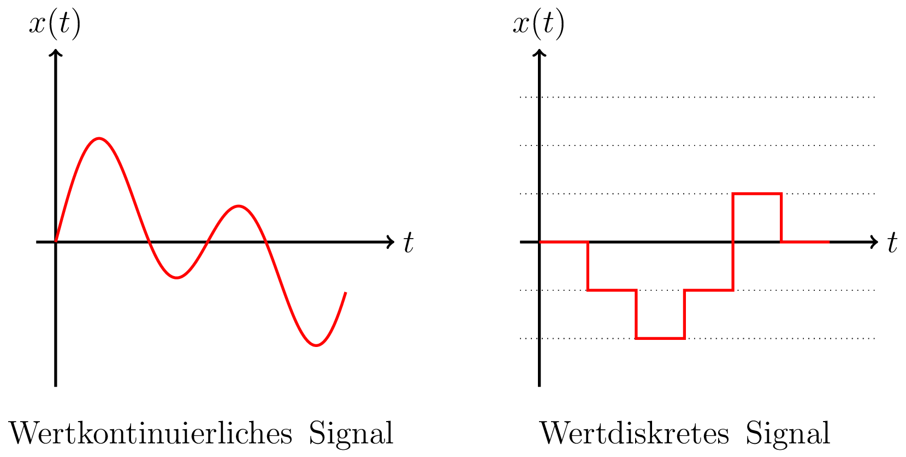

# Wertkontinuität von Signalen

Ein wertkontinuierliches Signal kann beliebige Funktionswerte annehmen, wohingegen ein wertdiskretes Signal nur diskrete Signalstufen besitzt. Die Diskretisierung (Quantisierung) der Amplitudenwerte geschieht i.d.R. in linearen Stufen, mit $N$-Bits ergeben sich $2^N$ mögliche Funktionswerte.