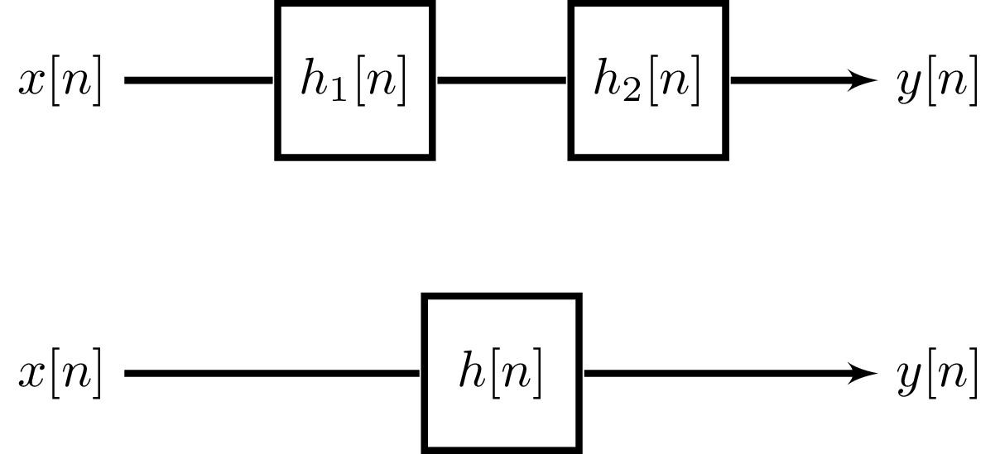

---
tags:
  - tikz
aliases:
keywords:
subject:
  - Signalverarbeitung
  - VL
semester: SS25
created: 12th March 2025
professor:
release: false
title: Diskrete Systeme
---

# Zeitdiskrete LTI-Systeme

> [!question] :LiArrowBigLeftDash: [Lineare Systeme](Lineare%20Systeme.md) |📍| [LTI-Zustandsraum](LTI-Zustandsraum.md) :LiArrowBigRightDash:

[Kontinuierliche LTI-Systeme](../Zeitkontinuierlich/LTI-Systeme.md) ***:LiRefreshCcw:***

---

#todo
## Differenzengleichung

## Übertragungsfunktion

> [!question] [Übertragungsfunktion](Übertragungsfunktion.md)

## IIR vs. FIR

Man unterscheidet je nach Impulsantwort des System Zwischen [IIR](../Signalverarbeitung/IIR-Filter.md) (Infinite Impulse Response) und [FIR](../Signalverarbeitung/FIR-Filter.md) (Finite Impulse Response) Systemen.

|             | FIR                                                          | IIR                                                  |
| ----------- | ------------------------------------------------------------ | ---------------------------------------------------- |
| Stabilität  | Immer [BIBO-Stabil](../Stabilität%20und%20Beschränktheit.md) | Wegen Rückkopplung Schwingfähig                      |
| Ordnung     | Hohe Ordnung                                                 | Niedriger Ordnung notwendig für das Selbe Verhalten. |
| Speicher    | Wegen der großen Anzahl an Koeffizienten groß                | Kleiner Speicher                                     |
| Verzögerung | Längere Verzögerungen                                        | Kürzere Verzögerungen                                |

## Kettenschaltung

Um ein gewünschtes Verhalten eines zeitdiskreten LTI-Systems zu erzielen, werden oft einzelne, leicht zu beschreibende Systeme kaskadiert. 

Die Reaktion des ersten Systems auf den Einheitsimpuls ist $h_{1}[n]$ somit wird die Ausgangsfolge des zweiten Systems und damit die Impulsantwort des Gesamtsystems (oder Ersatzsystems) $h[n]$ zu:

$$ h[n] = h_{1}[n] * h_{2}[n] $$

Wegen der kommutativität der [Faltung](Zeitdiskret/Faltungssumme.md), ist die Reihenfolge der kaskadierung nicht relevant.

---

## Beispiele für ZD-LTI-Systeme

> [!example] Ideale Verzögerung ^BSP1
> 
> - *Ausgangssignal:* $y[n] = x[n-n_{d}]$ mit $-\infty< n <\infty, n_{d} \in \mathbb{N}$
> - *Impulsantwort:* $h[n] = \delta[n-n_{d}]$
> 
> Durch Betrachtung von $h[n]$ folgt unmittelbar, dass es sich um ein kausales, BIBO stabiles LTI-System handelt.

---

> [!example] Summierer, Akkumulator oder diskreter Integrator ^BSP2
> 
> - *Ausgangssignal:*
> - *Impulsantwort:*
> 
> Durch Betrachtung von $h[n]$ folgt unmittelbar

---

> [!example] Gleitende Mittelwert Bildung - [Moving Average](../Signalverarbeitung/Moving%20Average.md) ^BSP3

---

> [!example] Vorwärts-Differenz-System ^BSP4
> 
> - *Ausgangssignal:* $y[n] = x[n+1]-x[n]$
> - *Impulsantwort:* $h[n] = \delta[n+1]-\delta[n]$
> 
> Dieses BIBO stabile LTI System ist nicht kausal, da der aktuelle Wert der Ausgangsfolge von einem zukünftigen Wert der Eingangsfolge abhängt. Startet das Eingangssignal beispielsweise bei $n=1$, so startet das Ausgangssignal bereits bei $n=0$
> 

---

> [!example] Rückwärts-Differenz-System ^BSP5
> 
> - *Ausgangssignal:* $y[n] = x[n]-x[n-1]$
> - *Impulsantwort:* $h[n] = \delta[n]-\delta[n-1]$
> 
> Diese System ist wiederum kausal

---