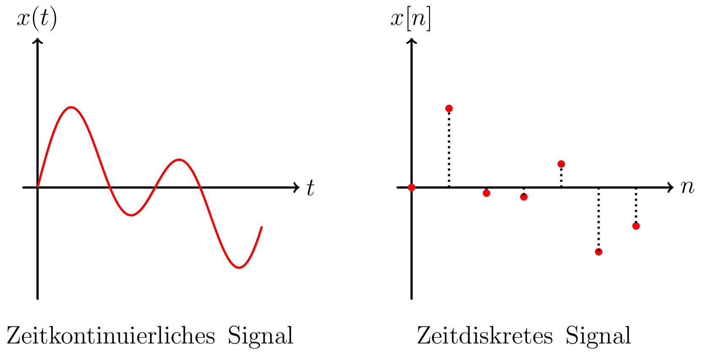

#  Zeitkontinuität von Signalen

Ein zeitkontinuierliches Signal ist für alle Zeitpunkte definiert, ein zeitdiskretes Signal nur zu gewissen Zeitpunkten.

Voraussetzungen zur Äquivalenz beider Darstellungen werden im Abtasttheorem erarbeitet.