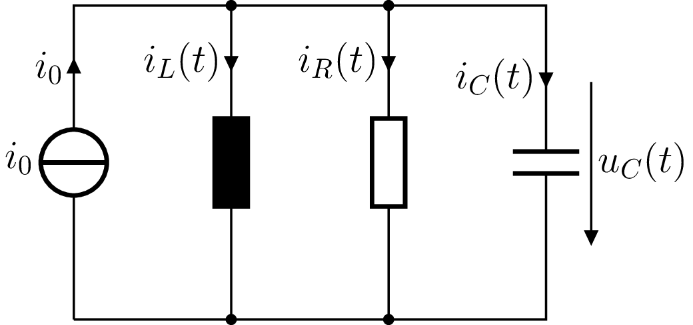

---
tags:
  - tikz/circuitikz
  - Systeme/Kon
aliases:
  - Zustandsvariablen
  - Zustandsbegriff
  - Zustandsgleichung
  - Zustandsgrößen
keywords: 
subject:
  - VL
  - Signale und Systeme
  - Regelungstechnik
semester: WS24
created: 18. Dezember 2024
professor:
  - Andreas Stelzer
  - Markus Schöberl
---

# Zustandsbeschreibung eines dynamischen Systems

> [!question] Zentraler Begriff der [Systemtheorie](index.md)

[Zeitdiskrete Zustandsbeschreibung](Zeitdiskrete%20Zustandsbeschreibung.md) ***:LiArrowBigRightDash:***

---

Der Zustand des Systems beschreibt die internen Größen des dynamischen Systems

> [!quote] Zustandsgrößen sind Variablen, die Auskunft über die vom System beinhaltete **Energie** geben. 
> 
> - Im Feder-Masse-Dämpfer-System: Geschwindigkeit $v$ und Auslenkung $x$
> - Im RC: Spannung am C $u_{c}(t)$
> - Im RLC: Spannung am C $u_{c}(t)$ und Strom in L $i_{l}(t)$ ([Beispiel: Parallelschwingkreis](#Parallelschwingkreis))

---

## Begriffserklärung

Für jeden Zeitpunkt $t_0$ reicht
- die Kenntnis des Zustandes **zu diesem Zeitpunkt** $t_0$
- zusammen mit der Kenntnis **der Erregung** (des Eingangs) für *alle Zeiten* $t \geq t_0$ aus,

um die Antwort des Systems für alle Zeiten $t \geq t_0$ zu bestimmen. Alle anderen Kenngrößen sind bekannt bzw festgelegt.

- Es spielt dabei **keine Rolle**, wie der Zustand in der **Vergangenheit** (zu Zeiten $t<t_0$ ) entstanden ist
- In der Regel wird der Zustand eines Systems durch mehrere Größen beschrieben
- Häufig werden Systeme mit mehreren Eingängen und mehreren Ausgängen betrachtet (MIMO - multiple inputs, multiple outputs))

Der Zustandsraum ist die Vorbereitung, um Systeme auf eine beliebige Anzahl von ein und Ausgängen zu erweitern (MIMO)

## Zustandsgrößen

- Beschreibung von Systemen mit Hilfe gewöhnlicher linearer Differentialgleichungen beliebiger Ordnung
- Im allgemeinen Fall: ein System von Differentialgleichungen
- Jede Differentialgleichung höherer Ordnung lässt sich in ein System von Differentialgleichungen 1. Ordnung zerlegen

> [!hint]- **Erinnerung:** [Lineare DGL n-ter Ordnung](../../Mathematik/Analysis/Lineare%20DGL%20n-ter%20Ordnung.md) $\to$ [DGL-System](../../Mathematik/Analysis/DGL-System.md) 1. Ordnung
> Differentialgleichung $n$-ter Ordnung:
> 
> $$x^{(n)}+\alpha_n x^{(n-1)}+\ldots+\alpha_3 \ddot{x}+\alpha_2 \dot{x}+\alpha_1 x=u$$
> 
> Wird Zu *($\alpha$ sind negativ da die größen auf die Andere Seite des LGS gebracht wurden)*
> 
> $$
> \begin{aligned}
> \begin{pmatrix}
> \dot{x}_1 \\ \dot{x}_2 \\ \vdots \\ \dot{x}_{n-1} \\ \dot{x}_n
> \end{pmatrix} = \begin{pmatrix}
> 0 & 1 & 0 & \ldots & 0 \\
> 0 & 0 & 1 & \ddots & 0 \\
> \vdots & \vdots & \ddots & \ddots & \vdots \\
> -\alpha_{1} & -\alpha_{2} & -\alpha_{3} & \ldots & -\alpha_{n-1}
> \end{pmatrix}\cdot \begin{pmatrix}
> x_1 \\ x_2 \\ \vdots \\ x_{n-1} \\ x_n
> \end{pmatrix}+ \begin{pmatrix}
> 0 \\ 0 \\ \vdots \\ 0 \\ u
> \end{pmatrix} \\
> \end{aligned}
> $$
> 

Die Größen $x_1, x_2, \ldots, x_n$ sind ein Satz von **Zustandsvariablen**. Wir überlegen uns ein mathematisches Modell, um den Zustand eines Systems zu Beschrieben. Dazu werden folgebde Annahmen aufgestellt:

| Es gibt $p$ **Eingangsgrößen** $u_1, u_2, \ldots, u_p$                                                                                                                           | Es gibt $q$ **Ausgangsgrößen** $y_1, y_2, \ldots, y_q$                                            |
| -------------------------------------------------------------------------------------------------------------------------------------------------------------------------------- | ------------------------------------------------------------------------------------------------- |
| Im allgemeinen Fall können alle Ableitungen $\dot{x}_1, \dot{x}_2, \ldots, \dot{x}_n$ von allen $p$ *Eingangsgrößen* und allen *Zustandsgrößen* $x_1, x_2, \ldots, x_n$ abhängen | Ausgangsgrößen lassen sich als Funktion der *Zustandsgrößen* und der *Eingangsgrößen* darstellen. |
| $\rightarrow$ **Zustandsgleichung:** $\mathbf{\dot{x}}=\mathbf{f}(t,\mathbf{x},\mathbf{u})$                                                                                      | $\to$ **Ausgangsgeichung:** $\mathbf{y}=\mathbf{g}(t,\mathbf{x}, \mathbf{u})$                     |

> [!quote] Regelungstechnik: Eingangsgrößen heißen auch Stellgrößen.

Aus den obigen Annahmen werden die Zustandsgrößen wiefolgt angeschreiben:

> [!def] **D1 - ZSGR)** Zustandsgrößen ^ZSGR
> $$
> \begin{align}
> \mathbf{u}(t)&=\left[ u_{1}, u_{2}, \dots, u_{p} \right] ^{\operatorname{T}}&\in\mathbb{R}^{p}\,\forall t\tag{Eingangsvektor} \\
> \mathbf{x}(t)&=\left[ x_{1}, x_{2}, \dots, x_{n} \right] ^{\operatorname{T}}&\in\mathbb{R}^{n}\,\forall t\tag{Zustandsvektor} \\
> \mathbf{y}(t)&=\left[ y_{1}, y_{2}, \dots, y_{q} \right] ^{\operatorname{T}}&\in\mathbb{R}^{q}\,\forall t\tag{Ausgangsvektor}
> \end{align}
> $$
> 

Der Zustandsvektor $\mathbf{x(t)}$ ist ein Element eines linearen Vektorraumes, des **Zustandsraumes**

---

# Beispiel

## Parallelschwingkreis

>[!example] Zustandsbeschreibung eines Parallelschwingkreis
> Relevant ist, wo hier die Energie gespeichert wird. 

> [!important] Zustansgrößen: $u_C(t)$, $i_L(t)$
> 
> Beide Größen sind Funktionen der Zeit und mit den beiden unabhängigen Energiespeichern im System direkt verknüpft $\rightarrow$ Zustandsvariablen Die Kapazität speichert die gesamte Vergangenheit in Form der eingebrachten Ladung als Spannung $u_C\left(t_0\right)$ und die Induktivität in Form des Stromes $i_L\left(t_0\right)$

Gleichungen zur Zustandsbeschreibung:

$$
\begin{aligned}
u_C(t) & =\frac{1}{C} \int_{-\infty}^t i_C(\tau) \mathrm{d} \tau=\frac{1}{C} \int_{-\infty}^{t_0} i_C(\tau) \mathrm{d} \tau+\frac{1}{C} \int_{t_0}^t i_C(\tau) \mathrm{d} \tau \\
& =\boxed{ u_C\left(t_0\right)+\frac{1}{C} \int_{t_0}^t i_C(\tau) \mathrm{d} \tau } \\
i_L(t) & =\frac{1}{L} \int_{-\infty}^t u_L(\tau) \mathrm{d} \tau=\frac{1}{L} \int_{-\infty}^{t_0} u_L(\tau) \mathrm{d} \tau+\frac{1}{L} \int_{t_0}^t u_L(\tau) \mathrm{d} \tau \\
& =\boxed{ i_L\left(t_0\right)+\frac{1}{L} \int_{t_0}^t u_L(\tau) \mathrm{d} \tau }
\end{aligned}
$$

Mit jedem **zusätzlichen Energie-Speicher** steigt die Ordnung der DGL die das System beschreibt um **1**.

---

Unexpected Zustandsraum: [3b1b: 9:00 "State Space"](https://youtu.be/6dTyOl1fmDo?si=l6_opNoznnERKKUX)