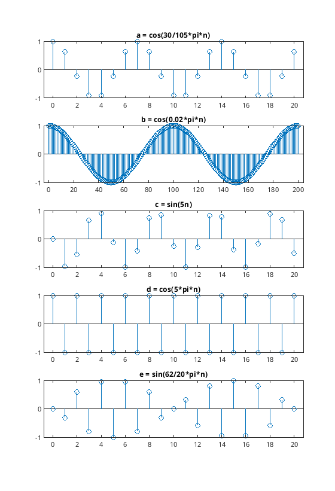

# ZSS005

> [!example] Periodizität von zeitdiskreten Signalen
> Gegeben ist das zeitdiskrete Signal. Welche dieser Signale sind periodisch? Berechnen Sie gegebenenfalls die Grundperiode.
> 
> 1. $\cos{\left(\frac{30}{105}\pi n\right)}$
> 2. $\cos{(0.02\pi n)}$
> 3. $\sin{(5n)}$
> 4. $\cos{(5\pi n)}$
> 5. $\sin{\left(\frac{62}{10}\pi n\right)}$

## 1 

$$
\begin{align*}
\cos{\left(\frac{30}{105}\pi(n+N)\right)} &\overset{!}{=} \cos{\left(\frac{30}{105}\pi n + 2\pi k\right)} &&\Bigg|\arccos \\
\frac{30}{105}\pi(n+N) &\overset{!}{=} \frac{30}{105}\pi \left(n+ 2k\cdot\frac{105}{30}\right) &&\Bigg| \frac{105}{30\pi} \ \Bigg| -n \\
N&\overset{!}{=} \frac{105}{15}k = 7k
\end{align*}
$$

Das kleinste ganzzahlige Ergebnis liefert $k=1\implies N=7$. In den folgenden Rechnungen wird die Forderung direkt an das Argument der Winkelfunktion gestellt.

## 2

$$
\begin{align*}
    0.02\pi (n+N) &\overset{!}{=} 0.02\pi n + 2\pi k\\
    \frac{1}{50}\pi(n+N) &\overset{!}{=} \frac{1}{50}\pi (n+100k) \\
    N &\overset{!}{=} 100k \implies N = 100
\end{align*}
$$
## 3

$$
\begin{align*}
5(n+N) &\overset{!}{=} 5n + 2\pi k \\
5n+5N &\overset{!}{=} 5n + 2\pi k \\
5N &\overset{!}{=} 2\pi k
\end{align*}
$$

$\pi$ ist irrational, daher ist das Signal nicht periodisch.

## 4

$$
\begin{align*}
5\pi (n+N) &\overset{!}{=} 5\pi n + 2\pi k \\
5\pi n+ 5\pi N  &\overset{!}{=} 5\pi n + 2\pi k \\
5\pi N &\overset{!}{=} 2k\pi \\
N &\overset{!}{=} \frac{2}{5}k \implies N = 2
\end{align*}
$$

## 5

$$
\begin{align*}
\frac{62}{10}\pi (n+N) &\overset{!}{=} \frac{62}{10}\pi n + 2\pi k \\
\frac{62}{10}\pi n+\frac{62}{10}\pi N &\overset{!}{=} \frac{62}{10}\pi n + 2\pi k \\
N&\overset{!}{=} \frac{20}{62} k = \frac{10}{31}k \implies N = 10
\end{align*}
$$

Veranschaulicht durch `stem` Plots:

