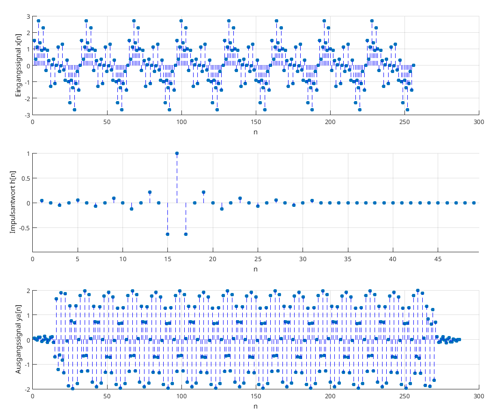
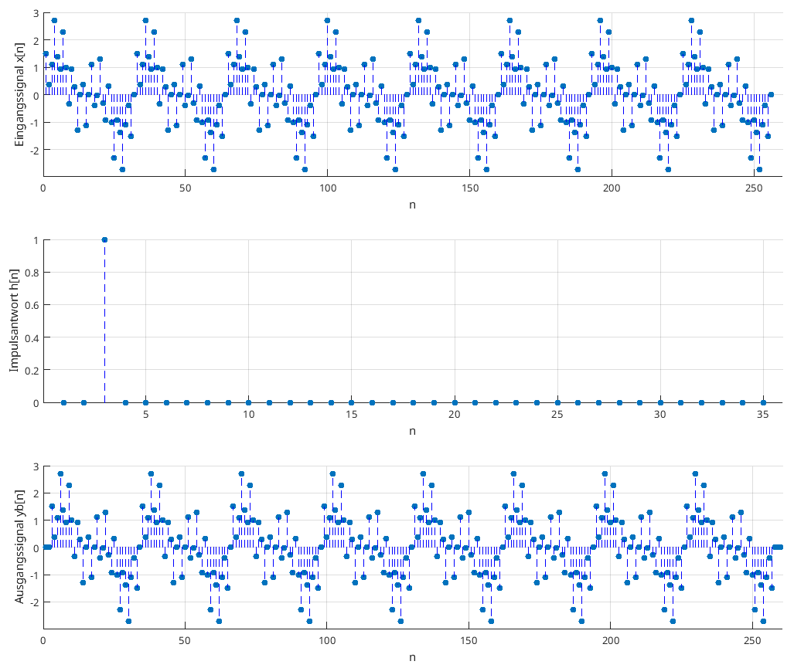
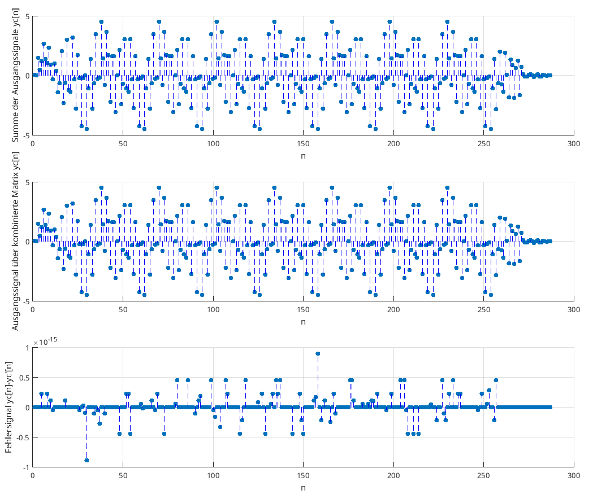

# ZSS016

> [!question]- [Faltungssumme](../Faltungssumme.md)
> Die Faltung kann über die Differenzengleichung
> 
> $$
> y[n] = a_0x[n] + a_1x[n-1]+\dots a_{N_a-1}x[n-N_a+1] \tag{1}
> $$
> 
> beschrieben werden. Der Eingang $x[n]$ und die konstante Koeffizienten-Sequenz $a[n]$ seien dabei $\mathbf{x}=[x[0],x[1],\dots, x[N_x-1]]^\mathrm{T}$ und $\mathbf{a}=[a[0],a[1],\dots,a[N_a-1]]^\mathrm{T}$. Die Ausgangssequenz sei definiert durch
> 
> $$\mathbf{y}_a = [y_a[0], y_a[1],\dots , y_a[N_{ya}-1]]^\mathrm{T}$$
> 
> wobei $N_{ya}=N_x$ gilt, d.h. (1) wird bis zu einem maximalen $n=N_x$ ausgewertet. Es wird angenommen, dass $x[n] = 0$ wenn $n \notin [0,N_x-1]$, und $a[n]=0$ wenn $n\notin[0,N_a-1]$.
 

> [!example] Faltungsmatrix (12 Punkte)
> a) Gleichung (1) kann auch in Matrix Form
> 
> $$ \mathbf{y}_a= \mathbf{Ax} $$
> 
> geschrieben werden, wobei $\mathbf{A}$ die sogenannte Faltungsmatrix ist. Diskutieren Sie die Struktur von $\mathbf{A}$. Was sind die resultierenden Dimensionen dieser Matrix? Geben Sie eine detaillierte Beschreibung für diese und die folgenden Fragen in Ihrem Protokoll.
> 
> b)  Schreiben Sie eine Matlab Funktion `[ya,A] = mtxfilter(a,x)` welche Gleichung (1) implementiert und zusätzlich die Matrix $\mathbf{A}$ zurückgibt. Sie dürfen dabei die built-in Funktionen `convmtx` und `conv` **nicht** verwenden! Die Funktion muss für Übergabeprameter `(a,x)` beliebiger Länge funktionieren.
> 
> c) Testen Sie Ihre Funktion mit dem Zeitsignal
> 
> $$x[n]=\sin{\left(2\pi\frac{8n}{N_x}\right)} + \sin{\left(2\pi \frac{16n}{N_x}\right)} + \sin{\left(2\pi\frac{80n}{N_x}\right)}, \quad n = 0,\dots, N_x-1$$
> 
> und den Filterkoeffizienten
> 
> $$
> a[n] = \begin{cases}
> (-1)^{n} \frac{\sin{(0.5\pi (n-D))}}{0.5\pi(n-D)} &\text{für } n=0,1,\dots, D-1, D+1,\dots, N_a-1\\
> 1 & \text{für } n = D 
> \end{cases}
> $$
>
> Setzen Sie $N_x = 256$, $N_a=33$ und $D=16$ und führen Sie die folgenden Experimente aus:
> 
> Verwenden Sie Ihre Funktion `mtxfilter` um die Ausgangssequenz `ya[n]` zu berechnen. Visualisieren Sie ihre Resultate in einer Abbildung. Verwenden Sie dabei wiederum die Funktion `subplot`, um die Eingangs-Sequenz, die Impulsantwort und die Ausgangs-Sequenz in der gleichen Abbildung darzustellen. Verwenden Sie die Funktionen `xlabel` und `ylabel` um die Achsen korrekt zu beschriften.
> 
> d) Betrachten Sie nun eine weiter Filterfunktion gegeben als
> 
> $$b[n]=\delta[n-2]$$
> 
> mit $N_b=3$. Wiederholen Sie die Schritte aus der vorigen Aufgabe, indem Sie den Filter $b[n]$ verwenden und berechnen Sie $y_b[n]$
> 
> e) Summieren Sie die Signale $y_a[n]$ und $y_b[n]$ um das Ausgangssignal $y[n]$ zu erhalten. Berechnen Sie also
> 
> $$y[n]=y_a[n]+y_b[n]$$
> 
> und plotten Sie es in der Zeitdomäne. Wie können Sie die Matrizen $\mathbf{A}$ und $\mathbf{B}$ (welche von den Funktionen `[ya, A] = mtxfilter(a,x)` bzw. `[yb,B] = mtxfilter(b,x)` zurückgegeben werden) kombinieren, um eine neue Matrix $\mathbf{C}$ zu erhalten, sodass $\mathbf{y}=\mathbf{Cx}$? Berechnen und plotten Sie $\mathbf{y}'=\mathbf{Cx}$ zum Vergleich.
> 

## a)

$N_{ya} = N_x$: Ein- und Ausgang sind gleichgroß:

$$
\mathbf{y}_a = \mathbf{Ax}, \quad \mathbf{A} \in \mathbb{R}^{N_{ya}\times N_x}
$$

Die Matrix ist quadratisch. Einsetzen für $n$ in (\ref{eqn:1}) liefert:

$$
\begin{align*}
y[0] &= a_0 x[0] \\
y[1] &= a_0 x[1] + a_1 x[0] \\
y[2] &= a_0 x[2] + a_1 x[1] + a_2 x[0]\\
& \ \ \vdots \\
y[N_{ya}-1] &= a_0 x[N_{ya}-1] + a_1 x[N_{ya}-2] + \dots + a_{N_{ya}-1} x[0]\\
\end{align*}
$$

Eingesetzt in den Vektor $\mathbf{y}_a$:

$$
\begin{pmatrix}
    y[0] \\ y[1] \\ y[2] \\ \vdots \\ y[N_{ya}-1]
\end{pmatrix} = \left(\begin{array}{l}
    a_0 x[0] \\ a_1 x[0] + a_0 x[1] \\ a_2 x[0] + a_1 x[1] + a_0 x[2] \\ \qquad \vdots \\
    a_{N_{ya}-1} x[0] + \dots + a_1 x[N_{ya}-2] + a_0 x[N_{ya}-1]
\end{array}\right)
$$

Durch erkennen der Linearkombination der Vektorelemente aus $\mathbf{x}$, lässt sich die Gleichung schreiben wie:

$$
\mathbf{y} = \underbrace{\begin{pmatrix}
    a_0 & 0 & 0 & \cdots & 0 \\
    a_1 & a_0 & 0 & \cdots & 0 \\
    a_2 & a_1 & a_0 & \cdots & 0 \\
    \vdots & \vdots & \vdots & \ddots & \vdots \\
    a_{N_{ya}-1} & a_{N_{ya}-2} & a_{N_{ya}-3} & \cdots & a_0 \\
\end{pmatrix}}_{\mathbf{A}} \mathbf{x}
$$

## b

Auch als Matlab-Skript im Anhang.

```matlab
function [ya,A] = mtxfilter(a,x)
    %calculate signal length and length of kernel
    sigLen = length(x);
    coeffLen = length(a);
    
    n = sigLen;
    m = sigLen+coeffLen-1;
    
    A = zeros(m,n);
    
    for i = 1:n
        A(i:i+length(a)-1,i) = a;
    end
    
    ya = A*x';
end
```
## c

Eingangssignal $\mathbf{x}$, Impulsantwort von $\mathbf{A}$, Ausgangssignal $\mathbf{y}$ zu $\mathbf{x}$



## d

Antwort auf $b[n]$



## e

Da die Eingänge lediglich addiert werden, lässt sich für die Matrix $\mathbf{C}$ einfach $\mathbf{A}$ und $\mathbf{B}$ addieren.



Summe der Ausgänge, Filter mit $\mathbf{C}$, Absoluter Fehler
