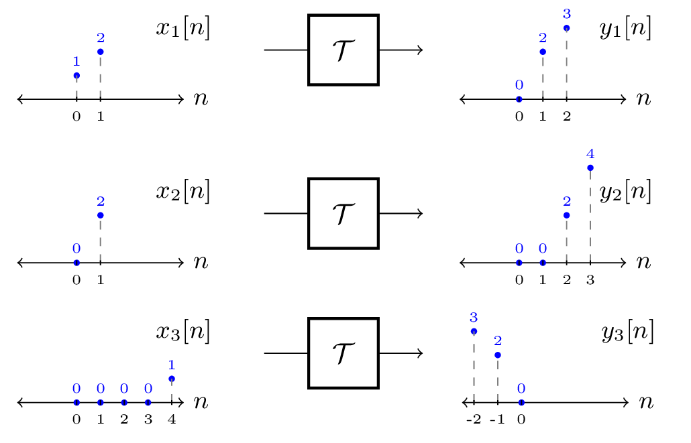

# ZSS039

> [!example] LTI Systeme
> Über das System $\mathcal{T}$ ist bekannt, dass es zeitinvariant ist. Wenn am Eingang des Systems die Signale: $x_1[n]$, $x_2[n]$ oder $x_3[n]$ anliegen, so erhält man die Systemantworten: $y_1[n]$, $y_2[n]$ bzw. $y_3[n]$, wie im folgenden Bild:
>
> 
>
> Stellen Sie fest, ob das System $\mathcal{T}$ linear sein kann.