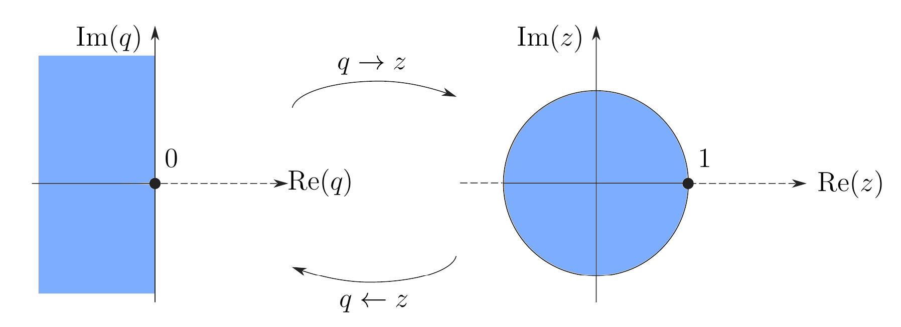

# q-Transformation

- [z-Transformation](z-Transformation.md)

---

> [!quote] Bilineartransformation nach Tustin
> Für den Entwurf digitaler Regelkreise spielt der Frequenzgang des Abtastsystems dieselbe Rolle wie bei zeitkontinuierlichen Systemen. Die Handhabung der Funktion $G\left( e^{ j\omega T_{a} } \right)$ wird jedoch durch die Tatsache erschwert, dass hier eine transzendente Funktion in $\omega$ vorliegt.

Das Ziel ist es, die Frequenz  $\omega$ so zu transformieren, dass in einer transformierten Frequenz $\Omega$ der Frequenzgang des Abtastsystems eine rationale Funktion ist.

Dies ist dann möglich, wenn man eine  Transformation so findet, dass die obere Hälfte des Einheitskreises $e^{ j\omega T_{a} }$ im Intervall $0 \leq \omega < \frac{\pi}{T_{a}}$ der komlexen $w$-Ebene abgebildet wird. Genau dies kann aber mithilfe der Transformationsvorschrift 

$$ w := \frac{z-1}{z+1} $$ 

erreicht werden. Setzt man in $w$ für $z=e^{ j\omega T_{a} }$ ein, so erhält man

$$
\frac{e^{ j\omega T_{a} } - 1}{e^{ j\omega T_{a} } + 1} = \tanh \left( \frac{j\omega T_{a}}{2} \right) = \tan \left( \frac{\omega T_{a}}{2} \right)
$$
Es hat sich als sinnvoll erwiesen, den Normierungsfaktor $T_{a}/2$ auch bei der transformierten Frequenz $\Omega$ zu verwenden, und aus

$$
\Omega \frac{T_{a}}{2} = \tan \left( \frac{\omega T_{a}}{2} \right) \qquad \implies \qquad \Omega = \frac{2}{T_{a}}\tan \left( \frac{\omega T_{a}}{2} \right)
$$



---

> [!hint] matlab Befehl (`Control_Systems_Toolbox`)
> 
> ```matlab
> tustin()
> ```


$$ G(q) = \frac{1-q}{3+q}, \quad T_{a}=2 \implies \Omega =1 $$

Um die realsierbarkeit / Sprungfähigkeit festzustellen muss $T_{a}$ bekannt sein. Im s-Bereich die grade von Nenner und Zähler vergleichen. Im q-Bereich Grenzwerte

---

# Referenzen

- Ähnlichkeit zur Transformationsvorschrtift des Reflexionsfaktors im Smith-Chart