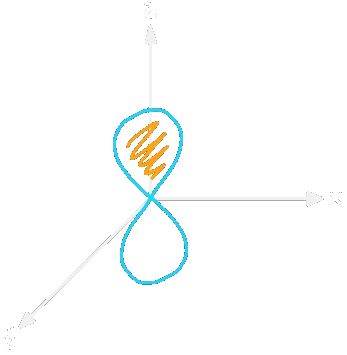

# Orbitalmodell
## Unterschalen
- Die Schalen von Bohr werden in **n** Unterschalen (s, p d ,f) aufgespalten
- Jede Schale kann maximal n Unterschalen haben. Es gibt 4 Unterschalen (s, p, d , f)
- Schale kann maximal $2n^{2}$ Elektronen ($e^{-}$ ) enthalten.
	 1. Schale: $2\cdot 1^{2} = 2e^{-}$
	 2. Schale: $2\cdot 2^{2} = 8e^{-}$
	 3. Schale: $2\cdot 3^{2} = 18e^{-}$
	 4. Schale: $2\cdot 4^{2} = 32e^{-}$

Unterschalen sind Orbitale

#### s-Orbitale
**Kugelsymmetrisch:**
>
#### p-Orbitale
**Mantelförmig:** 

| px               | py               | pz              |
| ---------------- | ---------------- | --------------- |
| > | > | > |
 
<mark style="background: #FFB86CA6;">Wellenberg</mark> 
<mark style="background: #CACFD9A6;">Wellental</mark> 

Es gibt 3 Stk.

#### d-Orbitale
**Rosettenförmig:**
>

Es gibt 5 Stk.

#### f-Orbitale
**Komplexere Form:**
>

Es gibt 7 Stk.

| Hauptquantenzahl | Orbitaltypen   | Bezeichnung der Orbitaltypen | Gesamtzahl der Orbitaltypen              |
| ---------------- | -------------- | ---------------------------- | ---------------------------------------- |
| n = 1            | 1 (s)          | 1s                           | $1\cdot1s=1$                             |
| n = 2            | 2 (s, p)       | 2s, 2p                       | $1\cdot2s,3\cdot2p=4$                    |
| n = 3            | 3 (s, p, d)    | 3s, 3p, 3d                   | $1\cdot3s,3\cdot3p, 5\cdot3d=9$          |
| n = 4            | 4 (s, p, d, f) | 4s, 4p, 4d, 4f               | $1\cdot4s,3\cdot4p,5\cdot4d,7\cdot4f=16$ | 

### Energieniveauschema zur Orbitalbesetzung

### Schreibweise der Elektronen Konfiguration
Bsp.:

$1s^{2}2s^{2}2p^{6}\longrightarrow [He] 2s^{2}2p^{6}$
>
<mark style="background: #ADCCFFA6;">Anzahl der $e^{-}$ </mark> 
<mark style="background: #FF5582A6;">Hauptquantenzahl</mark> 
<mark style="background: #FFB86CA6;">Orbitaltyp</mark> 

### Regel für die Besetzung der Orbitalen mit Elektronen 
1. Maximale Anzahl $e^-$ für die Hauptquantenzahl $2n^{2}$
2. Zustände **niederer Energie** werden **zuerst besetzt**.
3. **Pauli Prinzip:** Jedes Orbital kann $2e^{-}$ mit unterschiedlichen **Spin** aufnehmen.
4. **Hund'sche Regel:** Energetisch gleichwertige **Orbitale** werden **zuerst einfach besetzt**.

---
# Tags
 >**Werner Heisenberg**
 >[Heisenbergsche Unschärfe Relation](https://de.wikipedia.org/wiki/Heisenbergsche_Unsch%C3%A4rferelation):
 >Ort und Impuls eines $e^{-}$ ist nicht gleichzeitig ermittelbar. Man kann lediglich die Aufenthaltswahrscheinlichkeit angeben.

>**Louis de Broglic**
>Ebenso wie bei Licht, das als Teilchen oder Welle aufgefasst werden kann. Gilt für schnelle Teilchen $e^{-}$ der Wellenteilchendualismus.

>**Erwin Schrödinger**
>Elektronen Verhalten sich wie dreidimensionale stehende Wellen.
>Orbitale sind Räume, in denen die $e^{-}$ mit großer Wahrscheinlichkeit anzutreffen sind. Orbitale sind unscharf begrenzt.
