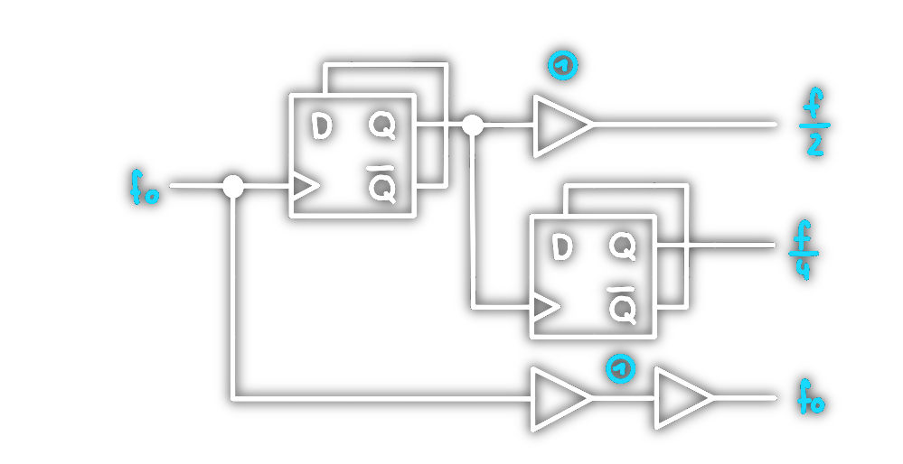
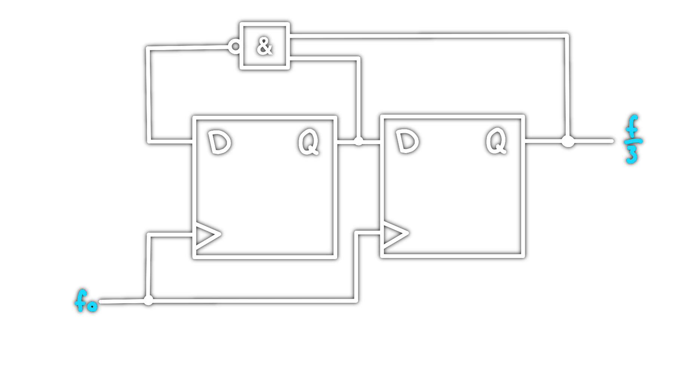

# [Clock](../hwe/Oszillatoren/Clock%20Generierung.md) Divider

Zweier Potenzen lassen sich leicht über kaskadierte D-Flip-Flops erzeugen.

## Geradzahlig 

1. [Clock-Tree-Balancing](../hwe/Clock%20Tree%20Balancing.md) (Kompensierung der Phasenverschiebung)

## Ungeradzahlig

>[!warning] Unsymmetrscher Takt ($DC\neq 50\%$)
# Tags