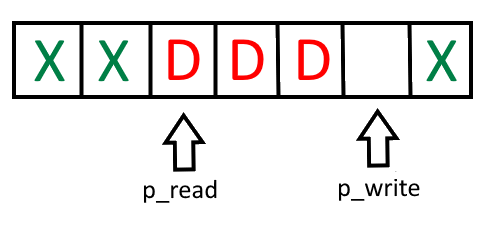
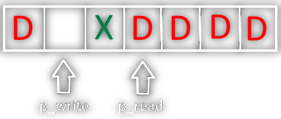

# Ringbuffer
Der Ringbuffer ist ein FIFO Speicher, der zwischen Ein und Ausgangsmedium eine Zeit Unabhängigkeit schaffen soll,
indem die zu übertragenden Daten nacheinander in einem Array geschrieben werden und bei bedarf gelesen werden können.


Hierbei bewegen sich zwei Pointer `p_read` und `p_write` durch ein Buffer Array:

> [!info] `p_write` zeigt auf die Stelle im Buffer, auf die als nächstes geschrieben wird
> - Wenn geschrieben wird. bewegt er sich auf die nächste Stelle
> - Ist er am Ende des Ringbuffers, kehrt er auf die Anfangspoition zurück

> [!info] `p_read` zeigt auf die Stelle im Buffer, von der als nächstes gelesen werden soll
> - Wenn gelesen wird. bewegt er sich auf die nächste Stelle
> - Ist er am Ende des Ringbuffers, kehrt er auf die Anfangspoition zurück


## Freier Speicher im Ringbuffer

> [!summary] Die Größe und der Datentyp des Ringbuffers müssen als einzige Parameter angegeben werden
> Freie Größe im Ringbuffer (D... Daten, X ... Freier Platz)
> - Wenn der *Read-Pointer* im Array vor dem *Write-Pointer* ist: `free_size = RINGBUFFER_SIZE - p_write + p_read - 1` 
> 
> - Daraus folgt:  Wenn der *Read*-Pointer auf dem *Write*-Pointer ist: `free_size = RINGBUFFER_SIZE - 1`
> 
> ---
> - Wenn der *Read-Pointer* im Array hinter dem *Write-Pointer* ist: `free_size = p_read - p_write - 1` 
> 
> - Daraus folgt: Wenn der *Read-Pointer* eine Stelle vor dem *Write-Pointer* ist: `free_Size = 0` 
> 

> [!warning] Der Tatsächlich für die Daten verfügbare Platz ist um `1` weniger als die angegebene Größe
> Es muss eine Stelle im Puffer geben, bei der der Write Pointer stehenbleibt, diese 

## AVR Example
Im Beispiel soll ein Ringbuffer verwendet werden, um Daten über die serielle [Schnittstelle]({MOC}%20Schnittstellen.md) `usart0` des µC [ATmega644p](AVR%20ATmega644p.md)
### Header
```c
/// @file ringbuffer.h
void ringbuffer_init();
void usart0_init();
void send_serial_data();
void print();
```
### Source
Includes:
```c
/// @file ringbuffer.c
#include <avr/common.h>    // für Statusregister SREG
#include <avr/io.h>        // für Pin-Definitionen des Prozessors
#include <avr/interrupt.h> // für UART Interrupt Vektoren
```
Initialisieren der Ringbuffer variablen:
- Da Interrupts verwendet werden, müssen die variablen global angelegt werden, weil keine Parameter in eine ISR übergeben werden können.
- Der verwendete Datentyp ist `unsigned char`
- Die Größe des Ringbuffers wird als Makro definiert.
```c
#define RINGBUFFER_SIZE 30
static unsigned char *p_read, *p_write, ringbuffer[RINGBUFFER_SIZE];
```
Zum initialisieren des Ringbuffers werden `p_read` und `p_write` auf den Anfang  von `ringbuffer` gesetzt, damit der Ringbuffer zu Beginn leer ist.
```c
void ringbuffer_init()
{
	p_read = p_write = ringbuffer // oder p_read = p_write = &ringbuffer[0]
}
```
Anschließend muss die Serielle [Schnittstelle]({MOC}%20Schnittstellen.md) initialisiert werden.
Serielle [Schnittstelle]({MOC}%20Schnittstellen.md):

| Baudrate |  Enable  |       Stoppbit        |       Datenbits       |     Parity Bit      |      Interrupt      |           Mode            |
|:--------:|:--------:|:---------------------:|:---------------------:|:-------------------:|:-------------------:|:-------------------------:|
|  19200   | Reciever | 1 Bit <br> (Standard) | 8 Bit <br> (Standard) | Aus <br> (Standard) | Data Register Empty | Asynchron <br> (Standard) |

```c
void usart0_init()
{
	UBRRL0 = 51; // Baudrate 19200 (single speed)
	UBRRH0 = 0;
	UCSR0B |= (1<<TXEN0) // Reciever Enable
	UCSR0B |= (1<<UDRIE0) // UDRE Interrupt Enable
}
```

Um den freien Speicherplatz zu ermitteln, müssen die Kriterien aus [Freier Speicher im Ringbuffer](#Freier%20Speicher%20im%20Ringbuffer) berücksichtigt werden.
Da die Pointer `p_write` und `p_read` in der ISR verändert werden, könnte bei eintreten eines Interrupts die Falsche `free_size` berechnet werden, weshalb die Interrupts davor gecleared werden müssen.
```c
void free_size(int* head, int* tail)
{
	int size = 0;
	
	// ---[!] Enter Critical Section [!]---
	
	unsigned char c_sreg = SREG; // interrupts speicher
	cli(); // clear interrupts
	if(p_write >= p_read)
		size = (RINGBUFFERSIZE - (int) p_write + (int) p_read - 1)
	else
		size = ((int) p_read + (int) p_write - 1);
	SREG = c_sreg; // alle interrupts wieder einschalten
	
	// ---[!] Leave Critical Section [!]---
	
	return size;
}
```

In `send_serial_data()` werden die Daten in den Ringbuffer geschrieben und der UDRE Interrupt eingeschalten.
In dieser Funktion erfolgt das Beschreiben des Ringbuffers.
```c
int send_serial_data(unsigned char *data, int len)
{
	if(len >= RINGBUFFER_SIZE)
		return -1; // return wenn Datengröße größer als der Ringbuffer ist
		
	int free_size = free_size(); // freien speicher berechnen
	if(len > free_size)
		while(!(UCSR0A & (1<<TXC0)))
			; // einfrieren bis ISR Ringbuffer ausreichend geleert hat

	for(int i = 0; i < len; i++)
	{
		*p_write = data[i]; // *p_write mit daten befüllen
		p_write++; // p_write erhöhen
		
		//ringbuffer addressbereich überschritten
		if(p_write >= &ringbuffer[RINGBUFFERSIZE])
			p_write = ringbuffer; // auf den start des Ringbuffers setzen
	}
	UCSR0B |= (1<<UDRIE0) // UDRE anschalten
}
```

Nachdem die Funktion `send_serial_data()` den UDRE Interrupt eingeschalten hat, wird die ISR dieses Interrupt Vektors ausgelöst, sobald das RX Daten Register leer ist.
In der ISR wird der Ringbuffer gelesen und die Daten an die Serielle gesendet.
Ist der Ringbuffer leer, so wird der UDRE Interrupt wieder ausgeschalten, bis die Funktion `send_serial_data()` erneut aufgerufen wird.

```c
ISR(USART0_UDRE_vect)
{
	if(p_read == p_write) // ringbuffer ist leer
	{
		UCSR0B &= ~(1<<UDRIE0) // UDRE Interrupt ausschalten
		return;
	}
	UDR0 = *p_read; // Wert bei p_read ins Output Register schreiben
	p_read++; // p_read erhöhen
	
	//ringbuffer addressbereich überschritten
	if(p_read >= &ringbuffer[RINGBUFFER_SIZE]) 
		p_read = ringbuffer; // auf den start des Ringbuffers setzen
}
```

Um automatisch die länge des Datensatzes zu ermitteln, wird die Wrapperfunktion `print()` erstellt
```c
void print(char* message)
{
	int len = 0;
	char* p = message;
	while (*msg++ != '\0') len++;
	send_serial_data((unsigned char*) message, len);
}
```

### main

```c
/// file: main.c
#include "ringbuffer.h"

int main()
{
	ringbuffer_init();
	usart0_init();
	sei();

	print("Hello, World!\n");
	
	while(1);
}

```

---
# Tags
