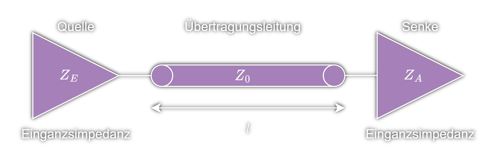
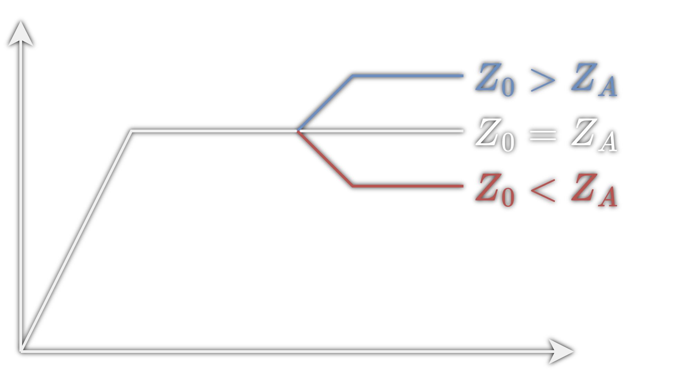

# Reflexionsfaktor

> [!SUMMARY] $\quad r= \dfrac{Z_{A}-Z_{L}}{Z_{A}+Z_{L}}$
> $$ r = \frac{U_{r}}{U_{h}} = \frac{\frac{1}{2}(U_{0}-I_{0}\cdot Z_{L})}{\frac{1}{2}(U_{0}+I_{0}\cdot Z_{L})} = \frac{\frac{U_{0}}{I_{0}}-Z_{L}}{\frac{U_{0}}{I_{0}}+Z_{L}}$$
> $Z_{L}\dots$ Leitungswellenwiderstand ([Impedanz](../Hardwareentwicklung/Impedanz.md) der [Leitung](Leitungstheorie.md))
> $Z_{A}\dots$ Abschlussimpedanz ([Impedanz](../Hardwareentwicklung/Impedanz.md) der Senke)

> [!HINT] Szenarien:
> - wenn $Z_{A}=Z_{L}\to$ keine Reflexionen 😊
> - wenn $Z_{A}>Z_{L}\to$ positive Reflexionen 😭 
> 	$\to$ (Reflexion addiert sich zum Signal $\to$ Overshoot)
> - wenn $Z_{A}<Z_{L}\to$ negative Reflexionen 😭 
> 	$\to$ (reflektierter Anteil subtrahiert sich vom Signal $\to$ Undershoot)
> 
> 

> [!INFO] Undershoot hat in modernen digitalen Schaltungen einen größeren Einfluss
> Wegen niedrigen Logikpegel! 