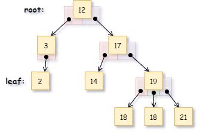

# 5 Dynamische Datenstrukturen

## Listen

Das Sammeln von mehreren Objekten kann mittels Arrays erfolgen. Der große Nachteil von Arrays ist, dass ihre Größe während der gesamten Programmlaufzeit immer gleich bleibt. Einerseits kann das Array groß genug gemacht werden. Wenn nicht sämtliche Plätze verwendet werden, bedeutet das automatisch eine Speicherplatzverschwendung. Wird die Größe eines Arrays eher knapp bemessen, kann es vorkommen, dass der Platz während der Laufzeit zu knapp wird.

Eine Lösung bieten die **verketteten Listen**. Jedes Element einer verketteten Liste beinhaltet:

- das zu speichernde Datum (wie in einem Array auch) und zusätzlich
- einen Zeiger auf ein folgendes Element.

Die Elemente so einer Liste werden als **Knoten** bezeichnet. Für das Speichern von drei einfachen Nummern sieht das so aus:


Bekannt sein muss der erste Knoten der Liste (als Variable oder ein Zeiger darauf), die folgenden Knoten sind über die Pointer welche die Liste verketten auffindbar. Der Zeiger des letzten Elements wird auf `NULL` gesetzt um das Ende Anzuzeigen.

Der Vorteil von einer solchen Liste ist ersichtlich: sie kann beliebig erweitert werden, dazu muss ein neues Element erzeugt werden und entweder an einer beliebigen Stelle oder am Ende eingefügt werden.

Da diese Art der Liste nur in eine Richtung durchgangen werden kann, wird sie als **einfach** verkettete Liste bezeichnet. Alternativ gibt es die **doppelt** verketteten Listen. Sie haben zusätzlich in jedem Knoten einen Zeiger der auf den vorhergehenden Knoten zeigt. Hier wiederum ein einfaches Beispiel dieses Typs:


Diese Liste kann in beide Richtungen durchgangen werden. Sie haben allerdings einen höheren Speicherbedarf.

**Listen-Knoten in C**

Für die obige einfach verkettete Liste kann ein Knoten in C die folgende Struktur haben:

```c
struct SNODE {
    int num;             // zu Speichernde Nummer
    struct SNODE *next;  // Zeiger auf genau so ein Knoten-Element
                         // (FolgeKnoten)
};
typedef struct SNODE TNODE;
```

Für die doppelt verkettete Liste entsprechend:

```c
struct SNODE {
    struct SNODE *prev; // Zeiger auf ein Knoten-Element (VorgaengerKnoten)
    int num;            // zu Speichernde Nummer
    struct SNODE *next; // Zeiger auf ein Knoten-Element (FolgeKnoten)
};
typedef struct SNODE TNODE;
```

Der Zeiger des letzten Knotens in **Zyklischen** Listen zeigt auf das erste Element der Liste.

### Listenkopf

Anstatt sich das erste Listenelement zu merken, wird häufig ein **Listenkopf** vorangestellt. Dieser beinhaltet zumindest einen Zeiger auf das erste Listenelement. Zusätzlich wird oft noch die Anzahl der Knoten in der Liste (Anzahl der Elemente) und/oder ein Zeiger auf das letzte Element angefügt.


### Vorteile von Listen

1. Einfaches Einfügen von Knoten am Beginn/Ende in der Mitte der Liste. Hier wird das Element 25 zwischen 99 und 37 eingefügt:

   

2. Einfaches Löschen von Knoten am Beginn/Ende in der Mitte der Liste. Der Zeiger des vorhergehenden Knotens wird angepasst, dann wird (ein Zeiger auf) das Element freigegeben (free):

   

3. Einfaches Verschieben von Knoten innerhalb der Liste. Dazu müssen lediglich die Zeiger verändert werden:

   

Werden die angeführten Operationen in Arrays gemacht, dann müssen zum Teil viele Elemente umkopiert werden. Hier werden lediglich einzelne, wenige Pointer angepasst.

### Traversieren

Mit Traversieren ist das Durchlaufen von Listen oder ähnlichen Strukturen gemeint. Wie erfolgt das:

- Begonnen wird das indem ein temporärer Zeiger `ptr` auf das erste Element gelegt wird - also dorthin wo `first`  vom Listenkopf zeigt:
  
- Um auf das nächste Element zugreifen zu können, muss der Hilfs-Zeiger `ptr` auf das Element verschoben werden, welches durch das aktuelle Element mittels `next` erreicht werden kann:
  
- Dieser Vorgang kann solange wiederholt werden, bis die Anzahl der Elemente `hdr.size` durchlaufen wurde, bis `ptr` auf `NULL` verschoben wird oder bis `ptr` auf `hdr.last` verschoben wird.

In einer doppelt verketteten Liste kann entsprechend auch in die entgegengesetzte Richtung verschoben werden.

## Bäume

Für Bäumen gilt:

- Bäume bestehen aus Knoten.
- Jeder Knoten hat keine oder mehrere Nachfolgerknoten.
- Jeder Knoten, bis auf den **Wurzelknoten (root)**, hat einen Vorgängerknoten.
- Ein Knoten ohne Nachfolger ist ein **Blatt (leaf)**.



Haben Knoten in Bäumen maximal zwei Nachfolgeknoten werden diese als **binäre Bäume** bezeichnet. Sie  haben große Bedeutung für die Sortierung/Suche von Daten - **binäre Suchbäume**.


Für einen binären Suchbaum gilt zusätzlich, dass die Werte jedes linken Teilbaums kleiner als die Wurzel ist.

**Baum-Knoten in C**

Für einen Binären Baum kann ein Knoten die folgende Struktur haben:

```c
typedef struct SNODE {
    int num;                // Datum des Knotens
    struct SNODE *left;     // Zeiger auf linken Teilbaum
    struct SNODE *right;    // Zeiger auf rechten Teilbaum
} TNODE;
```

### Traversieren in binären Bäumen

Häufig ist es gewünscht durch einen Baum hindurch sämtliche Elemente genau einmal aufzusuchen, etwa bei der Ausgabe oder der Suche. Man nennt das das **Traversieren** in einem Baum. Es gibt grundsätzlich die Bewegungsmöglichkeiten:

- Links->Wurzel->Rechts: **inorder**

  ```c
  void inorder(TNODE *ptr, FILE *stream){
      if (ptr){
          inorder (ptr->left, stream);
          fprintf (stream, "%d", ptr->num);
          inorder (ptr->right, stream);
      }
  }
  // 2 3 12 14 17 18 19 21
  ```

  Hier wird "von Links nach Rechts" jeder Knoten-Wert des Baums mit root = ptr in den FILE-stream ausgegeben. 

- Links->Rechts->Wurzel: **postorder**

  ```c
  void postorder(TNODE *ptr, FILE *stream) {
      if (ptr){
          postorder (ptr->left, stream);
          postorder (ptr->right, stream);
          fprintf (stream, "%d", ptr->num);
      }
  }
  // 2 3 14 18 21 19 17 12
  ```

- Wurzel->Links->Rechts: **preorder**

  ```c
  void preorder(TNODE *ptr, FILE *stream) {
      if (ptr){
          fprintf (stream, "%d", ptr->num);
          preorder (ptr->left, stream);
          preorder (ptr->right, stream);
      }
  }
  // 12 3 2 17 14 19 18 21
  ```

### Suche in binären Suchbäumen

In diesen Bäumen sind Elemente kleiner dem Knotenelement immer Links, die Suche ist daher mit wenig Aufwand möglich:

```c
TNODE *search(int num, TNODE *root) {
    if (root == NULL)                // Baumende
        return NULL;
    else if (num == root->num)       // Knoten gefunden
        return root;
    else if (num < root->num)        // Suchelement vor aktuellem Knoten --> Links
        return search(num, root->left);
    else                             // Suchelement nach aktuellen Knoten --> Rechts
        return search(num, root->right);
}
```

### Einfügen in binären Suchbäumen

Das Einfügen erfolgt auf folgende Weise: im Baum wird solange verzweigt biss der Abzweig gefunden wird an der das Element zu finden sein müsste. Dort wird das Element eingefügt:

```c
TNODE *insert (int num, TNODE **root) {
    TNODE *curr= *root;
    TNODE *prev= *root;
	
    // 1. Wenn Baum leer ist: Knoten als Wurzel erzeugen und Fertig
    if (*root == NULL) {
        *root = make_node(num);
        return *root;
    }

    //2. Suche Platz zum Einfügen
    while (curr != NULL) {
        prev = curr;
        if (num > curr->num)
            curr= curr->right;
        else if ( num < curr->num)
            curr= curr->left;
        else //Element bereits vorhanden
            return NULL;
    }

    //3. Bei prev neuen Knoten Erzeugen und Einfügen
    if (num > prev->num) {
        prev->right= make_node(num);
        return prev->right;
    } else {
        prev->left= make_node(num);
        return prev->left;
    }
}
```

Das macht das Arbeiten mit binären Bäumen so effizient, beim Einfügen muss nie ein Ersetzen/Verschieben erfolgen, jedes neue Element kann als Blatt sortiert eingefügt werden.

### Löschen in binären Suchbäumen

Für das Löschen eines Knotens in binären Suchbäumen müssen zwei Fälle unterschieden werden:

- Löschen von Knoten mit nur einem Zweig (Folgeknoten) oder gar keinem Zweig (also ein Blatt)
- Löschen von Knoten mit zwei Folgeknoten

Soll ein Knoten gelöschte werden dem nur ein Knoten folgt:


Im linken Bild soll Knoten 17 gelöscht werden. Dazu muss der right-Zeiger des Vorgängerknoten 12 der auf 17 zeigt auf Knoten 19 geändert werden (also auf denjenigen Knoten auf den der zu löschende Knoten zeigt). Wenn Knoten 17 keine Folgeknoten hat, dann wird der right-Zeiger von Knoten 12 (der auf Knoten 17 zeigt) auf NULL verändert.

Im rechten Bild soll Knoten 17 gelöscht werden. Dazu muss der right-Zeiger von Knoten 12 auf Knoten 15 verändert werden.

Völlig anders für das Löschen von Knoten mit zwei Folge-Zweigen. Im dargestellten Beispiel soll etwa der Knoten 12 gelöscht werden. Dazu wird der Knoten 12 durch den Knoten mit dem nächsthöheren Wert ersetzt (hier Knoten 14). Der nächsthöhere Knoten ist der Knoten im rechten Teilbaum von 12 der ganz links ist.


Für das Ersetzten von Knoten 12 durch Knoten 14 wird am einfachsten nur der Wert kopiert und dann Knoten 14 gelöscht. Hätte Knoten 14 noch einen rechten Zweig, dann müsste der Löschvorgang rekursiv auf diesen Knoten angewendet werden.

Die beschriebene Art kann völlig analog auch auf der anderen Seite erfolgen: 12 kann auch durch den Knoten ersetzt werden, der ganz rechts im linken Zweig liegt (hier 3).

### Ungünstige Konfigurationen

Der Grund für die Entwicklung der Bäume ist ja eine effiziente Suchstruktur. Je nachdem in welcher Reihenfolge ein Baum aufgebaut wird kann es zu ungünstigen Konstellationen kommen:


Um solche Anordnungen zu vermeiden, gibt es balancierte/ausgeglichene Bäume. Um einen Baum auszubalancieren wird der Medianwert ermittelt und als Wurzel gesetzt. Für jede Seite des Baums wird dieser Vorgang wiederholt.

(Medianwert ist jener Wert einer Zahlenzeihe zu dem es in der Zahlenreihe gleich viel größere als kleinere Werte gibt. Zum Beispiel: für die Zahlenreihe 1,2,1000 ist der Medianwert 2 - es gibt einen größeren und einen kleineren Wert)

## Referenzen

- Erklärung und Beispiele:
  [https://www.ethz.ch/content/dam/ethz/special-interest/dual/educeth-dam/documents/Unterrichtsmaterialien/informatik/B%C3%A4ume%20und%20Backtracking%20(Leitprogramm)/Backtracking.pdf](https://www.ethz.ch/content/dam/ethz/special-interest/dual/educeth-dam/documents/Unterrichtsmaterialien/informatik/B%C3%A4ume%20und%20Backtracking%20(Leitprogramm)/Backtracking.pdf)
- Schulungsmaterial Bäume
  https://www.u-helmich.de/inf/BlueJ/kurs121/folge17/folge17.html
## Fragen

- Unterschied zwischen Array und dynamischer Liste
- Einfach verkettete Liste <-> doppelt verkettete Liste
- Wie kann ein Element aus einer Liste gelöscht werden?
- Wie kann ein Element in eine Liste eingefügt werden?
- Wie kann ein Element in einer Liste verschoben werden?
- Welche Elemente beinhaltet ein Baum?
- Was ist an einem binären Baum spezieller als bei einem *gewöhnlichen* Baum?
