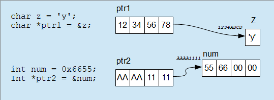

# C++ Zusammenfassung

## Datentypen

| Bezeichner | Typ                                               | # Bytes            |
| ---------- | ------------------------------------------------- | ------------------ |
| `bool`     | Logischer Datentyp                                | 1                  |
| `char`     | Zeichen Datentyp (ASCII)                          | 1                  |
| `int`      | Ganzzahl (siehe Unten)                            | 4 (Systemabhängig) |
| `float`    | Fließkommazahl (siehe Unten)                      | 4                  |
| `double`   | Fließkommazahl doppelte Genauigkeit (siehe Unten) | 8                  |

Grundsätzlich sind die Typen immer Vorzeichen behaftet, ansonsten können sie mit `unsigned` definiert werden (der Wertebereich verdoppelt sich damit).

**Ganzzahlen** gibt es in unterschiedlicher Form:

- `int`	hat nicht auf jedem Rechner die gleiche Größe, das hängt von der Hardware/Betriebssystem (Prozessorregister-Breite) und vor allem dem verwendeten Compiler ab.

- `short int`	auf jedem System 2 Bytes

- `long int`	auf jedem System 4 Bytes

- `long long`	auf jedem System 8 Bytes

**Fließkomma-Zahlen** gibt es ebenfalls in unterschiedlicher Form:

- `long double`	meistens 10 Bytes

Solle es notwendig sein den exakten Wert auf dem System zu kennen, kann das mittels Definitionen in *iostream* und/oder *limits.h* ermittelt werden.

## Zeiger (606)

In gibt es einen eigenen Datentyp um sich Adressen im Speicher zu merken. Den Speicher kann man sich als große Menge von Speicher-Bytes vorstellen. Jedes Byte hat eine eigene Adresse mittels welcher auf dessen Wert zugegriffen werden kann. Was in dem Byte gespeichert wird  (Zeichen, Fließkomma, Ganzzahl ...) ist dabei nicht wichtig. Daher ist eine Adress-Variable auch immer gleich groß, unabhängig davon auf welche Speicherzelle sie verweist. Da eine Adresse auf eine Stelle im Speicher verweist wird sie üblicherweise als Zeiger/Pointer bezeichnet.

**1. Definition:** Um eine Adress-Variable zu definieren:

```c++
int *ptr1;
```

Mit der Variable `ptr1` kann eine Adresse gespeichert werden. Das *int* bei der Definition hat überhaupt keinen Einfluss auf diese Variable. Es kündigt lediglich an, dass unter der gemerkten Adresse ein *int*-Wert zu finden sein wird.

**2. Adressen:** Um Adressen von Variablen zu ermitteln:

```c++
int num;				// Definition
ptr2 = &num;		// Adresse von var in Adressvariable ptr1 kopieren
```

Mit dem Adress-Operator *&* kann die Adresse einer Variable ermittelt werden. Diese Adresse kann dann einer Adress-Variable (Zeiger) zugewiesen werden.



Rechnen mit Adressen: (ptr2 + 1) erhöht die Adresse nicht um 1 sondern um die Größe des Elements, für einen Zeiger auf int wird daher die Adresse um 4 erhöht, und das gilt auch für den Inkrement-Operator:

```c++
ptr2++;			// entspricht (ptr2+1) wodurch die Adresse um 4 erhöht wird (Int-Pointer)
```

**3. Dereferenzierung:** Um Werte unter einer Adresse zu ermitteln:

```c++
int zahl = *ptr2;				// Lesen des Werts von Adresse ptr2
*ptr2 = 3;							// Beschreiben des Werts an Adresse ptr2
```

Für den Zugriff auf den Inhalt unter einer gegebenen Adresse wird der *Dereferenzierungs*-Operator verwendet.

Grundsätzlich klappt auch:

```c++
int num = *((int*)0x12345678);
```

Damit werden 4 Bytes die im Speicher unter der Adresse 0x12345678 zu finden sind als Integer-Zahl interpretiert und in die Variable num kopiert. Wo Variablen im Speicher angelegt werden entscheidet der Compiler, daher hat diese Art üblicherweise gar keinen Sinn (im Embedded-Bereich werden Variablen oft bewusst an bestimmten Stellen abgelegt - das Speichermanagement ist dort oft nicht nur Aufgabe eines Betriebssystems).

**4. Datentypangabe:** Die Angabe des Datentyps:

```c++
int *ptr2;
```

Diese Angabe (hier *int*) hat keinen Einfluss auf die ptr2-Variable selbst. Diese ist immer 4-Bytes groß. Benötigt wird diese Angabe etwa:

```c++
int num = *ptr2;
```

Hier muss klar sein, dass mit *\*ptr2* ein Integer-Wert, also 4 Bytes kopiert werden sollen. Deutlich wird das hier:

```c++
char *ptr1;                           // Zeiger auf Char
int num = 0xAABBCCDD;                 // Integer-Nummer
ptr1 = (char*)&num;										// char-Zeiger zeigt auf int
*ptr1 = 0x33;													// char-Wert wird auf 0x33 gesetzt
																			// damit wird num = 0xAABBCC33
```

Da der Zeiger laut seiner Definition (char) nur auf 1 Byte zeigt, wird auch nur 1 Byte überschrieben. Da an genau dieser Adresse auch die 4-Byte-Variable num liegt, wird gleichzeitig das Byte von num überschrieben und num beinhaltet nun 0xAABBCC33.

## Array (607)

Arrays funktionieren sehr ähnlich wie in anderen Sprachen:

```c++
int arr[10];	// 10 int-Elemente, Index von 0 bis 9
```

Bei der Definition eines Arrays ist der wesentliche Unterschied zu Arrays in anderen Programmiersprachen, dass die Größe des Arrays nach dem Arraynamen gesetzt wird. Realisiert werden Arrays in den bedeutenden Sprachen mittels Zeiger:

- die Array-Variable *arr* kann auch als Zeiger verstanden werden. Die Adresse die dieser Zeiger beinhaltet ist die Adresse des ersten Elements des Arrays. Sämtliche weiteren Elemente des Arrays sind im Speicher genau auf das erste Element folgend abgelegt. Dadurch kann mittels eines Index relativ effizient auf die einzelnen Elemente zugegriffen werden.

  

  In der technischen Realisierung eines Array kann daher der Index direkt zur Adresse des ersten Elements dazugezählt werden.

- Umgekehrt kann in C/C++ daher auf Zeiger mittels des Index-Operators zugegriffen werden (so als ob sie Arrays wären):

  ```c++
  char *zeiger;
  zeiger[0] = 'a';		// zeiger[0] entspricht (*zeiger)
  zeiger[1] = 'b';		// zeiger[1] entspricht (*(zeiger+1))
  zeiger[20] = 'c';		// zeiger[20] entspricht (*(zeiger+20))
  ```

  das gilt genau gleich für andere als char-Datentypen ebenso.

  ACHTUNG: in dem hier angeführten Beispiel wird im Speicher *irgendwo* herumgeschrieben obwohl der entsprechende Speicherplatz nicht reserviert wurde. Das kann zur Folge haben, dass die Software nicht richtig läuft oder ein Laufzeitfehler ausgelöst wird.

## Dateizugriff (608)

Der c-Dateizugriff funktioniert nach dem Prinzip:

​	Datei Öffnen -> Datei Lesen/Schreiben -> Datei Schließen

**Datei Öffnen**: Mit dem Öffnen wird eine Datei üblicherweise vom Betriebssystem reserviert. Erst wenn ein Zugriff wieder geschlossen (Close) wird, kann die Datei vom Betriebssystem freigegeben werden.

```c++
FILE *fhdl = fopen("c:/pfad/myFile.txt", "rt");
```

- der erste Parameter gibt den Pfad und Namen der Datei an, Als Trenner können Foreslashes **/**oder doppelte Backslashes **\\\\** verwendet werden.
- der zweite Parameter definiert die Zugriffsart, der erste Buchstabe r=read, w=write, a=append (anhängen); der zweite Buchstabe t=Textdatei, b=Binärdatei
- der Rückgabewert ist ein Zeiger auf eine FILE-Struktur. Er wird verwendet um im Folgenden auf die Datei zugreifen zu können. Wenn das Öffnen nicht erfolgreich ist (zum Beispiel Zugriff nicht möglich), wird 0 zurückgegeben.

**Datei Schließen**: Wie oben erwähnt wird eine Datei-Reservierung wieder freigegeben sobald sie geschlossen wird. Wird in eine Datei geschrieben, kann erst mit dem Schließen sichergestellt werden, dass die Daten tatsächlich in die Datei geschrieben werden.

```c++
fclose(fhdl);
```

**Datei Lesen**: Es gibt eine Vielzahl von Funktionen zum Lesen aus Dateien. Eine sehr praktische Funktion ist **F**ile**Get S**tring:

```c++
char str[10];
char *ptr = fgets(str, 10, fhdl);
```

Diese Funktion ließt eine Zeile aus der Datei. Sollte die Zeile länger als 10 Zeichen sein, dann werden nur die ersten 10 Zeichen gelesen.

Der Rückgabewert liefert 0 (nullptr) wenn keine Zeile gelesen werden kann, ansonsten einen Zeiger auf str. 

Ob das Ende der Datei erreicht wurde kann mit der Funktion **E**nd **O**f **F**ile ermittelt werden:

```c++
while (!eof(fhdl)) {			// Solange das Ende der Datei nicht erreicht wurde ...
  ...
```

**Datei Schreiben**: Für das Schreiben gibt es ebenfalls zahlreiche Funktionen, analog zum Schreiben in die Konsole kann **F**ile **Print** **F**ormated verwendet werden:

```c++
int num = 10;
fprintf(fhdl, "Hallo Welt\n");
fprintf(fhdl, "Num = %i\n", num);							// num = 10
fprintf(fhdl, "Num = %i (0x%X)", num, num);		// num = 10 (0xA)
```

Ein komplettes Beispiel:

```c++
FILE *fhdl1 = fopen("C:/temp/myfile.txt", "wt");	// Oeffnen zum Schreiben

int num = 10;
fprintf(fhdl1, "Hallo Welt\n");										// Schreiben ...
fprintf(fhdl1, "num = %i\n", num);
fprintf(fhdl1, "num = %i (0x%X)\n", num, num);

fclose(fhdl1);																		// Beenden des Dateizugriffs


FILE *fhdl2 = fopen("C:/temp/myfile.txt", "rt");	// Oeffnen zum Lesen

while (!feof(fhdl2)) {														// Solange Datei nicht am Ende
  char str[100];
  if (fgets(str, 100, fhdl2) != nullptr)					// Zeile in str Lesen, wenn erhalten:
    cout << str;																	// Ausgeben
}

fclose(fhdl);																			// Beenden des Dateizugriffs
```

## C-Strings

In c werden für Strings Arrays von Zeichen (Character) verwendet:

```c++
char str[10];
```

str ist eine Variable die einen 10 Zeichen langen String aufnehmen kann. Damit Funktionen erkennen können wo der String tatsächlich aus ist gilt die Konvention:

Das letzte Zeichen eines Strings ist immer die Zahl 0 beziehungsweise das Zeichen '\0' . Damit wird etwa bei einer Ausgabe nur der interessante Teil ausgegeben (und nicht das ganze Array):

```c++
char str[10];
str[0] = 'A';
str[1] = 'B';
str[2] = '\0';
cout << str;			// es wird nur "AB" ausgegeben
```

Wird das Feld so wie hier direkt mit Zeichen beschrieben, dann muss man sich selber darum kümmern dass der Abschluss eingefüllt wird.

Auf die gleiche Art wird ein String von Funktionen mit einem '\0' abgeschlossen. Das oben erwähnte fgets:

```c++
fgets(str, 10, fhdl);
```

befüllt das Array mit Text und schreibt anschließend '\0' hinein.

Daher kann aber in ein 10 großes Array nur 9 nutzbare String-Zeichen eingefüllt werden.

## Ein-/Ausgabe

### Ausgabe

1. **printf**: Um Ausgaben in die Konsole auszuführen gibt es die klassische C-Variante **print f**ormated (https://de.wikipedia.org/wiki/Printf):

   ```c++
   printf("Hallo Welt\n");
   printf("num = %i", num);
   printf("num1 = %i, num2 = %i", num1, num2);
   ```

   - Der erste Parameter dieser Funktion ist ein String der Platzhaltern beinhalten kann. Platzhalter beginnen immer mit %. Bei diesen Platzhaltern wird zusätzlich mit angegeben was an dieser Stelle ausgegeben wird:
   
     ​	%i ... Integerwert
     ​	%x ... Ganzzahl als Hexadezimal
     ​	%f ... Fließkommawert
     ​	%s ... c-String
   
   - Nach diesem String folgen die Parameter die anstatt der Platzhalter eingefüllt werden, dabei wird der erste Parameter an die Stelle des ersten Platzhalters gesetzt, der Zweite anstelle des zweiten Platzhalters usf.
   
2. **cout**: damit kann die Ausgabe in die Konsole "gestreamt" werden. cout ein Datenstrom der zur Konsole führt:

   ```c++
   cout << "Hallo ";
   cout << "Welt" << "\n";
   cout << "num = " << num << endl;
   ```

### Eingabe

1. **scanf**: klassische C-Variante:

   ```
   int num;
   scanf("%i", &num);
   ```

   Ähnlich wie mit printf können hier mit Platzhaltern Eingaben von der Tastatur ermittelt werden. Um mit der Funktion die eingelesenen Werte in einen Parameter schreiben zu können, wird hier die Adresse auf die Variable übergeben (daher & vor num). 
   
   ```
   scanf("%i - %i - %c - %s - %i", &num1, &num2, &zeichen, &str, &num3);
   ```
   
   Damit kann folgende Eingabe verarbeitet werden:
   
   ```
   10 - 4 - z - Hallo - 33
   ```
   
   Mit dieser Eingabe werden die Variablen so gesetzt:
   
   ```
   num1 = 10
   num2 = 4
   zeichen = 'z'
   str = "Hallo"
   num3 = 33
   ```
   
   Wenn eine der Parameter nicht stimmt dann wird die Eingabe an dieser Stelle beendet, wenn etwa eingegeben wird:
   
   ```
   10 - a - z - Hallo - 33
   ```
   
   Damit passt *num2* und *'a'* nicht zusammen und es wird nur *num1=10* zugewiesen.
   
2. **cin**: mittels Stream:

   ```c++
   int num;
   cin >> num;
   char str[10];
   cin >> str;
   ```

   Analog zur Stream-Ausgabe kann eine Stream-Eingabe erfolgen, Die Pfeile >> zeigen dabei vom Konsolestream cin weg.

## Funktionen

Funktionen werden (üblicherweise) aufgeteilt in eine Deklaration und eine Definition:

```c++
int add(int a, int b);				// Prototyp mit ; ohne {}

...

int add(int a, int b) {				// Implementierung
  return a+b;
}
```

Um Funktionen aufrufen zu können müssen sie darüber bekannt sein. Dafür kann ein Prototyp verwendet werden.

Um Funktionen in anderen C/C++-Dateien verwenden zu können werden die Prototypen in eigene Dateien ausgelagert. Diese eigenen Dateien können dann überall ohne die Implementierung eingebunden werden.

Diese Dateien mit den Deklarationen sind **Header**-Dateien mit der Erweiterung **.h**. Die Implementierung wird in gleichbenannte Dateien mit der Erweiterung **.cpp** geschrieben. Für das Additionsbeispiel:

add.h

```cpp
int add(int a, int b);
```

add.cpp

```c++
int add(int a, int b) {				// Implementierung
  return a+b;
}
```

main.cpp

```c++
#include "add.h"

int main() {
  int summe = add(3,4);			// summe = 7
}
```

Mit **#include ** wird vor der Übersetzung (Compilierung) der Code von *add.h* an dieser Stelle einkopiert.