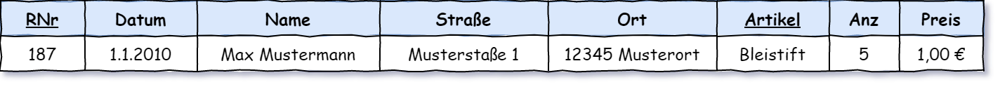

# 2 Normalformen

Vorweg: hier wird nur mehr über relationale Datenbanken geschrieben.

Um eine Datenbank sinnvoll zu konfigurieren sind einige Begriffe zu definieren. Der Datenbankentwurf ist so wichtig, da damit für die gesamte Benutzungszeit über die Qualität der Daten/-Verwaltung entschieden wird.

Probleme, die durch mangelhaftes Design auftreten (können):

- Einfügeanomalie: in eine Tabelle wird eine neue Zeile eingefügt, es sind noch nicht sämtliche Attribute belegbar.
  Beispiel: es wird ein neuer Bank-Kunde angelegt, er hat aber bei der Erstellung noch kein Konto
  Lösung: Kunde und Konto in separate Tabellen
- Updateanomalie: Durch Veränderung von Werten können Zeilen widersprüchliche Information beinhalten.
  Beispiel: Ein Bank-Kunde ändert seinen Namen (Hochzeit), dann haben nicht sämtliche Konten gleichzeitig einen neuen Konto-Wortlaut.
  Lösung: Konten werden mittels Kundennummer mit dem Kunden verbunden
- Löschanomalie: Durch Löschen eines Teils einer einzigartigen Information können leere Werte entstehen. Bei Auflösung des letzten Kontos eines Bank-Kunden verbleibt der Kunde mit leerem Konto-Feldern.
  Lösung: Kunde und Konto in separater Tabelle

**Schlüssel**

Als Schlüssel werden diejenigen Attribute (Spalten) bezeichnet die einen Tupel (Zeile) eindeutig identifizieren. In einer Schulklasse dient als Schlüssel meistens der Nachname. Wenn in dieser Klasse allerdings mehrere Schüler den gleichen Nachnamen haben dient als Schlüssel der Vor- **gemeinsam** mit dem Nachnamen. Als **Primärschlüssel** wird derjenige Schlüssel bezeichnet der für die konkrete Problemstellung als Schlüssel dient. Für das Schulklassenbeispiel könnte ja auch die Körpergröße als Schlüssel dienen.

Ein **Fremdschlüssel** ist in einer fremden Tabelle der Primärschlüssel. In einer Klassenliste können Schüler anhand ihrer Vor- und Nachnamen angeführt werden. Diese beiden Attribute sind ein Fremdschlüssel in der Klassenliste (Klassenbuch ...). In der Schülertabelle werden zum Schüler noch weitere Attribute (Wohnort ...) abgelegt werden. In dieser Tabelle ist der Schülername der primäre Schlüssel.

Um die Qualität von Relationen zu erhöhen, wurden die Normalformen entwickelt. Sie bieten einen *systematischen Ansatz* die Tabellenorganisation zu verbessern. Eine Organisation in einer *höheren Normalform* hat eine *höhere Relationen-Qualität*.

Allgemein gilt: Reihenfolge der Attribute (Spalten) aber auch Reihenfolge der Zeilen (Tupel) ist gleichgültig. Sie müssen nicht sortiert sein (sind es nicht).

> Normalformen: systematischer Ansatz um die Qualität von Relationen einer Datenbank zu bewerten/verbessern.

## 0. Normalform

Die Daten sind *unnormalisiert* (nicht atomar ...) in einer Tabelle zusammengestellt. Das kann der Beginn einer Datenbank-Entwicklung sein - um einen Überblick zu erhalten, werden sämtliche zu speichernde Daten *irgendwie* in einer Tabelle zusammengeschrieben.

Kriterium: Tupel (Zeile) ist einzigartig (nicht mehrfach).

## 1. Normalform

Unterschied zur NF0: Information in Atomare Form überführen, d.h. sämtliche Attribute sind so klein wie (sinnvoll) möglich zerteilt.

Es wurde der *Name* in *Vor-* und *Nachname* aufgespaltet. Es kann ja einen *Mustermann* der nicht *Max* heißt und einen *Max* der nicht *Mustermann* heißt geben. Gleiches gilt für *PLZ*/*Ort* und *Preis*/*Währung*. Natürlich könnte auch das Datum auf *Tag/Monat/Jahr* gespaltet werden. Für das Endergebnis wird das keinen Zugewinn bringen (es gibt einen Datum-Datentyp). Diese Atomarität ist gewissermaßen subjektiv. Es muss mit Sachkenntnis für die Daten entschieden werden, ob eine Aufteilung sinnvoll ist oder nicht (ansonsten kann jedes Wort weiter in seine Buchstaben zerlegt werden ...).

## 2. Normalform

In der obigen 1.Normalform gibt es für die angeführte Rechnung *187* mehrere Rechnungspositionen (eventuell werden nicht nur die angeführten Bleistifte gekauft). Jeder der Rechnungsposition-Einträge hat dann den gleichen *Name*, *Adresse* und *Datum* oder auch *RNr*. Die Information wird daher mehrfach (redundant) gespeichert. Beim Ändern von Daten ist das problematisch. Um das zu Verbessern, wird in die 2. Normalform entwickelt. Dafür wird zuerst der Schlüssel der Relation ermittelt. Als Schlüssel zählen jene Spalten gemeinsam, deren Werte bekannt sein müssen, um eine Zeile eindeutig identifizieren zu können. Dann gilt die folgende Bedingung:

​	*Jedes Nichtschlüsselattribut ist von jedem Schlüsselkandidaten voll funktional abhängig.*

- Für die bisherige Tabelle gibt es den Primärschlüssel: (*RNr* + *Artikel*) also beide zusammen. Für die 2. NF muss jedes Attribut von diesen beiden Teilen voll funktional abhängen. Der *Preis* kann alleine mit *Artikel* bestimmt werden und ist damit nicht von *RNr* abhängig.
- Der Name *Mustermann* kann von der *RNr* alleine bestimmt werden, ist also nicht vom *Artikel* abhängig.
- Die Anzahl ist nicht nur von der *RNr* oder nur vom Artikel abhängig sondern von Beiden gemeinsam.

Um diese Bedingung zu erfüllen (und in die 2.NF zu entwickeln) muss daher auf neue Tabellen aufgeteilt werden:

Hier gilt für jedes Attribut: es ist durch den Primärschlüssel bestimmt. Allgemein gilt:

- wenn der Schlüssel nur aus einem Attribut besteht ist eine Tabelle immer schon in der 2ten NF
- wenn sich ein Attribut in der Tabelle schon durch einen Teil des Tabellenschlüssels bestimmen lässt ist die Tabelle noch nicht in der 2ten NF.

Die neu geschaffenen Tabellen sind mittels Fremdschlüssel miteinander verbunden. In der *Rechnung*-Tabelle ist eine Kundennummer *KNr* angeführt. Mit diesem Attribut kann in der *Kunde*-Tabelle der Kunde gefunden werden. Dafür muss die Kundennummer *KNr* ein Primärschlüssel in der *Kunde*-Tabelle sein. In der Rechnung-Tabelle wird *KNr* als **Fremdschlüssel** bezeichnet.

## 3. Normalform

Für diese Normalform werden zusätzlich aus einer Tabelle direkt abhängige Attribute in eigene Tabellen ausgelagert. Also wenn Attribute von Nichtschlüsselattributen identifiziert werden können.

Für unser Beispiel gilt: mit der Postleitzahl ist der Ort eindeutig bestimmt und wird daher abgespaltet:

- wenn ein Attribut *transitiv* vom Primärschlüssel abhängt ist es nicht in der 3ten NF. *Musterort* kann schon durch *Plz* alleine bestimmt werden. Transitiv: Ort hängt über die *Plz* von *KNr* ab.

Es gibt noch weitere Normalformen (4., 5.). Diese sind für allgemeine Entwicklung lediglich von theoretischer Natur.

## Anomalien

Probleme die sich grundsätzlich ergeben können (siehe Oben):

- Updateanomalie
  Wenn in obigen Beispiel in der 1ten Normalform Herr Mustermann heiratet und nun Herr Meyr heißt, dann müssen viele Zeilen verändert werden.
- Einfügeanomalie
  In der 1.NF wird eine neue Rechnung eingefügt und es gibt aber noch keine Rechnungspositionen (während dem Einkauf).
- Löschanomalie
  Wird in der 1.NF die Rechnung auf Herrn Mustermann gelöscht, dann wird damit gleichzeitig Herr Musermann gelöscht.

Durch die Entwicklung einer Datenbank in eine höhere Normalformen, werden diese Probleme automatisch vermieden.

Um eine Datenbank zu entwickeln empfiehlt es sich in eine möglichst hohen Normalform zu kommen, damit wird die Fehleranfällig stark reduziert. Ein weiterer systematischer Ansatz um das zu erreichen ist die Modellierung nach dem ERM (siehe nächstes Kapitel).

## Referenzen

- Normalform von Datenbanken
  https://www.datenbanken-verstehen.de/datenmodellierung/normalisierung/

## Fragen

- Wofür werden Datenbank-Modelle in höhere Normalformen entwickelt?
- Was bedeuten der Begriff atomares Attribut?
- Welche Anomalien gibt es und wie kann ein Auftreten von Anomalien verhindert werden?
- Was ist ein Primärschlüssel und was ein Fremdschlüssel?
- Erklären Sie die einzelnen Normalformen (0-3)