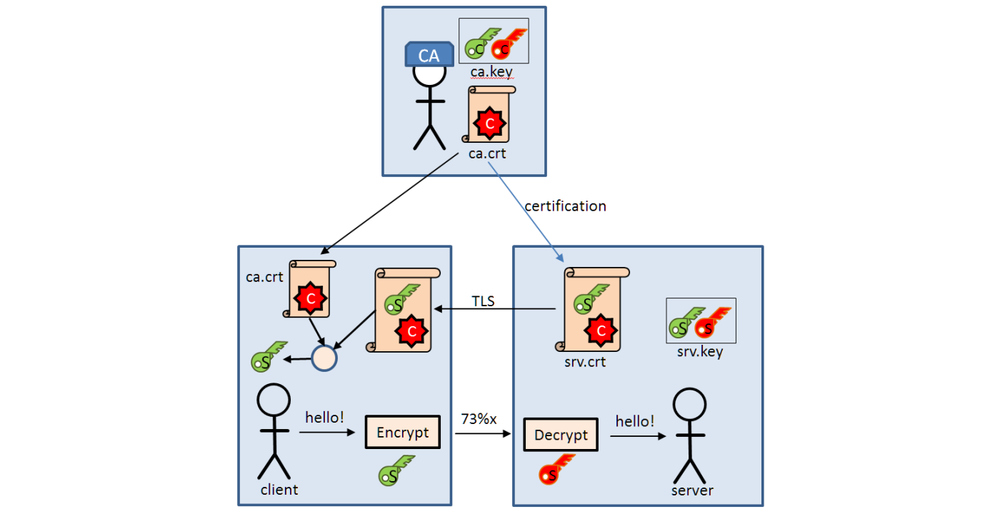

# MQTT - Message Queuing Telemetry Transport

https://de.wikipedia.org/wiki/MQTT

**Publish-Subsribe-Architektur**

Schwachstelle von MQTT: ohne Broker geht gar nicht mehr.

## Installation Mosquitto

Um mit MQTT arbeiten zu können wird am einfachsten Mosquitto installiert. Mosquitto gibt's für viele gängige Betriebssysteme. Für Windows/Linux kann es einfach über die Seite https://mosquitto.org/download bezogen werden.

Grundsätzlich ist zu unterscheiden:

- Broker: Tool welches MQTT-Nachrichten annimmt, behält und weitergibt
- Publisher: MQTT-Teilnehmer welcher Daten übermittelt/published (Messwerte/Aktuatorzustände ...) - die Daten werden an den Broker übermittelt
- Subscriber: MQTT-Teilnehmer welcher auf Daten vom Broker wartet, dazu trägt er die Nachrichten ein welche für ihm relevant sind.

Mit Mosquitto können sämtliche 3 Teilnehmer umgesetzt werden. Es kann ein Broker gestartet werden (oft als Service), in der Kommandozeile können Nachrichten an einen beliebigen Broker gesendet werden und es können auch Nachrichten von einem beliebigen Broker subskribiert werden.

### Installation Mosquitto auf RaspberryPi

[https://tutorials-raspberrypi.de/datenaustausch-raspberry-pi-mqtt-broker-client/](https://tutorials-raspberrypi.de/datenaustausch-raspberry-pi-mqtt-broker-client/)

Für den Raspi kann Mosquitto bezogen werden:

  ```
sudo apt-get install -y mosquitto mosquitto-clients
  ```
Damit wird automatisch anschließend ein Broker gestartet. Für einen Auto-Start während Boot:

```
sudo systemctl enable mosquitto.service
```
Subscribe eine `test_channel` Botschaft:

```
mosquitto_sub -h localhost -v -t test_channel
```
Pub eine `test_channel`-Boschaft:

```
mosquitto_pub -h localhost -t test_channel -m "Hello Raspberry Pi"
```
Starten/Stoppen (enable/disable) eines Service:

```
sudo systemctl enable mosquitto.service
```
Als einfacher Broker ist im Netz ebenfalls ein freier**Mosquitto**-Broker verfügbar ([https://mosquitto.org](https://mosquitto.org/)) verfügbar.

- Start des Brokers (Windows oder auch Linux):

```
  mosquitto
```

- Subscriben einer Botschaft home/data von 10.1.1.22:

  ```
  mosquitto_sub -h 10.1.1.22 -v -t home/data
  ```

- Pub einer Botschaft home/data an 10.0.1.23:

  ```
  mosquitto_pub -h 10.0.1.23 -t home/data -m "Hello Raspberry Pi"
  
  ```

## Aufbau der Nachrichten

Standard: <https://docs.oasis-open.org/mqtt/mqtt/v3.1.1/os/mqtt-v3.1.1-os.html>

Client (Sender) Beispiel mit Mosquitto:

```
mosquitto_pub -t home/data -m 32 -q 0
```

(Nachricht home/data mit Datum = 32, QoS = 0)

Broker (Server/Empfänger):

```
mosquitto_sub -h 10.0.0.77 -v -t home/data
home/data 32
```

Wireshark:


(Markiert: MQTT auf darunterliegenden TCP)

Header mit 2 Bytes: Header-Flags und Message-Length (restliche Länge)

### QoS

Quality of Service

0	Fire and Forget - es wird gesendet und nicht überwacht/bestätigt (wie TCP)
1,2	Eine Nachricht wird gesendet bist bestätigter Empfang erfolgt

### Topic

~Name~ des Inhalts. Topics werden in **Topic Levels** organisiert. Die Beschreibungen sind **case-sensitive**.

- Diese werden durch einen Foreslash **/** getrennt, das erste Zeichen ist *kein Slash*:

```
sport/tennis/player1/ranking
```

- Als **Multi-Level-Wildcard**-Zeichen gilt **#**, damit können mehrere Topics angesprochen werden:

```
sport/#
```

​	gilt für `sport/tennis/...` aber auch `sport/soccer/...` 

- Als **Single-Level-Wildcard** funktioniert **+**:

  ```
  sport/+/player1
  ```

  gilt für `sport/tennis/player1` oder `sport/soccer/player1` aber nicht für `sport/player1` oder `sport/skiing/nation/player1`.

## Sicherheit

Übertragung wird vom Client initiiert, dadurch kann von außen keine Verbindung geöffnet werden. Durch die Adressierung mittels Topic-Level ist keine Zuordnung auf Geräte möglich. MQTT wird im einfachsten Fall mittels TCP übertragen. Grundsätzlich soll die Übertragung produktiv immer über **TSL** übertragen werden. 



TLS benötigt eine Zertifizierungsstelle (CA - Certification Authority), die für die Richtigkeit der Daten bürgt. Falls wir unseren eigenen Zertifikaten trauen können wir diese selbst Erstellen (wie im Folgenden gezeigt).

- Download **openssl**: <http://slproweb.com/products/Win32OpenSSL.html>  (Win64, Essentials genügt) und installieren (Standard-Settings). Die Installation erfolgt damit üblicherweise nach:
  `C:\Program Files\OpenSSL-Win64\bin`

1. Damit wird ein Schlüssel-Paar für CA in die Datei **ca_.key** generiert (Schlüssel eingeben):

  ```
  c:\temp>"c:\program files\openssl-win64\bin\openssl" genrsa -des3 -out ca_.key 2048
  Generating RSA private key, 2048 bit long modulus (2 primes)
  ...................................................................+++++
  .................................................................................................................+++++
  e is 65537 (0x010001)
  Enter pass phrase for ca_.key:
  Verifying - Enter pass phrase for ca_.key:
  
  ```

2. Erstellen eines Zertifikates mit dem eben erstellten Schlüssel (obiger Schlüssel muss eingegeben werden) - es wird **ca.crt** erstellt:

  ```
  c:\temp>"c:\program files\openssl-win64\bin\openssl" req -new -x509 -days 1826 -key ca_.key -out ca.crt
  Enter pass phrase for ca_.key:
  You are about to be asked to enter information that will be incorporated
  into your certificate request.
  What you are about to enter is what is called a Distinguished Name or a DN.
  There are quite a few fields but you can leave some blank
  For some fields there will be a default value,
  If you enter '.', the field will be left blank.
  -----
  Country Name (2 letter code) [AU]:AT
  State or Province Name (full name) [Some-State]:Salzburg
  Locality Name (eg, city) []:Salzburg
  Organization Name (eg, company) [Internet Widgits Pty Ltd]:HTL-Salzburg
  Organizational Unit Name (eg, section) []:El&tInf
  Common Name (e.g. server FQDN or YOUR name) []:raspberrypi
  Email Address []:roman.schragl@htl-salzburg.ac.at
  
  ```

  **WICHTIG: **als FQDN (FullQualifiedHostName) wird der Name des Broker-Rechners eingetragen, für Standard-Raspi ist das `raspberrypi`.

3. Erstellen eines Server-Schlüssel-Paares - in die Datei **srv.key**:

  ```
  c:\temp>"c:\program files\openssl-win64\bin\openssl" genrsa -out srv.key 2048
  Generating RSA private key, 2048 bit long modulus (2 primes)
  ..................+++++
  ...........................................................................................................................................................................................................+++++
  e is 65537 (0x010001)
  
  ```

4. Erstellen einer Zertifikatsanforderung:

  ```
  c:\temp>"c:\Program Files\OpenSSL-Win64\bin\openssl" req -new -out srv.csr -key srv.key
  You are about to be asked to enter information that will be incorporated
  into your certificate request.
  What you are about to enter is what is called a Distinguished Name or a DN.
  There are quite a few fields but you can leave some blank
  For some fields there will be a default value,
  If you enter '.', the field will be left blank.
  -----
  Country Name (2 letter code) [AU]:AT
  State or Province Name (full name) [Some-State]:Sbg
  Locality Name (eg, city) []:Sbg
  Organization Name (eg, company) [Internet Widgits Pty Ltd]:HTL-Sbg
  Organizational Unit Name (eg, section) []:tInf&El
  Common Name (e.g. server FQDN or YOUR name) []:raspberrypi
  Email Address []:roman.schragl@htl-salzburg.ac.at
  
  Please enter the following 'extra' attributes
  to be sent with your certificate request
  A challenge password []:
  An optional company name []:
  
  ```

  **WICHTIG: **Hier dürfen auf keinen Fall die gleichen Daten wie oben eingegeben werden. Die Zertifikate müssen sich unterscheiden (1 Buchstabe anders genügt).

  Der letzte Absatz wird nicht ausgefüllt (auch kein password ...), wir sind selber die Authorisierungsstelle.

5. Verifizieren und Unterzeichnen des Server-Zertifikates. Damit wird die Datei **srv.crt** erstellt:

  ```
  c:\temp>"c:\program files\openssl-win64\bin\openssl" x509 -req -in srv.csr -CA ca.crt -CAkey ca.key -CAcreateserial -out srv.crt -days 360
  Signature ok
  subject=C = AT, ST = Sbg, L = Sbg, O = HTL-Sbg, OU = tInf&El, CN = raspberrypi, emailAddress = roman.schragl@htl-salzburg.ac.at
  Getting CA Private Key
  Enter pass phrase for ca_.key:
  
  ```

  Als Key wird der oben eingegebene Schlüssel (Erstellung des ca_.keys) eingegeben.

6. Passphrase auf **ca_.key** entfernen -> **ca.key**:

   ```
   c:\temp>"c:\program files\openssl-win64\bin\openssl" rsa -in ca_.key -out ca.key
   ```

7. Auf dem Server (Broker) für **mosquitto** werden die folgenden Dateien verschoben:

  - auf Windows: in einen neuen Ordner im Mosquitto-Verzeichnis (certs) kopiert: **ca.crt**, **ca.key**, **srv.crt** und **srv.key**.
  - Auf einem Linux-System werden **srv.key** und **srv.crt** in den schon vorhandenen Ordner  `/etc/mosquitto/certs/` verschoben und **ca.crt**, **ca.key** in den schon vorhandenen Ordner `/etc/mosquitto/ca_certificates` verschoben

8. Auf dem Client wird die **ca.crt** und **ca.key** in diese Ordner kopiert.

9. Auf dem Server/Broker anpassen der Mosquitto-Konfiguration in **mosquitto.conf**:

  ```
  port 8883
  protocol mqtt
  cafile /etc/mosquitto/certs/ca.crt
  keyfile /etc/mosquitto/ca_certificates/srv.key
  certfile /etc/mosquitto/ca_certificates/srv.crt
  tls_version tlsv1.1
  require_certificate true
  ```

  Die Pfade sind hier beispielhaft für Linux dargestellt. Für Windows können die Pfade analog so aussehen:

  ```
  ...
  cafile c:\program files\mosquitto\certs\ca.crt
  capath c:\program files\mosquitto\certs
  keyfile c:\program files\mosquitto\certs\srv.key
  certfile c:\program files\mosquitto\certs\srv.crt
  ...
  ```

  Hier wird `port 8883` ohne Kommentierung (#) von 1883 auf 8883 verändert. Für Linux gibt es das Verzeichnis `/etc/mosquitto/conf.d/` in welchem die Konfiguration eingefügt wird. Etwa indem eine **mosquitto.conf ** erstellt wird und nur der hier angeführte cfg-Auszug einkopiert wird. Damit diese Konfiguration verwendet wird muss so gestartet werden: `mosquitto -c /etc/mosquitto/mosquitto.conf`. Damit wird das Standard-Conf-File eingebunden aus welchem das eigene eingebunden wird. Für den service mosquitto.service wird üblicherweise automatisch mosquitto.conf eingebunden (liegt in inid.d).

10. Hash erneuern für den oben erwähnten capath:

    ```
    openssl rehash <path to capath>
    ```

- Subscriben auf dem Client (key von Oben):

  ```
  c:\Program Files\mosquitto>mosquitto_sub.exe -h 10.10.10.10 --tls-version tlsv1.1 --cafile certs\ca.crt --cert certs\ca.crt --key certs\ca.key --insecure -t home/data -p 8883
  Enter PEM pass phrase:
  31
  ```

- Publish auf dem Client (key von Oben):

  ```
  c:\Program Files\mosquitto>mosquitto_pub.exe -h 10.10.10.10 --tls-version tlsv1.1 --cafile certs\ca.crt --cert certs\ca.crt --key certs\ca.key --insecure -t home/data -m 31 -p 8883
  Enter PEM pass phrase:
  
  ```

## cloudmqtt.com

Ein Internet-Broker: <https://www.cloudmqtt.com/> bei dem es auch eine Gratis-Variante (Cute Cat) gibt (roman.schragl@htl-salzburg.ac.at:myromanatcloudmqtt). Sind Mosquitto-Broker mit Amazon-Speicher.

Eine einfache Youtube-Beschreibung gibt es von (Steve Cope):

<https://www.youtube.com/watch?v=DPmFJLXhj80>

Die Sache ist relativ selbsterklärend, wenn eine Instanz angelegt wurde, dann kann mit Mosquitto getestet werden:

```
mosquitto_sub -h m24.cloudmqtt.com -u asdadsj -P asdfadsfsadf -p 11111 -t myInstance
```

Die Host-Adresse (-h) ist auf der Seite unter den Instanz-Eigenschaften verfügbar, ebenso der Benutzer (-u), das Passwort (-P) und der Port (-p).

In einem zweiten Fenster kann dann published werden:

```
mosquitto_pub -h m24.cloudmqtt.com -u asdadsj -P asdfadsfsadf -p 11111 -t myInstance  -m hoho -d
```

### TLS

Für TLS hat cloudmqtt ein Comodo-Zertifikat. Ein CA-Root-Zertifikat kann geladen werden von:

<https://support.comodo.com/index.php?/comodo/Knowledgebase/Article/View/979/108/domain-validation-sha-2>

Damit kann dann mit der cafile-Option der Ort des Zertifikats angegeben werden:

```
>mosquitto_pub -h m24.cloudmqtt.com -u asdadsj -P asdfadsfsadf -p 21111 -t myInstance  --cafile c:\temp\addtrustexternalcaroot.crt -m haha -d
```

(gilt gleichermaßen für _sub und _pub).

## Referenzen

- <http://mqtt.org/>
- Deutsche Einführung
  <https://www.informatik-aktuell.de/betrieb/netzwerke/mqtt-leitfaden-zum-protokoll-fuer-das-internet-der-dinge.html>
- <https://www.hivemq.com/mqtt-essentials/>
- Broker Mosquitto
  <https://mosquitto.org/>
- Installation SSL für Mosquitto MQTT:
  <http://www.steves-internet-guide.com/mosquitto-tls/>
- Vergleich MQTT <-> CoAP
  [<https://iotbyhvm.ooo/coap-vs-mqtt/>](<https://iotbyhvm.ooo/coap-vs-mqtt/>)