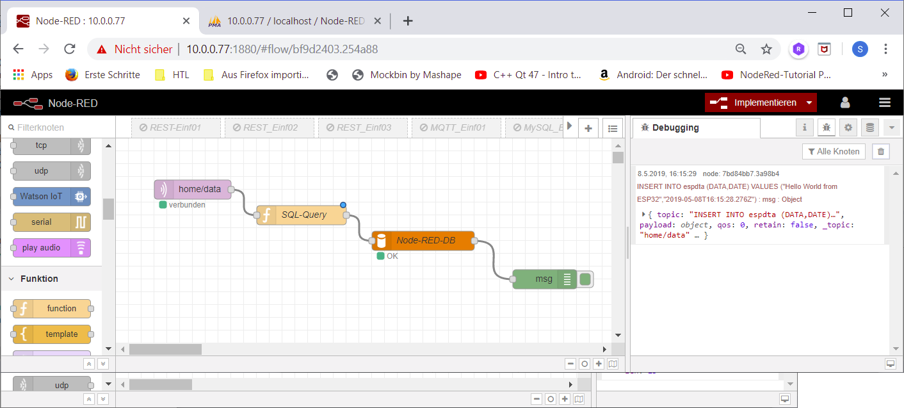

# Node-RED

## Installation

Windows-Version: <https://nodered.org/docs/platforms/windows>

Node-RED ist eine Signalflusssprache. Dabei werden Variable als Verbindungslinien zwischen Knoten (Nodes) dargestellt. Node-RED-Anwendungen werden grafisch entworfen und anschließend gestartet (deploy). Die Anwendung wird von einer Server-Anwendung im Hintergrund ausgeführt.

Starten der Anwendung aus der Kommandozeile: `node-red`. Auf die Entwicklungsumgebung kann dann mittels Browser auf Port 1880 zugegriffen werden `localhost:1880`. Produktiv wird node-red als Service laufen.

Node-RED legt unter Windows die Flows unter `C:\Users\xxxxxxx\.node-red` ab.

Der Umfang von Node-RED kann sehr einfach durch eine Vielzahl verfügbarer Module erweitert werden. Am Einfachsten mittels NPM.

http-Endpoint: https://cookbook.nodered.org/http/create-an-http-endpoint

### RaspberryPi

- Installation von Node-RED, Npm und Node.js:
  ```
  bash <(curl -sL https://raw.githubusercontent.com/node-red/raspbian-deb-package/master/resources/update-nodejs-and-nodered)
  ```
- Alternativ:
  ```
  update-nodejs-and-nodered
  sudo npm install -g node-red-admin
  ```
- Wenn Node-RED nur mit Passwort zugänglich sein soll:

  Passwort-Hash generieren (hashen) - hier wurde Passwort *mypassword* eingegeben:

  ```
  node-red-admin hash-pw
  Password:mypassword
  $2a$08$rQBQNbY1cVu2wlgzIygCq.vR3UXWZ6YTiO/Mq2lufDlQpBwstjJ5.
  ```
  Den Hash kopieren! Hash in die Konfiguration eintragen. Die liegt leider "immer wo anders". Daher zuerst mal angeben wo die Einstellung abgelegt werden soll:
  
  ```
  node-red --userDir ~/.node-red
  ```
  dort wird dann das settings.js abgelegt. Ansonsten kann es von `/root/.node-red/settings.js` kopiert werden. Diese Datei Editieren:
  
  ```
  nano ~/.node-red/settings.js
  ```
  dort diesen Teil aus-auskommentieren und den Benutzer und den oben generierten Hash einfügen:
  
  ```
  ...
     adminAuth: {
          type: "credentials",
          users: [{
              username: "pi",
              password: "$2a$08$rQBQNbY1cVu2wlgzIygCq.vR3UXWZ6YTiO/Mq2lufDlQpBwstjJ5.",
              permissions: "*"
          }]
      },
  ...
  ```
  Damit wird Node-RED beim Aufruf nur über den Benutzer mit obigen Passwort zugängig. Als Username muss derjenige angeführt sein unter welchem Benutzer der hash generiert wurde und in welchem home-Verzeichnis das setting abgelegt ist.
  
- Steuerung/Als Service starten:

  ```
  node-red-start
  node-red-stop
  sudo systemctl enable nodered.service
  sudo systemctl disable nodered.service
  ```
  Wenn Node-RED als service gestartet wird, dann muss die Kennwort-Abfrage im /root/.node-red/settings.js eingetragen werden (Benutzer der mit dem der hash berechnet wurde).
  
- Im Remote Browser Adresse des Raspi und Port 1880 eingeben:

  ```
  raspberrypi1003:1880
  ```
  der Port 1880 ist für Node-RED reserviert.

## REST-Api

- REST funktioniert mittels HTTP. Daher wird als Input ein `http`-Node benötigt. Für diesen Node wird als URL "/users" eingestellt.
- Als Output wird ein `http-response`-Node verwendet, die Standardeinstellungen werden nicht verändert.


In einem weiteren Browserfenster wird nun auf die URL (für obiges Bild) `http://192.168.62.104:1880/users` zugegriffen. Um GET in HTTP Daten mitzugeben kann die URL erweitert werden: `http://192.168.62.104:1880/users?Var=Wert`. Im Browser wird als Antwort Var=Wert dargestellt.

Als nächstes wird ein HTTP-Anforderung-Node (`http request`) dazwischen eingefügt. In diesem wird die URL `http://192.168.62.104:3000/api` eingestellt und als Methode `GET`. Wenn ein entsprechender node-Server läuft (siehe REST `$node Server.js`) dann wird die Antwort aus dem REST-Api returniert.

## MQTT

(Broker siehe Unten)

- In Node-RED sind Nodes für Publish und Subscribe verfügbar. Im Node erfolgen die Einstellungen (Adresse ...)

- auf dem Rechner läuft ein Mosquitto-Broker (alternative z.B. mosquitto.org)

- ein Device (oder mittels Kommandozeile `mosquitto_pub`) sendet an den Broker MQTT-Botschaften `home/data`

- In Node-RED wird eine `home/data`-Botschaft vom entsprechenden Broker subscribed:

  

### MQTT-Mosquitto

[https://tutorials-raspberrypi.de/datenaustausch-raspberry-pi-mqtt-broker-client/](https://tutorials-raspberrypi.de/datenaustausch-raspberry-pi-mqtt-broker-client/)
Um mit MQTT arbeiten zu können wird am einfachsten Mosquitto installiert:

```
sudo apt-get install -y mosquitto mosquitto-clients
```

Damit wird automatisch anschließend ein Broker gestartet. Für einen Auto-Start während Boot:

```
sudo systemctl enable mosquitto.service
```

Subscribe eine test_channel Botschaft:

```
mosquitto_sub -h localhost -v -t test_channel
```

Pub eine test_channel-Boschaft:

```
mosquitto_pub -h localhost -t test_channel -m "Hello Raspberry Pi"
```

Starten/Stoppen (enable/disable) eines Service:

```
sudo systemctl enable mosquitto.service
```

## MQTT-TLS

(IoT-Hack ist ein Thema! https://www.youtube.com/watch?v=urnNfS6tWAY)

- Für MQTT wird ein Server/Broker benötigt, die Einstellungen erfolgen in den MQTT-Nodes.
- In Node-RED sind Nodes für Publish und Subscribe verfügbar. Im Node erfolgen die Einstellungen (Adresse ...)
- Wenn der Broker SSL/TLS verwendet, dann muss die Einstellung des MQTT-Nodes entsprechend angepasst werden (Adresse, Port). Für selbst ausgestellte Zertifikate wird der lokale Pfad angegeben unter dem die Dateien **ca.crt**, **ca.key** abgelegt sind. Für eigene Zertifikate muss weiters ein Zertifikat für die CA und evtl. eine Passphrase (Passwort) angegeben werden und wichtig Ausschalten von *Verifiy server certificate*.
- Im Node kann ein Topic eingestellt werden (home/data)
- Hier wird eine home/data-Botschaft subscribed:


Der Content wird lediglich an einen Debug-Output gegeben - siehe Nachricht rechts: "Hello World from ESP32".

Analog funktioniert die Einstellung für einen MQTT-Output-Node.


## MySQL

- Dazu muss (üblicherweise) eine MySQL-Palette installiert werden:
  - Node-RED verbinden (ip:1880)
  - im Einstellungsmenü (ganz rechts oben) -> Palette verwalten (Englisch: Manage palette)
  - unter installieren (Install) -> mysql eintippen, dadurch wird unter Anderen "node-red-node-mysql" angeboten -> installieren (install). Wenn fertig -> Schließen
  - Unter der Kategorie Speicher (storage) ist nun **mysql** verfügbar

- Platzieren des mysql-Nodes. Einstellungen durch doppelklick aufs Symbol. Die Einstellungen müssen zur DB passen. Nachdem die Einstellungen erfolgten wird das Diagramm sofort implementiert. Dadurch wird (mittels connected) sofort erkenntlich ob der Zugang korrekt konfiguriert wurde.

- Mittels eines function-Nodes (hier SQL-Query) kann ein SQL-Query abgesetzt werden, z.B.:

```
  msg.topic = "SELECT * FROM mytab";
  return msg;
```

  Der Ausgang dieses Nodes wird mit dem DB-Node verbunden.

- Der function-Node-Eingang kann auf einen inject-Node verknüpft werden, damit kann die Ausführung durch einen Maus-Klick ausgelöst werden.

- Der DB-Ausgang kann auf einen Debug-Node verknüpft werden


## MQTT -> MySQL

Wunsch: Daten die via MQTT empfangen werden sollen in eine DB eingetragen werden. Die Tabelle ist ganz einfach gehalten: es wird lediglich die Empfangszeit und das empfangene String eingetragen. Die SQL-Anweisung (im Function-Node) dazu:

```javascript
// Zeit wird korrigiert fuer AT
var myDate = new Date();
myDate.setHours(myDate.getHours() + 2);

var str = "INSERT INTO espdta (DATA,DATE) VALUES (\"";
str = str + msg.payload;
str = str + "\",\"";

// String im ISO-Format, damit kann DB auf alle Faelle
str = str + myDate.toISOString();

str = str + "\")";
msg.topic = str;

return msg;
```

Die DB **espdta** hat zwei Spalten: **DATA** und **DATE**.



## InfluxDB

InfluxDB ist eine Datenbank die sich gut für Zeit-Abhängige Ablagen eignet. Um das InfluxDB-Addon Node-Red zu installieren: https://flows.nodered.org/node/node-red-contrib-influxdb.

InfluxDB-Datenbank aufsetzen:

https://www.bjoerns-techblog.de/2017/05/installation-von-influxdb-telegraf-und-grafana-auf-dem-raspberry-pi-3/

## Dashboard

Sehr einfache Einführung: <https://www.youtube.com/watch?v=X8ustpkAJ-U>

**Installation**

für ein Dashboard (Ordner ist in Windows üblicherweise unter c:\users\xxxxx\ zu finden):

  ```
cd .node-red
npm install node-red-dashboard
  ```

dann Node-RED wieder Starten und im Browser:

  ```
localhost:1880/ui
  ```

Im Node-RED-Panel gibts jetzt eine neue Schaltfläche, in der können Grundeinstellungen getätigt werden (Menüs/Strukturieren). Außerdem gibt es neue Nodes unter dem Punkt Dashboard.

## OpenWeatherMap

- openweathermap

  - register at http://openweathermap.org/
  - get your API Key, we will use this key in Node RED.
  - `151179bfe65ddf849aba008d98d9b48c`

- node-red

  - install openweathermap node

    ```plaintext
  npm install -g --unsafe-perm node-red-node-openweathermap
    ```

  - create flow: openweathermap
  - add gauge to show temperature of Salzburg
  - hint: use msg.payload.tempc
  - see: http://developers.sensetecnic.com/article/node-red-flow-using-freeboard/

- example: node-red
  

- example: node-red-dashboard
  

- hint: openweathermap widget (Generierung der Anzeige)

## MQTT, JSON - BMP280

Messung der aktuellen Temperature mittels ESP32 und Übertragen mittels MQTT an Broker. In Node-RED MQTT subscriben und die JSON-Nachricht aufbereiten und anzeigen:

- result: node-red
  
- result: node-red-dashboard
  

## Referenzen

- Node-RED Referenz
  <https://nodered.org/docs/api/>
- Node-RED HTTP
  <https://cookbook.nodered.org/http/>
- HTML-Stylesheets (CSS)
  <https://flows.nodered.org/flow/1bffe6808d37bd96cce283939983e758>
- Einführung
  <https://medium.com/@ankur.kus1/build-rest-api-using-flow-based-programming-node-red-4ed343228ba>
- Node-RED mit REST-Api
  <https://medium.com/@ankur.kus1/build-rest-api-using-flow-based-programming-node-red-4ed343228ba>
- Node-RED Dashboard
  <https://www.youtube.com/watch?v=X8ustpkAJ-U>
- Node-RED MQTT
  <https://www.youtube.com/watch?v=amA5OaXXCJo>