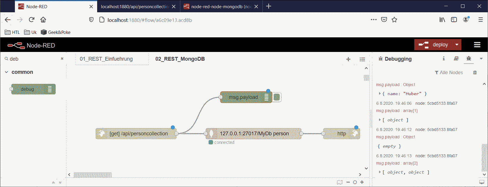
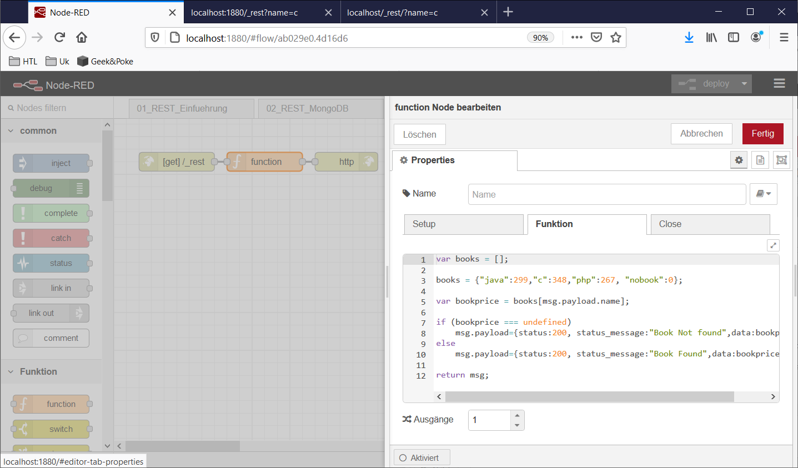

# REST-API

Erstellen eines REST-Apis für einen Datenbankzugriff mittels Node.js und express.

## CRUD

Das Akronym *CRUD* umfasst die vier grundlegenden Operationen persistenter Speicher

- **C**reate, Datensatz anlegen,
- **R**ead , Datensatz lesen,
- **U**pdate, Datensatz aktualisieren, und
- **D**elete, Datensatz löschen

Diese Operationen bieten für Datenzugriffe den wichtigsten Teil der Zugriffe ab. Daher wurden sie mit dieser Abkürzung zusammengefasst und versucht ähnlich/standardisiert zu definieren.

Im HTTP-Protokoll gibt es folgende Anfrage-Methoden: <https://wiki.selfhtml.org/wiki/HTTP/Anfragemethoden>. Diese werden können durch CRUD angewendet werden (zum Beispiel Create -> Post, Read -> Get, Update -> Put, Delete -> Delete ).

Beispielhaft wird hier das Anlegen eines Datensatz in einer XAMPP/MariaDB angeführt (Das Beispiel ist auch auf: https://www.ionos.de/digitalguide/websites/web-entwicklung/crud-die-wichtigsten-datenbankoperationen/ hervorragend und weiterführend erklärt). Die Darstellung in diesem Beispiel erfolgt mittels *Bootstrap-Grids*. Das Beispiel kann einfach mit Hilfe einer installierten XAMPP-Umgebung probiert werden:

### 1. Erstellen einer Beispieldatenbank

In phpMyAdmin wird eine Datenbank mit dem Namen **crud-intro** angelegt und mit Daten befüllt:

```
CREATE TABLE `customers` (
	`id` INT NOT NULL AUTO_INCREMENT PRIMARY KEY ,
	`name` VARCHAR( 100 ) NOT NULL ,
	`email` VARCHAR( 100 ) NOT NULL ,
	`mobile` VARCHAR( 100 ) NOT NULL
) ENGINE = INNODB;

INSERT INTO `customers`	(`id`, `name`, `email`, `mobile`) VALUES (NULL, 'John Smith', 'Smith@gooogle.com', '+53555123456');
INSERT INTO `customers`	(`id`, `name`, `email`, `mobile`) VALUES (NULL, 'Bill Hover', 'Hover@gooogle.com', '+53555125456');
INSERT INTO `customers`	(`id`, `name`, `email`, `mobile`) VALUES (NULL, 'Gram Roberts', 'Roberts@Yahooo.com', '+53555423456');
INSERT INTO `customers`	(`id`, `name`, `email`, `mobile`) VALUES (NULL, 'Jill Weisner', 'Weisner@gnx.com', '+53555123426');
INSERT INTO `customers`	(`id`, `name`, `email`, `mobile`) VALUES (NULL, 'Jack Miller', 'Miller@gnx.com', '+53555123455');
INSERT INTO `customers`	(`id`, `name`, `email`, `mobile`) VALUES (NULL, 'Sally Strikler', 'Strikler@gooogle.com', '+53555143456');
INSERT INTO `customers`	(`id`, `name`, `email`, `mobile`) VALUES (NULL, 'Hocee Grondner', 'Grondner@waalmart.com', '+53555123356');
INSERT INTO `customers`	(`id`, `name`, `email`, `mobile`) VALUES (NULL, 'Grome Maile', 'Maile@waalmart.com', '+53555123426');
```

Die Beibehaltung der Bezeichnungen (Spaltennamen ...) ist für die folgenden Teile wichtig.

### 2. Herstellen der DB-Verbindung

In einem Skript **database.php** wird eine Verbindung mit der DB hergestellt. Dafür wird eine Klasse `Database` mit der Methode `connect` erzeugt:

```
<?php
	class Database {
		private static $dbName = 'tmp_rest'; 
		private static $dbHost = 'localhost';
		private static $dbUsername = 'root';
		private static $dbUserPassword = 'myphppw1';

		private static $cont = null;

		public function __construct() {
			die('Init-Funktion nicht erlaubt');
		}

		public static function connect() {
			// Nur eine Verbindung während der gesamten Zugriffsdauer zulassen
			if ( null == self::$cont )
			{
				try {
					self::$cont = new PDO( "mysql:host=".self::$dbHost.";"."dbname=".self::$dbName, self::$dbUsername, self::$dbUserPassword);
				}
				catch(PDOException $e) {
					die($e->getMessage());
				}
			} 
			return self::$cont;
		}

		public static function disconnect() {
			self::$cont = null;
		}
	}
?>
```

Die Klasse/Methode wird im Folgenden in der index.php verwendet.

### 3. Darstellung mit index.php

Die Darstellung erfolgt mittels **index.php**:

```
<!DOCTYPE html>
<html lang="de">
	<head>
		<meta charset="utf-8">
		<link href="css/bootstrap.min.css" rel="stylesheet">
	</head>

	<body>
		<div class="container">
			<div class="row">
				<h3>Mein CRUD-PHP-Grid</h3>
			</div>
			<div class="row">
				<p>
					<a href="create.php" class="btn btn-success">Create</a>
				</p>
				<table class="table table-striped table-bordered">
					<thead>
						<tr>
							<th>Name</th>
							<th>E-Mail-Adresse</th>
							<th>Mobilnummer</th>
						</tr>
					</thead>
					<tbody>
						<?php 
							include 'database.php';
							$pdo = Database::connect();
							$sql = 'SELECT * FROM customers ORDER BY id DESC';
							foreach ($pdo->query($sql) as $row) {
								echo '<tr>';
								echo '<td>' . $row['name'] . '</td>';
								echo '<td>' . $row['email'] . '</td>';
								echo '<td>' . $row['mobile'] . '</td>';
								echo '</tr>';
							}
							Database::disconnect();
						?>
					</tbody>
				</table>
			</div>
		</div> <!-- /container -->
	</body>
</html>
```

Die index.php verwendet das bootstrap-Framework. Das kann heruntergeladen werden: <https://getbootstrap.com/> (Compiled CSS). Der Ordner css wird in das Verzeichnis von index.php entpackt.

Für die CRUD-Operationen wir hier als Beispiel Create vorgestellt:

### 4. Create-Operation

Create wird in **create.php** abgelegt:

```
<!DOCTYPE html>
<html lang="de">
	<head>
		<meta charset="utf-8">
		<link href="css/bootstrap.min.css" rel="stylesheet">
		<?php 

		require 'database.php';

		if ( !empty($_POST)) {
		// Validierungsfehler erfassen
		$nameError = null;
		$emailError = null;
		$mobileError = null;

		// Eingabewerte erfassen
		$name = $_POST['name'];
		$email = $_POST['email'];
		$mobile = $_POST['mobile'];

		// Eingabe validieren
		$valid = true;
		if (empty($name)) {
		$nameError = 'Bitte geben Sie einen Namen an';
		$valid = false;
		}

		if (empty($email)) {
		$emailError = 'Bitte geben Sie eine E-Mail-Adresse an';
		$valid = false;
		} else if ( !filter_var($email,FILTER_VALIDATE_EMAIL) ) {
		$emailError = 'Bitte geben Sie eine gültige E-Mail-Adresse an';
		$valid = false;
		}

		if (empty($mobile)) {
		$mobileError = 'Bitte geben Sie eine Mobilnummer an';
		$valid = false;
		}

		// Daten eingeben
		if ($valid) {
		 $pdo = Database::connect();
		 $pdo->setAttribute(PDO::ATTR_ERRMODE, PDO::ERRMODE_EXCEPTION);
		 $sql = "INSERT INTO customers (name,email,mobile) values(?, ?, ?)";
		 $q = $pdo->prepare($sql);
		 $q->execute(array($name,$email,$mobile));
		 Database::disconnect();
		 header("Location: index.php");
		}
		  }
		?>
	</head>

	<body>
		<div class="container">

			<div class="span10 offset1">
				<div class="row">
					<h3>Create a Customer</h3>
				</div>

				<form class="form-horizontal" action="create.php" method="post">
					<div class="form-group <?php echo !empty($nameError)?'has-error':'';?>">
						<label class="control-label">Name</label>
						<div class="controls">
							<input name="name" type="text" placeholder="Name" value="<?php echo !empty($name)?$name:'';?>">
							<?php if (!empty($nameError)): ?>
							<span class="help-inline"><?php echo   $nameError;?></span>
							<?php endif; ?>
						</div>
						</div>
					<div class="form-group <?php echo !empty($emailError)?'has-error':'';?>">
						<label class="control-label">E-Mail-Adresse</label>
						<div class="controls">
							<input name="email" type="text" placeholder="E-Mail-Adresse" value="<?php echo !empty($email)?$email:'';?>">
							<?php if (!empty($emailError)): ?>
								<span class="help-inline"><?php echo   $emailError;?></span>
							<?php endif;?>
						</div>
					</div>
					<div class="form-group <?php echo !empty($mobileError)?'has-error':'';?>">
						<label class="control-label">Mobilnummer</label>
						<div class="controls">
							<input name="mobile" type="text" placeholder="Mobilnummer" value="<?php echo !empty($mobile)?$mobile:'';?>">
							<?php if (!empty($mobileError)): ?>
								<span class="help-inline"><?php echo $mobileError;?></span>
							<?php endif;?>
						</div>
					</div>
					<div class="form-actions">
						<button type="submit" class="btn btn-success">Create</button>
						<a class="btn" href="index.php">Back</a>
					</div>
				</form>
			</div>

		</div> <!-- /container -->
	</body>
</html>
```

## Node.js / Raspberry-PI

(Beispiel: <https://scotch.io/tutorials/build-a-restful-api-using-node-and-express-4>)

Mit IoT kommunizieren vermehrt Geräte mit anderen Geräten. Das REST-Api definiert einen Standard wie diese Kommunikation unter Verwendung des HTTP-Protokolls funktionieren kann.

REST bietet eine stark vereinfachte aber standardisierte Schnittstelle zur Kommunikation mittels HTTP-Protokoll. Übertragene Datenformate (sogenannte Payloads) sind üblicherweise JSON oder XML. Mit REST wird definiert wie HTTP-Methoden oder die HTTP-Statuscodes anzuwenden sind.

Populär: Codieren/Ausführen von Javascript-Programmen auf dem Server (bei uns der RaspberryPi). Dafür wird hier **Node.js** verwendet. Als Installationshilfe wird der Packagemanager **NPM** (NodePackageManager) eingesetzt.

Eigenschaften von REST-Architekturen:

- Jede Ressource muss eindeutig (mittels URI - Uniform Resource Identification) adressierbar sein
- Bei jeder Anfrage werden sämtliche notwendigen Informationen mitgeschickt (stateless)
- Resourcen sind über gleichartige Methoden erreichbar (GET, PUT ...)
- Resourcen sind von der Repräsentation unabhängig. Übliche Formate sind XML und JSON.

### 1. Installation

(siehe Raspberry)

### 2. Vorbereitung

- Für Firefox: Installation des RESTClient-Add-Ons; Add-On Starten, dann können relativ komfortabel CRUD-Requests abgesetzt werden.
- Für Chrome: Installation der Restlet Client Erweiterung;  Starten (in der Adress-Leiste \<R\>-Icon anklicken), dann können relativ komfortabel CRUD-Requests abgesetzt werden.
- Verbindung entweder via Chrome/Firefox oder Alternativen (Postman) auf `http://192.168.62.104:3000/api` (Adresse unter welcher der Node.js-Server läuft, mit Port 3000).

### 3. Design des REST-API

Für die Verwendung eines REST-Api wird zuerst festgelegt was implementiert werden soll, also ein Design erstellt (CRUD):

| URL                            | HTTP command | POST-body   | Result               |
| ------------------------------ | ------------ | ----------- | -------------------- |
| /api/is_uni/is_professoren     | GET          | empty       | Abfrage aller Profs  |
| /api/is_uni/is_professoren     | POST         | JSON string | Erzeugen neuer Prof  |
| /api/is_uni/is_professoren/:id | GET          | empty       | Abfrage eines Prof   |
| /api/is_uni/is_professoren/:id | PUT          | JSON string | Einen Prof Verändern |
| /api/is_uni/is_professoren/:id | DELETE       | empty       | Löschen eines Prof   |

### 4. Routing

Bei REST wird mittels HTTP kommuniziert. Um HTTP-Anforderungsmethoden zu bearbeiten, werden dies Anfragen an eigene Methoden weitergeleitet (**Routing**). Mittels **express**:

```
var app = express.Router();
app.METHOD(PATH, HANDLER)
```

app ist hier eine express-Instanz, METHOD ist die HTTP-Anforderung die weitergeleitet werden soll, PATH ist der relative Pfad auf dem der Handler zu finden ist und HANDLER ist die Funktion an die weitergeleitet wird. Oft wird die Methode direkt bei diesem Aufruf implementiert:

```
app.get('/', function(req, res) {
    res.send('Hello World!');
});
```

Damit wird die HTTP-get-Anforderung weitergeleitet. Als Pfad wird der eigene Pfad angegeben.  Der Handler wird direkt codiert und gibt "Hello World" aus.

(<https://expressjs.com/de/starter/basic-routing.html>)

### 5. Herstellen einer Datenbankanbindung

Um via Node.js auf eine MySQL-DB (für uns MariaDB) zuzugreifen zu können:

(<https://www.npmjs.com/package/mysql>)
(<https://www.w3schools.com/nodejs/nodejs_mysql_select.asp>)

Voraussetzung ist eine laufende DB (wenn sie nicht sowieso schon läuft: `sudo /etc/init.d/mysql start`). Einfaches, allgemeines Beispiel (Parameter anpassen) **server.js**:

```
var mysql      = require('mysql');
var connection = mysql.createConnection({
  host     : 'localhost',
  user     : 'me',
  password : 'secret',
  database : 'my_db'
});
 
connection.connect();
 
// DB-Zugriff
 
connection.end();
```

### 6. Datenbank SELECT

Ein bisschen mehr: Mit get wird eine Verbindung zur Datenbank hergestellt, ein Select ausgeführt und das Ergebnis get zurückgegeben und in der Konsole ausgegeben. Daraufhin wird die DB-Verbindung beendet. **server.js**:

```
// server.js

// BASE SETUP
// =============================================================================

// call the packages we need
var express    = require('express');        // call express
var app        = express();                 // define our app using express
var bodyParser = require('body-parser');
var mysql      = require('mysql');

// configure app to use bodyParser()
// this will let us get the data from a POST
app.use(bodyParser.urlencoded({ extended: true }));
app.use(bodyParser.json());

var port = 3000;        // set our port

// ROUTES FOR OUR API
// =============================================================================
var router = express.Router();              // get an instance of the express Router

// test route to make sure everything is working
// (accessed at GET http://localhost:3000/api)
router.get('/', function(req, res) {
    //res.json({ message: 'Hello World! Welcome to the is_uni REST API! (100077)' });

    var connection = mysql.createConnection({
        host     : 'localhost',
        user     : 'uniuser',
        password : 'mysecret',
        database : 'uni'
    });
    connection.connect();

    connection.query('SELECT * FROM `professoren`', function (error, results, fields) {
      // error will be an Error if one occurred during the query
      // results will contain the results of the query
      // fields will contain information about the returned results fields (if any)
    	res.json(results);
    	console.log(results);
	});

	connection.end();

});

// more routes for our API will happen here
// .... TODO .....

// REGISTER OUR ROUTES -------------------------------
// all of our routes will be prefixed with /api
app.use('/api', router);

// START THE SERVER
// =============================================================================
app.listen(port);
console.log('is_uni REST API service on port ' + port + ' started.');
```

Für die hier verwendete uni-DB war die Tabelle professoren nur mit dem Attribut PersNr und den Daten 1, 2, 3 vorhanden:

```
[{ PersNr: 1 },{ PersNr: 2 },{ PersNr: 3 }]
```

Das Ergebnis wird in *results* als Array zurückgegeben, um das zu Zerlegen:

```
for (var i = 0; i < rows.length; i++) {
    var row = rows[i];
    console.log(row);
}
```

Liefert Daten in der Form (wenn die Tabelle schon ein wenig mehr bietet):

```
{PersNr: 2137, GName: 'Kant', ...}
```

Zum Zugriff auf die einzelnen Elemente (assoziatives Array): *row.gname*.

Für die Konvertierung in entsprechende json-Strings (<https://developer.mozilla.org/de/docs/Web/JavaScript/Reference/Global_Objects/JSON/stringify>):

``` 
res.json(JSON.stringify(results));
```

### 7. Weitere Routes

Um weitere Weiterleitungen einzubauen (siehe Design), wird analog vorgegangen:

```
app.post('/', function (req, res) {
  res.send('Got a POST request');
});
app.delete('/', function (req, res) {
  res.send('Got a POST request');
});
```

### 8. Service auf RaspberryPi

Starten/Stoppen (enable/disable) eines Service:

???

## Node.js / Desktop (JS/Node_01_MongoIntro)


https://www.youtube.com/watch?v=1VA0MPwFcyU

Für dieses Beispiel ist eine lokale MongoDB-Datenbank notwendig. Der Server muss lokal laufen (zum Beispiel als Service) und eine *MyDB*-Datenbank beinhalten mit einer (beliebigen) *person*-Collection (siehe *NoSQL-Datenbanken-Skriptum*).

### 1. Installation

- Download und Ausführen des msi von https://nodejs.org/de/. Dabei Auswahl für Installation der notwendigen Tools.

- In einer Kommandozeile sollte nun *npm* (Package-Manager für die weitere Installation) funktionieren

- Dann wird ein Verzeichnis angelegt und hineingewechselt

  ```
  mkdir c:\temp\node-mongo
  cd c:\temp\node-mongo
  npm init --yes
  npm install express
  npm install mongodb
  npm install -g nodemon
  ```

### 2. Erstes Skript

Erstellen des folgenden Skripts und Speichern unter **app.js**

```javascript
const express = require('express');
const app = express();

app.listen(3000, () => {
    console.log("startet");
});
```

Damit wird beim Start in der Konsole lediglich *startet* ausgegeben. Gestartet wird das Skript mit *Node.js*: 

```
nodemon app.js
```

Damit läuft die Anwendung. In einem Browser kann nun *localhost:3000* eingegeben werden (oben wurde Port 3000 angegeben). Damit wird *Cannot GET /* zurückgegeben (GET ist noch nicht implementiert).

### 3. Design des REST-API

| URL                   | HTTP command | POST-body | Result                         |
| --------------------- | ------------ | --------- | ------------------------------ |
| /api/personcollection | GET          | empty     | Abfrage des Collection-Inhalts |

### 4. Routing

Um auf einen *GET* zu reagieren wird **app.js** erweitert:

```javascript
const express = require('express');
const app = express();

app.listen(3000, () => {
    console.log("startet");
});

app.get('/', (req, res) => {
    res.send("Welcome to REST :-)");
});
```

Nun kann mittels Browser auf *localhost:3000* die Antwort **Welcome to REST :-)** empfangen werden.

für den MongoDB-Zugriff wird entsprechend geroutet:

```javascript
// Preconditions for runnind this script:
// - mongodb has to run (server as service) on localhost
// - MyDb database
// - persons collection

const express = require('express');
const app = express();

app.get('/', (req, res) => {
    res.send("Welcome to REST :-)");
});

app.get('/api/personcollection', (req, res) => {
    const MongoClient = require('mongodb').MongoClient;
    const client = new MongoClient("mongodb://localhost:27017");

    client.connect(err => {
        const collection = client.db("MyDb").collection("person");
        collection.find().toArray((err, docs) => {
            if (err) throw err;
            res.send(docs);
        });
        client.close();
    });
});

app.listen(3000, () => {
    console.log("startet");
});
```

Es wurde ein zweiter GET implementiert, diesmal mit einem anderen Pfad (api/personcollection). In einem Browser kann damit auf *localhost:3000/api/personcollection* abgefragt werden:

```
0:
	_id:	"5f285a2e17f3695fe67c5658"
	name:	"Huber"
	age:	28
	abschluesse:
		0:	"Seepferdchen"
		1:	"VS"
		2:	"NMS"
		3:	"HTL"
		4:	"FS-B"
1:
	_id:	"5f285a3a17f3695fe67c5659"
	name:	"Mayer"
	groesse:	180
```

(Je nach Datenstand in der MongoDB)

## C (408)


Um mittels C-Programm auf das Node.js REST-API zuzugreifen:

```c
#define _WIN32_WINNT 0x0A00
#include <winsock2.h>
#include <stdio.h>
#include <stdlib.h>

int main()
{
    // Win Only: Treiber Starten ==========================
	WSADATA wsaData;
    printf("WSAStartup(): % i\n", WSAStartup(MAKEWORD(2,2), &wsaData));

    // socket() ===========================================
    int s = socket(AF_INET, SOCK_STREAM, IPPROTO_TCP);
    printf("socket: % i\n", s);

    // connect() ==========================================
    struct sockaddr_in srvAddr;
    srvAddr.sin_family = AF_INET;
    srvAddr.sin_port = htons(3000);
    srvAddr.sin_addr.s_addr = inet_addr("127.0.0.1");

    printf("connect: % i\n", connect(s, (SOCKADDR*)&srvAddr, sizeof(SOCKADDR)));

    char str1[] = "GET /api/personcollection HTTP/1.0\r\n\r\n";
    send(s, str1, strlen(str1), 0);
    char str2[1000];
    int len = recv(s, str2, 1000, 0);
    str2[len] = 0;
    printf("Received:\n==\n%s\n==\n", str2);

    // close() ============================================
    printf("closesocket: % i\n", closesocket(s));

    // Win Only: Treiber Beenden ==========================
    printf("WSACleanup(): % i\n", WSACleanup());    return 0;
}
```

## PHP (JS-_REST_01)


Mit diesem Beispiel wird ein REST-GET mittels php realisiert. Dabei wird der Einfachheit wegen lediglich auf ein Feld zugegriffen. Verwendet werden kann diese Struktur um zum Beispiel einen Datenbankzugriff mittels REST über php zu ermöglichen.

Das Beispiel kann einfach mittels XAMPP realisiert werden.

**index.php**

```php
<?php
	// Aufruf:
	// localhost/_rest/?name=java
	// localhost/_rest/?name=c
	// localhost/_rest/?name=php

	header("Content-Type:application/json");
	include("functions.php");
	if(!empty($_GET['name'])){
		$name = $_GET['name'];
		$price = get_price($name);
		if (empty($price))
			deliver_response(200, "Book Not Found", NULL);
		else
			deliver_response(200, "Book Found", $price);
		//
	} else {
		deliver_response(400, "Invalid Request", NULL);
	}
	
	function deliver_response($status, $status_message, $data) {
		header("HTTP/1.1 $status $status_message");
		
		$response['status'] = $status;
		$response['status_message'] = $status_message;
		$response['data'] = $data;
		
		$json_response = json_encode($response);
		echo $json_response;
	}
?>
```

Dieses Skript sucht zum Parameter *name* den *price* mittels der Funktion *get_price*. Diese Funktion ist in einem zweiten php abgelegt - **functions.php**:

```php
<?php
	function get_price($find) {
		$books=array(
			"java"=>299,
			"c"=>348,
			"php"=>267
		);
		
		foreach($books as $book=>$price) {
			if ($book == $find) {
				return $price;
				break;
			}
		}
	}
?>
```

Hier wird ein Array angelegt in welchem jedem Namen *c*, *java* oder *php* ein Preis zugeordnet wird. Mit der Funktion wird der Preis eines angegebenen Namens zurückgegeben.

Aufgerufen werden kann zum Beispiel mittels Browser:

```
localhost/_rest/?name=php
```

Hier wurden die gezeigten php-Skripte in einer *XXAMP*-Umgebung abgelegt *C:/xampp/htdocs/_REST*.

Damit das Auslesen ästhetischer ist wird im Ordner zusätzlich die Datei **.htaccess** abgelegt:

```
# Turn on the rewrite engine
Options +FollowSymlinks
RewriteEngine on

# Request routing
RewriteRule ^([a-zA-Z_-]*)$   index.php?name=$1 [nc,qsa]
```

Mit dieser Konfiguration wird der Aufruf mittels Regulärem Ausdruck umgedeutet, der letzte Parameter wird als *name* interpretiert, damit kann der Aufruf auf diese Weiser erfolgen:

```
localhost/_rest/php
```

## Android (Andro-02)


Für dieses Beispiel ist das vorherige PHP-Beispiel Voraussetzung. 

- Mittels XAMPP wird ein Apache-WebServer mit PHP angeboten. Darin wird ein REST-API zur Verfügung gestellt:

  ```
  http://xxx.xxx.xxx.xxx:80/_rest/?name=c
  http://xxx.xxx.xxx.xxx:80/_rest/c
  ```

  beide Zugriffe sind gleichwertig (das wird mittels .htaccess realisiert). Der Pfad-Teil _rest ergibt sich durch die entsprechende Ablage im XAMPP-htdocs-Ordner erreicht.
  In functions.php sind Hilfsfunktionen für index.php abgelegt.

  (dieses Beispiel ist in *webWorkspace\_Rest_01_PhpServer* abgelegt)

- In der Handy-App 02_RestDemo wird auf das REST-API zugegriffen und zwar hardcoded:

  ```
  http://10.0.0.5:80/_rest/c
  ```

  (dieses Beispiel ist in *AndroWorkspace\02_RestDemo* abgelegt)

Im Android-Studio:

- in **build.gradle** wird eingefügt:

  ```java
  implementation 'com.android.volley:volley:1.1.0'
  implementation 'com.google.code.gson:gson:2.8.6'
  ```


  ```
  ...
  dependencies {
      implementation fileTree(dir: "libs", include: ["*.jar"])
      implementation 'androidx.appcompat:appcompat:1.2.0'
      implementation 'androidx.constraintlayout:constraintlayout:1.1.3'
      testImplementation 'junit:junit:4.12'
      androidTestImplementation 'androidx.test.ext:junit:1.1.1'
      androidTestImplementation 'androidx.test.espresso:espresso-core:3.2.0'
      implementation 'com.android.volley:volley:1.1.0'
      implementation 'com.google.code.gson:gson:2.8.6'
  }
  ```

- in **AndroidManifest.xml** werden die beiden Zeilen eingefügt:

  ```xml
  <uses-permission android:name="android.permission.INTERNET" />
  ...
  android:usesCleartextTraffic="true"
  ```

   um aufs Internet zugreifen zu können bzw. um eine IP-Adresse direkt angeben zu können (nur notwendig, wenn die IP direkt eingegeben wird):

  ```xml
  <?xml version="1.0" encoding="utf-8"?>
  <manifest xmlns:android="http://schemas.android.com/apk/res/android"
      package="com.example.restdemo">
      <uses-permission android:name="android.permission.INTERNET" />
      <application
  		android:usesCleartextTraffic="true"
          android:allowBackup="true"
          android:icon="@mipmap/ic_launcher"
          android:label="@string/app_name"
          android:roundIcon="@mipmap/ic_launcher_round"
          android:supportsRtl="true"
          android:theme="@style/AppTheme">
          <activity android:name=".MainActivity">
              <intent-filter>
                  <action android:name="android.intent.action.MAIN" />
  
                  <category android:name="android.intent.category.LAUNCHER" />
              </intent-filter>
          </activity>
      </application>
  
  </manifest>
  ```

- Programmierung in **MainActivity.java**:

  ```java
  package com.example.restdemo;
  
  import androidx.appcompat.app.AppCompatActivity;
  
  import android.app.VoiceInteractor;
  import android.os.Bundle;
  import android.util.Log;
  
  import com.android.volley.Request;
  import com.android.volley.RequestQueue;
  import com.android.volley.Response;
  import com.android.volley.VolleyError;
  import com.android.volley.toolbox.JsonObjectRequest;
  import com.android.volley.toolbox.Volley;
  
  import org.json.JSONObject;
  
  public class MainActivity extends AppCompatActivity {
  
      @Override
      protected void onCreate(Bundle savedInstanceState) {
  
          super.onCreate(savedInstanceState);
          setContentView(R.layout.activity_main);
  
          String URL = "http://192.168.56.1:80/_rest/c";
  
          RequestQueue requestQueue = Volley.newRequestQueue(this);
  
          JsonObjectRequest objectRequest = new JsonObjectRequest(
              Request.Method.GET,
              URL,
              null,
              new Response.Listener<JSONObject>() {
                  @Override
                  public void onResponse(JSONObject response) {
                      Log.e("Rest-Ok Response", response.toString());
                      TextView tv = (TextView) findViewById(R.id.tvAusgabe);
                      tv.setText(response.toString());                       
                  }
              },
              new Response.ErrorListener() {
                  @Override
                  public void onErrorResponse(VolleyError error) {
                      Log.e("Rest-Error Response", error.toString());
                  }
              }
          );
  
          requestQueue.add(objectRequest);
      }
  }
  ```

  Hier wurde die IP des Rechners angegeben auf welchem die PHP-Anwendung läuft

- Anpassung der *main Activity* in **main_activity.xml**: Benennen des *Hello World!* TextViews in *tvAusgabe*

- Ausführung - es wird in der Konsole, als auch am Display ausgegeben:

  ```
  Rest-Ok Response: {"status":200,"status_message":"Book Found","data":348}
  ```

## Node-RED

Node-RED ist eine grafische Signalfluss-Sprache. Gerade für IOT-Anwendungen sind häufig nicht so versierte Benutzer am basteln.

- REST funktioniert mittels HTTP. Daher wird als Input ein `http`-Node benötigt. Für diesen Node wird als URL "/users" eingestellt.
- Als Output wird ein `http-response`-Node verwendet, die Standardeinstellungen werden nicht verändert.


In einem weiteren Browserfenster wird nun auf die URL (für obiges Bild) `http://192.168.62.104:1880/users` zugegriffen (oder http://localhost:1880/users). Um GET in HTTP Daten mitzugeben kann die URL erweitert werden: `http://192.168.62.104:1880/users?Var=Wert`. Im Browser wird als Antwort Var=Wert dargestellt.

Als nächstes wird ein HTTP-Anforderung-Node (`http request`) dazwischen eingefügt. In diesem wird die URL `http://192.168.62.104:3000/api` eingestellt und als Methode `GET`. Wenn ein entsprechender node-Server läuft (siehe REST `$node Server.js`) dann wird die Antwort aus dem REST-Api returniert

## Node-RED MongoDB



Mit der dargestellten Struktur kann ebenfalls auf die MongoDB zugegriffen werden und wie mit obigen Node.js der Inhalt zurückgegeben werden. Damit gleich wird für GET api/personcollection angegeben. Für MongoDB muss im Hintergrund wiederum die DB (als Service) laufen. Eingestellt wurde als DB MyDb, als Collection persons. Mittels Browserfenster kann nun:

```
http://xxx.xxx.xxx.xxx:1880/api/personcollection
http://xxx.xxx.xxx.xxx:1880/api/personcollection?name=Huber
```
Mit dem ersten Aufruf werden alle Elemente aus der DB gelistet, mit dem zweiten nur derjenige mit Namen Huber (wenns den denn gibt).

## Node-RED BookStore

Das obige PHP (siehe Oben) wird mittels Node-RED implementiert:



Hier wird das Array ins JavaScript implementiert. Aufgerufen wird im Browser mittels:

```
http://localhost:1880/_rest?name=java
```

## Referenzen

- CRUD

  - https://de.wikipedia.org/wiki/CRUD
  - Schöne Anleitung zum Erstellen eines MySQL-Seite mit den CRUD-Operationen: https://www.ionos.de/digitalguide/websites/web-entwicklung/crud-die-wichtigsten-datenbankoperationen/

- REST

  - Einfach verständliche Einführung: <https://t3n.de/magazin/rest-web-services-einfuhrung-219976/>
  - https://de.wikipedia.org/wiki/Representational_State_Transfer
  - https://www.cloudcomputing-insider.de/was-ist-eine-rest-api-a-611116/
  - https://www.datacenter-insider.de/was-ist-rest-api-a-714434/
  - <https://entwickler.de/online/web/restful-api-design-intro-579826380.html>
  - Node.js mit Express
    <https://scotch.io/tutorials/build-a-restful-api-using-node-and-express-4>
    <https://scotch.io/bar-talk/designing-a-restful-web-api>

- Node.js - Serverseitige JavaScript-Laufzeitumgebung

  - https://de.wikipedia.org/wiki/Node.js
  - (!!!) https://www.w3schools.com/nodejs/default.asp
  - Installation für div. OS: https://nodejs.org/en/download/
  - Node.js für Raspian: https://www.w3schools.com/nodejs/nodejs_raspberrypi.asp

  - Node-Red->Datenbank: https://flows.nodered.org/node/node-red-node-mysql
  - Node.js - Verwendung für MySQL-Datenbanken
    <https://www.w3schools.com/nodejs/nodejs_mysql_select.asp>
    (<https://www.npmjs.com/package/mysql>)

- Node-Red mit Rest-API:
  https://medium.com/@ankur.kus1/build-rest-api-using-flow-based-programming-node-red-4ed343228ba