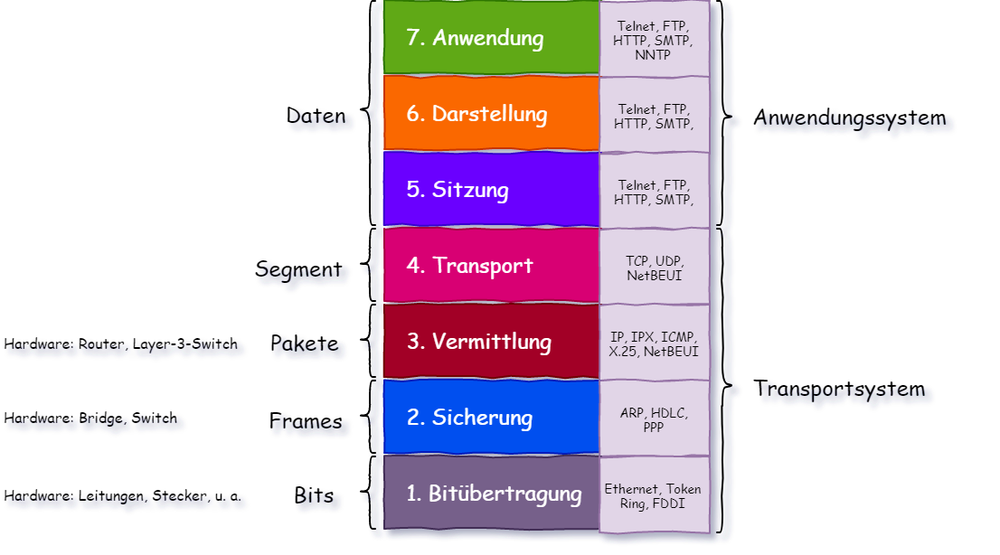
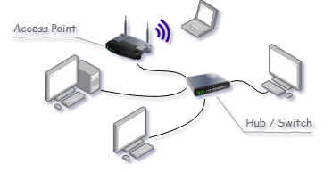
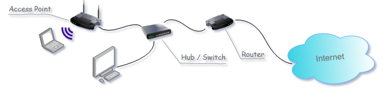
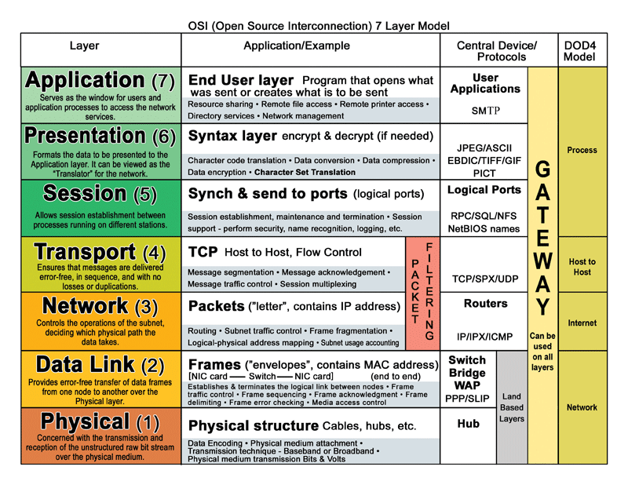

# 1 Netzwerke Allgemeines

- Netzwerk mit unterschiedlichen Komponenten:
  - Hersteller Windows(Linux/Unix ...)
  - Computer/Server/IoT-Devices/Smartphone
- Kommunikation nur möglich wenn nicht nur eine Verbindung vorhanden ist, sondern zusätzlich Regeln eingehalten werden.

## Proprietäres/Offenes System

Grundsätzlich zwei Möglichkeiten ein Netzwerk zu gestalten:

- Proprietär: nur ein Hersteller für die gesamte Kommunikation (da ja von ihm definiert) - funktioniert sehr gut, da Komponenten gut aufeinander abgestimmt sind. Dadurch ist das System abgeschlossen und eben herstellerabhängig.
- Offene Systeme: genormte Protokolle und Schnittstellen sind notwendig. Dadurch austauschbare Teile, die beste Technik kann sich durchsetzen, unterschiedliche Herstellerlösungen arbeiten zusammen und können einfach ausgetauscht werden: Normierung von ISO als **OSI-Schichtenmodell**

## OSI-Schichtenmodell

Früh wurde erkannt: Kommunikation ist komplex, daher:

- zur Vereinfachung wird der komplexe (Kommunikations-) Vorgang in einfache Teilschritte aufgeteilt
- jeder Teilschritt wird als Schicht ausgedrückt (-> 7 Schichten)
- es werden Schnittstellen zwischen den Schichten definiert um erfolgreich zu kommunizieren. Zur Übertragung: Protokolle (=Definition der Regelwerke)
- Datenübertragungen können grob in 3 Teile unterteilt werden:
  - Übertragungsweg (Kabel/Funk ...)
  - Protokoll: Definition wie der Übertragungsweg genutzt wird
  - Anwendung: stellt die Daten zur Verfügung/nimmt sie wieder entgegen
- Beim Senden werden 7 Schichten von Oben (Anwendung) beginnend durchlaufen, beim Empfang werden ebenfalls 7 Schichten in umgekehrter Richtung durchlaufen

Die Idee ist sehr gut, allerdings haben sich vielfach die unteren Schichten als sehr grob erwiesen, die oberen Schichten als zu fein.

### Schichten


1. Bitübertragung: Übertragung der Bits über physische Verbindung (HW-Definition). Typisch: welche Spannung hat 1, welche Spannung hat 0, wie lange ist ein Bit, wie sieht ein Stecker aus ... 
2. Sicherung: Um Übertragungsfehler zu erkennen (und zu beheben), wird eine Datenflusskontrolle und eine Fehlererkennung und -Behebung implementiert. Hier gibt es auch eine erste Adressierung von Paketen. Die Übertragung findet hier zwischen benachbarten Knoten statt. Mehrere Bits werden in einen Frame zusammengefasst. Adressierung kann etwa über MAC-Adressen erfolgen. Typisch: Management konkurrierender Zugriff, Daten-Bits zusammen mit Kontrollbits in Frames zusammengefasst ...
3. Vermittlung: logische Adressierung der Endgeräte. Routing/Weg Findung zwischen Sender und Empfänger. Auf dieser Schicht werden Pakete unabhängig voneinander von einem entfernten Punkt zwischen einem Zweiten transportiert. Die logische Adressierung kann etwa die IP-Adresse sein. Typisch: je nach Übertragungsweg (untere Ebenen) werden Datenpakete geteilt oder zusammengefasst (daher auch gepuffert), es wird ein Paket-Header mit Quelle-/Ziel-Adresse angehängt ...
4. Transport: Für fehlerfreie Übertragung der Pakete in richtiger Reihenfolge. Datenpakete werden den entsprechenden Anwendungen zugeordnet. Mit den Schichten 1-4 wird der Anwendung darüber eine zuverlässige End-zu-Endverbindung zur Verfügung gestellt. Typisch: Daten werden aus empfangenen Daten komplett wieder zusammengesetzt ...
5. Sitzung: Legt fest welche Station wann und wie lange sendet. Organisiert die Verbindung. Typisch: Session Auf-/Abbau ...
6. Darstellung: Bestimmt das Datenformat, wandelt diese um - Protokollumwandlung. Typisch: Umwandlung von Übertragungsformate in übergeordnete (HTML ...), Kompression, Verschlüsselung ...
7. Anwendung: Dateieingabe und -Ausgabe; stellt Funktionen für die Anwendung zur Verfügung

### Weitere Definitionen

- Schichten 1-4: **Transportsystem** - stellt eine zuverlässige Übertragung sicher

- Schichten 5-7: **Anwendungssystem** - für dieses System ist eine komplette End-zu-End-Verbindung gewährleistet.



Definition der Begriffe: Bits, Frames, Pakete, Segmente, Daten (siehe Bild): sind jeweils das Gleiche, kennzeichnen lediglich in welcher Schicht sie sich befinden. Zuordnung von (sehr gängigen) Protokollen zu den Schichten (siehe Bild).

### Reale Kommunikation

Die Kommunikation mittels eines Schichtenmodells wirkt so als kommuniziert etwa die Darstellungsschicht mittels eines Darstellungsprotokolls mit einem zweiten Teilnehmer der Darstellungsschicht (-> starke Vereinfachung). Unsichtbar ist eine Schicht dafür zuständig in die nächste Schicht zu übertragen. In jedem zwischengeschalteten Teilnehmer funktioniert das gleich. Bis in welche Ebene kommuniziert wird, hängt von der eingesetzten Komponente ab:


Hier ist **Host A** mit **Router 1** verbunden. Dieser ist (via weiterer, hier nicht dargestellter Komponenten) wiederum mit einem weiterem **Router n** verbunden. In einem Router (in einem TCP/IP-Netzwerk) werden die empfangenen Daten bis in die Vermittlungsschicht ausgepackt, der Empfänger damit ermittelt, für den Weitertransport wieder entsprechend verpackt und weitergesendet.

## Netzwerk-Architektur

Es gibt unterschiedliche Formen der Architektur, welche verwendet wird, hängt von der konkreten Anwendung ab.

### Peer-to-Peer

In einem Peer-to-Peer-Netzwerk ist jeder Teilnehmer gleichberechtigt. Jeder teilnehmende Computer stellt seine Ressourcen zur Verfügung. Das können Drucker, Scanner oder Kommunikationswege (weitere Netzwerke) sein. Der Vorteil dieser Struktur ist der einfache und kostengünstige Aufbau. Der Aufbau wird aber schon mit relativ wenigen Teilnehmern (<10) praktisch nicht mehr organisierbar.


### Hub

Mittels Hub können mehrere Geräte miteinander verbunden werden. Wenn ein Rechner Daten versendet, dann erhalten sämtliche am Hub angeschlossene Rechner die Nachricht. Derjenige Rechner der die Nachricht erhalten soll (Zieladresse der Nachricht) behält die Nachricht, alle anderen Teilnehmer verwerfen sie. Daher ist ein Hub nur für sehr kleine Netzwerke sinnvoll (nicht mehr wirklich zeitgemäß, Preisvorteil gegenüber Switch marginal).



### Switch

Ein Switch funktioniert ähnlich wie ein Hub, er agiert ein wenig intelligenter - er kennt die MAC-Adressen sämtlicher angeschlossener Geräte und übermittelt die Daten nur an denjenigen Teilnehmer an welchem das Datum adressiert ist.

### Access Point

Um mittels WLAN kommunizieren zu können, wird ein Access Point verwendet. Dieser kann mittels Hub oder Switch in ein Netzwerk eingebunden werden.

### Router

Um Dienste im Internet in Anspruch nehmen zu können, ist ein Router notwendig. Dazu werden interne IP-Adressen in diejenige Adresse übersetzt, die zum Beispiel vom Internet-Provider zur Verfügung gestellt wird. Das kann entweder statisch (fest eingestellt) oder dynamisch (DHCP) erfolgen. Router haben vielfach noch zusätzliche Optionen - Firewall, Filterung ...



Wenn vom Datennetzanbieter kein Netzwerk angeboten wird sondern ein anderes Medium (Telefon, Fernsehkabel ...), dann ist zusätzlich zwischen Router und Internet ein **Modem** notwendig. Ein Modem (*Mod*ulator-*Dem*odulator) adaptiert zum Beispiel Ethernet auf eine Telefonleitung oder ein Fernsehkabel.

Klassisch war es dann häufig auch notwendig, dass die Telefonleitung auf das Telefonsignal und Internetsignal aufgeteilt wurde (bevor es ins Modem kam), das erfolgte durch einen **Splitter**.

Im Privat-Bereich sieht die Gerätestruktur oft viel einfacher aus, das liegt daran, dass die oben erwähnten Komponenten komplett in ein einzelnes Gerät zusammengefasst werden, diese Geräte werden dann oft als **I**ntegrated **A**ccess **D**evice (IAD) bezeichnet. Oft ist aber in einen Access Point direkt ein Switch integriert. Ebenfalls auch in einem Router, dann haben diese Geräte gleich mehr als nur die beiden gezeigten Anschlüsse.

### Client-Server-Architektur

In einer solchen (logischen) Struktur wird zwischen Server und Client unterschieden. Ein Server ist nicht zwangsläufig ein eigener Computer (Hardware), er ist vielmehr ein Dienst der zur Verfügung gestellt wird. Ein Client ist eine Software die einem Dienst anfordert. Grundsätzlich können unterschiedliche Server und Clients auf ein und dem selben Rechner zur gleichen Zeit laufen.

Beispiele für gängige Server-Anwendungen sind:

- Mail-Server (der liefert meinem Client-Mailprogramm Mails wenn abgefragt wird)
- Drucker-Server: wird etwas im Netzwerk gedruckt, dann sendet ein Druckertreiber (Client) an den Drucker-Server (eventuell Software nur im Drucker)
- Web-Server: ein Browser (Client) fragt nach einer Seite (beim Web-Server)
- Datenbank: eine Datenbankanwendung (php, c# ...) kommuniziert mit einer Datenbank (DB-Server)
- Applikation-Server: Anwendung laufen auf Server

Ganz wichtig damit das funktionieren kann: die Sprache im Netzwerk muss geregelt sein. Der Anwender möchte sich nicht darum kümmern -> Protokolle.

Komponenten:

- Client: Dienstanforderer

- Server: Diensterbringer
- Abwicklungsprotokoll, wird von beiden Partnern verstanden

=> Vorteil dieser Struktur: Client und Server können auf unterschiedlichen Plattformen (Betriebssystemen/Hardware) laufen.

Die Server-Client-Struktur hat sich für sehr viele Anwendungen durchgesetzt. Der Grund liegt in der Einfachheit und klaren Definition der Rollen.

## Internet-Protokollfamilie

- das OSI-Modell ist sehr komplex
- über die Jahre haben sich leichter implementierbare Protokolle (daher preiswerter) etabliert.
- das amerikanische Verteidigungsministerium hat eigene Lösungen erarbeitet

Internet-Protokollfamilie = TCP/IP-Protokollfamilie (nach den beiden Kern Protokollen) = DoD-Protokollfamilie (**D**epartment **o**f **D**efence), 4 Ebenen:


- **Network Access Layer** OSI-Layer 1, 2 und zum Teil 3; Frame bestehend aus Header und Paket
- **Internet Layer** OSI-Layer 3; Paket bestehend aus Header und Segment
- **Transport Layer** OSI-Layer 4 und teilweise 5; Segment bestehend aus Header und Nachricht und 
- **Application Layer** OSI-Layer 5,6, und 7; Nachricht bestehend aus Header und Daten.

Die niedrigen Schichten beinhalten immer die kompletten oberen Schichten, erweitert um einen Schichtspezifischen Header. Der TCP-Header beinhaltet den Quell-/Ziel-Port, der IP-Header beinhaltet die Quell-/Ziel-IP-Adresse und die beiden Ethernet-Schichten darunter die Quell-/Ziel-MAC-Adressen (Achtung: Bild nicht maßstabgerecht):


### Protokolle der Netzzugangsschicht

- **ARP**	Address Resolution Protocol: Umsetzung von Hardware-Adresse (MAC) in eine IP-Adresse (für IPv4). Die Übersetzung erfolgt mittels Tabellen oder via ARP (wenn kein Eintrag vorhanden). Dabei wird mit einer Ziel-IP ein ARP-Request mit der unbekannten MAC Adresse 255.255.255.255 gesendet. Die betroffene Station antwortet mit seiner IP und der gesuchten MAC. Mit RARP wird umgekehrt die IP zu einer bekannten MAC-Adresse ermittelt. Unter Windows kann in der Konsole mittels `arp` auf die Zuordnungstabelle zugegriffen werden.

### Protokolle der Vermittlungsschicht (OSI3)

- **IP**	Internet Protocol: Versenden von Datenpaketen (Datagramm). IP ist verbindungslos (kein Öffnen/Schließen einer Verbindung notwendig), es wird weggesendet und darauf vertraut, dass es ankommen wird. IP garantiert kein Ankommen von Paketen oder die korrekte Reihenfolge von Paketen. IP läuft üblich über mehrere Zwischenstationen. Ein IP-Datagramm besteht aus einem Header (Version (IPv4...), Protokoll, Typ, Src-/Dst-Adressen, Checksumme, Länge ...) und einem Datenblock mit maximaler Länge (TCP liegt komplett im Datenblock).

  Diese Schicht ist nicht für Anwendungen zugänglich. Zum Senden eines IP muss die MAC-Adresse bekannt sein, Die Schicht unter dieser Schicht verwendet ARP um diese MAC-Adressen zu ermitteln.

- **ICMP**	Internet Control Message Protocol: Austausch von Kontroll-/Fehlerpaketen. Ist Teil des IP. (ping verwendet Echo-Requests auf ICMP)

### Protokolle der Transportschicht (OSI4)

- **UDP**	User Datagram Protocol: Verbindung der IP mit der Applikationsschicht. Ports definieren einen Dienst eines Servers oder ein Anwendungsprogramm einer Arbeitsstation. UDP ist verbindungslos (kein Öffnen/Schließen). Damit kann nicht auf Empfangsbereitschaft geprüft werden oder auf Erhalt von Daten. Eingesetzt wird es daher bei Media-Streaming-Anwendungen oder Internettelefonie.

- **TCP**		Transmission Control Protocol: Verbindungsorientiertes Protokoll, es verbindet zwei Endpunkte miteinander. Auch auf unzuverlässigen niedrigeren Schichten (etwa IP), kann damit sichergestellt werden, dass Daten ankommen. Vor dem Senden wird die Menge an Daten *ausgehandelt*. Gesendet wird mit Sequence-Number. Die Reihenfolge und Vollständigkeit wird damit gewährleistet. Der Empfänger muss Erhalt bestätigen ansonsten wird erneut gesendet.

  Endpunkte sind mittels IP-Adresse und Port definiert. Ein TCP-Segment besteht aus einem Header (beinhaltet Src- und Dst-Port) und der Payload.

- **TLS/SSL**		Secure Sockets Layer (neu **T**ransport **L**ayer **S**ecurity): Ende-zu-Ende-Verschlüsselung mittels symmetrischer Verschlüsselung (DES, AES...) und kryptografische Prüfsumme (SHA-1, MD5). TLS wird heute (unter Anderem) mit HTTPS, POP3S, SMTPS, FTPS eingesetzt (SSL wurde durch TLS ersetzt, die Abkürzung wird aber noch sehr häufig verwendet).
  Das TLS besteht wiederum aus zwei Schichten und wird häufig eher der 5ten Schicht zugerechnet. Es wird grundsätzlich über TCP gesehen (aber unter etwa HTTP).

### Protokolle der Anwendungsschicht (OSI5+)

- **DHCP**	Dynamic Host Configuration Protocol: für die Kommunikation benötigt jeder Rechner eine eigene, eindeutige IP-Adresse. In großen Netzwerken und mit wechselnden Teilnehmern ist das sehr aufwendig, daher gibt's DHCP: einer Station können dynamische IPs zugeordnet werden. DHCP-Server verwalten den Adresspool und protokollieren alle Vergaben. DHCP basiert auf UDP, Ports für IPv4 67/68 und für IPv6 547/546
- **DNS**	Domain Name System: um mit einer zweiten Station kommunizieren zu können wird seine IP-Adresse benötigt. Ein DNS-Server gibt zu einer URL (Uniform Resource Locator) eine IP-Adresse zurück. Eine URL ist hierarchisch aufgebaut. Der DNS-Server kann automatisch bezogen werden oder manuell eingestellt werden (kann schneller und/oder sicherer sein). UDP oder TCP, beide Port 53.
- **FTP**		File Transfer Protocol: Protokoll zur Datei-Übertragung im Netzwerk. Dabei sind mehrere Ports gleichzeitig eingebunden (Steuerports 20, 21, Datenports 1023+n). Klassisch läuft FTP völlig unverschlüsselt, daher neuer FTPS. FTP basiert auf den TCP Ports 20 und 21.
- **HTTP**	Hypertext Transfer Protocol: wird hauptsächlich zur Übertragung von Webseiten eingesetzt (Browser) neuerdings aber auch zum Austausch beliebiger Daten (IoT). HTTP baut auf TCP auf mit Port 80. - <https://www.a-coding-project.de/ratgeber/http/einfuehrung>. Die Kommunikation wird immer vom Client ausgehend aufgebaut.
- **NTP**	Network Time Protocol: Protokoll zur Synchronisierung von Uhren. Baut auf UDP, Port 123 auf.
- **POP3**	Postoffice Protocol Version 3: E-Mail-Protokoll zur Kommunikation zwischen E-Mail-Server und Client. Sehr einfach (ASCII) und eingeschränkt (Gegenstück: SMTP). TCP Port 110.
- **SMTP**	Simple Mail Transfer Protocol: E-Mail-Protokoll zur Kommunikation zwischen E-Mail-Server und Client. Kommunikation muss immer vom Sender initiiert werden (kann nicht vom Server starten). TCP, Port 25.
- **SSH**		Secure Shell: Sichere Verbindung zur Remote-Ausführung von Programmen. UDP und TCP auf Port 22. Gibt's mittlerweile in Windows als App inkludiert.
- **telnet**	Zeichenorientierter Datenaustausch, basierend auf TCP. Dient oft zur Fernsteuerung von Computern. Port 23

Liste der Ports: <https://de.wikipedia.org/wiki/Liste_der_standardisierten_Ports>

**Ein möglicher/vereinfachter Ablauf beim Zugriff auf eine Webseite:**

- Ein Client-Rechner meldet sich in Netzwerk an: mittels **DHCP**-Discover wird nach einem DHCP-Server gefragt. DHCP-Server offerieren einen Lease (IP Adresse+Subnetz+Gateway) an. Der schnellste gewinnt und stellt die Daten zur Verfügung. Damit hat der Client eine Adresse.
- Auf dem Client-Rechner wird mittels Browser eine Webseite mittels **URL** ausgewählt.
- Der Client fragt bei seinem **DNS**-Server nach der zur URL gehörenden IP-Adresse.
- Mittels dieser IP-Adresse des Zielrechners Dadurch kann ein **HTTP**-Request geformt werden.
- Üblicherweise befindet sich der Ziel-Webserver außerhalb des eigenen Netzwerks. Daher wird mittels **ARP** die **MAC**-Adresse des eigenen Routers ermittelt (wenn nicht von früher bekannt). Der direkte Zugriff auf den Ziel-Webserver ist nicht möglich.
- Der HTTP-Request wird in einem **TCP**-Segment an den Ziel-Webserver gesendet. TCP garantiert die Ankunft. Dafür wird das TCP in ein **IP**-Paket verpackt und mittels **Ethernet** und der vorher ermittelten **MAC**-Adresse an den Router gesendet.
- Der Router ermittelt wiederum mittels **ARP** die MAC-Adresse des Zielrechners und sendet die **IP**-Pakete dorthin. Die Teil-Pakete können dabei unterschiedliche Wege nehmen und in anderer Reihenfolge am Ziel ankommen. Wenn sie nicht vollständig ankommen wird das erkannt. Wenn die Pakete angekommen sind werden sie zum ursprünglichen **TCP**-Segment zusammengesetzt.
- Im Fall von Kommunikationsproblemen können Fehlermeldungen mittels **ICMP** übermittelt werden.

## HTTP

Für einen HTTP-Request und -Response wird zuerst einmal ein bestätigter TCP-Verbindungsaufbau benötigt. Ein Request besteht aus:

- Anfangszeile, zum Beispiel

  ```
  GET /startseite.html HTTP/1.1
  ```

- Headerzeilen (optionale Anzahl) mit Name-/Wert-Paar getrennt durch Doppelpunkt, zum Beispiel

  ```
  host: www.htl-salzburg.ac.at
  User-Agent: Mozilla/5.0 (Macintosh; U; PPC Mac OS X Mach-O; de; rv:1.8.0.4)
              Gecko/20060508 Firefox/1.5.0.4
  
  ```

- Leerzeile - immer mit `\r\n` 

- Nachricht (optional)

Ein Response:

- Statuszeile, zum Beispiel

  ```
  HTTP/1.1 200 OK
  ```

- Headerzeilen

  ```
  Server: Apache/2.0.49 (Linux/SuSE)
  Date: Thu, 13 Jul 2006 07:19:43 GMT
  Content-Type: text/html
  Connection: close
  
  ```

### Beispiel einer HTTP-Anfrage

Es wird eine Anfrage mittels Browser an einen Web-Server getätigt, die Anfrage wird vom Browser in Form eines HTTP-Requests getätigt. In Folge wird der HTTP-Nachricht ein TCP-Header vorangestellt (TCP-Paket), diesem wiederum ein IP-Header (IP-Datagramm) und letztlich diesem ein Ethernet II-Header. Dieses Paket wird dann gesendet:


(das ist eine mögliche Übertragung)

In einem Browser wird der Link

```
http://deine-erste-homepage.com/muster1.htm
```

aktiviert. Die Aufzeichnung eines Ethernet II-Pakets:

```
3039f21b11c16057183a80090800
4500020959a240008006e71a0a0000045f8e4ea0
c87a00500f512e9680aaec8d50180201bf410000
474554202f6d7573746572312e68746d20485454502f312e310d0a486f73743a206465696e652d65727374652d686f6d65706167652e636f6d0d0a557365722d4167656e743a204d6f7a696c6c612f352e30202857696e646f7773204e542031302e303b2057696e36343b207836343b2072763a37322e3029204765636b6f2f32303130303130312046697265666f782f37322e300d0a4163636570743a20746578742f68746d6c2c6170706c69636174696f6e2f7868746d6c2b786d6c2c6170706c69636174696f6e2f786d6c3b713d302e392c696d6167652f776562702c2a2f2a3b713d302e380d0a4163636570742d4c616e67756167653a2064652c656e2d55533b713d302e372c656e3b713d302e330d0a4163636570742d456e636f64696e673a20677a69702c206465666c6174650d0a436f6e6e656374696f6e3a206b6565702d616c6976650d0a557067726164652d496e7365637572652d52657175657374733a20310d0a49662d4d6f6469666965642d53696e63653a204d6f6e2c2030312044656320323030382031343a32333a333320474d540d0a49662d4e6f6e652d4d617463683a202263632d343563666366346137653334302d677a6970220d0a43616368652d436f6e74726f6c3a206d61782d6167653d300d0a0d0a
```

In diesem Paket wurden lediglich Zeilenumbrüche eingefügt.

**Ethernet II**

Ethernet-Paket-Header:

```
30 39 f2 1b 11 c1 60 57 18 3a 80 09 08 00
```

- Destination-MAC: 30:39:f2:1b:11:c1
- Source-MAC: 60:57:18:3a:80:09
- Protokoll: 0800 - IPv4

Nach diesem Header folgt direkt das IP-Datagramm und nach diesem eine 4-Byte-Checksumme.

**IP**

Datagramm-Header:

```
45 00 02 09 59 a2 40 00 80 06 e7 1a 0a 00 00 04 5f 8e 4e a0
```

- Version: 4 - 4
- Header-Länge: 5 - 20 Bytes
- ...
- Protokoll: 6 - TCP
- Source-IP: 0a000004 - 10.0.0.4
- Destination-IP: 5f8e4ea0 - 95.142.78.160

Nach diesem Header folgt direkt das TCP-Paket.

**TCP**

Paket-Header:

```
c8 7a 00 50 0f 51 2e 96 80 aa ec 8d 50 18 02 01 bf 41 00 00
```

- Source-Port: c87a - 51322
- Destination-Port: 0050 - 80 (HTTP)
- Sequenz-Nummer: 0f512e96
- Acknowledgement-Nummer: 80aaec8d
- Länge: 5 - 20 Bytes
- Flags: 018
- ...

Nach diesem Header folgt direkt der HTTP-Inhalt.

**HTTP**

Nachricht:

```
0000   47 45 54 20 2f 6d 75 73 74 65 72 31 2e 68 74 6d
0010   20 48 54 54 50 2f 31 2e 31 0d 0a 48 6f 73 74 3a
0020   20 64 65 69 6e 65 2d 65 72 73 74 65 2d 68 6f 6d
0030   65 70 61 67 65 2e 63 6f 6d 0d 0a 55 73 65 72 2d
0040   41 67 65 6e 74 3a 20 4d 6f 7a 69 6c 6c 61 2f 35
0050   2e 30 20 28 57 69 6e 64 6f 77 73 20 4e 54 20 31
0060   30 2e 30 3b 20 57 69 6e 36 34 3b 20 78 36 34 3b
0070   20 72 76 3a 37 32 2e 30 29 20 47 65 63 6b 6f 2f
0080   32 30 31 30 30 31 30 31 20 46 69 72 65 66 6f 78
0090   2f 37 32 2e 30 0d 0a 41 63 63 65 70 74 3a 20 74
00a0   65 78 74 2f 68 74 6d 6c 2c 61 70 70 6c 69 63 61
00b0   74 69 6f 6e 2f 78 68 74 6d 6c 2b 78 6d 6c 2c 61
00c0   70 70 6c 69 63 61 74 69 6f 6e 2f 78 6d 6c 3b 71
00d0   3d 30 2e 39 2c 69 6d 61 67 65 2f 77 65 62 70 2c
00e0   2a 2f 2a 3b 71 3d 30 2e 38 0d 0a 41 63 63 65 70
00f0   74 2d 4c 61 6e 67 75 61 67 65 3a 20 64 65 2c 65
0100   6e 2d 55 53 3b 71 3d 30 2e 37 2c 65 6e 3b 71 3d
0110   30 2e 33 0d 0a 41 63 63 65 70 74 2d 45 6e 63 6f
0120   64 69 6e 67 3a 20 67 7a 69 70 2c 20 64 65 66 6c
0130   61 74 65 0d 0a 43 6f 6e 6e 65 63 74 69 6f 6e 3a
0140   20 6b 65 65 70 2d 61 6c 69 76 65 0d 0a 55 70 67
0150   72 61 64 65 2d 49 6e 73 65 63 75 72 65 2d 52 65
0160   71 75 65 73 74 73 3a 20 31 0d 0a 49 66 2d 4d 6f
0170   64 69 66 69 65 64 2d 53 69 6e 63 65 3a 20 4d 6f
0180   6e 2c 20 30 31 20 44 65 63 20 32 30 30 38 20 31
0190   34 3a 32 33 3a 33 33 20 47 4d 54 0d 0a 49 66 2d
01a0   4e 6f 6e 65 2d 4d 61 74 63 68 3a 20 22 63 63 2d
01b0   34 35 63 66 63 66 34 61 37 65 33 34 30 2d 67 7a
01c0   69 70 22 0d 0a 43 61 63 68 65 2d 43 6f 6e 74 72
01d0   6f 6c 3a 20 6d 61 78 2d 61 67 65 3d 30 0d 0a 0d
01e0   0a
```

- Anfrage

   In einem Browser wird der Link
   
   ```
   http://deine-erste-homepage.com/muster1.htm
   ```
   
   aktiviert. Der Browser wandelt diese Eingabe in eine 
   Anfrage an *deine-erste-homepage.com* nach */muster1.html*. Diese Anfrage wird auf TCP mit dem http-Standardport 80 gesendet:
   
```
GET /muster1.htm HTTP/1.1\r\n
Host: deine-erste-homepage.com\r\n
Accept-Language: de,en-US;q=0.7,en;q=0.3\r\n
   \r\n
```

   1. Als Trennzeichen werden Leerzeichen (0x20) und \r\n (0x0d, 0x0a) verwendet
   2. Methode - hier *GET*
   3. Pfad der Ressource */muster1.html *
   4. Version des HTTP-Protokolls
   5. Es folgt der Header, das ist eine optionale Zusammenstellung von Informationen, das können unterschiedlich viele Angaben sein. Dieser Block wird mit einer leeren Zeile beendet.
   6. Nach dem Header kann ein Daten-Block folgen, für eine *GET*-Anfrage entfällt dieser Block (Für etwa einen *POST* wäre das Anders).

- Antwort
  Auf die obige Frage kann folgende Antwort folgen:

  ```
  HTTP/1.1 200 OK\r\n
  Server: Apache\r\n
  Date: Thu, 16 Oct 2018 06:02:55 GMT\r\n
  Last-Modified: Thu, 16 Oct 2017 06:02:55 GMT\r\n
  Content-Type: text/html\r\n
  Content-Length: 160\r\n
  \r\n
  <html>\r\n
  <head>\r\n
  <title>Hier steht der Titel der Homepage</title>\r\n
  </head>\r\n
  <body>\r\n
  Meine erste Homepage. Hier möchte ich euch etwas über mich, meine Freunde und meine Hobbies erzählen.\r\n
  </body>\r\n
  </html>\r\n
  ```

  diese Antwort hat wiederum eine unterschiedliche Anzahl von Elementen, hier sind nur wenige angeführt. Wichtig ist hier: *Content-Type* - damit wird hier mitgeteilt das der folgende *Content* ein HTML als Plain-Text folgt. Zusätzlich die Information *Content-Length* welche die Länge der Daten im direkt anschließenden Datenblock beschreibt, die Trennung ist wiederum ein zusätzlicher *\r\n*.

## Medizintechnische Netzwerk-Klassen

Im medizinischen Bereich:

- Netzwerkklasse A: allgemeine Computernetzwerke (Krankenhausinformationssysteme)

-  Netzwerkklasse B: Computernetzwerke im klinischen Einsatz (z.B. Vernetzung klinische Abteilung mit zentralen medizinischen Bildarchiv)
- Netzwerkklasse C: hochsicherheitskritische klinische Bereiche, z.B. Monitoring in der Intesivmedizin. Diese Klasse ist (physisch) unabhängig von anderen Systemen zu verwirklichen.

## Anderes

- **MAC**	**M**edia\_**A**ccess\_**C**ontrol-Adresse: Eindeutige Adresse einer Netzwerk-Adapters (wird in der Produktion vergeben). Ist 48 Bit lang (6 Byte). Schreibweise entweder mit : oder mit -: `01:80:42:ae:fd:7e`. Mit Hilfe dieser Adresse kann eine Kommunikation eindeutig erfolgen (es ist schon vorgekommen, dass MAC doppelt vorkommen, manchmal ist die MAC-Adresse auch SW-konfigurierbar). Dargestellt wird üblich in der *kanonischen* Form - LSB zuerst. Die MAC-Adresse `ff:ff:ff:ff:ff:ff` ist ein *Broadcast*-Adresse.
- **Port**	Ports werden in Transport-Protokollen (TCP, UDP) verwendet um mehrere Kommunikationskanäle zur Verfügung zu stellen und grob zu zeigen um welchen Dienst es sich handelt (siehe oben).
- **Socket**	Ein durch eine RFC definierter Begriff (Socket ~ Steckdose). Ein Socket ist ein Bündel aus Quell-/Ziel-IP und -Port. Zusätzlich noch mit dem verwendeten Protokoll. Es ist damit ein API zwischen Transport und Anwendungsebene für die Anbindung mittels TCP/IP oder IrDA (praktisch).
- **Repeater**	Verbinden von Netzwerksegmenten auf OSI1. Verbundene Netze dürfen keine Zyklen haben (ansonsten können Pakete kreisen). Sie dienen als Verstärker, mit ihnen können daher Netzwerke räumlich vergrößert werden.
- **Bridge**	Eine Bridge arbeitet auf OSI2 (MAC-Schicht). Eine Bridge puffert Pakete und wirkt damit als Buffer bei Kollisionen. Sie übermittelt den Datenverkehr der von einem Netzwerk-Segment in das benachbarte muss und blockiert die anderen. Damit können Kollisionen reduziert werden und räumlich Netzwerke vergrößert werden.
- **Hub**	*einfachste* Komponente an Schnittstellen in einem Netzwerk. Ein Hub leitet Pakete an sämtliche an ihm angeschlossene Hosts weiter. Dadurch müssen sich an einen Hub angeschlossene Geräte die verfügbare Bandbreite immer teilen und sind nur für den Anschluss von wenigen Geräten sinnvoll. 
- **Switch**	Ähnlich wie ein Hub. Im Gegensatz zu diesem kann ein Switch aber mehrere Geräte zur gleichen Zeit miteinander verbinden. Ein Switch kommuniziert nur mit der adressierten Komponente, er kann aber auch an mehrere gleichzeitig übertragen.
- **Router**	Ein Router verbindet zwei oder mehrere logische Netze. Er arbeitet auf OSI3. In TCP/IP Übertragungen sind in Schicht 3 die Adressen enthalten womit der Router das Paket lenkt. Dazu bedient er sich einer Routing-Tabelle. Ein Router kann unterschiedliche Wege aufgrund Laufzeit auswählen und damit auch Redundanzen oder Lastverteilung durchführen. Router können DHCP (dynamisches Zuweisen von IP-Adressen an angeschlossene Komponenten) und NAT. Häufig können sie auch MAC oder IP Adressen filtern und haben eine Firewall integriert.
- **NAT**	Network Address Translation. Erfolgt auf dem Router. Übersetzung lokaler Netzwerkadressen in eine ~globale. Damit weiß ein Router welcher lokale Host welchen Dienst im Internet verwendet und kann dementsprechend die Replys durch routen.
- **Gateway**		Ein Gateway kann zwei Geräte bis in die Schicht 7 verbinden. Damit können Anwendungsprotokolle übersetzt werden. Zur Konvertierung eines TCP/IP in ein IBM-SNA wird ein MS-SNA-Server (Gateway) verwendet. Auf einem Host ist der Standard-Gateway diejenige Adresse an die Anfragen weitergeleitet werden, wenn sie nicht im lokalen Adressbereich liegen.
- **CSMA/CD** 	Carrier Sense Multiple Access/Collision Detect: Dieses Verfahren wird in Ethernet (nur wenn nicht via Switch) und abgewandelt in WLAN Netzen eingesetzt. Dabei wartet ein Busteilnehmer der Senden möchte auf einen freien Bus. Wenn dieser frei ist beginnt er zu Senden und hört dabei gleichzeitig mit ob seine Daten auf dem Bus ankommen. Wenn nicht (etwa weil ein zweiter genau gleichzeitig zu Senden begonnen hat) wird die Sendung sofort beendet. Ein Zufallsgenerator ermittelt ab wann dieser Sender einen erneuten Sende-Versuch startet (mit Warten auf freien Bus). Dieses Verfahren wird im Ethernet verwendet (als IEEE 802.3). In Drahtlosen Netzen werden andere Verfahren eingesetzt. Ein Teilnehmer welcher sendet, kann nicht gleichzeitig hören ob ein zweiter Teilnehmer sendet, daher wird hier häufig ein CSMA/CA (A für Avoidance) eingesetzt. Dabei wird vor dem Senden Gehört.
- **Ethernet**	Kombination gewisser Protokolle und Hardware für kabelgebundene Netze. Ethernet ist sowohl auf Layer 1 und Layer 2 festgelegt. Ethernet kann die Basis  für TCP/IP bilden.
- **PPP/PPPoE**	Point-to-Point Protocol: Verbindung über Wählleitung. oE bedeutet over Ethernet. Wird bei ADSL verwendet. Ist ein Übliches Protokoll für Internetprovider den Kunden gegenüber.
- **Firewall**	Kann etwa auf einem Router aktiv sein. Damit wird jede Übertragung aus dem Heimnetzwerk in das Internet direkt ermöglicht, in die umgekehrte Richtung werden allerdings nur Antworten durchgelassen (einfachster Fall).

## IP-Adresse

Um Geräte in einem IP-Netzwerk eindeutig adressieren zu können wird jedem Gerät eine logische IP-Adresse zugeordnet. Eine IP-Adresse besteht in **IPv4** aus **32 Bit**, damit sind >4 Mrd. Teilnehmer adressierbar. Da das in Zukunft zu wenig sein wird, wurde die Adresse für **IPv6** auf **128 Bit** erweitert. Die Darstellung von IPv4 Adressen: 4 Oktetten getrennt durch einen Punkt: `192.168.7.7`. Diese Schreibweise ist für IPv6 nicht praktisch da sie zu lange wird, daher wird die Adresse hier in doppelte Oktette in hexadezimaler Schreibweise zusammengefasst: `2001:0db8:85a3:0000:0000:8a2e:0370:7344` (führende Nullen werden oft weggelassen).

Eine IP-Adresse ist eine logische, wie bekommt ein Rechner eine IP-Adresse?

- Manuell: es wird eine Adresse auf dem Gerät eingestellt.
- Automatisch: die Adresse wird beim Start *dynamisch* zugewiesen (DHCP)

Eine IP-Adresse setzt sich aus 2 Teilen zusammen: einem Netzwerkteil (für alle Rechner eines Subnetzes gleich) und einem Hostteil (damit werden die Rechner innerhalb eines Subnetzes unterschieden). Schreibweisen: `192.168.45.22/24`  damit wird festgelegt: die ersten 24 Bit sind Netzwerkteil und die verbleibenden 8 Bit sind Hostteil (bis zu 256 Rechner/Drucker ... möglich). Alternativ: Angabe einer Subnetzmaske für dieses Beispiel: `192.168.45.22` und `255.255.255.0` (=Subnetzmaske).

Gängige/Reservierte IPs:

```
192.168.0.0/16	Privat (klein)
127.0.0.0/8			Localnet (Kommunikation mit sich Selber)
10.0.0.0/8			Privat (sehr groß)
172.16.0.0/12 	Privat (groß)
255.255.255.255	Broadcast
```

Darstellung der eigenen Konfiguration (Windows):

```
ipconfig /all
```

- IPv4 und IPv6
- Subnetzmaske
- für jeden Netzwerkadapter
- Host / Router

Zuordnung IP-URL mittels DNS.

Zuordnung IP <-> MAC mittels ARP.

Wie findet ein IP Paket den Weg zum Zielrechner:

- Adresse im eigenen Subnet: wenn Rechner nicht bekannt: arp-Anfrage (Broadcast) nach MAC passend zu IP, nach Antwort wird das Paket direkt dorthin gesendet
- Adresse außerhalb des Subnets: das Datenpaket wird an die MAC-Adresse des Routers (Standard-Gateway) gesendet. Dieser kümmert sich um die Weiterleitung des Pakets.
- Der Router führt *Routing-Tabellen*, diese können statisch (von Hand) oder dynamisch erstellt worden sein. Für dynamisches Routing tauschen sich benachbarte Router miteinander aus um die entsprechende Information zu sammeln.

# Windows

Telnet aktivieren:  https://praxistipps.chip.de/windows-10-telnet-client-aktivieren-und-deaktivieren_92627 


Poster:


## Referenzen

- Gute Protokoll-Zusammenfassung:

  https://kompendium.infotip.de/netzwerktechnologie2-referenzmodelle-und-protokolle.html

- Socket-Programmierung mit C#
  <https://docs.microsoft.com/de-de/dotnet/framework/network-programming/sockets>

- Windows-Tools:
  https://kompendium.infotip.de/netzwerkbefehle-der-windows-kommandozeile.html