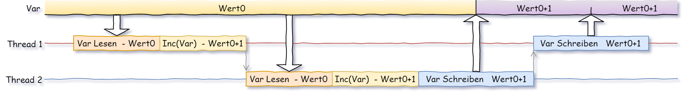
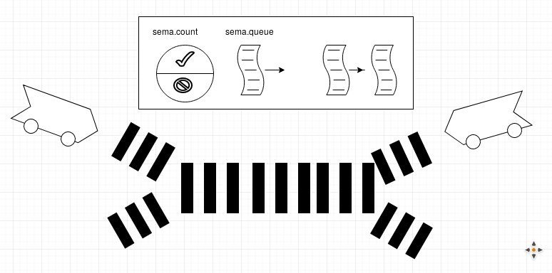

# 3 Os - Synchronisation - Java

Häufig müssen parallel laufende Threads miteinander synchronisiert werden (Ablauf aufeinander abgestimmt). Das kann durch die Nutzung gemeinsamer Betriebsmittel, Datenbereichen oder beim Austausch von Information notwendig sein. In vielen Fällen ist der gleichzeitige Zugriff auf Betriebsmittel nicht zulässig oder kann Fehler verursachen (siehe weiter unten).

Wenn der Zugriff nicht geregelt wird, dann kann es zur sogenannten **Race Condition** kommen. Damit ist gemeint, dass jeder Thread versucht, seine Operationen so schnell wie möglich zu erledigen, ohne die Organisation des Gesamt-Prozesses zu berücksichtigen. Damit können sich Threads ungünstig gegenseitig behindern. Da sich der Ablauf dadurch zwangsläufig "eher sporadisch" verhält, sollten Data-Races vermieden werden und der Zugriff auf geteilte Ressourcen (**gemeinsame Variable**) organisiert werden (Fehler durch Data-Races sind oft sehr schwer zu finden).

Ein wichtiges Konzept um dieses Problem zu behandeln ist die Sperrsynchronisation - **Mutex**: (**Mut**ual **Ex**clusion): dieser Begriff fasst Verfahren mit wechselseitigem Ausschluss (im Bezug auf kritische Bereiche) zusammen. Im Allgemeinen wird dabei der Zugang zu einem kritischen Bereich für andere Threads gesperrt wann immer dieser Bereich betreten wird.

---

**Lost Update-Beispiel von Oben:**
Thread1 und Thread2 greifen schreibend auf eine gemeinsame Variable namens `mCount` zu. Sie wollen jeweils die Variable `mCount` um 1 erhöhen. 

Annahme beim Start: `mCount = 7`

Das Erhöhen einer Variablen kann durch folgende Elementaroperationen realisiert werden:

​	 read  -> inc -> write

Ein Thread kann zwischen jeden dieser Schritte vom Scheduler unterbrochen werden. Daraus kann sich folgendes Scenario ergeben:

 ```
T1: read variable mCount (7)
						T2: read variable mCount (7)
						T2: inc variable mCount (8)
						T2: write variable mCount (8)
T1: inc variable mCount (8)
T1: write variable mCount (8)
 ```

Eigentlich müsste `mCount` den Wert 9 haben, da `mCount` ja 2 mal erhöht wurde, es wurde jedoch einer der Updates verloren -> **Lost Update**

In diesem Beispiel ist der gesamte Inkrementiervorgang (read, inc und write) ein **kritischer Abschnitt**. Der Zugriff auf die gemeinsame Variable muss synchronisiert werden.

---

## Monitor

(Konzept aus dem Betriebssystembereich) In Java besteht ein Monitor aus:

- Daten die nur von Zugriffsroutinen aus bearbeitet werden können
- Zugriffsroutinen
- definierten Methoden für den Zugriff von Threads auf den Monitor (`wait()`, `notify()` ...)
- Condition-Variable

Der Monitor selber ist ein geschützter Bereich, in welchem sich zu einem Zeitpunkt maximal ein Thread befinden kann. Der Zugang ist nur über die definierten Zugangsroutinen möglich. Race-Condition sind damit von Haus aus unmöglich.

In Java sind Monitore mit Objekten verbunden (mittels `synchronized()`). Dadurch sperren sich in diesem Objekt gekennzeichnete Methoden (Schlüsselwort `synchronized`) automatisch gegenseitig aus.

```java
class Point {
    private float mX, mY;
    ...
    void setPoint(float x, float y) {
        mX = x;		// wenn Thread nach dieser Zeile unterbrochen -> Inkonsistente Daten
        mY = y;
    }
    Point getPoint() {
        return new Point(mX, mY);
    }
}
```

mittels Monitor:

```java
class Point {
    private float mX, mY;
    ...
    synchronized void setPoint(float x, float y) {
        mX = x;				// Thread kann hier nicht mehr unterbrochen werden
        mY = y;
    }
    synchronized Point getPoint() {
        return new Point(mX, mY);
    }
}
```

Achtung: für verschiedene Objekte dieser Klasse wird nicht gesperrt, die Koordinaten verschiedener Punkte haben ja auch nichts miteinander zu tun. Innerhalb ein und desselben Objekts kann nun nicht mehr `getPoint()` aufgerufen werden solange ein anderer Thread innerhalb `setPoint()` läuft (und umgekehrt).

### Ereignisse

Warten auf Ereignisse mittels Monitor: in Producer-Consumer-Problemen wartet ein Consumer-Thread auf Ergebnisse eines Producer-Threads. Um vorhandene Ergebnisse nicht zyklisch abfragen zu müssen gibt es eine `wait()`-Funktion. Mittels dieser Funktion wird der Consumer-Thread *wartend* gesetzt. Immer wenn ein Producer ein Ergebnis generiert, ruft er die `notify()` Funktion auf. Damit weckt der Monitor den nächsten wartenden Thread, dieser kann prüfen ob ein Ergebnis vorliegt und kann gegebenenfalls seine Arbeit erledigen.

## Typische Anwendungsfälle

Probleme die typischerweise in der nebenläufigen Programmierung auftreten:

1. Producer-Consumer (Erzeuger-Verbraucher)

2. Leser und Schreiber (siehe obiges Point-Beispiel), Lost-Update

3. Semaphore

### 1. Producer-Consumer (Ereignissynchronisation) (708)

- ein Thread erzeugt Daten (Laden aus dem Internet, aus Dateien, Langwierige Berechnung ...)
- ein weiterer Thread verarbeitet die Daten weiter (Anzeige in einer GUI, weitere Berechnung, Speichern von Daten ...)

Um sich nicht permanent gegenseitig zu blockieren (dann hätte Multi-Threading für diese Fälle keinen Sinn), kann als ersten Schritt mittels FiFo-Buffer (Queues) gearbeitet werden. Java bietet hierfür einige (Thread-Sichere) Strukturen an:

- BlockingQueue, ArrayBlockingQueue (siehe Übungen)
- PipedInputStream, PipedOutputStream (siehe Unten)
- alternativ Eigene, selbst erstellte Buffer mittels Arrays oder Listen-Strukturen

Für die Ereignissynchronisation (typisch Producer-Consumer-Produkterzeugung/-Entnahme wird synchronisiert) stehen im Java-Monitor `wait()` und `notify()` zur Verfügung. Diese statischen Methoden sind von `Object` geerbt.

- Mit `wait()` wird der aufrufende Thread im Scheduler auf den Status wartend gesetzt und in die Warteliste des Objekts eingetragen. Für die Funktion ist dort ebenfalls eine Warteschlange für die wartenden Threads.
- Mit `notify()` wird ein Thread aus der Warteliste entnommen und direkt ge-schedult.
- `wait()` und `notify()` darf nur innerhalb eines gesperrten Bereichs ausgeführt werden (innerhalb eines `synchronized`-Blocks).

Beispiel **Producer-Consumer**:

- Ein Producer-Thread erzeugt Daten und schreibt diese in ein Queue (FiFo)

- Ein Consumer-Thread verwendet die Daten des Producer weiter. Er holt sie dazu aus dem FiFo-Speicher

- Reale Probleme:

  - der Produzent erzeugt zu viel Daten, der Buffer läuft über (eventuell entnimmt der Konsument die Daten zu langsam)  -> *Buffer-Overflow*
  - der Konsument möchte Daten abholen, der Buffer ist allerdings schon leer -> *Buffer-Underflow*

  einfachste Lösung: Auslösen einer Exception für Buffer-Overflow/-Underflow

FiFo-Buffer können einfach als Ringbuffer realisiert werden. Die Position des Schreibens und Lesens wird mittels eines Index in einem Array festgelegt. Die 8 Plätze in diesem Beispiel bieten Platz für bis zu 7 Elemente (würden 8 Elemente zugelassen, kann Voll nicht von Leer unterschieden werden ...):


Eine einfache Implementierung, die anstatt des Ringbuffers einen Vector verwendet wird im folgenden gezeigt. Aufgrund des ~endlos~ großen Buffers gibt es keinen Overflow sondern nur einen Underflow:

```java
class Producer extends Thread {     // -- PRODUCER ------------------
    private Vector mVec;

    public Producer(Vector v){
        this.mVec = v;
    }
    public void run() {
        String s;

        while (true) {
            synchronized (mVec) {    // -- work on Product-Vector -> critical
                s = "Wert " + Math.random();
                mVec.addElement(s);
                System.out.println("Produzent erzeugte "+s);
                mVec.notify();       // -- inform waiting, critical Sections of mVec 
            }
            try {
                Thread.sleep((int)(100 * Math.random()));
            } catch (InterruptedException e) {}
        }
    }
}

class Consumer extends Thread { // -- CONSUMER ------------------
    private Vector mVec;

    public Consumer(Vector v) {
        this.mVec = v;
    }

    public void run(){
        while (true) {
            synchronized (mVec) {    // -- work on Product-Vector -> critical
                if (mVec.size() < 1) {  // buffer underflow -> wait()
                    try {
                        mVec.wait();
                    } catch (InterruptedException e) {}
                }
                System.out.print("\t\tKonsument fand " + (String)mVec.elementAt(0));
                mVec.removeElementAt(0);
                System.out.println(" (verbleiben: " + mVec.size() + ")");
            }
            try {
                Thread.sleep((int)(100*Math.random()));
            } catch (InterruptedException e) {}
        }
    }
}

public class Demo {
    public static void main(String[] args) {

        // wird von Consumer und Producer genutzt
        Vector myVec = new Vector();  

        Producer p = new Producer(myVec);
        Consumer c = new Consumer(myVec);

        p.start();
        c.start();
    }
}
```

> - Mit `wait()` wird ein Thread in einer kritischen Sektion schlafen gelegt (bis ein `notify()` für seinen `synchronized` erfolgte).
> - Ein Thread der in `wait` ist blockiert nicht die kritische Sektion in welcher er sich befindet.
> - Mit `notify()` in einer kritischen Sektion kann ein Thread (wenn mehrere warten ein beliebiger!) innerhalb der gleichen kritischen Sektion welche sich im `wait`-Zustand befinden geweckt werden.
> - Mit `notifyAll()` in einer kritischen Sektion werden sämtliche Thread innerhalb der gleichen kritischen Sektion welche sich im `wait`-Zustand befinden geweckt.

#### PipedInputStream, PipedOutputStream

Um zwischen zwei verschiedenen Threads Daten auszutauschen kann, wie im vorhergehenden gezeigt, mittels Buffer (im Beispiel oben ein synchronisierter Vector) gearbeitet werden.

In Java gibts für diese Art des Datenaustausches bereits ein fertiges **Piping-Konzept**. Die beiden beteiligten Klassen sind **PipedInputStream** (Erhalt der Daten) beziehungsweise **PipedOutputStream** (Senden der Daten). Diese beiden werden paarweise in den Threads verwendet. Beim Erzeugen werden die beiden miteinander verbunden.

Das obige Producer-Consumer-Problem kann einfacher mit diesen Strukturen gelöst werden:

```java
class Producer extends Thread  { // -- Producer ------------------
    private PipedOutputStream mPipe;
    public Producer(PipedOutputStream pipe) {
        this.mPipe = pipe;
    }

    public void run() {
        while (true) {  // endless production
            byte b = (byte)(Math.random() * 128);
            try {
                mPipe.write(b);

                System.out.println("Produzent erzeugte " + b);
            } catch (IOException e) {  // Pipe-Overrun
                System.err.println(e.toString());
                interrupt();
            }

            try {
                Thread.sleep((int)(100*Math.random()));
            } catch (InterruptedException e) {
                interrupt();
            }
        }

        try {
            pipe.close();
        } catch (IOException e) {}
    }
}

class Consumer extends Thread { // -- CONSUMER ------------------
    private PipedInputStream pipe;

    public Consumer(PipedInputStream pipe) {
        this.pipe = pipe;
    }

    public void run() {
        while (!isInterrupted()) {  // consum until stopped
            try {
                byte b = (byte)pipe.read();

                System.out.println("\t\t\tKonsument fand " + b);
            } catch (IOException e) {
                System.err.println(e.toString());
                interrupt();
            }

            try {
                Thread.sleep((int)(100*Math.random()));
            } catch (InterruptedException e) {
                interrupt();
            }
        }

        try {
            pipe.close();
        } catch (IOException e) {
            e.printStackTrace();
        }
    }
}

public class ProdConsDemo {
    public static void main(String[] args) throws Exception {
        PipedInputStream inPipe = new PipedInputStream();
        PipedOutputStream outPipe = new PipedOutputStream(inPipe);
        // Pipes were linked to each other

        Producer p = new Producer(outPipe);
        Consumer c = new Consumer(inPipe);

        p.start();
        c.start();
    }
}
```

Der Vorteil: die Kommunikation läuft ohne Zutun synchronisiert.

Im Beispiel werden PipedInput- und PipedOutput-Stream als Byte-Streams verwendet (siehe `pipe.write()` und `pipe.read()`). Mittels **PipedWriter** und **PipedReader** kann auch eine zeichenweise-Übertragung erfolgen (lediglich austauschen mit den Stream-Varianten).

### 2. Lost-Update  (707)

Referenz-Beispiel: 

- mehrere Threads arbeiten parallel mit gemeinsam genutztem Speicher. Beide Threads inkrementieren jeweils die selbe Zähler-Variable.

- allgemein besteht ein Inkrementieren aus den atomaren Teilen:

  - Lesen
  - Erhöhen
  - Schreiben

- Dabei kann folgendes passieren (**Lost-Update**) :

  

  

  Thread2 liest den ursprünglichen Wert von Var, erhöht ihn und schreibt ihn. Thread1 liest ebenfalls den ursprünglichen Wert, erhöht diesen ebenfalls und überschreibt damit den von Thread2 erhöhten Wert. Der Grund liegt darin, dass die zeitliche Abfolge nicht abgestimmt ist. Die Änderung von Thread2 ist wirkungslos, sein *Update* wird verloren (*lost*).

Im Folgenden inkrementieren zwei Threads den Wert einer globalen Variable jeweils 5 mal:

```c++
class LostUpdate extends Thread{
    // Der schreibende Zugriff ist hier noch nicht synchronisiert
    static int mCount = 0;
    String s;
  
    LostUpdate(String ps){
        s = ps;
    }  
  
    public void run(){
        for (int i=1; i <= 5; i++ ){
            mCount++;
            System.out.println(s + mCount);
        }
    }
}

public class Main throws InterruptedException {
    public static void main(String[] args) {
        Thread t1 = new LostUpdate("Thread1: ");
        Thread t2 = new LostUpdate("Thread2: ");

        t1.start();
        t2.start();

        t1.join();
        t2.join();    	
    }
}
```

Als Ergebnis kommt etwas ähnliches wie das Folgende:

```
Thread2: 2
Thread2: 3
Thread2: 4
Thread2: 5
Thread2: 6
Thread1: 1
Thread1: 7
Thread1: 8
Thread1: 9
Thread1: 10
```

Der Ergebnis sieht soweit gut aus. Zweimaliges fünffaches Inkrementieren hat einen Zählerstand von 10 zur Folge.

Wird das Beispiel verändert indem die Schleife etwa 100000 mal durchzulaufen hat, dann zeigt sich, dass das Ergebnis nicht immer 2xSchleifenanzahl ist.

Die Ursache: die Berechnung `mCount++` (kritischer Abschnitt) wird unterbrochen. Eine einfache Lösung für dieses Problem: die Berechnung darf nicht unterbrochen werden. Dieses Vorgehen kann mittels **Monitor** erfolgen - der Abschnitt wird für Threads gesperrt, wenn er von einem Thread bearbeitet wird.

#### Methode - Monitor

 Die erste Variante ist mittels `synchronized`-Modifikator vor eine Funktion welche den kritische Abschnitt beinhaltet:

```java
public synchronized int nextNumber() {     // synchronized -> nextNumber() = critical section
    int ret = cnt;
    // Hier erfolgen ein paar zeitaufwendige Berechnungen, um 
    // so zu tun, als sei das Errechnen des Nachfolgezählers
    // eine langwierige Operation, die leicht durch den
    // Scheduler unterbrochen werden kann.
    double x = 1.0, y, z;
    for (int i= 0; i < 100000; ++i) {
        x = Math.sin((x*i%35)*1.13);
        y = Math.log(x+10.0);
        z = Math.sqrt(x+y);
    }
    //Jetzt ist der Wert gefunden
    cnt++;
    return ret;
}
```

Beim Aufruf dieser Funktion aus einem Thread wird diese Funktion erst gestartet, wenn sie nicht zeitgleich schon von einem zweiten Thread ausgeführt aus dem selben Objekt (!) wird. Wenn die Funktion dann gestartet wird, kann währenddessen kein zweiter Thread diese Funktion aufrufen. Diese Funktion kann somit als **atomare Ausführung** (unteilbar) gesehen werden.

#### Block - Monitor

Wenn nicht eine gesamte Funktion als kritischer Abschnitt definiert werden soll, sondern nur ein Teil, dann kann ein Block definiert werden:

```java
...
  public void run() {
      while (true) {
          synchronized (getClass()) {        // opening Block and set synchronized
              System.out.println(m_count++);
          }
      }
  }
...
```

Als Parameter für `synchronized`kann ein Objekt mitgegeben werden auf welches synchronisiert werden soll. In dem angeführten Beispiel wird einfach auf das Objekt bezogen in welchen die Methode ist. Das das durchaus andere Objekte sein können wird im folgenden gezeigt.

### 3. Semaphore

Semaphor(e) gehören zur Gruppe der Mutex-Verfahren und beinhalten eine **Datenstruktur zur Steuerung eines ausschließenden Zugriffs**. Im Betriebssystembereich ist dieses Konzept mit dem **Monitor** verwandt. Die allgemeine Bedeutung von Semaphor ist Signalmast (Formsignal bei der Eisenbahn). Im Bahnverkehr kann ein Gleisabschnitt auch nur von einer maximalen Anzahl (je nach Anzahl der Spuren) Zügen zur gleichen Zeit befahren werden.



Ein binärer Semaphor (nur ein einzelner Thread darf zu einem Zeitpunkt einen Abschnitt betreten - siehe Bild) besitzt:

1. einen Zähler (0=nicht frei, 1=1Spur frei) - für den Fall, dass eine gewisse Anzahl von Threads gleichzeitig eintreten dürfen entsprechend anpassen,
2. eine Queue, um die Prozess-ID (PID) wartender Prozesse/Threads zu speichern,
3. P-Operation (auch wait() genannt) 
4. V-Operation (auch notify() genannt)

Vereinfacht kann ein Semaphore so realisiert werden (Pseudo-Code):

```c++
// 1. SEMAPHORE Structure
typedef struct semaphor {
    int count;
    Queue queue;              //  PID-Queue
} Semaphor;


// 2. INIT
void init(sema){
    Semaphor.count = 1;       // in case max single pass possible
    Semaphor.queue = new Queue();
}


// 3. P-OPERATION / WAIT
void wait(sema){

    if (sema.counter>0)       // Free -> decrease free slots
        sema.counter--;
    else {                    // no slot free
        sema.queue.enqueue(PID); // put PID into Sema-Queue and wait
        PID = suspend();      // put current proc to Scheduler-READY-Queue (wait)
    }
}

// 4. V-OPERATION / NOTIFY
void notify(sema){

    if (sema.queue.isEmpty()==false){     // at least one prozess waits
        PID = sema.queue.dequeue();       // get one PID from Sema-Queue
        resume(PID);                      // put this PID into Scheduler-Queue
    } else                                // no one waiting -> increase free slot
        sema.counter++;
}
```

siehe auch [wikipedia: Mutex-Verfahren](https://de.wikipedia.org/wiki/Mutex)

Ein binärer Semaphore kann in Java mittels **Monitor** auf folgende Weise realisiert werden:

```java
// Sync-Objekt !!!!!!!!!!!!!!!!!!!!!!!!!!!!!!!!!!!
private static Object syncLock = new Object();

synchronized (syncLock){

	// critical section

}
```

### Semaphore-Klasse

In Java sind *Semaphore*-Klassen verfügbar. Mit dieser Klasse kann ein Mutex (Semaphore mit maximaler Anzahl 1) oder eben Semaphore erstellt werden:

```java
import java.util.concurrent.Semaphore;
...
static Semaphore sema = new Semaphore(1);
...
sema.acquire();  // Mutex Sperren
...
sema.release();  // Mutex Freigeben
...
```

Werden beim Konstruktor mehr als 1 mitgegeben, dann können entsprechend mehrere Threads gleichzeitig Semaphore akquirieren.

## Zusammenfassung

Beherzigen Sie folgende Regeln bei der Synchronisierung von Threads:

- Nie Ressourcen anfordern, wenn gleichzeitig schon welche besetzt werden.
- Sicherstellen, dass eine Ressourcen-Sperre in jeden Fall freigegeben wird.
- Monitore sind ein abstraktes Sperrkonzept, der Vorteil: man muss sich nicht auf niedriger Ebene darum kümmern.

## Fragen

- Warum sollen Threads synchronisiert werden (sollen sie/wann/warum)?
- Was versteht man unter einem Data-Race/Race-Condition (gut/schlecht)?
- Auf welche Arten können Prozesse in Java synchronisiert werden?
- Was bedeutet Lost-Update?
- Erklären Sie das Producer/Consumer-Problem?

## Referenzen

- Java-Semaphore/Mutex
  https://www.mkyong.com/java/java-thread-mutex-and-semaphore-example/

- Java -> Insel

  http://openbook.rheinwerk-verlag.de/javainsel9/javainsel_14_001.htm#mj8c6f381221d805dd6fbe480731ac0c58