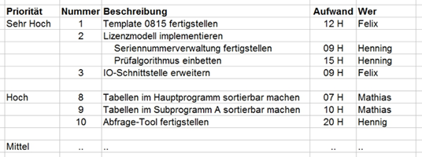
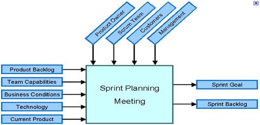
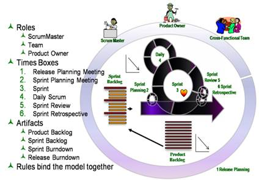

# Agile Softwareentwicklung / Scrum

# 1. Einleitung

Das folgende Video gibt einen ersten Eindruck

http://www.youtube.com/watch?v=XU0llRltyFM

 Die vorliegende Arbeit beschäftigt sich mit einer neuen, innovativen Art der Softwareentwicklung und geht speziell auf eine Unterart davon, dem sogenannten Scrum ein.

Folgend werden die allgemeinen Prinzipien und Werte der **Agilen Softwareentwicklung** präsentiert.

Ausgestattet mit den Grundlagen kann dann auf **Scrum** eingegangen werden. 

Anschließend folgt ein Vergleich mit konventionellen Entwicklungsmethoden, der Vor- und Nachteile dieser neuen Praktik abwägen und bewerten soll.

# 2. Agile Softwareentwicklung

Im Bereich der Softwareentwicklung ist es stets notwendig nach der kostengünstigsten, flexibelsten und gleichzeitig einfachsten Projektorganisationsmethode zu suchen. Herkömmliche Managementsysteme, wie sie in folgender Arbeit noch zur Sprache kommen werden, bieten nicht die erforderliche **Flexibilität, um kundenspezifische Änderungen rasch** und sicher umzusetzen. Agile Software-Managementsysteme hingegen verschaffen dem Entwickler die Möglichkeit gerade auf diese einzugehen, ohne ein Risiko in Bezug auf die Auslieferbarkeit der Software einzugehen.

Die Agile Softwareentwicklung verfolgt das Ziel den Entwicklungsprozess effektiver, schlanker und vor allem flexibler zu gestalten. Dazu wird auf eine Art des **Evolutionären Prototypings** zurückgegriffen. Es wird also ein kleiner Teil des Programms entwickelt, dass die geforderte Grundfunktionalität aufweist und anschließend ausschließlich iterativ-inkrementell an diesem Prototyp gearbeitet und verbessert. Dies bietet erstens den massiven Vorteil

- **zu jeder Zeit über funktionierende Software** zu verfügen und zweitens

- mit **geringem Aufwand auf kundenspezifische Änderung** einzugehen.

 Das Wort Agilität (lat. agilis: flink; beweglich) bezeichnet hierbei also die Möglichkeiten:

- Auf Kundenwünsche, Änderungen und Problem Auslagerungen einzugehen
- Den gesamten Entwicklungsprozess für jedes Projekt individuell zu gestalten
- Eigene Entwicklungsverfahren und –Prinzipien in den Entwicklungsprozess zu   integrieren.

 Trotz erster Ansätze in den 1990er Jahren konnte sich die Agile Softwareentwicklung erst 1999 durch das Werk *„Extreme Programming“* Gehör verschaffen. Kent Beck verfasste dieses Buch in Zusammenarbeit mit anderen Entwicklern und schrieb darin die Grundlagen der späteren Agilen Softwareentwicklung nieder.

 ***Agiles Manifest***
 Im Jahr **2000** versammelten sich führende Vertreter verschiedener, dem Extreme-Programming-Konzept nahes Entwicklungs-Paradigma und gründeten die Agile Alliance. Ein Jahr darauf verfasste diese das Agile Manifest, welches die Grundwerte der Agilen Softwareentwicklung beinhaltet.

> „Wir erschließen bessere Wege, Software zu entwickeln, indem wir es selbst tun und anderen dabei helfen. Durch diese Tätigkeit haben wir diese Werte zu schätzen gelernt:
>
> - **Individuen und Interaktionen**           mehr als Prozesse und Werkzeuge
> - **Funktionierende Software**                 mehr als umfassende Dokumentation
> - **Zusammenarbeit mit dem Kunden**  mehr als Vertragsverhandlung
> - **Reagieren auf Veränderung**               mehr als das Befolgen eines Plans
>
> Das heißt, obwohl wir die Werte auf der rechten Seite wichtig finden, schätzen wir die Werte auf der linken Seite höher ein.“ (Agile Alliance)

 Das Manifest stellt wie bereits zuvor erwähnt das Fundament der Agilen Softwareentwicklung dar. Basierend auf diesen Grundlagen werden die sogenannten Agilen Werte formuliert, die wiederum die Grundlage Agiler Prinzipien bilden, usw.

# 3. Scrum

Scrum wurde erstmals 1986 von Nonaka und Takeuchi in einem Harvard Business Review (The New Product Development Game) erwähnt und später von Ken Schwaber, Jeff Sutherland und Mike Beedle ausgebaut und etabliert.

Es setzt speziell auf **ITERATIV - INKREMENTIELLE Entwicklung** und bietet somit zu jeder Zeit ausführbare Software (*Prototyping*).

Ein Scrum-Team besteht idealerweise aus 7±2 Personen, die wiederum verschiedene *Rollen* bekleiden.

## 3.1. Anforderungen

Sie dienen einerseits zur Beschreibung der Ziele und andererseits als Rahmen diese Ziele umzusetzen.

### 3.1.1. User Stories

- vom **Kunden formuliert**e Anforderungen (Funktionen)

- vom **Product Owner** **erfasst** (ins **Product-Backlog**) und **priorisiert**

*User Stories* sind einfache, vom **Kunden** formulierte **Anforderungen an das System**. Sie werden vom **Product-Owner** verfasst und **priorisiert**.

So werden zum Beispiel *User Stories*, die für die Grundfunktionalität der Software unverzichtbar sind, am höchsten priorisiert und damit als erstes bearbeitet. Sind sie angemessen priorisiert werden sie in das **Product-Backlog** aufgenommen.

 *User Stories* werden während der Realisierung wiederum in einzelne sogenannte *Tasks* zerlegt. Dies dient ausschließlich zur Trennung der für die Umsetzung der *User Story* notwendigen Aufgaben, um gezielter darauf eingehen zu können. 

http://apropos-media.net/2010/11/03/der-einfache-weg-zu-guten-user-stories/

### 3.1.2. Product-Backlog

Wie bereits zuvor erwähnt werden die User Stories in *das Product-Backlog* gelegt. 

Das *Product-Backlog* ist eine **dynamische Sammlung von Anforderungen (=User Stories)** und dient als Grundlage der gesamten Entwicklung. Es kann während des Entwicklungsprozesses erweitert, verändert oder komprimiert werden, jedoch nur vom **Product Owner**.

Ein Product-Backlog http://winfwiki.wi-fom.de/index.php/Distributed_Scrums_-_Analyse_des_Softwaretools_Agilo

### 3.1.3. Sprint-Backlog

Das *Sprint-Backlog* **ist eine Zwischenlagerung der User Stories**, welche beim *Sprint* umgesetzt werden sollen.

 

Es werden so viele hoch priorisierte User Stories in diesen Backlog aufgenommen, wie der **Project-Owner und das Team** für realisierbar halten.

Der Umfang des *Sprint-Backlog*s wird während des **Sprint Planing Meeting** vom *Project-Owner* und dem *Team* festgelegt.
Wurden zu viele *User Stories* ausgewählt und konnten nicht umgesetzt werden, so werden sie zurück in das *Product-Backlog* gelegt, neu priorisiert und beim nächsten *Sprint* berücksichtigt.

​       http://winfwiki.wi-fom.de/index.php/Distributed_Scrums_-_Analyse_des_Softwaretools_Agilo

### 3.1.4. Sprint

Der Sprint ist das zentrale Element des Scrum. Er bildet einen geschützten Raum innerhalb des Projektes, in dem sich das **Team selbst organisiert den umzusetzenden User-Stories** widmet.

 Dafür wird gewöhnlich ein Zeitraum von etwa einem **Monat** vorgesehen, in dem Tag für Tag Ergebnisse besprochen und neue Ziele gesetzt werden, im sogenannten **Daily-Scrum**. Zur permanenten Darstellung des Sprint-Fortschritts werden bestimmte Tools wie zum Beispiel ein White Board verwendet.

### 3.1.5. White Board

Das White Board ist eine Weiterentwicklung der herkömmlichen Schultafel und kann mit speziellen Filz-Markern beschrieben werden.

In *Scrum* wird das White Board dazu verwendet **Backlogs zu verwalten** und User Stories bestimmten *Stati* zu unterstellen. (to do, in progress, done, usw.)

### 3.1.6. Impediment Backlog

Dieses *Backlog* kann als **Liste von Hindernissen** betrachtet werden, die während der Entwicklung auftreten. Als Hindernis gilt beispielsweise ein äußerer Umstand, der dem Team das Entwickeln erschwert oder sogar unmöglich macht. Es ist die Aufgabe des **Scrum-Masters** diese zu beseitigen und somit für optimale Arbeitsbedingungen zu sorgen.

### 3.1.7. Artefakt

Als *Artefakt* wird die **entwickelte Software** selbst bezeichnet, da der auslieferbare Code das Einzige darstellt auf das nicht verzichtet werden kann. Es besteht seit dem ersten *Sprint* und wird danach nicht mehr neu verfasst, sondern ausschließlich iterativ-inkrementell erweitert. So wird sichergestellt, dass zu jeder Zeit funktionierende Software vorliegt und sie bei Bedarf zur Abnahme bereitsteht.

## 3.2. Rollen

Um den Agilen Werten gerecht zu werden und somit die Flexibilität in den Vordergrund zu stellen, werden im *Scrum-Team* gewisse *Rollen* vereinbart. Sie ermöglichen eine strikte Trennung der Verantwortlichkeiten und tragen so wiederum zur Agilität bei.

### 3.2.1. Kunde

Natürlich spielt der Kunde bei jedem Projekt eine äußerst wichtige Rolle. In der Agilen Softwareentwicklung dient dieser jedoch **nicht nur als Auftraggeber**, sondern greift auch während der Entwicklung stets in den Entwicklungsprozess ein.

So nimmt er beispielsweise jedes Mal **nach Beendigung eines Sprints** am sogenannten **Review** teil, um die **umgesetzten Ziele zu besprechen** und die neue Version des **Projekts abzunehmen**.

 Als Kunde wird in Scrum allerdings nicht nur der Auftraggeber selbst, sondern all jene bezeichnet, welche später etwas mit dem entwickelten Projekt zu tun haben oder einfach nur Interesse am Projekt zeigen (Stakeholder).

### 3.2.2.     Product Owner

Der Product-Owner bildet die **Schnittstelle zwischen dem Kunden und dem Scrum-Team**.

 Er legt die gemeinsamen Ziele fest, meist in Form von **User Stories, priorisiert** diese (aufgrund der Firmenphilosophie der auftraggebenden Firma) und legt sie **im Product-Backlog** ab.

 Der Product-Owner ist Dreh- und Angelpunkt des Projektes, **alles geht über ihn**. Er fällt wichtige Entscheidungen, verwaltet das Product-Backlog und ist **für den Erfolg des Projektes verantwortlich**.

### 3.2.3. Scrum-Master

|  |  |
| --------------------------------------- | ---------------------------------------- |
|                                         |                                          |

http://3back.com/scrum/certified-scrummaster-training/
http://borisgloger.com/2009/04/24/3-secrets-of-a-good-scrummaster/

 Der Scrum-Master ist **für die Umsetzung von Scrum verantwortlich**. Dabei liegt seine Aufgabe erstens darin, darauf zu achten, dass die Scrum zugrunde liegenden Regeln und Prinzipien **eingehalten** werden, und zweitens für optimale **Arbeitsbedingungen** zu sorgen und Hindernisse, die sich dem Team in den Weg stellen, zu beseitigen.

 Er coacht das Team, ohne ihnen gewisse Arbeitsweisen oder Aufgaben aufzuzwingen.

 „Ein Scrum-Master führt, indem er anderen ihre Verantwortung nicht abnimmt, sondern darauf achtet, dass die anderen Rollen ihre Verantwortung annehmen und ihrer gerecht werden.“ (Wirdemann, 2011)

### 3.2.4.     Team

Das Team hat die Aufgabe die vorliegenden **User Stories erfolgreich umzusetzen**.

Es organisiert sich im geschützten Raum des Sprints eigenständig und **teilt sich somit Aufgaben autark zu**.

Das Funktionieren von Scrum beruht auf der **Eigenverantwortung** der Teammitglieder. Ohne das Übernehmen von Verantwortung kann es nicht umgesetzt werden!

http://www.holisticon.de/cms/AgileGlossar/Startseite

## 3.3. Zyklus

Da *Scrum* ein Agiler Prozess/Framework ist, bietet es einen Rahmen, der gewisse Vorgehensweisen und Methoden bereitstellt, um die Agilität der Softwareentwicklung zu wahren.

 

Abbildung : Scrum Zyklus

### 3.3.1. Sprint-Planung

Jeder *Sprint* beginnt mit einem eintägigen *Sprint-Planning-Meeting*. In diesem 2-teiligen Meeting präsentiert der *Project-Owner* all jene *User Stories*, die er im nächsten *Sprint* bearbeitet sehen möchte, das sogenannte *Selected Backlog,* und damit ein *Sprint Ziel*, welches es zu erreichen gilt. Als nächstes wird mit dem Entwicklungsteam besprochen, welche und wie viele der vorliegenden *User Stories* es für realisierbar und sinnvoll hält. Im zweiten Teil des *Sprint-Planning-Meetings* schlägt das Thema von „Was wird bearbeitet“ in „Wie werden die Ziele realisiert“ um. Ist eine Übereinkunft zwischen dem *Team* und dem *Project-Owner* getroffen, so wird das nun komprimierte *Selected Backlog* zum *Sprint-Backlog.* Mit Abschluss der *Sprint-Planung* steht also ein *Sprint Ziel* und ein *Sprint-Backlog* fest.

### 3.3.2. Sprint-Durchführung

Während der *Sprint-Durchführung* wird mit Umsetzung der ausgewählten *User Stories* im *Sprint-Backlog* auf das *Sprint Ziel* hingearbeitet. Dazu Obwohl die *Sprint-Durchführung* bereits Teil eines Zyklus ist, beinhaltet sie selbst einen kleinen internen Zyklus namens *Daily Scrum*.

### 3.3.3. Daily Scrum

Das *Daily Scrum* ist ein täglich zur selben Zeit stattfindendes, zirka 15-minütiges Meeting, in dem der aktuelle Stand des Projektes besprochen wird:

- Was habe ich seit dem letzten *Daily Scrum* getan?

- Was plane ich, bis zum nächsten *Daily Scrum* zu tun?

- Was hat mich bei der Arbeit behindert (*Impediments*)?

Eine Besonderheit dabei ist, dass die Beteiligten stehen. Dies soll die Runde etwas auflockern und die Konzentration steigern. Der *Scrum-Master* notiert sich die dabei genannten *Impediments*, die er anschließend in seinen *Impediment Backlog* aufnimmt und greift wenn nötig moderierend in das Gespräch ein.

### 3.3.4. Velocity

Die *Velocity* (engl. Geschwindigkeit) bezeichnet jene Geschwindigkeit, die beim Erreichen eines *Sprint Ziels* erzielt wird. Sie wird nach jedem *Sprint* berechnet und als Bezugswert für kommende *Sprint-Planungen* eingesetzt. Jedoch kann eine *Velocity* nur dann aufrechterhalten werden, wenn die Anzahl der Teammitglieder und die Größe der *Sprints* konstant bleiben. Da Feiertage, Schulungen oder Krankenstände diesen Umstand oft erschweren, müssen sie bei der Berechnung der *Velocity* berücksichtigt werden.

### 3.3.5. Überprüfung von Ergebnis und Prozess (REVIEW)

Am Ende eines jeden *Sprints* werden das Ergebnis und der Prozess selbst einer genauen Betrachtung unterzogen. Die Dauer des *Sprints* wird auf keinen Fall verändert. Konnten *User Stories* nicht umgesetzt werden, so werden sie im nächsten *Sprint* berücksichtigt, ist nach der Abarbeitung des *Sprint-Backlogs* noch Zeit übrig, so werden zusätzliche *User* *Stories* behandelt. Beim Besprechen der Ergebnisse in einem sogenannten *Sprint* *Review* ist auch der *Kunde* anwesend. Ihm werden die Ziele des *Sprints* erläutert und die funktionierende Software präsentiert. Die Überprüfung des Prozesses enthüllt Fehler, die bei der Entwicklung gemacht wurden. Nicht etwa Programmierfehler, sondern Fehler im Zeitmanagement, in der Auswahl der Methoden, usw.

### 3.3.6.     Verbesserung und Anpassung (RETROPERSPEKTIVE)

In der Verbesserungs- und Anpassungsphase des *Sprints*, auch *Sprint* *Retroperspektive* genannt, werden Verbesserungsmöglichkeiten diskutiert, die im nächsten *Sprint* mit einbezogen werden. Methoden werden optimiert, Zeitlücken ausgenutzt oder es wird auf *User Stories* verzichtet, um die Auslieferbarkeit nicht zu gefährden. Somit wird die Software im Idealfall schlanker und effektiver.

# 4. Vergleich mit konventionellen Entwicklungsmethoden

Um einen Nutzen aus dieser Arbeit ziehen zu können ist ein Vergleich mit klassischen Vorgehensmodellen wie zum Beispiel dem Wasserfallmodell unausweichlich.

## 4.1. Planung

Der erste Schritt, egal ob konventionelle oder agile Softwareentwicklung, ist immer die Planung der weiteren Vorgehensweise. Doch schon bei der Form der Planung existieren gravierende Unterschiede, wie sie im Folgenden beschrieben werden.

### 4.1.1. Planung bei Klassischen Projektmanagementsystemen

Das Zentrum des Projektes ist der Projektleiter. Er gibt vor zu welchem Zeitpunkt welche Arbeit von wem durchgeführt werden soll und bestimmt Meilensteine an denen gewisse Arbeiten fertiggestellt sein müssen. Die gesamte Projektplanung ist also dezentral zu den Personen, die die Software eigentlich entwickeln. Diese Vorgehensweise setzt Entwickler oft unter argen Zeitdruck, was sich auch auf das Arbeitsklima und die Produktivität auswirkt. Weiters vernachlässigt die sture und teilweise penible zeitliche Auflistung von Aufgaben in der Praxis auftretende Störungen. So kann zum Beispiel ein Problem auftauchen, dass nicht sofort beseitigt werden kann. Dadurch geraten sämtliche Zeitangaben und Meilensteine aus der Planung und der Release-Termin verschiebt sich.

### 4.1.2. Planung bei Scrum

Im Gegensatz zu konventionellen Projektmanagementsystemen folgt die gesamte Planung des Projektes aus dem Zentrum heraus, also durch das *Team*. Dies bewirkt nicht nur den angenehmen Nebeneffekt, dass sich das Team die Zeit selbst einteilen kann und sich folglich eine ungleich lockerere und freundlichere Stimmung breit macht, sondern auch, dass Projektdetails schneller und erfolgreicher intern geregelt werden können und somit die gesamte Arbeit effektiver gestaltet wird. Ein weiterer Vorteil von *Scrum* ist die Art, wie sich das Projektteam dem Endergebnis nähert. Anstatt das gesamte Projekt gleich am Anfang zu planen, wie es bei klassischen Projektmanagementsystemen der Fall ist, zieht *Scrum* seine Flexibilität aus dem iterativ-inkrementellen *Prototyping*. So steht dem Kunden zu jedem Zeitpunkt ein funktionierendes Programm zur Verfügung, welches dann inkrementell fortgeführt wird.

 Durch den sich durch das ganze Projekt ziehenden Abarbeitungszyklus und der dabei mit einbezogenen kundennahen Überarbeitungstaktik kann das *Scrum-Team* zwischen und sogar während des *Sprints* auf Kundenwünsche eingehen und auftretende Probleme entweder in kleinere Teilprobleme aufteilen oder sie quasi umschiffen, da es sich vorher nicht auf eine bestimmte Entwicklungsvariante festnageln lässt.

## 4.2. Durchführung

Während der Durchführung entsteht eine riesige Kluft zwischen dem Verfahrensmodell konventioneller Systeme und dem des Scrum.

### 4.2.1. Durchführung bei klassischen Projektmanagementsystemen

Nun gilt es das Geplante in die Tat umzusetzen. Dazu befolgt jeder Mitarbeiter stur die Richtlinien und Aufträge, die ihm durch den Projektleiter zugewiesen wurden. Verbesserungen, Anpassungen oder Erweiterungen können nun nur schwer oder gar nicht mehr eingebracht werden. Sie können erst mit Abschluss eines neuen Projektvertrages in einem neuen Projekt mit einbezogen werden.

### 4.2.2. Durchführung bei Scrum

Ganz anders ist es mit *Scrum*. Die in Zusammenarbeit mit dem Kunden erarbeiteten User Stories sind im *Product-Backlog* priorisiert und warten auf ihre Abarbeitung. Wurde eine geeignete Anzahl hoch priorisierter *User Stories* in das *Sprint-Backlog* aufgenommen, steht bereits eine erste Grundfunktionalität des Endproduktes fest. Da diese mit dem Kunden abgesprochen ist, ist eine Änderung unwahrscheinlich. Als nächstes kann *Scrum* seinen großen Vorteil gegenüber anderen Entwicklungssystemen ausspielen. Ist erst einmal das Grundgerüst, der Prototyp, nach dem ersten *Sprint* fertiggestellt, wird im Beisein des Kunden die weitere Vorgehensweise besprochen. Hegt der Kunde spezielle Wünsche oder drängt gewisse Funktionen in den Vordergrund, können diese sofort im nächsten *Sprint* beachtet und idealerweise gleich umgesetzt werden. Man sieht also, dass die kundennahe Entwicklung den Effektivwert des Projektes erheblich steigert.

## 4.3. Nach der Durchführung

Nach der Durchführung der geplanten Aufgaben folgt schließlich die Abnahme des Projektes.

### 4.3.1. konventionelle Softwaremanagementsysteme nach der Durchführung

Bei dieser Art der Entwicklung ist das gesamte Projekt mit der Abnahme abgeschlossen. Das fertige Programm enthält im Idealfall alle geplanten Features und läuft fehlerfrei. Doch ist das System, das der Kunde erhält, nicht jenes, das er gerne hätte, sondern das, was er vor sehr langer Zeit für brauchbar hielt. In der Zeit, in der das Projekt realisiert wurde haben sich technologische Standards verändert und weiterentwickelt, Anforderungen haben sich verlagert und die in Auftrag gegebene Software ist, obwohl sie ihren Zweck erfüllt, nicht mehr das Geld wert, das im Vertrag dafür vereinbart wurde.

### 4.3.2. Scrum nach der Durchführung

Ist der Sprint am Ende angelangt, so kann erstmals ein fertiges, funktionierendes Stück Programmcode ausgeliefert werden. Doch dies ist erst der Anfang der Entwicklung. Dem Kunden wird der Prototyp vorgeführt und alle Features, die bis zu diesem Zeitpunkt vorhanden sind, werden vorgestellt. Ein Feedback vom Kunden und allen Beteiligten des Projektes ist die Folge. Daraus leiten sich neue User Stories, Verbesserungsvorschläge und weitere Ideen ab, die das Projekt immer mehr in eine Richtung drängen. Es steht also nicht von Beginn an fest welche Aufgaben und in welchem Ausmaß die Software diese bewältigen soll, sondern es entwickelt sich im Laufe des Entwicklungsprozesses selbst zu der Anwendung, die der Kunde braucht. 

# 5. Zusammenfassung

http://www.stefan-nowaczynski.com/infos/scrum-video/

# 6. Referenzen

- AgileAlliance: Agiles Manifest. Internet: http://agilemanifesto.org/iso/de/ (07.04.2011)

- ScrumFibel: Scrum-Fibel. Internet: http://scrum-fibel.de/

(09.03.2011)

- Scrum-Master: Scrum Master. Internet: [http://scrum-master.de](http://scrum-master.de/)

(05.05.2011)