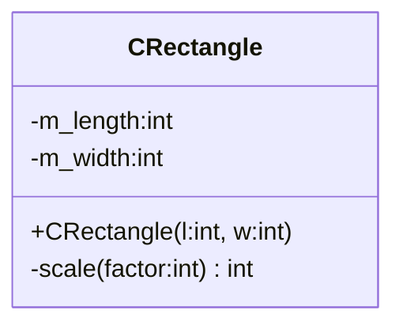
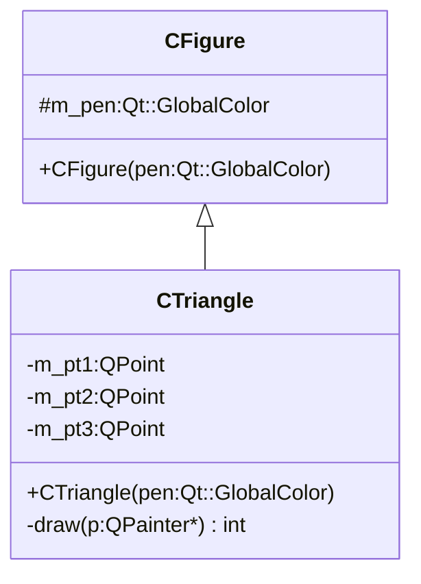
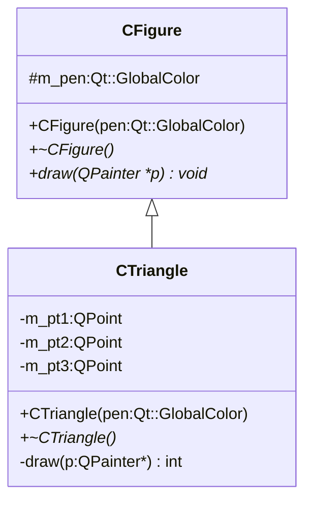
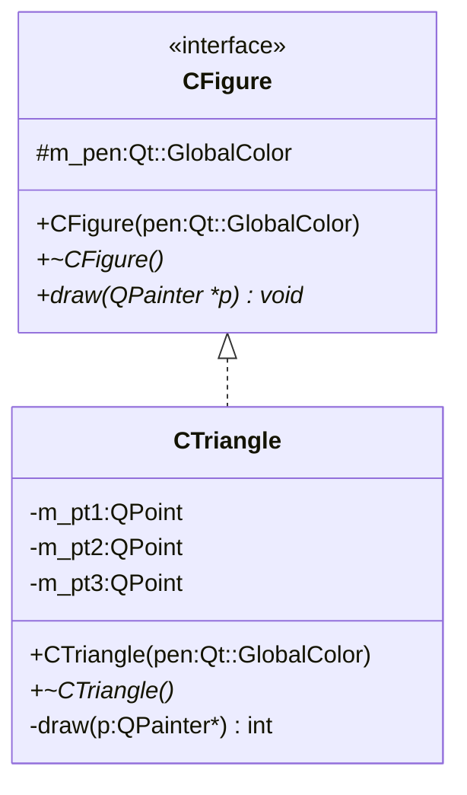
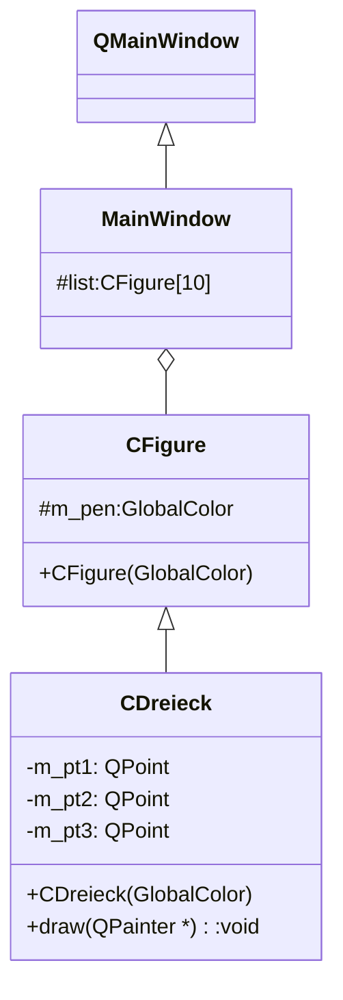
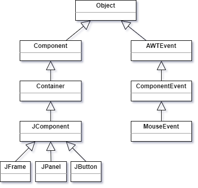
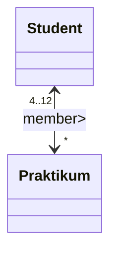
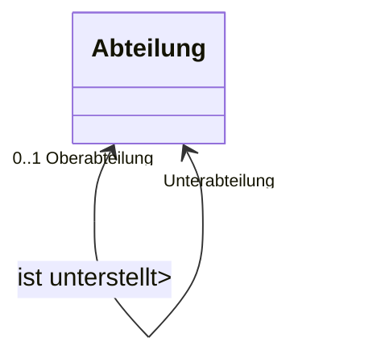
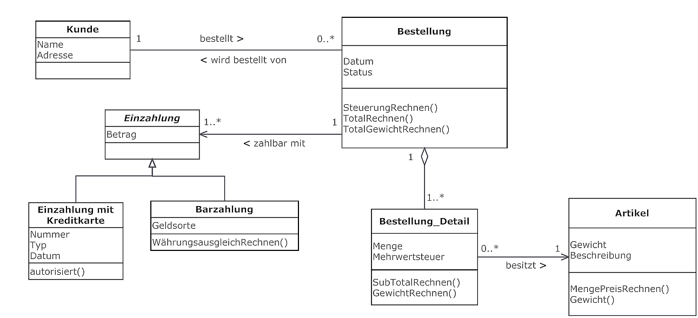

# 4 UML - Übungen

## a) Use-Case

### Use-Case - Autovermietung

 Erstellen Sie den Use-Case: Autovermietung. Berücksichtigen Sie folgende Anwendungsfälle 

-  Beraten, Auskunft
-  Reservieren
-  Mietvertrag abschließen
-  Mietwagen-Übergabe/-Abnahme
-  Mietwagen-Rücknahme/-Rückgabe
-  Rechnung

Auf der Kundenseite gibt es Interessenten, Kunden und Fahrer. Ein Interessent wird automatisch zu einem Kunden, wenn er einen Mietwagen reserviert oder einen Mietvertrag abschließt.  

Auf der Unternehmerseite gibt es Reservierung-, Übergabe- und Rücknahmemitarbeiter.

### Use-Case - Fehler

Finden Sie die Fehler im folgenden Use-Case-Diagramm und korrigieren sie diese. Erstellen Sie das Use-Case-Diagramm neu.


Inverviewer und Personalchef sind nicht Teil der Bewerbung. Wer erhält das Bewerbungsschreiben/Absage/Einladung? Wer sendet die Einladung ... 

### Use-Case - Elektronikbauteile

Erstellen Sie ein Use-Case-Diagramm für den Verkauf von Elektronikbauteilen und definieren Sie selbst die dafür erforderlichen Anwendungsfälle.

Verwenden Sie die Akteure Kunde, Verkäufer, Registrierkassa.

## b) Klassendiagramme

### Figuren - Einfache CRectangle-Klasse

CRectangle-Klasse in C++:

```c++
class CRectangle {

public:
	CRechteck(int l, int w);

private:
  int m_length;
  int m_width;
  void scale(int factor);
};
```

Entsprechendes UML:



Nur der Konstruktor ist Public (daher +) die anderen Attribute und Methoden sind Private (daher -). Der Detailierungsgrad ist variabel, hier wird für den Konstruktor kein Name für die Parameter angegeben, für die Funktion *scale* allerdings schon (*factor*). Der Konstruktor wird wie eine statische Funktion beschrieben (unterstrichen).

### Figuren - CTriangle als abgeleitete Klasse

Klasse CFigur und abgeleitete Klasse CTriangle in C++:

```c++
class CFigur {
public:
    CFigur(Qt::GlobalColor pen);
protected:
    Qt::GlobalColor m_pen;
};

class CTriangle : public CFigur {
public:
    CDreieck(Qt::GlobalColor pen);
    void draw(QPainter *p);
private:
    QPoint m_pt1;
    QPoint m_pt2;
    QPoint m_pt3;
};
```

Entsprechendes UML:



Der Figur-Member *m_pen* ist Protected (daher #).

### Figuren - Virtuelle Funktionen, Interfaces, Abstrakte Klasse

Dreieck-Klasse in C++:

```c++
class CFigur {
public:
    CFigur(Qt::GlobalColor pen);
    virtual ~CFigur();
    virtual void draw(QPainter *p);    // *******************
protected:
    Qt::GlobalColor m_pen;
};

class CDreieck : public CFigur {
public:
    CDreieck(Qt::GlobalColor pen);
    virtual ~CDreieck();
    void draw(QPainter *p);
private:
    QPoint m_pt1;
    QPoint m_pt2;
    QPoint m_pt3;
};
```

Entsprechendes UML:



Hier sind die virtuellen Funktionen kursiv geschrieben (manchmal werden sie zur deutlichen Kennzeichnung mit vorangehenden {virtual} gekennzeichnet).

Für den dargestellten Code, wenn die ***-Zeile angepasst wird:

```c++
virtual void draw(QPainter *p) = 0;
```

Damit ist in *CFigure* eine Implementierung der Funktion *draw* nicht notwendig und die Klasse ist abstrakt. Das UML-Diagramm sieht dann so aus:



(Streng genommen ist eine Klasse nur dann ein Interface, wenn sie ausschließlich virtuelle Funktionen beinhaltet).

### Figuren - Aggregation

In einem Hauptfenster werden die Zeichenobjekte in einer Liste abgelegt:

```c++
class MainWindow : public QMainWindow{
  ...
  Figur *list[10];
  ...
}
```





Hier ist *MainWindow* von *QMainWindow* abgeleitet. *CFigure* ist Teil von *MainWindow* (Aggregation). Grundsätzlich kann *CFigure* auch ohne diese Beziehung sein, daher keine Komposition. In der obigen Implementierung ist *list* eine Sammlung von Zeigern auf *CFigure*. Daher sind die *CFigure*-Objekte eigentlich außerhalb der Klasse und mittels Zeiger in die Klasse verbunden (daher Aggregation).

Wenn eine *CFigur* wie hier eingebunden wird:

```c++
...
CFigur f;
...
```

dann kann argumentiert werden dass dieses Element f nur innerhalb der aktuellen Klasse existiert und damit eine Komposition vorliegt.

### Java-Bibliothek

Folgendes UML-Klassendiagramm beschreibt eine Java-Klassenhierarchie:

  

Was sagt Ihnen diese Abbildung? Sämtliche Klassen leiten sich von *Object* ab:

- sie bieten dessen Methoden und Attribute
- alle abgeleiteten Klassen können polymorph zusammengefasst werden

### Assoziationen I

Vervollständigen Sie die Begriffe im Klassendiagramm:


Lösung:


### Assoziationen II

Erklären Sie die beiden Klassendiagramme:






### Klassendiagramme I

Versuchen Sie die folgenden Beispiele in UML Diagrammen aufzuzeichnen:

1. **Assoziation, Grafikprogramm**
   - Ein **Grafikprogramm** wird von einem oder keinem **Benutzer** benutzt.
   - Genau ein **Benutzer** verwendet ein **Grafikprogramm**.

2. **Aggregation, Computer**
   - Ein **Computer** besteht aus
     - 0 oder beliebig vielen **HD-Kontrollern**,
     - mindestens aus einem **Prozessor**, maximal 2 Prozessoren.
   - Ein **HD-Kontroller** ist maximal in einem **Computer** installiert.
   - Ein **Prozessor** wird in maximal einem **Computer** installiert.

3. **Komposition, Bankkonto**
   - Ein **Bankkonto** besteht aus einem oder beliebigen **Buchungssätzen**.
   - Ein **Buchungssatz** gehört genau zu 1 **Konto**.

4. **Klassendiagramm, Textverarbeitung**

   - Das Textverarbeitungssystem erlaubt es Peter Müller und anderen Benutzern Dokumente anzulegen und zu editieren.
   - Ein Dokument kann Text und Bitmap-Grafik enthalten. Text besteht aus Abschnitten, jeder Abschnitt aus Zeichen.
   - Ein Dokument enthält außerdem verschiedene administrative Informationen wie seinen Titel, seinen Autor, den Dateinamen, in dem es abgelegt ist, sowie das Datum der Letzen Änderung.

   Aufgaben:

   1. Welche Objekte/Klassen lassen sich im obigen Problemfall identifizieren?
   2. Welche Beziehungen bestehen zwischen den Klassen? 
      Zeichnen Sie das entsprechende Klassendiagramm in der UML Notation
   3. Welche Attribute hat die Klasse Dokument?
   4. Ergänzen Sie das gezeichnete Klassendiagramm entsprechend.
   
5. **+Klassendiagramm: Verkehrsmittel**

   Gegeben seien folgende Begriffe aus der zu modellierenden Realität:

   PKW, LKW, LKW mit Anhänger, Taxi, Autobus, Containerschiff, Fähre, Floss, Yacht

   **Aufgaben:**
   
   - Identifizieren Sie die Klassen und entwerfen Sie eine Vererbungshierarchie.
   
   - Finden Sie Verallgemeinerungen der Klassen und ergänzen Sie die Vererbungshierarchie. (zuoberst in der Vererbungshierarchie soll nur eine Klasse stehen)
   
   - Teilen Sie Ihre gefundenen Klassen in konkrete und abstrakte Klassen ein. Bezeichnen Sie konkrete Klassen mit "K", abstrakte Klassen mit "A".
   
5. **+Map, Entry, Key, Value**

   Erstellen Sie ein UML Klassendiagramm:

   - Unter einer **Map** versteht man in Java einen Container (Behälter), der sogenannte Schlüssel-Werte-Paare (**Entry**) enthält.  

   - Ein Schlüssel-Werte-Paar (Entry) besitzt einen Schlüssel (Key) und eventuell mehrere Werte (Value). 
   - Der Schlüssel(**Key**) muss eindeutig sein, darf also nur einmal in der Map vorkommen. Das bedeutet der Key darf nur einmal in einem Schlüssel-Werte-Paar enthalten sein (Multiplizität 1–1). Anhand seines Schlüssels kann somit ein Wert-Objekt eindeutig in der Map gefunden werden.  
   - Das Schlüssel-Werte-Paar kann jeweils nur einen Schlüssel haben. Es kann aber sein das dem Schlüssel-Werte-Paar mehrere Werte zugeordnet sind.

   - Ein Eintrag (Entry) gehört nur zu einer Map. Wird die Map zerstört, sind alle Einträge ebenfalls entsorgt. (Komposition)
     Wird das Schlüssel-Werte-Paar (Entry) gelöscht, bleiben die eigentlichen Schlüssel (Key) und Werte (Values) – Objekte erhalten (Aggregation)

   **Lösung:**

   

   - Unter einer **Map** versteht man in Java einen Container (Behälter), der sogenannte Schlüssel-Werte-Paare (**Entry**) enthält.  

   - Ein Schlüssel-Werte-Paar (Entry) besitzt einen Schlüssel (Key) und evtl. mehrere Werte (Value). 
   - Der Schlüssel(**Key**) muss eindeutig sein, darf also nur einmal in der Map vorkommen. Das bedeutet der Key darf nur einmal in einem Schlüssel-Werte-Paar enthalten sein (Multiplizität 1–1). Anhand seines Schlüssels kann somit ein Wert-Objekt eindeutig in der Map gefunden werden.  
   - Das Schlüssel-Werte-Paar kann jeweils nur einen Schlüssel haben. Es kann aber sein das dem Schlüssel-Werte-Paar mehrere Werte zugeordnet sind. 

   - Ein Eintrag (Entry) gehört nur zu einer Map. Wird die Map zerstört, sind alle Einträge ebenfalls entsorgt. (Komposition)
     Wird das Schlüssel-Werte-Paar (Entry) gelöscht, bleiben die eigentlichen Schlüssel (Key) und Werte (Values) – Objekte erhalten (Aggregation)

### Klassendiagramme II

Beurteilen Sie, ob die folgenden Diagramme richtig sind und korrigieren sie diese sofern sie nicht richtig sind:


------


------


------


------


### Bestellung

Gegeben ist das folgende UML-Klassendiagramm.



Bestimmen Sie, ob die folgenden Aussagen zum Klassendiagramm richtig oder falsch sind.

1. Es kann im System Kunden geben, welche nie eine Bestellung durchgeführt haben.

2. Die Klasse Einzahlung ist die Oberklasse der Klasse Bestellung.
3. Jedes Objekt der Klasse Bestellung_Detail besitzt genau einen Artikel.
4. Alle Einzahlungen mit Kreditkarte haben einen Betrag.
5. Es ist möglich, dass ein Artikel keine Assoziation mit einem Bestellung_Detail besitzt.
6. Jedes Bestellung_Detail, das Teil einer Bestellung ist, hat seinen eigenen Status und sein eigenes Datum.

### Kunde

In der Datenbankentwicklung werden oftmals Entity-Relationship-Diagramme (ERD) eingesetzt. Vermehrt geht man aber dazu über zur Modellierung von Systemen UML-Klassendiagramme einzusetzen.  

1. Erklären Sie, warum dies der Fall ist.
2. In der folgenden Darstellung ist ein Erst-Entwurf eines Klassendiagrammes gegeben. Nehmen Sie dazu Stellung und versuchen Sie eine verbesserte Version zu erstellen.
3. Wie kann dieses verbesserte Modell dann in einem relationalem Datenbanksystem gespeichert werden?


### Bibliothek

Eine **Bibliothek** besitzt **Bücher** und **Zeitschriften**, die an **Studierende** ausgeliehen werden.
Um die Ausleihfrist zu überprüfen wird notiert, wann etwas ausgeliehen wird.

**Aufgaben:**

1. Modellieren Sie diesen Sachverhalt möglichst genau in einem Klassendiagramm.
2. Welche wichtigen Punkte fehlen in der obigen Beschreibung?

### Videoverleih

Es liegt folgender Projektauftrag für die Entwicklung eines Softwaresystems vor:
**Projektauftrag**
Es soll ein Softwaresystem entwickelt werden, um die Geschäftsabläufe eines Videoverleihs zu
unterstützen. Das System soll die relevanten Informationen über Videos, Kunden und die
Ausleihe von Videos an Kunden verwalten sowie Rechnung stellen.
**Problem Beschreibung / Anforderungen**
Folgende Informationen über die Geschäftsabläufe des Videoverleihs beziehungsweise Anforderungen an
das Softwaresystem liegen vor:

- Von **Kunden** sind Namen und Adressen zu speichern. Sie werden bei der ersten Ausleihe
  erfasst.
- Der Videoverleih hat von einem **Titel** eine oder mehrere **Videokassetten** auf Lager.
- Für jeden Titel soll der Name des Titels (zum Beispiel „Mission Impossible 2“) und ein
  Ausleihpreis pro Tag gespeichert werden.
- Jede Videokassette wird durch einen Barcode identifiziert.
- Bei einer **Ausleihe** kann ein Kunde eine oder mehrere Videokassetten mitnehmen. Er muss
  angeben, ob er bar bezahlen will oder mit Kreditkarte. Bei **Barzahlung** wird eine Kaution
  erhoben, die dann bei der Schlussabrechnung einer Ausleihe verrechnet wird. Bei einer
  **Kreditkartenzahlung** muss der Kunde nur seine Kreditkartennummer angeben.
- Der Kunde kann die zu einer Ausleihe gehörende Videokassette einzeln (an verschiedenen
  Tagen) zurückbringen. Es wird das Rückgabedatum notiert. Dann steht die Videokassette
  wieder für andere Ausleihen zur Verfügung.
- Die Schlussabrechnung für eine Ausleihe erfolgt, wenn die letzte zum Verleih gehörende
  Videokassette zurückgebracht wird.
- Will ein Kunde ein Video ausleihen, von dem gerade keine Kassette verfügbar ist, so kann er
  eine Reservation tätigen. Es wird das Reservationsdatum notiert.

**Aufgabe**

- Erstellen Sie das Modell (Problem-Domain) für ein Softwaresystem, das die Geschäftsabläufe
  des Videoverleihs unterstützen soll. Beachten Sie dabei folgende Hinweise:
- Es soll nur ein Klassendiagramm erstellt werden.
- Der Videoverleih ist das ganze System und wird nicht als Klasse dargestellt.
- Modellieren Sie nur die im Abschnitt Problem-Beschreibung/Anforderungen verwendeten
  Angaben und halten Sie sich möglichst an die dort verwendeten Bezeichnungen.
- Keine impliziten Methoden angeben.

### Klassendiagramm - PacMan

Es soll nur ein Klassendiagramm erstellt werden.

**Beschreibung:**

-  PacMan lässt sich mittels Tastatur steuern.
-  Er bewegt sich nur, wenn es im Labyrinth möglich ist.
-  Trifft er dabei auf einen Punkt, so erhöht sich sein Punktestand um 1.
-  Trifft er auf einen dicken Punkt, so erhöht sich sein Punktestand um 10 Punkte. Außerdem wird er für 20 Takte unverwundbar.
-  Trifft er auf einen Geist und ist verwundbar, so wird er gefressen und er hat ein Leben weniger. Ist er jedoch unverwundbar, so stirbt der Geist und der Punktestand erhöht sich um 100 Punkte.
-  PacMan bewegt sich gleich schnell wie die Geister
-  Die Geister verfolgen PacMan, solange er verwundbar ist und fliehen vor ihm, wenn er unverwundbar ist.
-  Die Geister können sich nur innerhalb des Labyrinth bewegen.
-  Das Spiel endet, wenn alle Punkte eingesammelt sind oder PacMan kein Leben mehr hat.
-  Die erreichte Punktezahl wird ausgegeben.
-  Am Ende des Spiels wird der Gewinner angegeben.