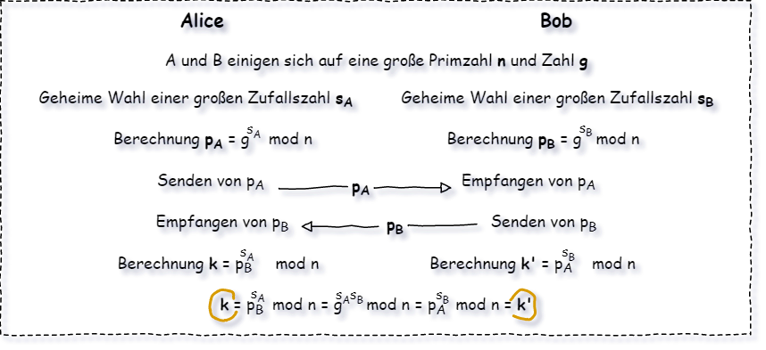
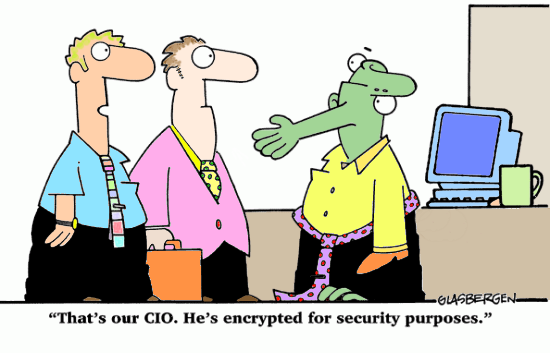
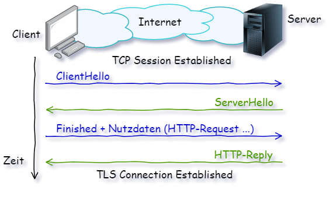

# 1 Kryptographie

## Allgemein

Computer und Netzwerksicherheit gewinnen immer größere Bedeutung. Um eine sichere Kommunikation über Netzwerke zu gewährleisten, müssen folgende Aspekte erfüllt sein:

- *Vertraulichkeit*: Sicherheit gegen unerlaubtes Abhören
- *Integrität*: Schutz gegen partieller Veränderung von übertragener Information
- *Authentizität*: Prüfung ob Jemand ist der er vorgibt zu sein (Echtheit)
- *Autorisierung*: Steuerung der Gewährung von Zugriffen auf Informationen oder Diensten
- *Verbindlichkeit*: Ein getätigte Aktion kann nicht abgestritten werden
- *Verfügbarkeit*: Informationen sind nur dort und dann zugänglich, wenn benötigt

Ein Kommunikationsteilnehmer (Alice) möchte mit einem Zweiten (Bob) kommunizieren. Es soll ein **Klartext** übertragen werden, dazu wird dieser Klartext verschlüsselt in einen **Geheimtext** (Chiffre-Text, Chiffrat), dann über einen unsicheren Übertragungsweg (Internet, Telefon, Brief) übertragen und vom Empfänger in den ursprünglichen Klartext entschlüsselt. Unter **Kryptographie** wird die Wissenschaft, die sich mit dem Thema der Verschlüsselung beschäftigt bezeichnet.

### Transposition und Substitution

In der Kryptographie wird zwischen zwei Verfahren unterschieden:

- Transposition: die Zeichen bleiben wie sie sind, sie werden im Text in ihrer Position verschoben
- Substitution: ein Zeichen wird durch ein Anderes ersetzt

### Symmetrische Verfahren

Als symmetrisch wird eine Verschlüsselung bezeichnet, wenn für die Ver- und Entschlüsselung der gleiche Schlüssel verwendet wird. 

Schlüsseltauschproblem: wenn mittels symmetrischer Verschlüsselung gearbeitet wird, dann muss der Sender den Schlüssel, der zum Verschlüsseln verwendet wird, an dem Empfänger übertragen. Wenn kein sicherer Übertragungsweg existiert, dann kann der Schlüssel von einem Angreifer kopiert werden.

Für beschreibende Beispiele werden häufig Alice und Bob als kommunizierende Teilnehmer verwendet (A und B). Als Angreifer kommt üblich Mallory (Malicious oder Man-in-the-Middle) oder Eve (nur lauschend) zum Einsatz. Für die Authentifikation Peggy (Prover - der zu Überprüfende) und Victor (Verifier - der Prüfende). Eine dritte, vertrauenswürdige Instanz ist Trent (Trusted Entity). Wird ein dritter Kommunikationsteilnehmer benötigt, dann ist das Carol (C).

Diese Verfahren können wiederum in Zeichen, Strom- und Blockchiffre eingeteilt werden.

- Bei der zeichenorientierten Chiffre wird jedes Zeichen anhand einer festen Regel durch ein anderes Zeichen ersetzt (Caesar ...).
- bei der blockorientierten Chiffre werden Gruppen von Zeichen (Blöcke) mit jeweils dem gleichen Schlüssel substituiert oder transpositioniert.
- In der Stromchiffre wird eine Funktion auf den Strom der Zeichen des Textes mit einem Schlüsselstrom verrechnet. Im extremsten Fall ist der Schlüsselstrom länger als der Textstrom (One-Time-Pad).
  Anwendung VoIP ...

### Asymmetrische Verfahren

Im Gegensatz zur symmetrischen Verschlüsselung werden hier zwei verschiedene Schlüssel verwendet. Einer zum Verschlüsseln und einer zum Entschlüsseln. Dadurch kann jemand eine Nachricht verschlüsseln, die nur derjenige entschlüsseln kann, der den passenden zweiten Schlüssel besitzt. Häufig wird der Schlüssel zum Verschlüsseln öffentlich zur Verfügung gestellt, der passende zweite Schlüssel wir privat behalten. Dadurch werden diese Verfahren auch **Public-Key**-Verfahren bezeichnet.

Diese Verfahren beruhen auf mathematische Funktionen die in eine Richtung mit relativ geringen Aufwand lösbar sind, in die umgekehrte Richtung allerdings nur mit erheblichem Aufwand gelöst werden können.

Eine Schwäche der asymmetrischen Verfahren ist die fehlende Zuordenbarkeit eines öffentlichen Schlüssels zu einer bestimmten Person. Dadurch kann eine Kommunikation durch einen **Man in the Middle** manipuliert werden.

Ein Nachweis kann erfolgen:

- Übertragen des öffentlichen Schlüssels über ein sicheres Medium. In Unternehmen ist es üblich dass diese Schlüssel mittels Brief übergeben werden, weiters kann Fax oder Telefon funktionieren.
- Mittels Zertifizierungsinstanzen (***C*ertification *A*uthorities - CA, auch *Trust-Center***). Diese Instanzen stellen auf Wunsch (Bezahlung) etwa Zertifikate zur Verfügung. Diese Abstimmung erfolgt üblicherweise im Hintergrund, nur wenn ein Zertifikat nicht hinterlegt ist wird mittels Meldung gewarnt.
- Durch die Bestätigung eines weiteren, bekannten und zertifizierten Partner (wird für **PGP** verwendet)

### Hash-Funktionen

Hash-Funktionen berechnen aus einer Zeichenfolge beliebiger Größe eine Zeichenfolge mit definierter Größe (auch für **MAC - Message Authentification Code**). Für die Hash-Funktion muss gelten:

- eindeutig: die gleiche Zeichenfolge muss den gleichen Hash liefern
- einfach berechenbar (geringer Rechenaufwand)
- inverse Funktion sehr schwer berechenbar (nicht möglich / mit sehr viel Aufwand)
- die Wahrscheinlichkeit dass zwei Ausgangszeichenfolgen einen gleichen Hash liefern muss möglichst gering sein. Hash Werte sind oft deutlich kürzer als die Ausgangszeichenfolge, dann kann das nicht stimmen. Dann darf nicht abschätzbar sein, wie die Ausgangszeichenfolge verändert werden muss um einen bestimmten Hash zu bekommen.

Hash Funktionen werden oft verwendet um sie an Stelle von Passwörtern abzulegen. Dadurch ist das Passwort nicht bekannt und nur jemand mit dem echten Passwort kommt mit dessen Hash durch.

### Hybride Verfahren

- Nachteil symmetrischer Verfahren: Schlüsselaustausch ist aufwändig

- Nachteil asymmetrischer Verfahren: Ver-/Entschlüsselung rechenintensiv

Lösung: mittels asymmetrischem Verfahren wird ein symmetrischer Schlüssel (kleine Datenmenge) ausgetauscht, mit diesem wird die große Datenmenge symmetrisch verschlüsselt.

### Tunneln

Unter Tunneln wird das mehrfache Verpacken von Paketen verstanden. Beispielhaft kann ein IPv6-Paket in ein IPv4-Paket verpackt werden (IP/IP Tunneling).

Das kann auch abschnittweise erfolgen. Für bestimmte Abschnitte der Übertragung wird das Paket in ein Zweites verpackt.

### Angriffe

- Abhören: abgehört kann auch werden, wenn verschlüsselt wird, dabei wird der Datenverkehr nicht manipuliert.
- Man in the Middle: dabei wird der Datenverkehr manipuliert. *Mallory* gibt sich *Alice* gegenüber als *Bob* aus und umgekehrt. Wenn *Mallory* die Pakete von den beiden Partnern annimmt mit den Schlüsseln des jeweils anderen verschlüsselt können diese vom Angriff nichts bemerken.
- Replay: es werden abgehörte Pakete noch einmal gesendet. Eventuell mit leichten Änderungen. Erkannt werden kann das evtl. durch wiederholte Sequenznummern (TCP ...).
- Brute Force: Angriff mit *roher Gewalt*. Beispielhaft werden Rechner mit einer derartig großen Zahl von Anfragen überschwemmt, dass er für die eigentliche Aufgabe nicht mehr zur Verfügung steht (**Denial-of-Service**-Angriff).
- Cyphertext Only: durch die Sammlung einer großen Menge nur an verschlüsselten Daten kann durch statistische Methode etwa eine Verschlüsselung gebrochen werden (üblicherweise viel Aufwand).
- Known Plaintext: durch Beobachtung kann eventuell durch erraten ein vermutlicher Text dem verschlüsselten Text zugeordnet werden. Für das Brechen der Enigma-Verschlüsselung etwa hat sich in gewissen Bereichen gezeigt, dass jede Nachricht mit dem gleichen Gruß beendet wurde. Wenn die Nachricht sehr kurz war, war die Wahrscheinlichkeit sehr hoch, dass *KEINEBESONDERENVORKOMMNISSE* übertragen wurde.

- Chosen Plaintext: es gibt Fälle, in welchen der Angreifer den Text der Verschlüsselt wird selbst bestimmen. Durch eine geeignete Wahl des Textes kann das Brechen des Codes ebenfalls unterstützt werden. Auch hierfür gibt es Beispiele aus dem 2. Weltkrieg, so wurden gezielt Bojen ausgeschaltet um durch die verschlüsselt übertragene Meldung auf den Tagesschlüssel schließen zu können.

## Symmetrische Kryptographie

Verschlüsseln von Botschaften hat eine lange Geschichte, schon zu Zeiten von Julius Caesar war es gewünscht dass mittels Boten übermittelte Nachrichten nur vom Empfänger gelesen werden sollen.

>  Symmetrischen wird ein Verfahren bezeichnet wenn die Verschlüsselung und die Entschlüsselung den gleichen Schlüssel verwenden.

### Transposition

> Als Transposition werden die Zeichen des Klartextes umsortiert, also ihre Position verändert.

Beispiel: Verschlüsselung der Botschaft *EIN WIRKLICH VERWIRRENDER GARTENZAUN* durch Verschieben jedes zweiten Zeichens:

```
E  N  I  K  I  H  E  W  R  E  D  R  A  T  N  A  N
 I  W  R  L  C  V  R  I  R  N  E  G  R  E  Z  U
 
ENIKIHEWREDRATNAN IWRLCVRIRNEGREZU
```

###  Substitution

> Substitution ist das Ersetzen eines Klartext-Zeichens durch ein anderes Zeichen.

Zu dieser Methode gehören (unter vielen Anderen):

#### Verschiebende Chiffre

Julius Caesar wird zugeschrieben, er habe geheime Nachrichten verschlüsselt, indem er jedem Buchstaben im Alphabet um drei Positionen verschoben hat. So wird aus *a* -> *d* oder aus *g* -> *j*.

Beispielhaft aus *CAESAR* wird *FDHVDU*.

> Verschiebe-Chiffre: jeder Buchstabe wird um eine konstante Spanne verschoben, zur Dekodierung wird um die gleich große Spanne negativ verschoben.
>
> Nachteil: nur 26 mögliche Schlüssel, durch Probieren sehr überschaubarer Entschlüsselungs-Aufwand.

Mathematisch: z -> (z + k) mod 26 (Klartext-Zeichen wird auf verschobenes Zeichen abgebildet und auf 26 begrenzt)

#### Multiplikative Chiffre

Verschiebende Chiffre sind sehr einfach zu entschlüsseln. Durch Probieren alleine (Brute Force) können die 26 möglichen Lösungen betrachtet und sehr schnell bewertet werden. Durch die sehr deutliche Häufigkeitsverteilung einzelner Zeichen können derartige Chiffren sehr einfach auch automatisch aufgelöst werden.

Eine Alternative zum Addieren einer Zahl zum Buchstaben-Index (Verschieben) kann das Multiplizieren des Buchstaben-Index mit einer Zahl sein. Das Ergebnis wird Modulo 26 gerechnet um überlaufende Werte in den gültigen Bereich abzubilden. Um alle unterschiedliche Zeichen wiederum auf unterschiedliche Zeichen abzubilden, muss der Multiplikator teilerfremd zur Alphabet-Größe sein: $ggT(Multiplikator, 26) = 1$.

Das Dechiffrieren erfolgt wiederum mit einer Multiplikation des Buchstaben-Index mit dem Inversen des Chiffrier-Multiplikators (ChifMult * DeChifMult % 26 = 1):

| ChifMult   | 1    | 3    | 5    | 7    | 9    | 11   | 15   | 17   | 19   | 21   | 23   | 25   |
| ---------- | ---- | ---- | ---- | ---- | ---- | ---- | ---- | ---- | ---- | ---- | ---- | ---- |
| DeChifMult | 1    | 9    | 21   | 15   | 3    | 19   | 7    | 23   | 11   | 5    | 17   | 25   |

> Multiplikative-Chiffre: der Index eines Buchstaben wird mit einer konstanten Zahl multipliziert um den neuen Index zu ermitteln. Der Multiplikator muss teilerfremd zur Größe des Alphabets sein.
>
> Nachteil: überhaupt nur 12 mögliche Schlüssel.

Mathematisch: z -> (z * t) mod 26  (Klartext-Zeichen wird auf verschobenes Zeichen abgebildet und auf 26 begrenzt)


Diese beiden Chiffren funktionieren als *Substitution*. Sie ersetzen jedes Klartextzeichen durch ein anderes Zeichen. Der Nachteil der Substitution ist, dass in Texten Buchstaben in unterschiedlicher Häufigkeit vorkommen (etwa e im Deutschen sehr häufig). Wenn eine genügende Menge an Geheimtext zur Verfügung steht, kann mittels statistischer Auswertung relativ gut auf den Code geschlossen werden.

> Substituierende Chiffren sind mittels statistischer Methoden relativ einfach zu brechen. 

Je nachdem ob ein Zeichen immer durch das gleiche Zeichen oder durch unterschiedliche Zeichen ersetzt wird, spricht man von monoalphabetischer oder polyalphabetischer Substitution.

### Homophone Chiffre

In den oberen beiden Beispielen wird jedem Klartextzeichen verallgemeinert mittels einer Tabelle ein Geheimtextzeichen zugeordnet. Mit der oben angeführten einfachen Statistik kann ebenso eine Tabelle erstellt werden welches Geheimzeichen welchem Klartextzeichen entspricht.

Um die Dechiffrierung nicht ganz so einfach zu machen, können Klartextzeichen auf mehrere Geheimtextzeichen übersetzt werden (-> polyalphabetische Chiffre). Beispielhaft kommt das Zeichen **e** in deutschen Texten mit einer Häufigkeit von etwa 17 % vor. Werden diesem Buchstaben abwechselnd fünf Geheimtextzeichen zugeordnet, dann kommen diese Zeichen nur mehr mit einer Häufigkeit von 17/5 = 3,4 % vor.

Sind in einem Text alle Buchstaben mit gleicher Häufigkeit verteilt, dann kommt jeder mit 3,8 % (100/26) vor.

Mit dieser Methode kann einfach die Häufigkeit jedes Zeichens im Geheimtext gleich groß gemacht werden. Allerdings kommen in Sprachen weiters Buchstabenpaare ebenfalls in unterschiedlicher Häufigkeit vor, ein **en** wird sicher oft vorkommen, ein **kg** hingegen nicht. Wenn der Text/die Datenmenge nur lange genug ist, werden die Geheimtext-Paare ebenfalls gewisse Häufungen annehmen. So kann mittels statistischer Methoden jede dieser Chiffren gebrochen werden.

### Vigenère Chiffre

Die Zeichen des Klartextes werden wiederum im Alphabet verschoben. Die Größe der Verschiebung hängt von der Position im Text ab. Zum Beispiel wird das erste Klartextzeichen um 1 verschoben, der zweite um 2 und so fort. Gespeichert kann dieser Vorgang durch ein Passwort. Zum Beispiel wird hier der Klartext *hallo* mit dem Passwort *abc* kodiert:

```
hallo		// Klartext
abcab		// Verschiebung erst 0, dann 1, dann 2
hbnlq		// Geheimtext
```

Jedem Buchstaben wird eine Verschiebung zugeordnet, also a -> 0, b -> 1 und so fort. Wenn das Passwort zu kurz ist wird von vorne begonnen.

Wenn genügend Geheimtext zur Verfügung steht, dann sind für diesen Code schon Verfahren bekannt mittels derer die Länge des Schlüssels ermittelt werden kann. Wenn die Schlüssellänge bekannt ist, dann ist das Brechen der Verschlüsselung wiederum einfach: Es werden lediglich die Zeichen im Schlüsselintervall zusammengefasst. Diese Zeichen sind monoalphabetisch codiert. Das kann für jede Stelle im Intervall gemacht werden. 

Absolut sicher ist dieses Verfahren lediglich, wenn die Schlüssellänge die Länge des Klartextes übersteigt. Dadurch wird jedes Zeichen mit einem eigenen Schlüssel codiert. Dieses Verfahren (unendlich langer Schlüssel) wird als **One-Time-Pad** bezeichnet und ist die einzige Verschlüsselung die beweisbar sicher ist. Implementiert werden diese Verfahren als **Stromchiffre**. Der Klartext wird mit einem Strom an Schlüsselzahlen verknüpft.

### XOR - Realisierung

Auf dem Papier ist ein Verschieben von Zeichen relativ einfach, realisiert werden diese Verfahren üblicherweise als binäre Zeichen, das Alphabet ist damit 2 groß (0, 1) und die Verschiebung kann nur 0 oder 1 sein, höhere Werte führen zu einem Überlauf, der ist gleichbedeutend wie die kleinen Werte:

```
Klartext    Verschieben  Geheimtext  EXOR(Klartext,Verschieben)
   0           0            0            0
   1           0            1            1
   0           1            1            1
   1           1            0            0
```

Es wird ersichtlich: die Verknüpfung von Klartext mit der Verschiebung kann einfach mittels EXOR gelöst werden. Im großen Maßstab hat XOR den Nachteil, dass wenn Schlüssel an gewissen Bitpositionen des Schlüssels nicht die gleiche 1er und 0er Auftretens-Wahrscheinlichkeit haben, damit ein Angriff vereinfacht werden kann.

### Blockchiffre

Ein Klartext ist stark strukturiert. Um einen effizienten Geheimtext zu erhalten muss dieser möglichst stark gemischt werden, jedes Zeichen und jede Zeichengruppe muss möglichst zufällig vorkommen. Zusätzlich soll jedes Zeichen des Klartextes möglichst auf jedes Zeichen des Geheimtextes Einfluss nehmen. Um die Komplexität der Umsetzung zu reduzieren, werden Blöcke gebildet (zum Beispiel mit einer Länge von 64 Bit).

Daher Kombination aus: Permutation (Vermischen), Substitution (Ersetzen) und Transposition (Verschieben).

Um eine hohe Sicherheit zu erreichen muss der **Schlüsselraum** (Anzahl möglicher Schlüssel) möglichst groß sein. Für eine Blocklänge von 64 gibt es einen Schlüsselraum von maximal $2^{64}!$ (Fakultät) als eine endliche Möglichkeit. Der Schlüssel für eine umfassende Vermischung müsste etwa $10^{11}$ GByte lang sein. In der Praxis ist das nicht handhabbar, daher wird mir wesentlich kürzeren Schlüsseln gearbeitet.

Für Block-Chiffre ist es wichtig, dass die Länge des Klartextes ein Vielfaches der Block-Länge ist. Ansonsten werden die fehlenden Zeichen aufgefüllt (wenn schlecht gelöst, Ansatz für Brechen des Algorithmus).

Wird die mögliche Variation eines (z. B. 64 Bit) Blocks als Alphabet (mit $2^{64}$ Buchstaben!) verstanden, dann erfolgt die Verschlüsselung jedes Blocks wiederum nach dem gleichen Verfahren. Wenn der Klartext-Block gleich ist, dann ist auch die Chiffre gleich. Auf dieser Ebene kann damit die Verschlüsselung als Monoalphabetisch und brechbar betrachtet werden. Dafür ist "lediglich" eine entsprechend große Datenmenge (und damit Zeit) notwendig.

#### Data-Encription-Standard DES

(basierend auf LUCIFER, 1973, Horst Feistel, IBM: 16 Bit Blöcke und 128 Bit Schlüssel - daher der Überbegriff *Feistel-Chiffren*). Der Ablauf bei diesen Verfahren besteht aus zyklischen Mischen und Ersetzen.

Ein Feistel-Netzwerk sieht wie folgt aus (L = Links, R = Rechts, K = Schlüssel):


Für DES (64 Bit Block, 56 Bit Schlüssel) wird dieses Netzwerk etwa so ausgeführt:

- Klartextblock: 64 Bit Block des Klartextes -> Zerteilen in einen Linken 32-Bit- und einen Rechten 32-Bit-Block.
- Der jeweils Rechte Block wird direkt als Linker Block der nächsten Runde übernommen.
- Der jeweils Linke Block wird mit einem Teil des Schlüssels XOR-Verknüpft und zum Rechten Block der Folge-Runde. Für die XOR-Verknüpfung muss F() einen 32 Bit Wert liefern.
- Diese Abfolge (Runden) erfolgt 16 mal.
- Der notwendige 32 Bit Schlüssel für die jeweilige Runde ermittelt sich aus der Berechnung aus einem 56 Bit Schlüssel. Dazu wird dieser Schlüssel in jeder Runde geteilt, geschoben und bestimmte Positionen entnommen.

Diese Verschlüsselung kann mittels (relativ einfach) hoher Rechenleistung gebrochen werden (Brute Force). Der Aufwand ist hoch und mit einer einige 1000 € Hardware konnte gezeigt werden, dass der Schlüssel in Tagen zu finden ist.

Die Implementierung kann gut in Hardware erfolgen, da bewusst sehr einfache Operationen verwendet werden.

Die Sicherheit kann relativ einfach gesteigert werden, so kann der Algorithmus zum Beispiel dreimal hintereinander (verschlüsseln - entschlüsseln - verschlüsseln mit unterschiedlichen Schlüsseln) mit unterschiedlichen Schlüsseln angewendet werden (**Triple-DES**).

#### Advanced-Encription-Standard AES

Amerikanische Behörden haben AES als Nachfolger von DES entwickeln lassen. Der große Vorteil ist unter anderem, dass für den dahinterstehenden Algorithmus (Rijndael-Algorithmus)m die Block- und damit Schlüssellänge verändert werden kann. Wenn eine Codierung durch technische Fortschritte relativ einfach gebrochen werden kann, dann kann dem mit einer Vergrößerung der Blockgröße entgegengewirkt werden. Der Algorithmus funktioniert ebenfalls als eine Abfolge von Mischen und Ersetzen.

AES-256 ist aktuell für Verschlüsselung mit höchster Geheimhaltungsstufe zugelassen. Vorgeschlagene Strategien um sie zu Brechen sind bislang zu komplex um erfolgreich zu sein. Explizit bewiesen kann die Sicherheit nicht werden.

Dieser Standard findet für IEEE 802.11i-WLAN bzw. WPA2 Anwendung. Ebenso bei SSH (Secure Shell), Skype oder Mac-OS X Disk-Verschlüsselung, 7-Zip, PGP, GnuPG. Viele moderne Rechner-CPUs besitzen spezielle Befehle um die Verschlüsselung schneller und Energie-schonend durchführen zu können.

#### Weitere Blockchiffre

- IDEA (ETH-Zürich 1990) - 64 Bit Blöcke mit einem 128 Bit Schlüssel, gilt ebenfalls als Sicher und wird in PGP angewandt.
- RC5 - wird in S/MIME (Mail-Verschlüsselung) angewendet

#### Betriebsmodus

Nachrichte die länger als ein Block müssen in Blöcke unterteilt werden. Die Art auf welche diese Teilung erfolgt wird als Betriebsmodus bezeichnet.

- Electronic Code Book Mode ECB: diese klassische Variante ist die einfachste (aber absolut nicht mehr zeitgemäß). Dabei wird die Nachricht direkt in Blöcke der Code-Größe aufgeteilt. Der große Nachteil dieser Variante ist, dass gleichartiger Text der verschlüsselt wird immer zum gleichen Ergebnis führt (Begrüßungsformeln, Mail-Signatur, einfarbige Flächen in Bildern ...).
- Andere Variante beziehen Teile aus benachbarten Blöcken in einen Block ein, dadurch erfolgt automatisch eine stärkere Vermischung über den gesamten Quell-Text.

## Asymmetrische Verfahren (Public-Key)

Symmetrischen Verfahren haben allesamt ein Problem: es muss ein gemeinsamer Schlüssel bekannt (ausgetauscht) sein. Dieser Austausch/Abgleich eines gemeinsamen Schlüssels ist ein Sicherheitsrisiko. Diffie, Hellman und Merkle haben aus einer Überlegung geahnt, dass es besser klappen könnte: soll eine geheime Botschaft übermittelt werden, kann diese von Alice mit ihrem persönlichen Schlüssel in eine Truhe gesperrt werden und an Bob gesendet werden. Bob versperrt die Truhe (er kann sie nicht öffnen)  zusätzlich mit seinem eigenen Schloss und sendet sie an Alice zurück. Alice nimmt ihr Schloss ab und sendet die Truhe an Bob zurück. Bob kann nun das eigene Schloss entfernen und die Botschaft entnehmen. Die Truhe wird immer versperrt versendet, es gibt während der Übertragung keine Möglichkeit die Truhe zu öffnen. Aufgrund dieser Überlegung gingen sie davon aus, dass das mathematisch realisierbar sein müsste. Das mathematische Problem: die Schlösser müssen in umgekehrter Reihenfolge abnehmbar sein als anlegbar.

Die Lösung von diesen drei Herren ist als Diffie-Hellman-(Merkle-)Algorithmus bekannt:

### Diffie-Hellman-Algorithmus

Mittels Diffie-Hellman-Merkle können sich Alice und Bob den gleichen, geheimen Schlüssel **k** berechnen, ohne ihn austauschen zu müssen. Damit kann anschließend mittels symmetrischer Verschlüsselung kommuniziert werden.

Funktion:



mit $g = [2, ..., n-2]$ und $s = [1, ..., n-1]$. Durch Abhören der Übertragung, kann n (Modul - Primzahl), g, $p_A$ und $p_B$ erfahren werden. Zur Berechnung von k, wird allerdings noch entweder $s_A$ oder $s_B$ benötigt. Diese Werte können ermittelt werden durch Lösen der Gleichung $p_A = g^{s_A} mod\ n$ nach $s_A$. Diese Bestimmung wird *diskretes Logarithmus-Problem* bezeichnet. Für große n mit g und n teilerfremd ist diese Gleichung ähnlich aufwändig zu bestimmen, wie eine große Primfaktorenzerlegung. Mit große Primzahl ist aktuell etwa $2^{2048}$ gemeint (Standardbrowser). Aktuell geht die öffentliche Kryptologie-Meinung davon aus, dass von Geheimdiensten deutlich weniger als $2^{100}$ Berechnungen durch reines Probieren gelöst werden kann (je nach Algorithmus gibt es jedoch Effizienzsteigerungen).

Praktische Realisierung: g und n werden von einem Trustcenter veröffentlicht. $p_A$ und $p_B$ werden ebenfalls an das Trustcenter gesendet bzw. vom Gesprächspartner von dort bezogen ($p_A$ und $p_B$ sind Public-Keys).

Mittels eines Man-In-The-Middle Angriffs kann ein Schlüssel mit dem falschen Gesprächspartner bestimmt werden. Daher muss für dieses Verfahren auf jeden Fall die Authentizität des Kommunikationspartners geprüft werden. Da das jeweilige Prüfen aufwändig ist, wurde ein auf diese Art bestimmter Schlüssel häufig lange behaltet (oft verwendet). Dadurch wiederum kann Geheimtext gesammelt und die Kodierung gebrochen werden. Daher wird aktuell, für jede Sitzung ein neuer Schlüssel ausverhandelt.

**Wichtig: Diffie-Hellman ist kein Verschlüsselungsverfahren sondern lediglich ein Schlüsselvereinbarungsprotokoll.**

Um dieses Verfahren anzuwenden, müssen Alice und Bob mehrfach miteinander kommunizieren. Wenn Alice an Bob eine Botschaft übertragen möchte, dann muss sie für die Schlüsselbildung auf Bobs $p_B$ warten, um die Nachricht verschlüsseln zu können.
Diffie-Hellman-Merkle haben sich daher eine Änderung überlegt: wenn Alice auf der ganzen Welt offene Vorhängeschlösser (ohne Schlüssel) verteilt, dann kann ihr jeder eine Truhe abgesperrt senden, zu der nur sie einen Schlüssel hat. Die Übertragung hat dabei nur einfach zu erfolgen. Das Konzept wurde als Public-Key bekannt. Mathematisch waren sie nicht in der Lage diese Idee umzusetzen. Aufgrund dieses Konzepts jedoch, wurden drei weitere Herren fündig:

### RSA



(Rivest-Shamir-Adleman - 1978) Der Algorithmus ist aufgrund ausgelaufener Patente frei verwendbar.

Dabei wird mit unterschiedlichen Schlüsseln für das Ver- und Entschlüsseln gearbeitet. Der Schlüssel für das Verschlüsseln ist öffentlich, für jeden ersichtlich und verfügbar (Public-Key). Dadurch kann jeder eine Nachricht Verschlüsseln.

Der zweite Schlüssel wird geheim gehalten, mit diesem kann eine Nachricht entschlüsselt werden. Dieser Schlüssel muss nie über unsichere Wege übertragen werden.

Wenn Alice eine Nachricht an Bob übertragen möchte, dann verschlüsselt sie die Nachricht mit Bobs öffentlichen Schlüssel (kann öffentlich via Internet besorgt oder übertragen werden). Entschlüsselt werden kann der Geheimtext allerdings nur mit dem geheimen Schlüssel von Bob. Damit kann Alice eine geheime Nachricht an Bob senden ohne einen geheimen Schlüssel mit ihm zu vereinbaren.

Der Nachteil der Public-Key Verschlüsselung ist, dass sie rechentechnisch wesentlich aufwendiger ist als eine vergleichbare symmetrische Verschlüsselung.

(Beispiel für Public-Key: jeder kann Post in einen Briefkasten eines Empfängers werfen. Öffnen und die Post lesen, kann diesen nur der Postkasteninhaber selber).

Algorithmus:

- Auswahl zweier großer Primzahlen **p** und **q**

- Berechnung des *RSA-Moduls*  $N = p\cdot q$

- Ermitteln von $\varphi(N) = (p - 1)(q - 1)$                  (*Eulersche-Funktion*)
  $\varphi(N)$ ... Anzahl der teilerfremden natürlichen Zahlen von N (Zahlen die keinen gemeinsamen Teiler mit N haben)
  Bsp.: $\varphi(6) = 2$  weil in der Menge {1,2,3,4,5,6} nur 1 und 5 teilerfremd sind; da 6 das Produkt von 2 und 3 ist liefert die Berechnung das gleiche Ergebnis (3-1)*(2-1)=2 
  
- Wahl einer kleinen natürlichen Zahl **e** für die gilt: e und $\varphi$ sind prim zueinander (ggT ist 1, bzw. sind teilerfremd) und größer 1

- der Entschlüsselungsexponent muss multiplikativ invers bezüglich dem Modul sein:          $e\cdot d \equiv 1\ mod\ \varphi(N)$ 
  
  (zur Schreibweise, gleichbedeutend mit:          $(e\cdot d) \mod \varphi(N) = 1$          )
  Berechnung $d = (e\ mod\ \varphi(N))^{-1}$ mittels erweiterten Euklidischen Algorithmus (siehe Übung).
- Öffentlicher Schlüssel: **P** = (e, N), Verschlüsseln eines Klartextes m mit:                $c = m^e mod \ N$
  (m muss kleiner als N sein)

- Privater/Geheimer Schlüssel **S** = (d, N), Entschlüsseln des Chiffrats c mit:             $m = c^d mod \ N$

- Signieren eines Textes m:                         $s = m^d \ mod(N)$

- Verifizieren des signierten Textes s:        $m = s^e \ mod(N)$

Die Nachricht wird geblockt codiert, die Blockgröße ist (möglichst knapp) kleiner als N zu wählen.

Das besondere: dieses Verfahren kann auch für die Authentifizierung verwendet werden. Dazu verschlüsselt Bob mit seinem geheimen Schlüssel eine zu signierende Information. Entschlüsselt werden kann dieser Geheimtext von jedem mittels dem öffentlichen Schlüssel von Bob (und nur mit diesem). Damit ist für jeden Ersichtlich, dass der gesendete Text nur von Bob geschickt worden sein kann.

Die Gültigkeit der Prozedur ist mathematisch belegt. Der geheime Schlüssel kann ermittelt werden indem die im öffentlichen Schlüssel vorhandene Zahl N in ihre Primfaktoren zerlegt wird. Für große Zahlen ist diese Aufgabe sehr aufwendig. Für das Erzeugen der Schlüssel müssen große Primzahlen gefunden werden. Von diesen gibt es beliebig viele. Das Prüfen ob eine gewählte Zahl eine Primzahl ist, funktioniert hingegen sehr effizient.

Die Sicherheit dieser Verschlüsselung basiert darauf, dass keine effiziente Methode bekannt ist um Primfaktoren zu bestimmen. Allgemeine Ansätze wie das Probieren mittels gefundener Primzahlen dauert (aktuell) so lange, dass RSA durch die Wahl entsprechend große Zahlen als Sicher erachtet wird. Mittels Quanten-Computer könnte die Berechnung so schnell werden, dass das Verfahren nicht mehr sicher ist.

**RSA als Blockchiffre**

Definition der Anzahl der Zeichen/Alphabet in einer zu verschlüsselnder Nachricht. Als Beispiel wird hier einmal 27 Zeichen angeführt (nur klein und keine Zahlen, Sonderzeichen ...). Die Zahlenentsprechung sei: a=1, b=2 ... z=26, Leerzeichen=0. Damit kann der Text **hallo** in Zahlen umgerechnet werden:

```
h=8
a=1
l=12
o=15
8*27^4 + 1*27^3 + 12*27^2 + 12 *27^1 + 15*27^0 = 3681823‬
```

Diese Zahl entspricht dem Text **hallo**. Mit 5 Zeichen können 373.071.581 Varianten übertragen werden (27^5 - 1). Mit den beiden Primzahlen p=18059 und q=20663 kann ein Zahlenraum von 373.153.117 ($N = p \cdot q$) verschlüsselt werden.

## Sicherungsprotokolle

Es gibt eine Vielzahl von Protokollen die eine Sicheren Übertragung ermöglichen. Beginnend auf der Sicherungsschicht (PPTP, L2TP...), Vermittlungsschicht (IPsec...) und der Transportschicht.

### Transportschicht - SSL, TLS und HTTPS

SSL (Secure Socket Layer): mit SSL wird ein private Kanal zwischen Kommunikationsanwendungen bereitgestellt. Hierzu wird DH/RSA für die Ermittlung/den Austausch eines symmetrischen Sitzungsschlüssels und DES oder RC-4 für die Verschlüsselung der Nutzdaten verwendet. Mit SSL wird ein eigener Socket (auf den TCP-Socket aufsetzend) für die Kommunikation zur Verfügung gestellt. In der Praxis hat sich HTTP auf SSL durchgesetzt (wird als HTTPS bezeichnet). Zusätzlich sind aber auch FTP, SMTP und weitere auf SSL verfügbar. Grundsätzlich lässt sich jede erdenkliche Datenübertragung über einen unsicheren Kanal mittels diesem Protokoll absichern.

Später wurde das Protokoll als TLS genormt. SSL liegt in vielen (auch offenen) Implementierungen vor. Als bedeutend ist hier **OpenSSL** zu nennen. Es beinhaltet nicht nur Bibliotheken und Routinen zur Erstellung von Programmen sondern auch Werkzeuge.

Mit TLS wird die **Vertraulichkeit ** (durch Verschlüsselung), die **Integrität** und die **Authentizität** (Echtheit - Schlüsselinhaber zuordenbar) gesichert.

TLS-Dienste im Schichtenmodell:


TLS setzt auf der TCP/UDP-Schicht auf und bietet mit dem Applikations-Protokoll Dienste für Anwendungen wie HTTP an. Damit liegt es zwischen dem Transport-Layer und dem Application-Layer. Das Record-Layer-Protocol stellt PDUs (Protocol-Data-Units) als Container zur Verfügung in welche die Applikationsdaten eingebettet werden (daher Record-Layer-Frames oder kurz Records)

Das Handshake-Protokoll wird durch die CipherSpec definiert. Die Auswahl der CipherSpec ist in TLS1.3 nicht mehr vorhanden (hat sich als angreifbar herausgestellt).

Ein Verbindungsaufbau (**TLS-Handshake-Protokoll**) läuft oft wie folgt ab (vereinfachte Darstellung für die aktuelle Version 1.3). Bedingung ist eine bereits aufgebaute TCP-Verbindung (3-Wege-Handshake):



- *ClientHello*: ein Client meldet sich bei einem Server. Die Meldung beinhaltet (neben weiteren anderen Parametern):
  - Unterstützte Chiffre
  - Generierte Zufallszahl (in etwa ein Public Key mit dem der Server einen Key berechnen kann), wird DH verwendet dann werden hier die Parameter (in etwa $g$, $n$ und $p_A$)
- *ServerHello*: der Server antwortet mit unterschiedlichen Teilen:
  - Generierte Zufallszahl (ebenfalls eine Art Public Key), für DH wird hier $p_B$ übertragen
  - gewählte Chiffre
  - x509-Zertifikat (zur Bestätigung seiner Authentizität) mit seinem öffentlichen Schlüssel (public Key). Dieses Zertifikat wird mit dem berechneten symmetrischen Schlüssel verschlüsselt
  
  dieser Teil wird schon verschlüsselt ausgetauscht, der Server ist ja schon in der Lage den Key zu berechnen
- *Finished*: Bestätigung das Entschlüsselung bereit (Zertifikat entschlüsselt) und Senden des ersten Requests an den Server.

Auch beim übertragenen Sitzungsschlüssel gibt es Varianten: entweder generiert der Client alleine den Schlüssel und sendet ihn wie oben gezeigt an den Server (RSA). Alternativ kann der Schlüssel auf beiden Seiten unabhängig mittels Diffie-Hellman-Verfahren generiert werden (in TLS1.3 Mandatory!). Nach den beiden Hello-Nachrichten sind beide Seiten in der Lage den symmetrischen Sitzungsschlüssel zu berechnen.

TLS funktioniert mit zuverlässigen Transportprotokollen (zum Beispiel TCP). Für nicht zuverlässige Protokolle (zum Beispiel UDP) gibt es keinen Handshake, um für diese Art von Protokollen ebenfalls Verschlüsselung zu ermöglichen wurde DTLS entwickelt.

Nach dem Ende einer Sitzung werden die Schlüssel auf beiden Seiten gelöscht. Damit können Daten auch nachträglich nicht mehr entschlüsselt werden (zum Teil werden Übertragungsdaten gespeichert und wenn eine Verschlüsselung gebrochen wird, dann konnten nachträglich gespeicherte Daten entschlüsselt werden).

### Anwendungsschicht - S-HTTP, SSH, PGP, S/MIME

S-HTTP (Secure HTTP) verschlüsselt die Daten jeder einzelne Anfrage. Der HTTP-Header hingegen nicht (Unterschied zu HTTPS). S-HTTP wird nicht so häufig wie HTTPS eingesetzt.

SSH (Secure Shell). Mittels Shell kann auf ein Dateisystem zugegriffen werden. Programme wie Telnet oder rlogin sind unsicher, sie übertragen Passwörter im Klartext. Secure Shell ist ein Protokoll als auch entsprechende Programme. Für die Authentifizierung kann zum Beispiel RSA verwendet werden, anschließend wird für die Dauer einer Sitzung ein symmetrisches Verfahren (AES, IDEA ...) angewendet.

PGP (Pretty Good Privacy) zählt zu den meistgenutzten Verschlüsselungsprogrammen im Internet. Neben RSA und Diffie-Hellman kommen AES, DES, IDEA und weitere zum Einsatz. Bei der Verwendung der asymmetrischen Verschlüsselung bietet PGP zusätzlich die Möglichkeit ein **Web of Trust** aufzubauen. Das basiert auf die Verbindung mit vertrauenswürdigen Teilnehmern.

S/MIME (Secure Multipurpose Internet Mail Extensions) für dieses Mail-Protokoll wird auf Zertifikate zurückgegriffen die allerdings Kosten verursachen. Mit S/MIME können Mails signiert oder/und verschlüsselt werden.

### Sicherungsschicht

Hier sind besonders Tunnelprotokolle hervorzuheben:

- PPTP (Point-to Point-Tunneling Protocol)

## Server-Zertifikate

Symmetrische Verschlüsselungsverfahren sind aktuell die praktikabelste Möglichkeit um verschlüsselt größere Datenmengen auszutauschen. Um den symmetrischen Schlüssel zwischen den Teilnehmern auszutauschen, wird ein asymmetrisches Verfahren (Public-Key) eingesetzt:

- Client: Erzeugen eines geheimen symmetrischen Schlüssels für eine Verschlüsselung + Verbindungsaufbau zum Server
- Server: Senden seines Public-Key (Web-Site, Mail ...).
- Client: Verschlüsseln des geheimen, symmetrischen Schlüssels für die später folgende Verschlüsselung mittels Public-Key des Servers und Senden an den Server.

- Server: Entschlüsseln der Nachricht mittels seines passenden Private-Keys und damit Erhalt des symmetrischen Schlüssels. Damit könnte nun die symmetrische Verschlüsselungskommunikation beginnen.
- Problem: Man-In-The-Middle kann sich in der Kommunikation eingeschaltet haben (gefälschter Public-Key ...).
- Lösung: **Zertifikate** die von einer Zertifizierungsstelle (CA = Certification Authorithies) ausgestellt wurden.

> Zertifikate sind von einer CA beglaubigte Public-Keys (und Anderes)

**Lösung mittels Server-Zertifikaten:**

- Client: Erzeugen eines geheimen symmetrischen Schlüssels für eine Verschlüsselung + Verbindungsaufbau zum Server
- Server: Senden seines Public-Key (Web-Site, Mail ...) der mittels Server-Zertifikat beglaubigt ist (signiert mittels Private-Key der CA)
- Client prüft die Echtheit des Zertifikates mittels Public-Key der CA (diesen hat der Client schon immer). Falls authentisch, geht der Ablauf weiter.
- Client: Verschlüsseln des geheimen, symmetrischen Schlüssels für die später folgende Verschlüsselung mittels (zuverlässig echtem) Public-Key des Servers und Senden an den Server.

- Server: Entschlüsseln der Nachricht mittels seines passenden Private-Keys und damit Erhalt des symmetrischen Schlüssels. Damit kann nun die symmetrische Verschlüsselungskommunikation beginnen.

- Ein Austausch durch einen Man-In-The-Middle würde erkannt werden.


Server-Zertifikat:

- wird von der CA mit ihrem Private-Key unterschrieben

- beinhaltet einen Public-Key des Servers
- beinhaltet den Herausgeber und die Dauer der Gültigkeit des Zertifikats

- eine CA besitzt ein Stamm-/Root-Zertifikat. Dieses ist in Browseranwendungen hinterlegt.

## Begriffe

- Symmetrischer Algorithmus: Verschlüsseln und Entschlüsseln mit dem gleichen Schlüssel (asymmetrisch: unterschiedliche Schlüssel - Public-Key)
- Zeichenchiffre: zum Kodieren wird ein Klartext-Zeichen durch ein anderes Zeichen ersetzt. Ein gleiches Klartext-Zeichen wird immer durch ein gleiches Geheimtext-Zeichen ersetzt. 
- Stromchiffre: wie bei der Zeichenchiffre wird ein Klartext-Zeichen durch ein anderes Zeichen ersetzt. Der Schlüssel durch welches Geheim-Zeichen das Zeichen ersetzt wird wird allerdings mit jedem Zeichen verändert.
- Blockchiffre: die Nachricht wird in Blöcke unterteilt und jeder Block wird als gesamte Einheit verschlüsselt (innerhalb verschieben und ersetzen).
- Public-Key: asymmetrischer Algorithmus. Ein Schlüssel ist öffentlich, mit diesem kann verschlüsselt werden. Entschlüsselt kann nur mit einem geheimen Schlüssel.
- Monoalphabetische Chiffre: jedem Klartext-Buchstaben wird immer der gleiche Geheimtext-Buchstabe zugewiesen.
- Polyalphabetische Chiffre: ein Geheimtext-Buchstabe entspricht nicht immer dem gleichen Klartext-Buchstaben.
- Homophone Chiffre: Jedes Zeichen kommt mit gleicher Häufigkeit vor (nicht wie in deutschen Texten, e kommt sehr oft vor).
- Schlüsselraum: Mögliche Vielfalt von Schlüsseln. Für einfach verschiebende Chiffre beträgt der Schlüsselraum 26.
- Transposition: zur Ermittlung eines Geheimtextes wird ein Zeichen des Klartextes an eine andere Position verschoben.
- Substitution: Ersetzen eines Klartext-Zeichens durch ein Geheimtextzeichen.
- PKI: Public-Key-Infrastruktur - um mit Public-Key-Verschlüsselung/Signaturen arbeiten zu können ist eine gewisse Infrastruktur notwendig. Die Zertifizierungs-Stellen (CAs) etwa.
- PSK: Pre-Shared Key: symmetrische Verfahren. Der Schlüssel muss vorab Sender und Empfänger bekannt sein. Beispielhaft für WLAN-Zugänge üblich. Der Access-Point und des Endgerät müssen beide vorab den Schlüssel kennen (WLAN-Passwort).
- Signatur: Kennung mittels der ein Dokument als nicht verfälscht und von einem bestimmten Sender kommend identifiziert werden kann.
- Web-of-Trust: Kommunikations-Teilnehmer-Identifikation wird über eigene Bekannte beglaubigt.
- Certification Authority CA: Glaubwürdige Stelle von der glaubhaft die Identifikation eines Kommunikations-Teilnehmers bestätigt werden kann. Deren Zertifikate sind in Browseranwendungen hinterlegt.

## Referenzen

- Sehr Umfassende Referenz
  [<http://kryptografie.de/kryptografie/chiffre/vigenere.htm>](<http://kryptografie.de/kryptografie/chiffre/vigenere.htm>)
- Sehr gute TLS-Handshake-Beschreibung
  https://www.youtube.com/watch?v=86cQJ0MMses


## Fragen

- Erklären Sie den Unterschied symmetrische <-> asymmetrische Verschlüsselung
- Was ist der Vorteil/Nachteil der symmetrischen gegenüber der asymmetrischen Verschlüsselung
- Was versteht man unter Block- und Stromchiffre?
- Was ist mit dem Schlagwort Public-Key im Zusammenhang mit Kryptographie gemeint?
- Erklären Sie den Diffie-Hellman-Algorithmus. Wofür kann/wird dieses Verfahren verwendet?
- Erklären Sie das Prinzip der RSA-Verschlüsselung. Ist dieses Verfahren 100% sicher?
- Erklären Sie die Begriffe Chosen-Plaintext / Known-Plaintext / Ciphertext Only
- Ist ein *Man-in-the-Middle* eine Bedrohung für einen Diffie-Hellman-Abgleich und / oder eine RSA-Verschlüsselung eine Bedrohung?
- Wann / Warum wird eine hybride Verschlüsselung verwendet?
- Erklären Sie den Ablauf des Verbindungsaufbaus mittels hybrider Verschlüsselung und Server-Zertifikaten.