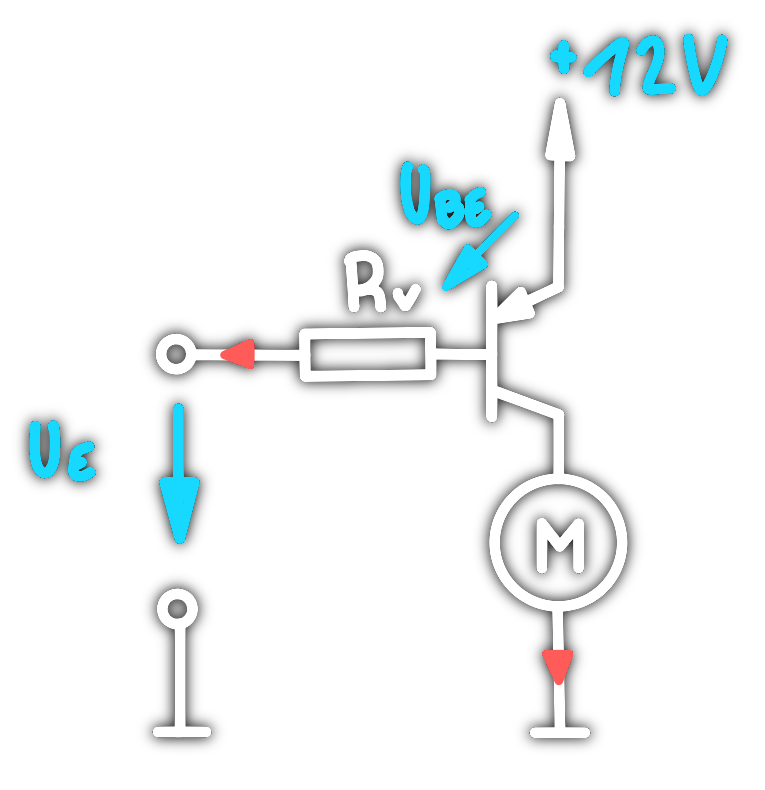

# Grundlagen

# [Transistor]({MOC}%20Transistor.md) als Schalter
## NPN

## PNP

# Transistorschaltungen
## Stromgegenkopplung

## [Emitterfolger](Emitterfolger.md)
## [Kollektorfolger](Kollektorfolger.md)
##  Stabilisierung

---
# Tags
