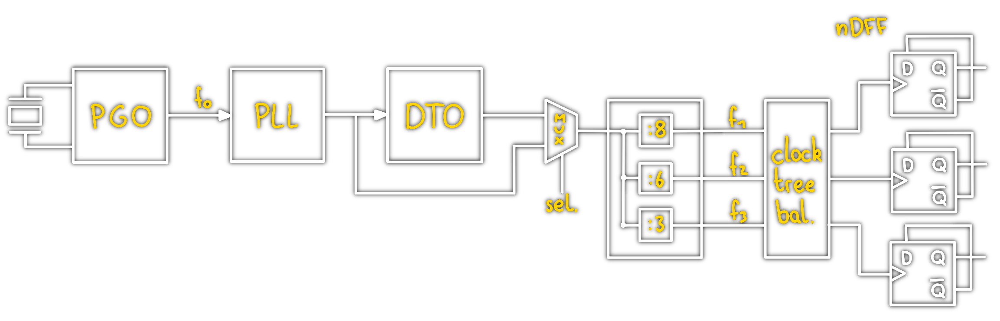

# Discrete Time Oscillator

> [!important] Ausgangspunkt:
> 4 Bit Dualzähler betrieben mit $f_{0}$ betrachtet man das MSB
> 

> [!important] Topologie:
> Accumulating register (Accureg) mit Feedbackleitung, betaktet mit dem Ausgang eines [[Phase Locked Loop|PLL]]
> 

Das MSB des Accureg wird als Ausgang des DTO verwendet.

> [!info] Die Frequenz ist abhängig von
> - der Clockfrequenz des [[Phase Locked Loop|PLL]]
> - Bit-Breite des Addierers
> - Inkrement Wert

## Blockschaltbild eines komplexen Taktsystems

# Tags
[Clock Tree Balancing](../Clock%20Tree%20Balancing.md)