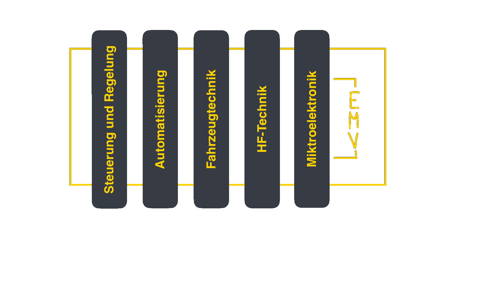

# Elektromagnetische Verträglichkeit

Elektromagnetische Verträglichkeit beschreibt die Fähigkeit eines Gerätes oder Systems in seiner elektromagnetischen Umgebung zufriedenstellend zu funktionieren ohne selbst unzulässige Strörungen in diese Umgebung einzubringen.

> [!info] EMV ist eine horizontale Disziplin
> ... die sich durch alle Bereiche der Elektrotechnik zieht.
> 
> 

## Grundlagen und Begriffe

Prinzipiell kann die EMV an jedem der 3 Blöcke durch Maßnahmen verbessert werden.

> [!hint] Kopplungsmechanismus
> Der Kopplungsmechanismus ist der physikalische Zusammenhang über den eine von der [Störquelle](Störquelle.md) ausgehende Störung auf die Senke einwirkt.
> Kopplungsarten
> 1. [kapazitiv](Kapazitive%20Kopplung.md)
> 2. induktiv
> 3. galvanisch

> [!hint] [Störquelle](Störquelle.md)

> [!hint] Störsenke
> Elektronische Einrichtung, deren Funktion durch die Störgrößen beeinträchtigt werden kann.

> [!hint] Störgröße
> Eine elektromagnetische Größe (Spannung-/ Stromfeldstärke) die eine unerwünschte Beeinflussung erzeugt.

# Komponenten und Konzepte zur Verbesserung

> [!info] Von Leistungselektronik bis Mikroelektronik gibt es eine große breite, und in der technischen Umsetzung sehr unterschiedliche, Maßnahmen.
> 
> 
> 
> Kleine Chip-Kondensatoren gehen bis zu sehr hohen Resonanzfrequenzen.

1. E- und H-Felder Eindämmen ([Schirmung](Schirmung.md))
2. ICs verwenden, welche die Anwendungen mit den langsamsten Anstiegs- und Abfallzeiten betreiben können
3. Hochfrequente bzw. hochenergetische Leiterbahnen so kurz wie möglich halten
4. Leistungsabgabe verbessern
	- Entkopplung/[Abblockkondensator](Abblockkondensator.md)
	- [Induktivität](Induktivitäten.md) minimieren
	- [Kapazität](Kapazität.md) maximieren
		- Dünne Dielektrika mit hoher Dielektrizitätszahl
		- $\Big(C=\dfrac{\varepsilon_{0}\cdot\varepsilon_{r}\cdot A}{d}\Big)$
5. Gutes [PCB-Layout](PCB-Layout.md)/Stack-Up

> [!caution] Die Frequenz in digitalen Schaltkreisen liegt in den Flanken, nicht im Takt.
> Schon bei niedrigen getakteten Schaltkreisen können Effekte der HF-Technik eintreten.

> [!caution] Die Energie in Schaltkreisen liegt in den Feldern im Dielektrikum Zwischen den Leiterbahnen bzw im Isolator von Twisted-Wire Paar.

# Tags

