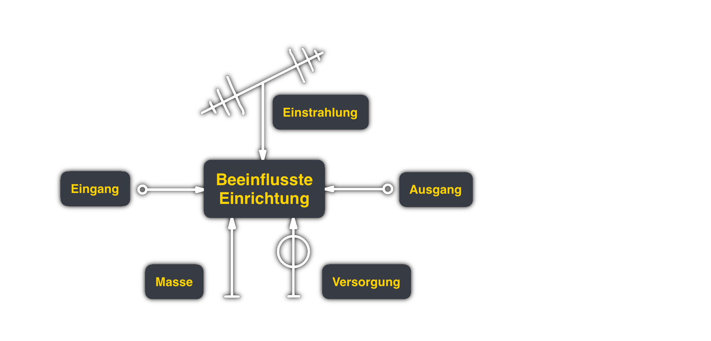

# Elektromagnetische Verträglichkeits
Elektromagnetische Verträglichkeit beschreibt die Fähigkeit eines Gerätes oder Systems in seiner elektromagnetischen Umgebung zufriedenstellend zu funktionieren ohne selbst unzulässige Strörungen in diese Umgebung einzubringen.

> [!info] EMV ist eine horizontale Disziplin
> ... die sich durch alle bereiche der Elektrotechnik zieht.
> 
## Grundlagen und Begriffe

Prinzipiell kann die EMV an jedem der 3 Blöcke durch Maßnahmen verbessert werden.
### Kopplungsmechanismus
Der Kopplungsmechanismus ist der physikalische Zusammenhang über den eine von der Störquelle ausgehende Störung auf die Senke einwirkt.

> [!hint] Kopplungsarten
> 1. [kapazitiv](Kapazitive%20Kopplung.md)
> 2. induktiv
> 3. galvanisch
> 

### Störquelle
Ist das Objekt von dem die Störung ausgeht.
#### Art der Störquellen
Grundsätzlich kann zwischen externen und internen Störquellen unterschieden werden.
##### Externe Störquellen
Man untersheidet wiederum;
###### Natürliche Störquellen
- Atmospherische Entladungen (Blitz)
- Elektrostatische Entladungen ([ESD](ESD.md)) (z.B. Reibungselektrizität)
	- bei Kunststoffbeschichteten Stühlen & Tischen
	- bei Bekleidung und Böden aus synthetischen Stoffen
	- bei nicht geerdeten Werkzeugen
###### Künstliche Störquellen
- Vorhergesehene und unvorhergesehene elektromagnetische vorgänge.
- In der Energieerzeugung und Verteilung → elektrische Schaltvorgänge
- [Schaltnetzteil](Stromversorgungseinheiten/Schaltnetzteil.md)e, Leuchtstoffröhren
- Zündsysteme von Motoren
- Fernseh / Radiosender, Mobilfunk

##### Interne Störquellen
- Lade- & Entladevorgänge von L,[C](../assets/C.md)
- Takterzeugung und Verteilung
- Signalwechsel auf Leitungen
- Schaltvorgänge von [Transistoren]({MOC}%20Transistor.md)

### Störsenke
Elektronische Einrichtung, deren Funktion durch die Störgrößen beeinträchtigt werden kann.

### Störgröße
Eine elektromagnetische Größe (Spannung-/ Stromfeldstärke) die eine unerwünnschte Beeinflussung erzeugt.

# Komponenten und Konzepte zur Verbesserung
> [!info] Von Leistungselektroink bis Mikroelektronik gibt es eine große breite, und in der technischen Umsetzung sehr unterschiedliche, Maßnahmen.
> 
> Kleine Chip-Kondensatoren gehen bis zu sehr hohen Resonanzfrequenzen.

> [!info] Resonanzverlauf
> 

## Abblockkondensator
Da die [Impedanz](Impedanz.md) eines Kondensators bis zur Resonanzfrequenz sinkt, können HF-Störungen auf Versorgungsleitungen mit Gleichsignalen oder NF-Signalen durch einen Parallelgeschalteten [Kondensator](Kapazität.md) (Kurzschluss-geblockt) werden.

Für das NF-Signal: [Kapazität](Kapazität.md) ist ein Leerlauf
Für die HF-Störung: [Kapazität](Kapazität.md) ist ein Kurzschluss

- Die HF Störung kann nicht in die Schaltungsteil eindringen bzw diesen verlassen.
- Störungen werden reflektiert, nicht absorbiert
	- [Reflexionsfaktor](../hf-technik/ksn%20(4)/Reflexionsfaktor.md) im Kurzschluss: $r_{KS}=-1$
	- ggf. gibt es Probleme mit Resonanzen innerhalb der Schaltung
- Versorgungsleitungen kurz halten (siehe 4-Pol [Kondensator](Kapazität.md) [a])
- 3-Leiter Anordung mit 3 Kondensatoren zum KS gleich und gegentaktsignalen [b])
# Tags
