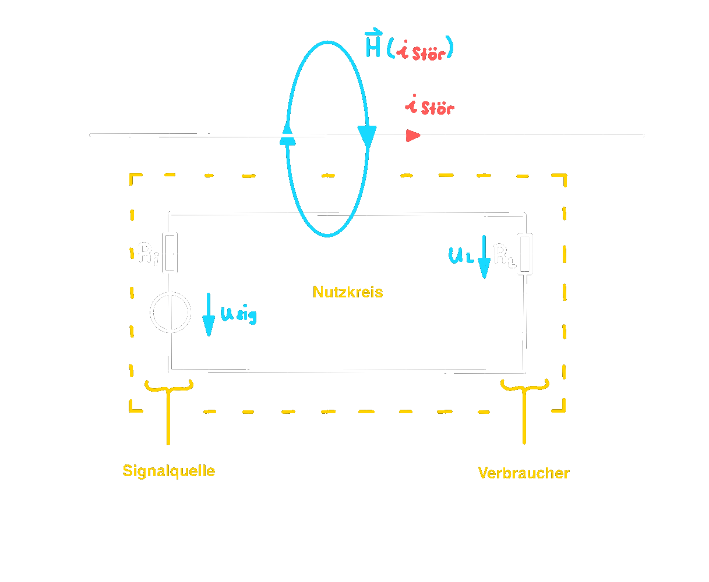
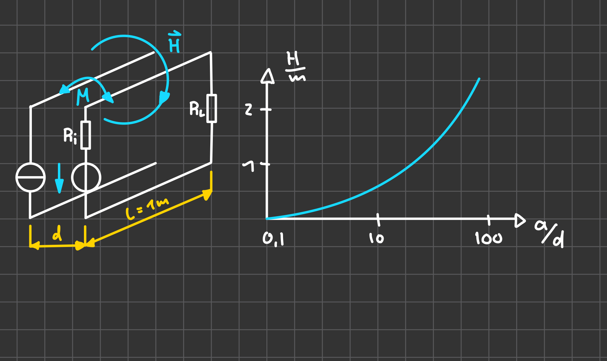

# Magnetische Kopplung

Bei der magnetischen Kopplung wird die Störgröße über das magnetische Feld in den Nutzkreis übertragen.

> [!WARNING] Ursachen für magnetische beeinflussungen sind, die Magnetfelder stromdurchflossener Leiter, welche bei einer Stromänderung Spannungen in benachbarten Leiterschleifen induzieren.

$$
\begin{align*}
H(i_{stör}) &= \frac{i_{stör}}{2\pi\cdot r}\\
B(i_{stör}) &= \mu\cdot H(i_{stör})\\
\Phi(i_{stör}) &= B(i_{stör})\cdot A\\
u_{stör}&=N\cdot \frac{d\Phi}{dt}\\
u_{stör} &= L\cdot \frac{di}{dt}
\end{align*}
$$
Die Lastspannung $u_{L}$ erhält durch die magnetisch eingekoppelte Störspannung einen Störanteil.

## Modellierung 

Modellierung der induzierten Störspannung erfolgt durch eine weitere Spannungsquelle am Nutzkreis.  

> [!INFO] Die magnetische Kopplung wird durch die Gegeninduktivität $M$ ausgeprägt.  
> $u_{stör} = M\cdot \dfrac{di_{stör}}{dt}$

> [!summary] Der Störanteil am Verbrauchereingang: 
> $$
> \begin{align*}
> u_{L, stör} &= \frac{R_{L}}{R_{i}+ R_{L}}\cdot u_{stör} = \frac{R_{L}}{R_{i}+ R_{L}} \cdot M\cdot\frac{di_{stör}}{dt} \qquad&&\text{Zeitbereich}\\
> U_{L, stör} &= \frac{R_{L}}{R_{i}+R_{L}}\cdot U_{stör}= \frac{R_{L}}{R_{i}+R_{L}}\cdot j\omega M \cdot \underline{I}_{stör}\qquad&&\text{Frequenzbereich}
> \end{align*}
> $$

Die Höhe der induzierten Störspannug hängt ab von:
1. Der Größe der Gegeninduktivität $M$, zwischen Nutzund Störkreis
2. Änderungsgeschwindigkeit des Stromes $\frac{di_{stör}}{dt}$
3. der Amplitude des Stromes $\hat{i}_{stör}$
4. der Frequenz des Störstromes $\omega\cdot\underline{I}_{stör}$

Die Gegeninduktivität wird durch die Topologie, bzw durch die [Leiterbahn](../hf-technik/Leitung.md) anordnung bestimmt.

## Gegeninduktivität $M$

$$
\begin{align*}
M&= \frac{\mu_{0}\cdot l}{2\pi}\cdot\ln\left[1+\left(\frac{a}{d}\right)^{2}\right]
\end{align*}
$$

>[!example] Bsp.:  
>$l=1m$  
>$\cfrac{a}{d}=0.1$  
> ges.: $M$  
> $R_{i}<<R_{L}$ (Nutzkreis)  
> $\cfrac{di}{dt}=\frac{1000A}{\mu s}$  
> ges.: $u_{L}$
> $$
> \begin{align*}
> M&= \frac{4\pi\cdot10^{-7}\cdot 1m}{2\pi}\cdot\ln(1.01) = 2\cdot10^{-9}H = 2nH \\
> u_{L}&=M\cdot \frac{di_{stör}}{dt}=2\cdot 10^{-9}H\cdot \frac{1000A}{10^{-6}s}
> \end{align*}
> $$

## Nachweis magnetisch gekoppeter Störungen

$$
\begin{align*}
\ddot{u}_{L,stör}= \frac{R_{L}}{R_{i}+R_{L}}\cdot \ddot{u}_{stör} = \frac{R_{L}}{R_{i}+R_{L}\cdot}M\cdot \frac{di}{dt}
\end{align*}
$$

Zur Diagnose muss der Wechselanteil der Störgröße zu $0$ gemacht werden.

### Abhilfemaßnahmen

Verringerung der Gegeninduktivität druch:
- Vergrößern des Abstandes zwischen der gefährdete und gefährende Masche
- Enge räumliche Anordung 
- Verdrillen von Hinund Rückleiter
- Verändern der Änderungsgeschwindigkeit $\vec{v}$ des Störstromes
- Herabsetzen der Flussänderungsgeschwindigkeit 

> [!INFO] Verändern der Änderungsgeschwindigkeit $\vec{v}$ des Störstromes
> - Einsatz von Bauelementen mit niedriger Grenzfrequenz
> - Einsatz von Tiefpassfiltern

> [!INFO] Herabsetzen der Flussänderungsgeschwindigkeit 
> - Ein Kurzschlussring mit ähnlicher magntischer Flussdichte wird zwischen Stör und Nutzkreis 

# Tags

