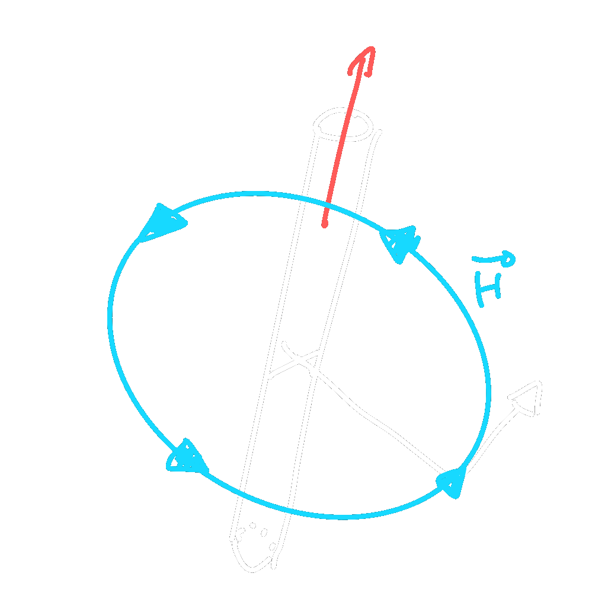
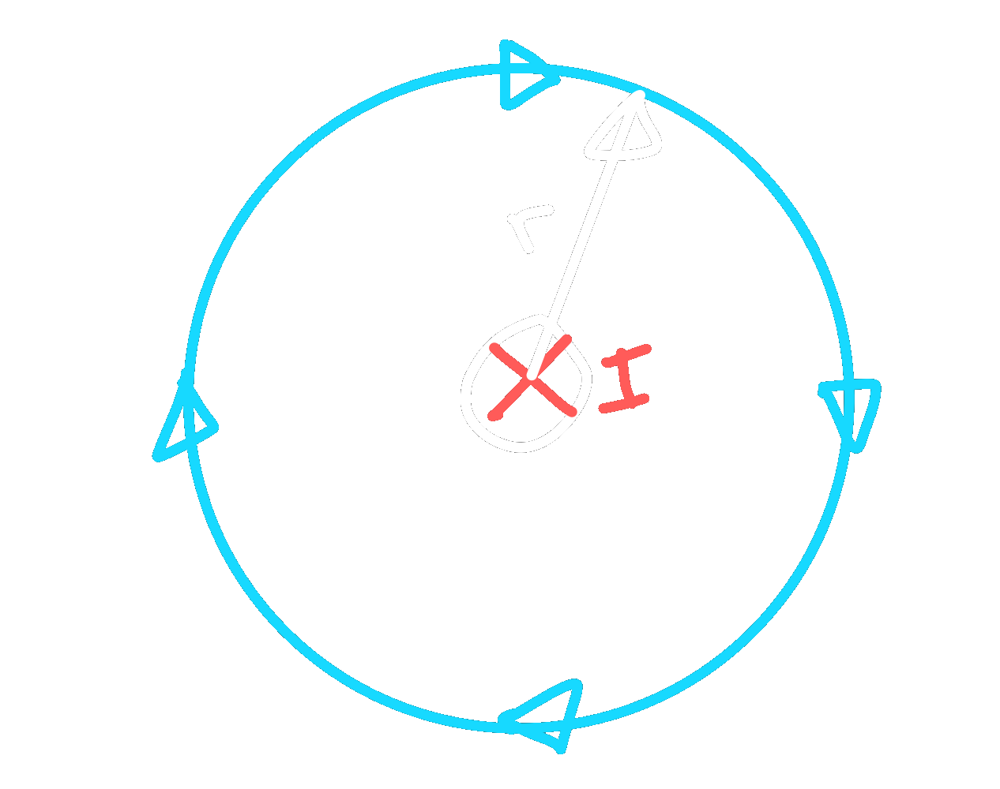
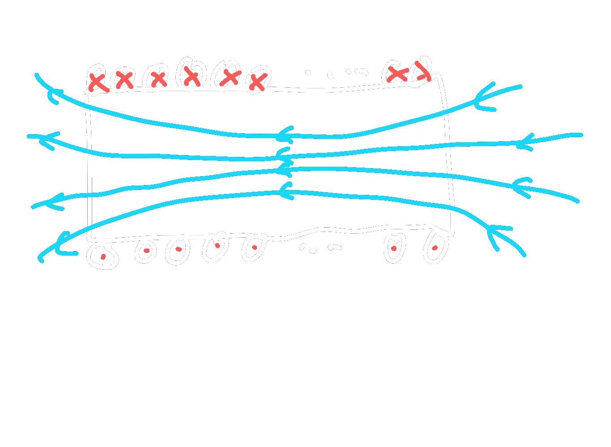

# Magnetisches Feld
> [!info] Ein Magnet feld wird durch einen Strom (gleichmäßig bewegte Ladung) durch einen Leiter erzeugt
> 

> [!hint] Rechtsschraubenregel
> 

> [!hint] Umfassungsregel
> 

# Magnetische Grundgrößen

| Größe                            | Formel                                               |         Einheit          |
| -------------------------------- | ---------------------------------------------------- |:------------------------:|
| magn. Feldstärke                 | $H=\frac{I}{2\pi r}$                                 |     $[\frac{A}{m}]$      |
| magn. Flussdichte                | $B=\mu \cdot H$                                      | $[\frac{Vs}{m^{2}}],[T]$ |
| permeablität                     | $\mu$                                                |    $[\frac{Vs}{Am}]$     |
| magn. Fluss                      | $\Phi=B\cdot A$                                      |       $[Vs],[Wb]$        |
| Induktivität einer Zylinderspule | $L=N^{2}\cdot \dfrac{\mu_{0}\cdot\mu_{r}\cdot A}{l}$ |          $[H]$           |
| Induzierte Spannung              | $u = L\cdot \frac{di}{dt}$                           |          $[V]$           |

# Quellen
#MS-2JG 
