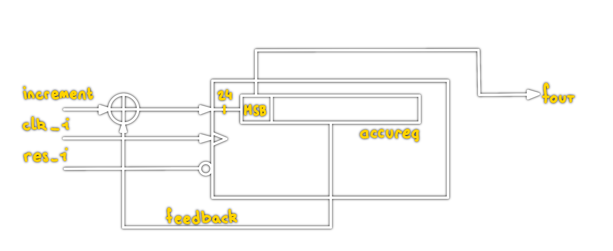
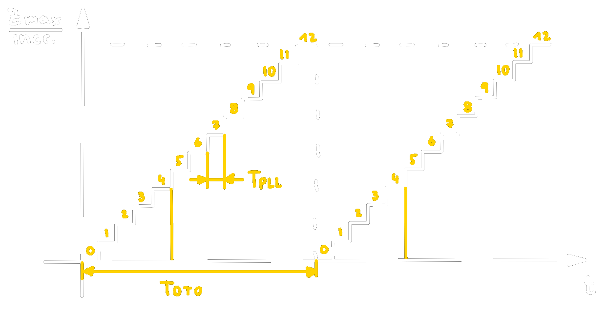

# Discrete Time Oscillator

> [!important] Ausgangspunkt:
> 4 Bit Dualzähler betrieben mit $f_{0}$ betrachtet man das MSB

> [!important] Topologie:
> Accumulating register (Accureg) mit Feedbackleitung, betaktet mit dem Ausgang eines [PLL](Phase%20Locked%20Loop.md) *(clk_i)*
> 
> - Das MSB des Accureg wird als Ausgang des DTO verwendet.

> [!info] Die Frequenz ist abhängig von
> - der Clockfrequenz des [PLL](Phase%20Locked%20Loop.md)
> - Bit-Breite des Addierers
> - Inkrement Wert

$$
\begin{align*}
Z_\max
\end{align*}
$$

# Tags
[Clock Generierung](Clock%20Generierung.md)
[Clock Tree Balancing](Clock%20Tree%20Balancing.md)
[PLL](Phase%20Locked%20Loop.md)