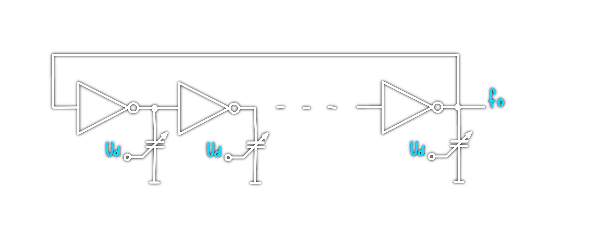

# Ringoszillator

Ein Ringoszillator besteht aus einer in Reihe geschalteten Kette von Invertern. es gelten die [Barkhausen Kriterien](Barkhausen%20Kriterium.md).

[BHK](Barkhausen%20Kriterium.md):
- open loop gain > 1
- open loop phase shift: ungerades Vielfaches von $180\degree$

>[!summary] Oscillation frequency: $f_{osz} = \dfrac{1}{2\cdot M\cdot T_{d}}$
> - $M$ ... Anzahl der Inverter stufen.
> - $T_{d}$ ... Delay Time eines einzelnen Inverters (Propagation Delay)

Die delay time einer einzelnen Inverter Stufe, lässt sich auf kapazitive/resistive weise und durch beeinflussen des Querstromes beim Schaltvorgang des Gatters beeinflussen. 

## Schaltung

# Tags
