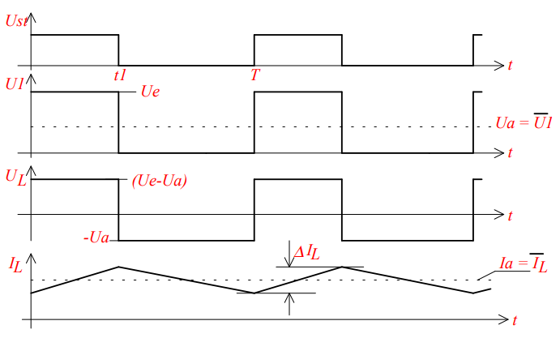

# Buck Converter

## Schaltung

Der [Transistor](../Halbleiter/{MOC}%20Transistor.md) $T$ Arbeitet als Schalter ($S$), der mittels der PWM gesteuerten Spannung $U_{st}$ (Gate-Spannung) mit hoher Frequenz ($50kHz-500kHz$) angesteuert wird.  
Der Term $DC = \dfrac{t_{1}}{T_{S}}$ beschreibt das Tastverhältnis (Duty-Cycle) der Steuerspannung.

## Impuls-Zeit Diagramm

## Schaltstufe S

### $0<t<t_{1}$: $S_{geschlossen}$

Die Differenz $\dfrac{U_{e}}{U_{a}}$ treibt einen Striom dutrch die [Spule](../Induktivitäten.md) $L$ und versorgt den Lastwiderstand und den [Kondensator](../Kapazität.md) $C_{L}$. Dabei speichert auch die [Spule](../Induktivitäten.md) $L$ Energie

### $t_{1}<t<T_{s}$: $S_{geöffnet}$

Die in der [Spule](../Induktivitäten.md) gespeicherten Energie liefert weiter Strom an den [Kondensator](../Kapazität.md) und den Lastwiderstand $R_{L}$. Da während der gesamten Schaltperiode die [Spule](../Induktivitäten.md), den [Kondensator](../Kapazität.md) und den Verbraucher mit Strom versorgt, wird die Schaltung auch als **Durchflusswandler** bezeichnet.

### Herleitung der Dimensionierung

Annahme: $U_{a}$ ist konstant über $T_{S}$  
$0<t<t_{1}$: $S_{geschlossen}$
$$
\begin{align*}
	\Delta I_{L1} &= \frac{1}{L}\int^{t_{1}}_{0} (U_{e}-U_{a})dt = \frac{1}{L}\cdot (U_{e}-U_{a})\cdot t_{1}
\end{align*}
$$
$t_{1}<t<T_{s}$: $S_{geöffnet}$
$$
\begin{align*}
	\Delta I_{L2} = \frac{1}{L}\int^{T_{S}}_{t_{1}} (U_{a}+U_{F_{0}})dt = \frac{1}{L}\cdot (U_{e}-U_{a})\cdot (T_{S}-t_{1})\\
\end{align*}
$$

$\Delta I_{L2} = \Delta I_{L1}$

$$
\begin{align*}
(U_{a}+U_{FO})\cdot (T_{S}-t_{1}) &= (U_{e}-U_{a})\cdot t_{1}
\\
&\dots
\\
U_{a} &= U_{e}\cdot \frac{t_{1}}{T_{S}}-U_{FO}(1- 
 \frac{t_{1}}{T_{S}})
\end{align*}
$$
Nach Vernachlässigung von $U_{FO}$
$$
U_{a} = U_{e} \cdot \frac{t_{1}}{T_{S}} = U_{e}\cdot DC
$$

Die Ausgangsspannung kann nur kleiner als $U_{e}$ sein und die Steuerung von $U_{a}$ erfolgt durch veränderung der **Duty-Cycle** bzw der **Schaltperiode**.

## [Induktivität](../Induktivitäten.md)

Aus ) folgt:
$$
L_{min} = \frac{(U_{a}+U_{FO})\cdot (T_{s}-t_{1})}{\Delta I_{L}(t)}
$$
 Aus ) folgt:
$$
L_{\min} = \frac{(U_{a}-U_{e})\cdot t_{1}}{\Delta I_{L}}
$$
Es ist zu beachten, dass $I_{L}(t)$ in der Ausschaltphase nicht in den Lückenden Betrieb übergeht, das heißt auf $0$ sinkt. Delta $I_{L}$ ist daher mit $0,2 - 0,4$ fachen von $\overline{I_{a}}$ als Richtwert anzunehmen.

## [Kapazität](../Kapazität.md)

$$
\begin{align*}
\Delta Q &= \Delta I\cdot t &&= \frac{\Delta I_{L}}{2}\cdot\frac{t_{1}}{2}\cdot \frac{1}{2} + \frac{\Delta I_{L}}{2} \cdot \frac{T_{S}-t_{1}}{2}\cdot \frac{1}{2}
\\
\Delta Q &= C\cdot\Delta U_{a} &&= \frac{\Delta I_{L}\cdot T_{S}}{8}
\\
\Delta U_{a} &=  \frac{\Delta I_{L}\cdot T_{S}}{8\cdot C}
\end{align*}
$$
Durch den Ladestrom $I_{L}$ wird auch eine Änderung der Kondensatorspannung bewirkt und somit auch der Ausgangsspannung.

Die Annahme einer konstanten Ausgangsspannung bezieht sich daher auf den Mittelwert der zeitabhängigen Größe $U_{A} = U_{C}(\overline{t})$

## [Diode](../Halbleiter/Diode.md)

Verwendung einer Schottky [Diode](../Halbleiter/Diode.md):
- kurze Schaltzeit
- niedrige Schwellspannung $U_{FO}\approx 0,4V$

Zu Beachten:
- $U_{Reverse} > U_{e}$ (laut DS meistens $1.3\cdot U_{e}$)

## Dimensionierung der Bauteile

- ESR: Equivalent Series Resistance
	- Möglichst Gering
- ESL: Equivalent Series Inductance
	- Möglichst Gering
- kurze Leitungsführung
- sternförmige Masse
- Bauteilplatzierung Wichtig
- Layout Guideline beachten (im Datasheet)

| Groß     | [Kapazität](../Kapazität.md)      | Spule                  | Frequenz                |
| -------- | ----------------- | ---------------------- | ----------------------- |
| Vorteil  | Stärkere Glättung | kleines $\Delta I_{L}$ | Spule kann kleiner sein |
| Nachteil |                   | großes Package         | größere [EMV](../Elektromagnetische%20Verträglichkeit.md)            |

### Mindest Spulenwert

Damit der Spulenstrom in der Ausschaltphase nicht in den Lückenden Betrieb übergeht, muss folgendes gelten:
$$
\begin{align*}
	I_{Amin} = \frac{\Delta I_{L}}{2}\rightarrow R_{L,max} = \frac{U_{a}}{\frac{\Delta I_{L}}{2}} = \frac{2\cdot U_{a}}{\Delta I_{L}}
\end{align*}
$$

Mit [$0<t<t_{1}$ $S_{geschlossen}$](Buck%20Converter.md#$0<t<t_{1}$%20$S_{geschlossen}$) folgt $\dots$ $\Delta I_{L} = \dfrac{1}{L}\cdot (U_{e}-U_{a})\cdot T_{s}$  
Unter vernachlässigung von $U_{FO}$

$$
I_{Amin} = \frac{1}{2L_{min}}\cdot (U_{e}-U_{a})\cdot T_{s}
$$

 - Für kleine [Induktivitäten](../Induktivitäten.md) ist eine große Schaltfrequenz zu wählen. 
 - Frequenz nicht beliebig wählbar, da sie ein steigen der dynamischen Verluste in der Drossel verursacht, wenn sie höher wird. Eine Hohe Schaltfrequenz bewirkt auch einen teureren Schalttransistor.
 - Daher erfolgt eine Begrenzung der Taktfrequenz bei $50-500kHz$ (Je nach Bauart)

### Glättungskondensator

$$
\begin{align*}
\Delta U_{a} &= \frac{\Delta I_{L}\cdot T}{8\cdot C}\\
&=\frac{1}{L}\cdot \left(1-\frac{U_{e}}{U_{A}}\right)\cdot U_{a}\cdot T\cdot \frac{T}{8C}\\
C_{a,min} &= \frac{U_{a}\cdot T^{2}}{8L\cdot\Delta U_{a}}\cdot\left(1- \frac{U_{a}}{U_{e}}\right)
\end{align*}
$$

## Erzeugung des Schaltsignals

Die erzeugung von $U_{steuer}$ erfolg mit einem Pulsbreiten modulator und mit einem Regler mit Spannungsreferenz

### Funktionsweise des Impulsbreitenmodulators

Der Impulsbreitenmodulator besteht aus einem Sägezahngenerator und einem Komparator. Der Komaprator steuert über $U_{st}$ den Schalter ([MOSFET](../Halbleiter/Metall-Oxid-Halbleiter-Feldeffekttransistor.md) + Treiber) an, solange $U_{R}$ größer ist als $U_{sz}$. Nachfolgend gezeigt ist die sogenannte [Voltage-Mode-Regelung](../Voltage-Mode-Regelung.md). 

---

# Tags

[Schaltnetzteil](Schaltnetzteil.md)