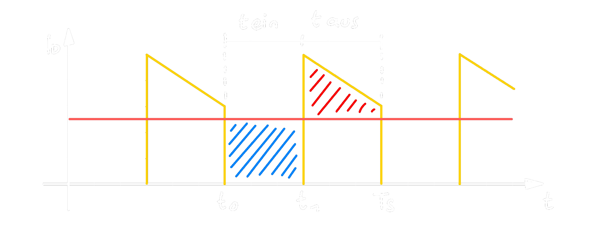

# Inverswandler
- Der Inverswandler arbeitet nach dem Sperrwandler-Prinzip
- Die Ausgangsspannung $U_{e}$ kann größer oder kleiner als $U_{e}$ sein.

## Schaltbild
>

Der [Transistor](../{MOC}%20Transistor.md) arbeitet als Schalter ($S$) der mittels PWM ($U_{st}$) angesteuert wird.
Dabei wird eine $U_{a}$ mit umgekehrtem Vorzeichen zur Eingangsspannung erzeugt.

## Lauf-Zeit-Diagramm
>
> <mark style="background: #ABF7F7A6;">$\Delta I_{L1}$</mark>
> <mark style="background: #FFF3A3A6;">$\Delta I_{L2}$</mark> 

### Kontinuierlicher Betrieb
>
> <mark style="background: #FF5582A6;">$I_{a,max}$</mark> = <mark style="background: #FFB86CA6;">$\overline{I_{D}}$</mark> 

### Diskontinuierlicher Betrieb
>
> <mark style="background: #FF5582A6;">$I_{a,min}$</mark> = <mark style="background: #FFB86CA6;">$\overline{I_{D}}$</mark> 

## Schalter $S$ bzw. Transistor $T$
### Herleitung der Dimensionierung
#### $0<t<t_{1}$: $S_{geschlossen}$
$$
\begin{align*}
\Delta I_{L1} &= \frac{1}{L}\int^{t_{1}}_{0}{U_{e}dt}\\
&= \frac{1}{L}\cdot U_{e}\cdot t_{1} \qquad (1)
\end{align*}
$$
#### $t_{1} < t < T_{S}$: $S_{offen}$
$$
\begin{align*}
\Delta I_{L2} &= \frac{1}{L} \int^{T_{s}}_{t_{1}}{(-1)\cdot (-U_a+U_{Fo})dt}\\
&=-\frac{1}{L}\cdot (U_{a}+U_{Fo})(T_{s}-t_{1})\qquad (2)
\end{align*}
$$
#### $\Delta I_{L1}= -\Delta I_{L2}$
$$
\begin{align*}
\frac{1}{L}\cdot U_{e}\cdot t_{1} &= \frac{1}{L}\cdot (-U_{a}+U_{Fo})(T_{s}-t_{1})\\
&\dots\\
&U_{a}\approx -U_{e} \frac{t_{1}}{T_{s}-t_{1}} 
\end{align*}
$$
## Induktivität
$\rightarrow$ 
## Kapazitzät
$\rightarrow$ 

---
# Tags
