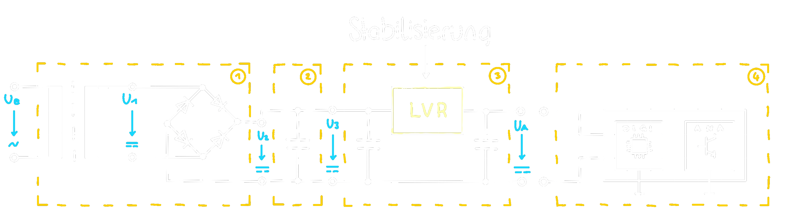

# Typische Schaltung eines Netzteils mit Linearregler
## Aufbau
1. Gleichrichterschaltung (inkl. Transformation)
2. Siebschaltung zur Glättung der Gleichspannung
3. Spannungsstabilisierung der Gleichspannung gegen Schwankungen ...
	- ... der Eingangsspannung
	- ... der Last
	- ... der [Temperatur](../../physik/Temperatur%20und%20Teilchenmodell.md) 
4. Last
	- bei der Last werden üblicherweise Analoge und Digitale Versorgung mittels einer Sternförmigen Masse getrennt.

>

Verlauf der Spannung:
- Rot: vor der Stufe
- Gelb: nach der Stufe

>
## Stabilisierung und Regelung von Spannung
Die notwendigen Kenngrößen zur Beurteilung der Qualität einer Stabilisierungsschaltung sind wiefolgt:
1. Eingangsspannung und Toleranz
2. Ausgangsspannung und Toleranz
3. Eingangsschwankungs-Regelung **(Line Regulation)**
	- $\dfrac{\Delta U_{a}}{\Delta U_{e}}$
4. Belastungs-Regelung **(Load Regulation)**
	- $\dfrac{\Delta U_{a}}{\Delta i_{a}}$
5. [Temperatur](../../physik/Temperatur%20und%20Teilchenmodell.md) Koeffizienten
6.  Ausregelzeit
	- Wie lange eine Veränderung am Eingang zu einer Veränderung am Ausgang dauert.

Die Klassifizierung von Schaltungen zur Spannungsstabilisierung, kann in die Kategorien **geregelt** und **ungeregelt** vorgenommen werden.
# Linearregler
## Ungeregelte Spannungsstabilisierung
### Stabilisierungsschaltung mit einer 
Mittels einer Zener [Dioden](../Dioden.md) kann eine Ausgansspannung in einem wieten Bereich konstantgehalten werden.

| Kennwerte                                                                                                           | Schaltung                    |
| ------------------------------------------------------------------------------------------------------------------- | ---------------------------- |
| $I_{V}\dots$ Gesamtstrom  $I_{L}\dots$ Laststrom $I_{Z}\dots$ Z-Diodenstrom $U_{Z}\dots$ Z-Diodenspannnung $R_{V}\dots$Vorlastwiderstand $R_{L}\dots$ Lastwiderstand| |

#### Kennlinie
| Kennwerte                                                                                                                                                                                      | Kennlinie                   |
| ---------------------------------------------------------------------------------------------------------------------------------------------------------------------------------------------- | --------------------------- |
| $U_{e,min}\dots$ $U_{e,max}\dots$ $I_{Z,min}\dots$ $I_{Z,max}\dots$ $R_{V,min}\dots$ $R_{V,max}\dots$ $P_{tot}\dots$  $U_{F}\dots$ $U_{R}\dots$ $I_{F}\dots$ $I_{B}\dots$ |  |

#### Dimensionierung
$$
\begin{align*}
	U_{e} &\rightarrow \text{konstant}\\
\Delta U_{Z}\approx 0 \rightarrow U_{Z} &\rightarrow \text{konstant}\\\\

R_{V,min} = \frac{U_{e}-U_{z}}{I_{Z,max}} &\rightarrow I_{Z} = \frac{U_{e}-U_{z}}{R_V}\\
I_{Z} &= I_{Z,min}+I_{L,max}\\
&\\
P_{V} &=\left.\frac{U_{RV}^{2}}{R_{V}}\right|_{R_{L}=0}
\end{align*}
$$
Möchte man mit möglichst *geringem Stromverbrauch* auskommen, so dimensioniert man nach *$I_{Z,min}$, $I_{L,max}$ und $U_{e,min}$*.

| $R_{V,min}$                                                  | $R_{V,max}$ |
| ------------------------------------------------------------ | ----------- |
| $$R_{V,min} = \frac{U_{e,max}-U_{Z}}{I_{Z,max}+ I_{L,min}}$$ |  $$R_{V,max} = \frac{U_{e,min}-U_{Z}}{I_{Z,min}+ I_{L,max}}$$           |

Für eine *optimale Stabilisierung* ist folgendes zu beachten:
- $U_{e}\approx 2\cdot U_{Z}$
- Der *Arbeitspunkt* liegt in der *Mitte* der Kennlinie, bei *$\frac{I_{Z}}{2}$*
- *$I_{Z,min}$* darf *nicht unterschritten* werden.
- *$R_{V}$* begrenzt *$I_{Z}$* bei *$U_{e,max}$* auf *$I_{Z,max}$* 

#### Absoluter Stabilisierungsfaktor
$$
\begin{align*}
S=\frac{\Delta U_{e}}{\Delta U_{a}} = \frac{\Delta U_{e}}{\Delta U_{Z}}
\end{align*}
$$
#### Nachteil der Schlatung
Der **Regelbereich** für Laststrom ist **stark eingeschränkt**.
Es gilt  $\Delta I_{L}=\Delta I_{Z}$
Eine Längstransistorschaltung behebt diesen Nachteil
### Längstransistor mit 

#### Längsregler

## Geregelte Spannungsstabilisierung
### Kontinuierlicher Spannungsregler
### Integrierter Spannungsregler

---
# Tags
#incomplete 
