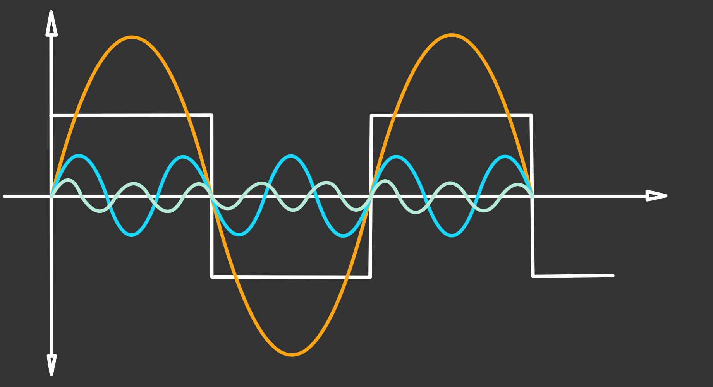

# Fourier Reihe

Jede periodische Funktion kann aus einer Summe von Sinusund/oder Cosinus Schwingungen zusammengesetzt werden.

## Periodische Funktion

$f(x)=f(x+a)$  

>[!summary] $$f(x) = \frac{a_{0}}{2}+\sum^{\infty}_{n=1}\left[a_{n}\cdot\cos(n\cdot x)+b_{n}\cdot\sin(n\cdot x)\right]$$
> - $a_{n}$, $b_{n}\dots$ **Fourier Koeffizienten**

Sei $f$ einer $2\pi$-periodische Funktion.  
Ist das Periodenintervall in **endlich viele Teilintervalle** zerlegbar, in denen $f$ sowohl **stetig, als auch monoton** ist, so kann die Funktion in eine **Fourier Reihe** zerlegt werden.

$f(x)\dots$**Trigonometrisches Polynom**

## Amplituden-Phasenform

> [!summary] $$A_{n}\sin(b\cdot x+\varphi_{n})=a_{n}\cdot cos(n \cdot x)+b_{n} \cdot\sin(n\cdot x)$$
> - $A_{n}=\sqrt{a_{n}^{2}+b_{n}^{2}}$
> - $\varphi=\arctan\left(\dfrac{a_{n}}{b_{n}}\right)$

- $A_{1}\cdot\sin(x+\varphi)$: 1. Harmonische oder Grundschwingung
- $A_{2}\cdot\sin(2x+\varphi)$: 2. Harmonische oder 1. Oberschwingung
- $A_{3}\cdot\sin(3x+\varphi)$: 3. Harmonische oder 2. Oberschwingung

>[!EXAMPLE] Rechteckschwingung  
>   
> [Klirrfaktor](../../hwe/Klirrfaktor.md) … $k=\dfrac{\sqrt{(\frac{2}{\pi})^{2}+(\frac{6}{5\pi})^{2}}}{\sqrt{(\frac{6}{\pi})^{2}+(\frac{2}{\pi})^{2}+(\frac{6}{5\pi})^{2}}} = 0.3623$

## Fourier Koeffizienten

### Periode $T$

### Periode $T=2\pi$

$$
\begin{align*}
f(t) &= \frac{a_{0}}{2}\sum\limits^\infty_{n=1}[a_{n}\cdot\cos(n\cdot\omega_{0}\cdot t) + b_{n}\cdot\sin(n\cdot\omega_{0}\cdot t)]
\end{align*}
$$
$$
\begin{align*}
a_{n} &= \frac{2}{T}\cdot\int^{T}_{0}f(t)\cdot\cos(n\cdot\omega_{0}\cdot t)dt\\
b_{n} &= \frac{2}{T}\cdot\int^{T}_{0}f(t)\cdot\sin(n\cdot\omega_{0}\cdot t)dt\\
a_{0} &= \frac{2}{T}\cdot\int^{T}_{0}f(t)dt
\end{align*}
$$
Gleichrichtwert $\dfrac{a_{0}}{2}$

> [!hint] Das Integrationsintervall kann beliebig verschoben werden

## Güte der Näherung

---

# Tags

