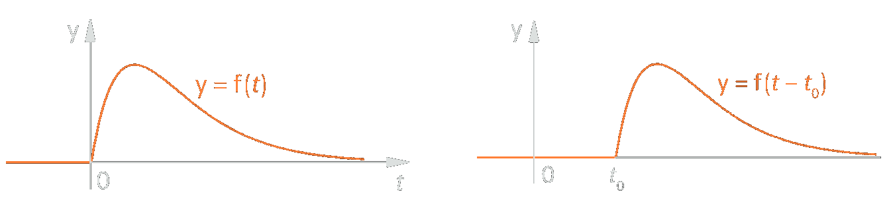

# Laplace Transformation - Multiplizieren Statt [Differenzieren](../mathe%20(3)/Differenzialrechnung.md)

- Bei Einschaltvorgängen interessiert uns nur, was nach dem Einschalten $(t=0)$ passiert.
- Um mehr Funktionen transformieren zu können, wird eine [Dämpfung](../../Hardwareentwicklung/Dämpfung.md) $e^{-\delta t}$ eingeführt. $(\delta\in\mathbb{R}^{+})$

Ist eine Funktion auf
- $t\in\mathbb{R}$
- definiert mit $f(t):[0,\infty[$
- für $t<0$,  
so heißt:
  
>[!summary] $$F(s) = \int_{0}^{\infty}f(t)\cdot e^{-st}dt \qquad s\in\mathbb{C}$$

> [!summary] Frequenzparameter: $s = \delta+j\omega$
> 

[Fourier Transformation](Fourier%20Transformation.md) vs. Laplace Transformation  
$$F(s) = \mathcal{L}\{ f(t)\} \qquad F(\omega) = \mathcal{F} \{f(t)\}$$  
für $s=j\omega$ ist dann $F(s)=F(\omega)$

>[!EXAMPLE] Bsp.: Deltaimpuls
> $$
> \begin{align*}
> f(t) &= 1\\
> f(t) &= \delta(t) = \begin{cases}
> 1 && t \geq 0\\
> 0 && t < 0
> \end{cases}\\
> \mathcal{L}\{1\} &= \int_{0}^{\infty}1\cdot e^{-st}dt = -\frac{1}{s}\cdot e^{-st} \Bigg{|}_{0}^{\infty} = 0-\left(\frac{1}{s}\cdot e^{0}\right) = \frac{1}{s}
> \end{align*}
> $$

## Herleitung

Woher: $f(t)\cdot e^{-\delta t}$ wird [fourier-transformiert](Fourier%20Transformation.md) $(f(t)=0 \forall t<0)$

$$
\begin{align*}
F(\omega) &= \int_{-\infty}^{\infty}f(t)\cdot\underbrace{e^{-\delta t}\cdot e^{-j\omega t}}_{e^{-(\delta+j\omega)t}}dt\\
F(s) &= \int_{0}^{\infty}f(t)\cdot e^{-st}dt\\
\mathcal{L}\{f(t)\} &= \mathcal{F}\{f(t)\cdot e^{-\delta t}\} \qquad f(t) = 0 \forall t<0
\end{align*}
$$

## Regeln Der Laplace Transformation

### Linearitätssatz

#### Summenregel

$$
\mathcal{L}\{f(t) + g(t)\} = \mathcal{L}\{f(t)\} + \mathcal{L}\{g(t)\} 
$$

#### Faktorregel

$$
\mathcal{L}\{c\cdot f(t)\} = c\cdot \mathcal{L}\{f(t)\} 
$$

### Dämpfungssatz

Aus einer [Dämpfung](../../Hardwareentwicklung/Dämpfung.md) im [Zeitbereich](../mathe%20(3)/Komplexe%20Zahlen.md) wird eine Verschiebung im [Bildbereich](../mathe%20(3)/Komplexe%20Zahlen.md)

$$
\begin{align*}
	\mathcal{L}\{f(t)\} &= F(s)\\
	\mathcal{L}\{f(t)\cdot e^{-at}\} &= F(s+a)\\
	&\text{bzw.}\\
	f(t) &\multimap F(s)\\
	f(t)\cdot e^{-at} &\multimap F(s+a)
\end{align*}
$$

### Zeitverschiebungs-Satz

Ist $t \leq 0$ so gilt:
 $$
\begin{align*}
	&{f(t)} &&\multimap &{F(s)}\\
	&\downarrow &&&\downarrow
\end{align*}
$$   

#### Herleitung

$$
\begin{align*}
	f(t-a) &\multimap F(s)\cdot e^{-a\cdot s}\\
	\mathcal {L}\{f(t\cdot a\} &= \int_{0}^{\infty} f(t\cdot a)\cdot e^{-s\cdot t} dt\\
	\text{Substituieren: }u &= t - a\\
	\mathcal {L}\{f(t\cdot a\} &= \int_{0}^{\infty}f(u)\cdot e^{-s(u+a)}dt
\end{align*}
$$
$$
\begin{align*}
	f(t) &= \begin{cases}
	 & 1 & 0\leq t\leq a \\
	 & 2 & \text{sonst}
	\end{cases}
\\
	\sigma(t) &\multimap \frac{1}{s}\\
	f(t) &=\sigma(t)-\sigma(t-1)\\
	\mathcal{L}\{f(t)\} &=\underbrace{\mathcal{L}\{\sigma(t)\}}_{\frac{1}{s}} - \underbrace{\mathcal{L}\{\sigma(t-1)\}}_{e^{} ...}
\end{align*}
$$

### Ähnlichkeitssatz (Zeit Dehnung Bzw. -Streckung)

$$
\begin{align*}
	f(a\cdot t) &\multimap \frac{1}{a} \mathcal{F}(\frac{s}{a})
	=\int^{\infty}_{0}f(a\cdot t)\cdot e^{-st}dt
\\
	\text{Substituieren: }u &= a\cdot t \rightarrow \frac{du}{dt}=a
\\
	 \int_{0}^{\infty}f(u) \cdot e^{-s\cdot \frac{u}{a}} \frac{du}{a} &= \frac{1}{a} \mathcal{F}\left(\frac{s}{a}\right)
\end{align*}
$$

### Differentationssatz

$$
\begin{align*}
	\mathcal{L}\{f'(t)\} &= \int_{0}^{\infty}f'(t)\cdot e^{-st}dt = \lim_{b\rightarrow 0}f(t)\cdot e^{-st} \Bigg{|}_{0}^{b}-\int_{0}^{\infty}f(t)\cdot e^{-st}(-s)dt
\\
	&= 0 - f(0)+s\cdot F(s)
\\
	\mathcal{L}\{f'(t)\} &= s\cdot F(s) - f(0)
\\
	\mathcal{L}\{f''(t)\} &= s^{2}\cdot F(s) - s\cdot f(0) - f(0)'
\\
	\mathcal{L}\{f'''(t)\} &= s^{3}\cdot F(s) - s^{2}\cdot f(0) - s\cdot f'(0) - f(0)''
\end{align*}
$$

### Integrationssatz

$$
\int_{0}^{t} f(\tau)d\tau \multimap \frac{1}{s}F(s)
$$
$$
\begin{align*}
	\mathcal{L}\{\sin(t)\} &= \frac{1}{s^{2}+1}\\
	\mathcal{L}\{\cos(t)\} &= s\cdot F(s) - f(0) = s\cdot \frac{1}{s^{2} + 1} - \sin(0) = \frac{s}{s^{2}}
\end{align*}
$$

# Elektrische Netzwerke Im Laplace-[Bildbereich](../mathe%20(3)/Komplexe%20Zahlen.md) (s-Domäne)

Ein RCL-Netzwerk wird für die gesuchte Größe (Spannung, Strom) durch eine Lineare Differentialgleichung mit konstanten Koeffizienten beschrieben. Diese Netzwerke werden als lineare Netzwerke bezeichnet.

Bei umfangreichen Netzwerken ist jedoch oft
 - das Aufstellen der [Differenzialgleichung(en)](../{MOC}%20DGL.md) 
 - die Lösung  
 mit beträchtlichen Schwierigkeiten verbunden.

# Tags

[Delta-Impuls](Delta-Impuls.md)
 