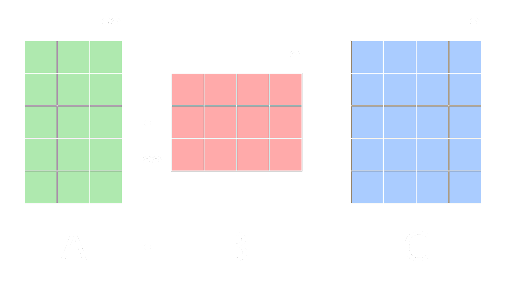

# Matrix

Matrizen sind:
- assoziativ $\rightarrow A \cdot (B \cdot C) = ( A \cdot B ) \cdot C$ 
- distributiv
	- für $C \in R^{m \times n}\rightarrow (A + B) \cdot C = A \cdot C + B \cdot C$
	- für $C \in R^{n \times l}\rightarrow C \cdot (A + B) = C \cdot A + C \cdot B$
- *Nicht* kommutativ $\rightarrow A \cdot B \neq B \cdot A$

## Transponieren von Matrizen

Werte werden um die Diagonale gespiegelt

$$
\begin{align*}
&A = \begin{pmatrix}
A_{11} & A_{12}\\
A_{21} & A_{22}
\end{pmatrix}
&&A^{(T)} = \begin{pmatrix}
A_{11} & A_{21}\\
A_{12} & A_{22}
\end{pmatrix}
\\\\
&B = \begin{pmatrix}
B_{11} & B_{12} & B_{13}\\
B_{21} & B_{22} & B_{23}
\end{pmatrix}
&&B^{(T)} = \begin{pmatrix}
B_{11} & B_{21}\\
B_{12} & B_{22}\\
B_{13} & B_{23}\\
\end{pmatrix}
\end{align*}
$$

## Multiplikation

> [!IMPORTANT] Größe des Produkts  
> 

> [!IMPORTANT] Berechnung der Werte  
> 

## Determinante

[Mathematrick Determinante](https://www.youtube.com/watch?v=dJ7d9wwC2sw)  
[Mathematrick Laplace Entwicklungssatz](https://www.youtube.com/watch?v=3cG0HWdmHLI)

## Rang einer Matrix

## Invertieren einer Matrix

Eine quadratische Matrix ($A \in \mathbb{R}^{n\times n}$) ist genau dann invertierbar, wenn ihr Rang gleich $n$ ist.

# Tags

[Einheitsmatrix](Einheitsmatrix.md)  
[[Rotationsmatrix]]  
[Matrixmultiplikation - Wikipedia](https://de.wikipedia.org/wiki/Matrizenmultiplikation)

